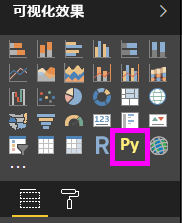
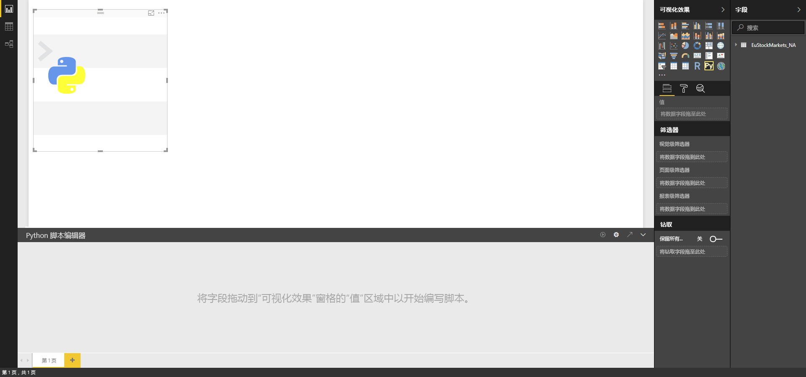

# <a name="create-power-bi-visuals-using-python"></a>使用 Python 创建 Power BI 视觉对象
借助 Power BI Desktop  ，可以使用 Python  将数据可视化。

## <a name="prerequisites"></a>先决条件

使用以下 Python 脚本学习[在 Power BI Desktop 中运行 Python 脚本](desktop-python-scripts.md)教程：

```python
import pandas as pd 
df = pd.DataFrame({ 
    'Fname':['Harry','Sally','Paul','Abe','June','Mike','Tom'], 
    'Age':[21,34,42,18,24,80,22], 
    'Weight': [180, 130, 200, 140, 176, 142, 210], 
    'Gender':['M','F','M','M','F','M','M'], 
    'State':['Washington','Oregon','California','Washington','Nevada','Texas','Nevada'],
    'Children':[4,1,2,3,0,2,0],
    'Pets':[3,2,2,5,0,1,5] 
}) 
print (df) 
```
[在 Power BI Desktop 中运行 Python 脚本](desktop-python-scripts.md)一文介绍了如何在本地计算机上安装 Python 并在 Power BI Desktop 中利用它编写 Python 脚本  。 本教程使用上述脚本中的数据来说明如何创建 Python 视觉对象。

## <a name="create-python-visuals-in-power-bi-desktop"></a>在 Power BI Desktop 中创建 Python 视觉对象
1. 在“可视化效果”窗格中选择“Python 视觉对象”图标   。
   
   

1.  在出现的“启用脚本视觉对象”对话框中，选择“启用”   。 

    向报表添加 Python 视觉对象后，Power BI Desktop 执行以下操作  ：
   
     - 占位符 Python 视觉对象图像位于报表画布上。
   
     - Python 脚本编辑器  位于中央窗格底部边缘处。
   
    

1. 接下来，将“Age”、“Children”、“Fname”、“Gender”、“Pets”、“State”和“Weight”字段拖到显示“在此处添加数据字段”的值部分          。 

    

   Python 脚本只能使用添加到“值”部分的字段  。 在使用 Python 脚本时，可以在“值”部分添加或删除字段  。 Power BI Desktop 会自动检测字段更改  。
   
   > [!NOTE]
   > Python 视觉对象的默认聚合类型是“不求和”  。
   > 
   > 
   
1. 现在你可以使用你选择用来创建绘图的数据。 

    在选择或删除字段时，系统会自动生成或删除 Python 脚本编辑器中的支持代码。 
    
    基于这些选择，Python 脚本编辑器将生成以下绑定代码。

    * 编辑器创建了一个包含添加字段的“数据集”数据帧  。 
    * 默认聚合函数是“不求和”  。
    * 类似于表格视觉对象，字段将进行分组，并且重复行只出现一次。

        
   
     > [!TIP] 
     > 在某些情况下，你可能不希望进行自动分组，或者可能希望所有行都出现，包括重复项。 在这种情况下，你可以向将导致所有行被视为唯一且阻止分组的数据集添加索引字段。
   
   可以使用各自的名称访问数据集中的列。 例如，可以在 Python 脚本中编写数据集 ["Age"] 的代码来访问年龄字段。

1. 借助所选字段自动生成的数据帧，就可以编写将导致绘制到 Python 默认设备的 Python 脚本。 脚本完成后，在“Python 脚本编辑器”标题栏中选择“运行”   。

   当以下任一事件发生时，Power BI Desktop 会重新绘制视觉对象  ：
   
   * 当从“Python 脚本编辑器”  标题栏选择“运行”  时
   * 每当数据更改发生时（由于数据刷新、筛选或突出显示所导致）
   
   如果运行 Python 脚本时导致错误，则不会绘制 Python 视觉对象，并且会出现一个画布错误消息。 有关错误详细信息，请从消息中选择“查看详情”  。

   若要获取可视化效果的较大视图，你可以尽量减小 Python 脚本编辑器  。

好的，让我们创建一些视觉对象。

## <a name="create-a-scatter-plot"></a>创建散点图

让我们创建一个散点图，看看年龄与体重之间是否具有相关性。 

1. 在“粘贴或在此处键入脚本代码”下，输入此代码  ：

   ```python
   import matplotlib.pyplot as plt 
   dataset.plot(kind='scatter', x='Age', y='Weight', color='red')
   plt.show() 
   ```  
   Python 脚本编辑器窗格现在应如下所示：

   

   导入 matplotlib 库以绘制并创建视觉对象  。

1. 如果选择“运行”脚本按钮，则会在占位符 Python 视觉对象图像中生成以下散点图  。

   

## <a name="create-a-line-plot-with-multiple-columns"></a>创建包含多个列的线条图

 让我们为每个用户创建一个显示其子女数和宠物数的线条图。 删除或注释“删除或在此处键入脚本代码”下的代码，并键入以下 Python 代码  ：

 ```python
 import matplotlib.pyplot as plt 
ax = plt.gca() 
dataset.plot(kind='line',x='Fname',y='Children',ax=ax) 
dataset.plot(kind='line',x='Fname',y='Pets', color='red', ax=ax) 
plt.show() 
```
如果选择“运行”脚本按钮，则将生成包含多个列的以下线条图  。

 

## <a name="create-a-bar-plot"></a>创建条形图

让我们创建一个包含每个人年龄的条形图。 删除或注释“删除或在此处键入脚本代码”下的代码，并键入以下 Python 代码  ：

```python
import matplotlib.pyplot as plt 
dataset.plot(kind='bar',x='Fname',y='Age') 
plt.show() 
```

如果选择“运行”脚本按钮，则会生成以下条形图  ：

 

## <a name="security"></a>安全性

> [!IMPORTANT] 
  > **Python 脚本安全性：** Python 视觉对象是基于 Python 脚本创建的，这可能包含具有安全风险或隐私风险的代码。 当尝试查看 Python 视觉对象或首次与其交互时，用户会看到一条安全警告消息。 仅当你信任作者和来源，或者在查看并了解 Python 脚本之后，才启用 Python 视觉对象。 
  >  

## <a name="more-information-about-plotting-with-matprolib-pandas-and-python"></a>有关使用 Matprolib、Pandas 和 Python 绘图的详细信息

本教程旨在帮助用户开始在 Power BI Desktop 中使用 Python 创建视觉对象  。 它仅仅浅显地介绍了使用 Python、Pandas 和 Matprolib 库创建视觉对象报表的多种选项和功能。 下面提供了很多详细的信息，以及一些入门介绍链接。

* [Matplotlib](https://matplotlib.org/) 网站上的文档。 
* [Matplotlib 教程：使用 Matplotlib 和 Python 的基本指南](https://www.datasciencelearner.com/matplotlib-tutorial-complete-guide-to-use-matplotlib-with-python/) 
* [Matplotlib 教程 - Python Matplotlib 库和示例](https://www.edureka.co/blog/python-matplotlib-tutorial/) 
* [Pandas API 引用](http://pandas.pydata.org/pandas-docs/stable/reference/index.html) 
* [Power BI 服务中的 Python 可视化效果](https://powerbi.microsoft.com/blog/python-visualizations-in-power-bi-service/) 
* [在 Power BI 中使用 Python 视觉对象](https://www.absentdata.com/how-to-user-python-and-power-bi/)


## <a name="known-limitations"></a>已知限制

Power BI Desktop 中的 Python 视觉对象有一些限制  ：

* 数据大小限制 - Python 视觉对象用于绘制的数据仅限 150,000 行。 如果选择了 150,000 行以上，则只会使用前 150,000 行，且在图像上显示一条消息。
* 计算时间限制 - 如果 Python 视觉对象计算时间超过 5 分钟，则执行将超时并生成一个错误。
* 关系 - 如同其他 Power BI Desktop 视觉对象，如果选择的不同表中数据字段间没有定义关系，则会发生错误。
* Python 视觉对象在数据更新、筛选和突出显示时进行刷新。 但是，图像本身不是交互的并且不能为交叉筛选的源。
* Python 视觉对象响应突出显示的其他视觉对象，但你不能单击 Python 视觉对象中的元素以进行其他元素的交叉筛选。
* 只有绘制到 Python 默认显示设备的绘图会正确地显示在画布上。 避免显式使用不同的 Python 显示设备。

## <a name="next-steps"></a>后续步骤

查看以下更多信息，了解有关 Power BI 中的 Python。

* [在 Power BI Desktop 中运行 Python 脚本](desktop-python-scripts.md)
* [将外部 Python IDE 与 Power BI 一起使用](desktop-python-ide.md)

