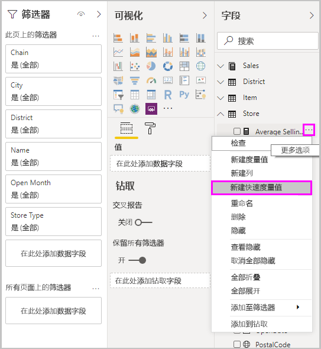
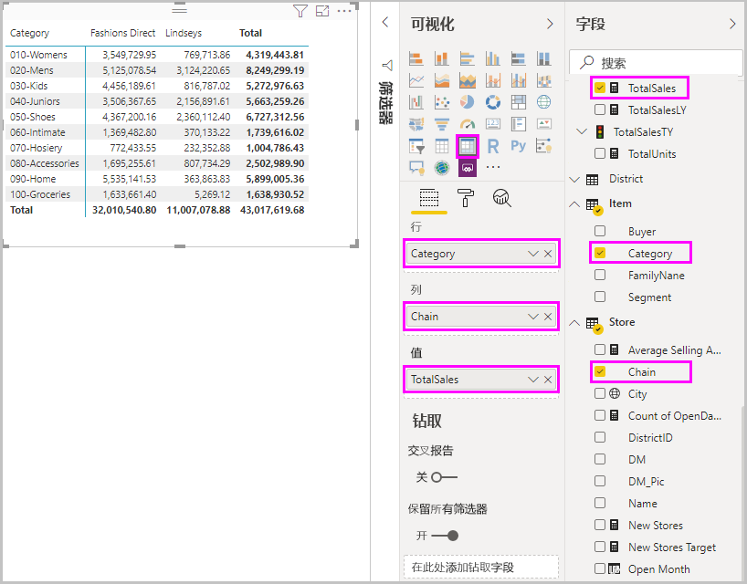
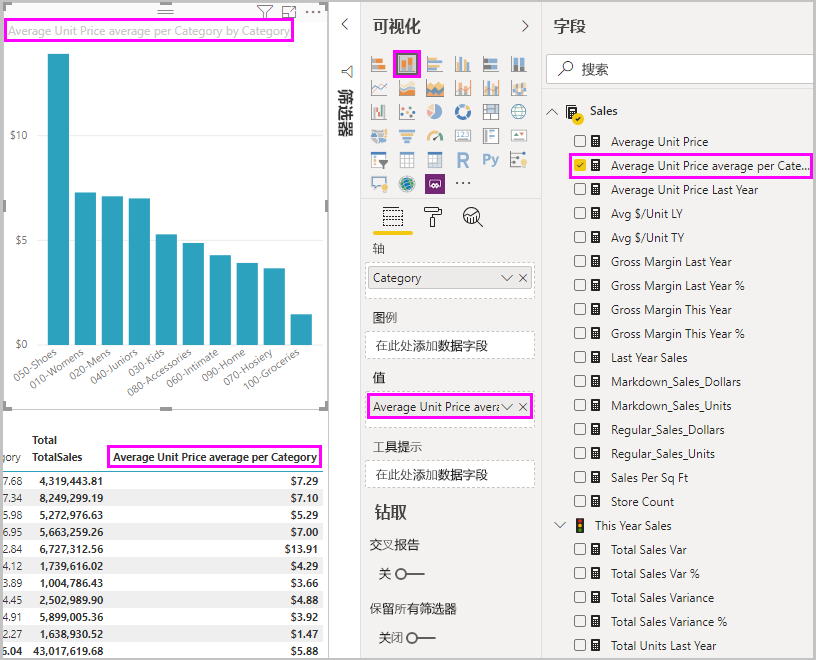
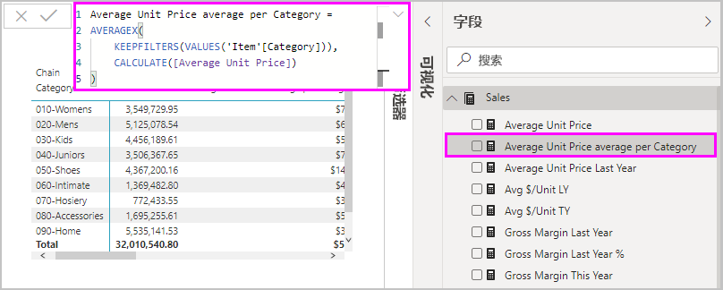

# 使用快速度量执行常见计算
可使用快速度量快速、轻松地执行常见的高效计算  。 快速度量在后台运行一组数据分析表达式 (DAX) 命令，然后显示结果以供用户在报表中使用。 无需编写 DAX，系统会根据对话框中提供的输入自动完成此操作。 计算分为许多类别，可通过多种方式来根据自己的需求修改所有计算。 也许最重要的是，可以查看快速度量执行的 DAX，从而开始学习或拓展你自己的 DAX 知识。

## 创建快速度量

若要在 Power BI Desktop 中创建快速度量，右键单击或选择“字段”窗格中任意项旁边的省略号 ...，然后从随即显示的菜单中选择“新建快速度量”    。 

你还可以在现有视觉对象的“值”框中右键单击或选择任何值旁边的下拉箭头，然后选择菜单中的“新建快速度量”   。 

选择“新建快速度量”后将显示“快速度量”窗口，随即可以选择所需计算，以及要对其运行计算的字段   。 

选择“选择计算”字段，查看一长串的可用快速度量  。 

五种快速度量的计算类型及其计算如下所示：

* **每个类别的聚合**
  * 每个类别的平均值
  * 每个类别的差异
  * 每个类别的最大值
  * 每个类别的最小值
  * 每个类别的加权平均
* **筛选器**
  * 已筛选的值
  * 与已筛选值的差异
  * 与已筛选值的百分比差异
  * 新客户的销售额
* **时间智能**
  * 本年迄今总计
  * 本季度至今总计
  * 本月至今总计
  * 年增率变化
  * 季度增率变化
  * 月增率变化
  * 移动平均
* **总数**
  * 汇总
  * 类别总数（应用筛选器）
  * 类别总数（未应用筛选器）
* **数学运算**
  * 相加
  * 减法
  * 乘法
  * 除法
  * 百分比差异
  * 相关系数
* **文本**
  * 星级评分
  * 值连接列表

若要针对想查看的新快速度量、底层 DAX 公式或其他快速度量相关内容提交建议，请参阅本文末尾部分。

> [!NOTE]
> 使用 SQL Server Analysis Services (SSAS) 实时连接时，可以使用一些快速度量。 Power BI Desktop 仅显示连接到的 SSAS 版本所支持的快速度量。 如果连接到 SSAS 实时数据源，但列表中没有显示特定的快速度量，这是因为连接到的 SSAS 版本不支持用于实现这些快速度量的 DAX 度量。

选择要用于快速度量的计算和字段后，选择“确定”  。 新建的快速度量将显示在“字段”窗格中，而基础 DAX 公式显示在“公式”栏中  。 

## 快速度量示例
接下来在实践中了解快速度量。

以下矩阵视觉对象显示了一张各种产品的销售额表。 这是包含了每个类别的销售总额的基本表。

选择矩阵视觉对象后，在“值”框中选择 TotalSales 旁边的下拉箭头，然后选择“新建快速度量”    。 

在“快速度量”窗口的“计算”中，选择“Average per category”    。 

将“Average Unit Price”从“字段”窗格拖到“基值”字段    。 将“类别”字段保留为 Category，然后选择“确定”    。 

选择“确定”后会发生几个值得关注的事情  。

1. 矩阵视觉对象有一个新列，其中显示已计算的“Average Unit Price average per Category”  。
   
2. 新建的快速度量的 DAX 公式显示在公式栏中。 有关 DAX 公式的详细信息，请参阅[下一节](#learn-dax-by-using-quick-measures)。
   
3. 新建的快速度量在“字段”窗格中以选中和高亮显示状态显示  。 

新建的快速度量值可用于报表中的任何视觉对象，而不只是您为其创建的视觉对象。 下图显示了使用“新建的快速度量”字段创建的快速柱形图视觉对象。

## 使用快速度量了解 DAX
快速度量的一个强大优点在于显示了实现度量值的 DAX 公式。 选择“字段”窗格中的快速度量后将显示公式栏，其中显示了 Power BI 为实现此度量值而创建的 DAX 公式   。

公式栏不仅显示度量值背后的公式，而且更重要的可能是，使你可以了解如何创建 DAX 公式基础快速度量。

假设需要执行年增率计算，但你不确定该如何编写 DAX 公式，或者说，一点头绪都没有。 无需坐在桌前冥思苦想，可以使用“年增率变化”计算创建快速度量，然后看它在视觉对象中如何显示以及 DAX 公式如何运作  。 然后，可以直接更改 DAX 公式，也可以创建符合要求和预期的类似度量值。 这就好像只需单击几下，即有老师迅速回答你的“假设”问题一样。 

如果不喜欢快速度量，你可以随时将其从模型中删除。 只需右键单击或选择度量值旁边的“...”，然后选择“删除”   。 还可以在菜单中选择“重命名”，重命名快速度量  。 

## 限制和注意事项
有几点要牢记的限制和注意事项。

- 你可以在报表的任何视觉对象中使用添加到“字段”窗格的快速度量  。
- 选择“字段”列表中的度量值，然后查看公式栏中的公式，可以随时查看与快速度量相关联的 DAX  。
- 如果能够修改模型，快速度量才可适用。 如果使用某些实时连接，则不适用。 如前文所述，支持 SSAS 表格实时连接。
- 在 DirectQuery 模式下工作时，无法创建时间智能快速度量。 这些快速度量中使用的 DAX 函数在转换为发送到数据源的 T-SQL 语句时会影响性能。

> [!IMPORTANT]
> 快速度量的 DAX 语句只将逗号用作参数分隔符。 如果 Power BI Desktop 版本使用的是将逗号用作十进制分隔符的语言，快速度量将无法正常运行。

### 时间智能和快速度量
可以将自己的自定义日期表与时间智能快速度量配合使用。 如果使用的是外部表格模型，请确保在生成模型时，此表中的主日期列被标记为“日期”表，如[指定“标记为日期表”以便与时间智能配合使用](https://docs.microsoft.com/sql/analysis-services/tabular-models/specify-mark-as-date-table-for-use-with-time-intelligence-ssas-tabular)所述。 如果要导入自己的日期表，请确保将其标记为“日期”表，如[在 Power BI Desktop 中设置和使用日期表](desktop-date-tables.md)所述。

### 其他信息和示例
对尚未提供的快速度量有建议吗？ 很好！ 请参阅 [Power BI 建议](https://go.microsoft.com/fwlink/?linkid=842906)页，并提交你的建议以及想要在 Power BI Desktop 中使用的快速度量的 DAX 公式。 在未来版本中，我们会考虑将其添加到“快速度量”列表。

