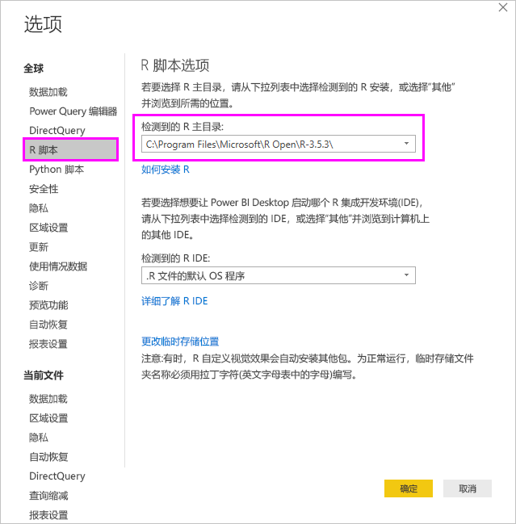
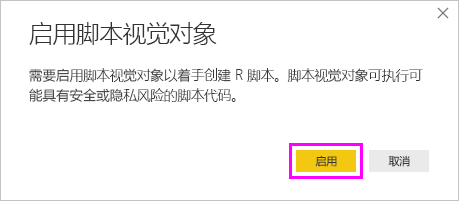

# <a name="create-power-bi-visuals-using-r"></a>使用 R 创建 Power BI 视觉对象
借助 Power BI Desktop，可以使用 R 将数据可视化  。 [R](https://mran.revolutionanalytics.com/documents/what-is-r) 是用于统计计算和图形的一种语言和环境。

## <a name="install-r"></a>安装 R
默认情况下，Power BI Desktop 既不包括，也不会部署或安装 R 引擎。 若要在 Power BI Desktop 中运行 R 脚本，必须在本地计算机上单独安装 R。 可以从很多位置免费下载并安装 R，其中包括 [Revolution Open 下载页](https://mran.revolutionanalytics.com/download/)和 [CRAN 存储库](https://cran.r-project.org/bin/windows/base/)。 Power BI Desktop 中当前版本的 R 脚本在安装路径中支持 Unicode 字符以及空格（空字符）。

## <a name="enable-r-visuals-in-power-bi-desktop"></a>在 Power BI Desktop 中启用 R 视觉对象
安装 R 后，Power BI Desktop 会自动将其启用。 若要验证 Power BI Desktop 是否在正确位置启用了 R，请执行以下步骤： 

1. 在 Power BI Desktop 菜单中，选择“文件” > “选项和设置” > “选项”    。 

2. 在“选项”页左侧的“全局”下，选择“R 脚本”    。 

3. 在“R 脚本选项”下，验证在“检测到的 R 主目录”中是否指定了本地 R 安装，并验证其是否正确反映了你想要 Power BI Desktop 使用的本地 R 安装   。 在下图中，R 的本地安装路径为 C:\Program Files\R Open\R-3.5.3\\  。
   
   

验证 R 安装后，即可开始创建 R 视觉对象。

## <a name="create-r-visuals-in-power-bi-desktop"></a>在 Power BI Desktop 中创建 R 视觉对象
1. 在“可视化效果”窗格中选择“R 视觉对象”图标以添加 R 视觉对象   。
   
   

2. 在出现的“启用脚本视觉对象”窗口中，选择“启用”   。

   

   向报表添加 R 视觉对象后，Power BI Desktop 将进行以下更改：
   
   - 占位符 R 视觉对象图像位于报表画布上。
   
   - R 脚本编辑器  位于中央窗格底部边缘处。
   
   

3. 在“可视化效果”窗格的“值”部分中，拖动要在 R 脚本中使用的“字段”窗格中的字段，就像处理其他任何 Power BI Desktop 视觉对象一样    。 此外，还可以在“字段”窗格中直接选择字段  。
    
    只有已添加到“值”部分的字段才可供 R 脚本使用  。 可以在 R 脚本编辑器中处理 R 脚本的同时，添加新字段，或从“值”部分删除不必要的字段   。 Power BI Desktop 会自动检测已添加或已删除的字段。
   
   > [!NOTE]
   > R 视觉对象的默认聚合类型是“不汇总”  。
   > 
   > 
   
4. 现在你可以使用你选择用来创建绘图的数据： 

    - 由于选择了字段，R 脚本编辑器将在编辑器窗格顶部旁的灰色部分生成这些字段的支持 R 脚本绑定代码  。
    - 如果删除一个字段，R 脚本编辑器将自动删除该字段的支持代码  。
   
   下图所示示例中，选择了三个字段：hp、gear 和 drat。 由于这些选择，R 脚本编辑器将生成总结如下的绑定代码：
   
   * 创建名为“数据集”的数据帧，该数据帧由用户选择的不同字段组成  。
   * 默认聚合是“不汇总”  。
   * 类似于表格视觉对象，字段将进行分组，并且重复行只出现一次。
   
   
   
   > [!TIP]
   > 在某些情况下，你可能不希望进行自动分组，或者可能希望所有行都出现，包括重复项。 在这种情况下，向数据集添加索引字段，可以使所有行被视为唯一行并阻止分组。
   > 
   > 
   
   生成的数据帧称为“数据集”，并且可以通过相应所选列名称访问所选列  。 例如，gear 字段可通过在 R 脚本中添加 dataset$gear 进行访问  。 对于具有空格或特殊字符的字段，请使用单引号。

5. 借助所选字段自动生成的数据帧，就可以编写 R 脚本，Power BI Desktop 会将其绘制到 R 默认设备。 完成脚本后，选择“R 脚本编辑器”标题栏右侧的“运行脚本”   。
   
    选择“运行脚本”后，Power BI Desktop 会识别绘图，并在画布上予以呈现  。 由于该过程是在本地 R 安装上执行，请确保安装了所需的 R 包。
   
   当以下任一事件发生时，Power BI Desktop 将重新绘制视觉对象：
   
   * 你可以在“R 脚本编辑器”标题栏中选择“运行脚本”   。
   * 数据刷新、筛选或突出显示会导致数据更改。

     下图显示相关绘图代码的示例，该示例绘制了不同类型汽车特征间的关联。

     

6. 若要获取可视化效果的较大视图，可以尽量缩小 R 脚本编辑器  。 如同 Power BI Desktop 中的其他视觉对象，你可以选择环形视觉对象（右侧的圆形视觉对象）中的特定部分（如跑车），交叉筛选相关绘图。

    

7. 修改 R 脚本，自定义视觉对象，并通过向绘图命令添加参数来利用 R 的强大功能。

    原始的绘图命令如下：

    ```
    corrplot(M, method = "color",  tl.cex=0.6, tl.srt = 45, tl.col = "black")
    ```

    更改 R 脚本，以确保绘图命令如下所示：

    ```
    corrplot(M, method = "circle", tl.cex=0.6, tl.srt = 45, tl.col = "black", type= "upper", order="hclust")
    ```

    结果是，R 视觉对象现在绘制圆形，只考虑了上半部分，对矩形图重新排序以集中相关特征。

    

    执行导致错误的 R 脚本时，画布（而不是 R 视觉对象绘图）上将显示错误消息。 有关错误详细信息，请从 R 视觉对象错误中选择“查看详细信息”  。

    

## <a name="r-scripts-security"></a>R 脚本安全性 
R 视觉对象是根据 R 脚本创建的，其中可能包含具有安全风险或隐私风险的代码。 当尝试查看 R 视觉对象或首次与其交互时，用户会看到一条安全警告消息。 仅当你信任作者和来源，或者在查看并了解 R 脚本之后，才启用 R 视觉对象。


## <a name="known-limitations"></a>已知限制
Power BI Desktop 中的 R 视觉对象有以下限制：

* 数据大小：R 视觉对象用于绘制的数据仅限 150,000 行。 如果选择了 150,000 行以上，则只会使用前 150,000 行，且在图像上显示一条消息。

* 计算时间：如果 R 视觉对象计算时间超过五分钟，则会导致超时错误。

* 关系：如同其他 Power BI Desktop 视觉对象，如果选择的不同表中数据字段间没有定义关系，则会发生错误。

* 刷新：R 视觉对象在数据更新、筛选和突出显示时进行刷新。 但是，图像本身不是交互的并且不能为交叉筛选的源。

* 突出显示：如果突出显示其他视觉对象，R 视觉对象会响应，但你不能选择 R 视觉对象中的元素以进行其他元素的交叉筛选。

* 显示设备：只有绘制到 R 默认显示设备的绘图会正确地显示在画布上。 避免显式使用不同的 R 显示设备。

* RRO 安装：在此版本中，32 位版本的 Power BI Desktop 不会自动标识 RRO 安装；因此必须在“选项和设置” > “选项” > “R 脚本”中手动提供 R 安装目录的路径    。

## <a name="next-steps"></a>后续步骤
有关 Power BI 中的 R 的详细信息，请参阅以下文章：

* [在 Power BI Desktop 中运行 R 脚本](desktop-r-scripts.md)
* [将外部 R IDE 与 Power BI 一起使用](desktop-r-ide.md)

