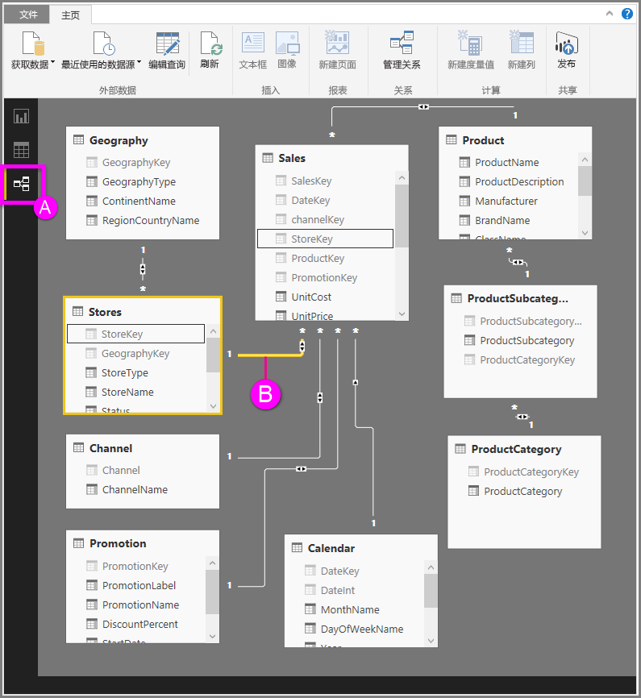

# Power BI Desktop 中的关系视图
**关系视图**显示模型中的所有表、列和关系。 这在模型包含许多表且其关系十分复杂时尤其有用。

让我们来看一下。

**A.**  关系视图图标 – 单击可显示关系视图中的模型

**B.** 关系 – 可以将光标悬停在关系上方以显示所用列。 双击关系以在“编辑关系”对话框中将其打开。 

在上图中，你可以看到 *商店* 表中有一个*StoreKey* 列与 *销售额* 表中的 *StoreKey* 列相关。 我们可以看到这是*多对一* (\*:1) 关系，线中间的图标指出交叉筛选器方向设置为*两者*。 图标上的箭头表示筛选上下文流的方向。

有关关系的详细信息，请参阅[在 Power BI Desktop 中创建和管理关系](desktop-create-and-manage-relationships.md)。

