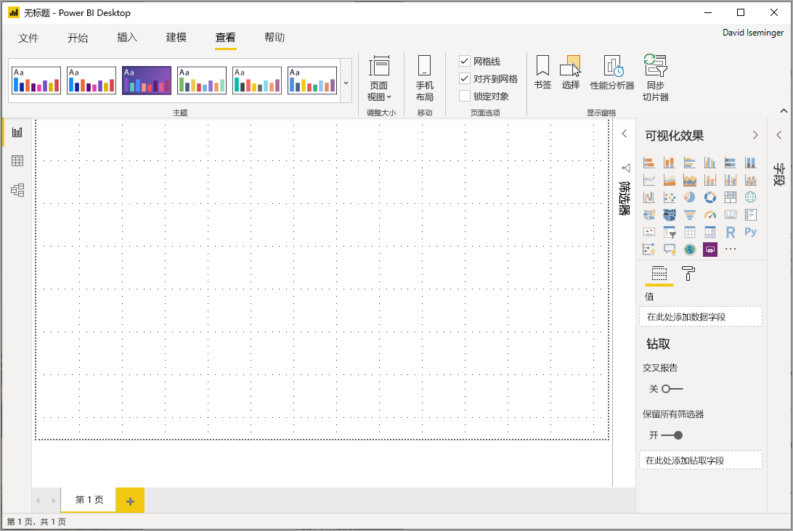
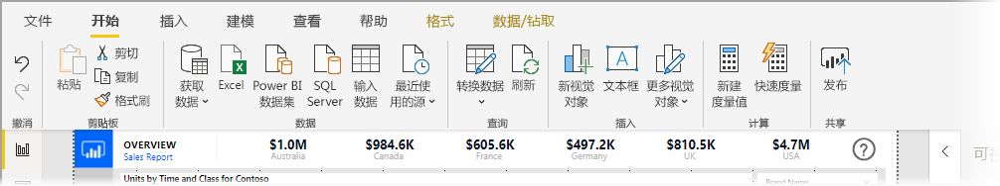
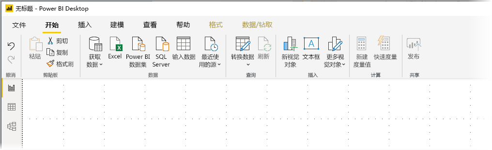
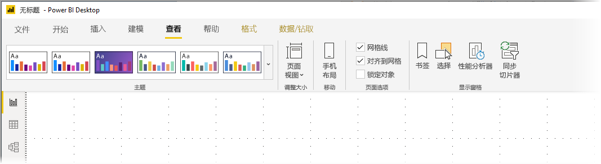
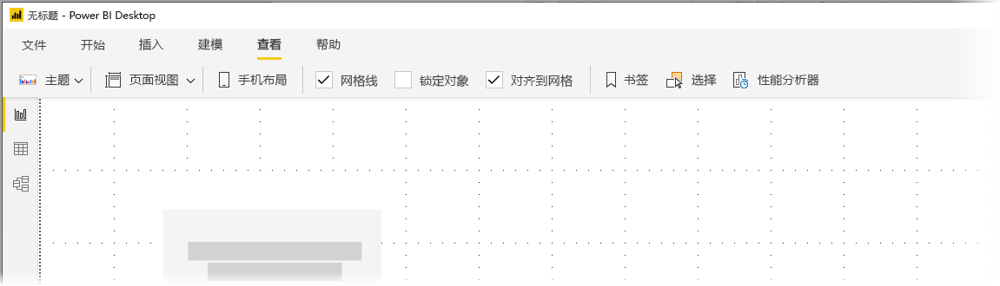

# 在 Power BI Desktop 中使用更新后的功能区（预览）

从 2019 年 11 月更新开始，Power BI Desktop 修改了其功能区，以便更好地使其外观和体验与其他 Microsoft 产品（如 Microsoft Office）相一致。

更新的功能区目前为预览版，以便我们从用户和客户那里收集反馈，并确保能带来良好体验。 我们预计，经过几个月的预览、反馈和改进后，更新的 Power BI Desktop 功能区才会公开发布。 

## 如何启用更新的功能区

Power BI 中更新的功能区是预览功能，必须启用。 若要启用该功能，请选择“文件”>“选项和设置”>“选项”，然后从左侧列中选择“预览功能”。 在右窗格中，有一个“更新的功能区”选项。 选中“更新的功能区”旁边的框即可启用该功能。 需要重新启动 Power BI Desktop 才能使预览功能更改生效。

## 新功能区的功能

更新功能区旨在使客户在 Power BI Desktop 以及其他 Microsoft 产品中的体验更加轻松、熟悉。 

其优点可以分为以下几类：

* **改进的外观和编排** - 新 Power BI Desktop 功能区中的图标和功能与 Office 应用程序中的功能区项的外观和编排一致。

    

* **直观的主题库** -“视图”功能区中的“主题库”具有与 PowerPoint 主题库相似的外观。 因此，功能区中的图像会显示应用于报表时主题的变化（如颜色组合和字体变化）。 

    

* **基于视图动态显示功能区内容** - 在 Power BI Desktop 的现有功能区中，无法使用的图标或命令只是灰显，这并不是最佳体验。 更新后的功能区可以动态显示和排列图标，方便你始终了解上下文中有哪些选项可供使用。

* **折叠后的单行功能区可节省空间** - 新功能区的另一个优点是能够将功能区折叠到一行中，并基于上下文动态地显示功能区项。 

    

除了这些看得见的更改之外，新功能区还允许我们对 Power BI Desktop 及其功能区进行后续更新，如下所示：

* 在功能区中创建更灵活、更直观的控件，如视觉对象库
* 将黑色和暗灰色 Office 主题添加到 Power BI Desktop
* 改进辅助功能

## 后续步骤
你可以使用 Power BI Desktop 连接到各种数据。 有关数据源的详细信息，请参阅下列资源：

* [什么是 Power BI Desktop？](desktop-what-is-desktop.md)
* [Power BI Desktop 中的数据源](desktop-data-sources.md)
* [使用 Power BI Desktop 调整和合并数据](desktop-shape-and-combine-data.md)
* [通过 Power BI Desktop 连接到 Excel 工作簿](desktop-connect-excel.md)   
* [直接将数据输入到 Power BI Desktop 中](desktop-enter-data-directly-into-desktop.md)   

