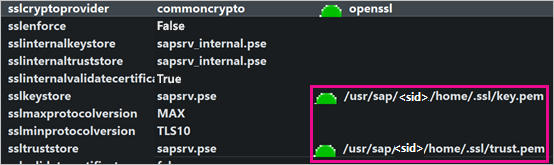
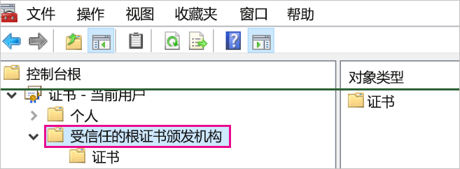
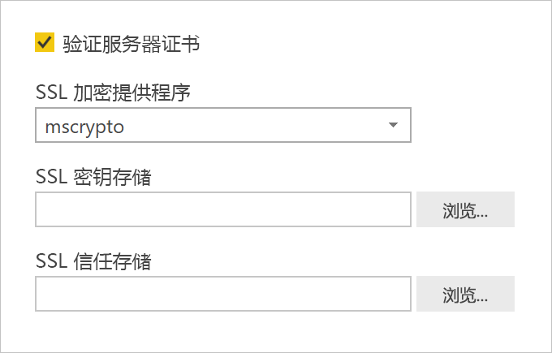

# <a name="enable-encryption-for-sap-hana"></a>启用 SAP HANA 加密

我们建议对从 Power BI Desktop 或 Power BI 服务到 SAP HANA 的连接进行加密。 可以使用 OpenSSL 和 SAP 的专有 CommonCryptoLib 库（以前称为 sapcrypto）启用 HANA 加密。 SAP 推荐使用 CommonCryptoLib，但任一个库均可提供基本加密功能。

本文概述如何使用 OpenSSL 启用加密，并参考了 SAP 文档的某些特定方面。 我们会定期更新内容和链接，但如需获取全面说明和支持，请务必参阅 SAP 官方文档。 如要使用 CommonCryptoLib 而非 OpenSSL 来设置加密，请参阅[如何使用 SAP HANA 2.0 配置 TLS/SSL](https://blogs.sap.com/2018/11/13/how-to-configure-tlsssl-in-sap-hana-2.0/)。有关从 OpenSSL 迁移到 CommonCryptoLib 的步骤说明，请参阅 [SAP 备注 2093286](https://launchpad.support.sap.com/#/notes/2093286)（需要 s 用户）。

> [!NOTE]
> 本文详细介绍的加密设置步骤与 SAML SSO 的设置和配置步骤重叠。 无论是选择 OpenSSL 还是 CommonCryptoLib 作为 HANA 服务器的加密提供程序，都请确保在 SAML 和加密配置中采用一致的选择。

使用 OpenSSL 启用 SAP HANA 加密分为四个阶段。 下文对这些阶段进行了介绍。  有关详细信息，请参阅[通过 SSL 保护 SAP HANA Studio 和 SAP HANA 服务器之间的通信](https://blogs.sap.com/2015/09/28/securing-the-communication-between-sap-hana-studio-and-sap-hana-server-through-ssl/)。

## <a name="use-openssl"></a>使用 OpenSSL

请确保 HANA 服务器已配置为使用 OpenSSL 作为其加密提供程序。 使用 HANA 服务器的服务器 ID (sid) 替换下方缺失的路径信息。



## <a name="create-a-certificate-signing-request"></a>创建证书签名请求

为 HANA 服务器创建一个 X509 证书签名请求。

1. 使用 SSH，连接到以 \<sid\>adm 身份运行 HANA 服务器的 Linux 计算机。

1. 进入主页目录 _/_usr/sap/\<sid\>/home  。

1. 创建一个名为 _.__ssl_ 的隐藏目录（如果尚不存在）。

1. 执行以下命令：

    ```
    openssl req -newkey rsa:2048 -days 365 -sha256 -keyout Server\_Key.pem -out Server\_Req.pem -nodes
    ```

此命令创建一个证书签名请求和私钥。 签名后，证书有效期为一年（请查看 -days 参数）。 当系统提示输入公用名 (CN) 时，请输入安装了此 HANA 服务器的计算机的完全限定的域名 (FQDN)。

## <a name="get-the-certificate-signed"></a>完成证书签名

由用于连接到 HANA 服务器的客户端所信任的证书颁发机构 (CA) 对证书进行签名。

1. 如果已经具有受信任的公司 CA（下例中由 CA\_Cert.pem 和 CA\_Key.pem 表示），则通过运行以下命令对证书请求进行签名：

    ```
    openssl x509 -req -days 365 -in Server\_Req.pem -sha256 -extfile /etc/ssl/openssl.cnf -extensions usr\_cert -CA CA\_Cert.pem -CAkey CA\_Key.pem -CAcreateserial -out Server\_Cert.pem
    ```

    如尚不具备可用的 CA，可以按照[通过 SSL 保护 SAP HANA Studio 和 SAP HANA 服务器之间的通信](https://blogs.sap.com/2015/09/28/securing-the-communication-between-sap-hana-studio-and-sap-hana-server-through-ssl/)中说明的步骤自行创建一个根 CA。

1. 通过合并服务器证书、密钥和 CA 的证书，创建 HANA 服务器证书链（key.pem 名称是 SAP HANA 的约定）：

    ```
    cat Server\_Cert.pem Server\_Key.pem CA\_Cert.pem \> key.pem
    ```

1. 创建名为 trust.pem 的 CA\_Cert.pem named trust.pem 副本（trust.pem 名称是 SAP HANA 的约定）：

    ```
    cp CA\_Cert.pem trust.pem
    ```

1. 重启 HANA 服务器。

1. 验证客户端和用于对 SAP HANA 服务器证书进行签名的 CA 之间的信任关系。

    客户端必须首先信任用于对 HANA 服务器 X509 证书进行签名的 CA，之后才可从该客户端的计算机建立与 HANA 服务器的加密连接。

    无论使用 Microsoft 管理控制台 (MMC) 还是命令行，均可采用多种方法确保存在此信任关系。 可以将 CA 的 X509 证书 (trust.pem) 导入要建立连接的用户的“受信任的根证书颁发机构”文件夹，或者根据需要，其导入客户端计算机本身的相同文件夹中  。

    

    要将证书导入“受信任的根证书颁发机构”文件夹，必须先将 trust.pem 转换为 .crt 文件（例如，通过执行以下 OpenSSL 命令）：

    ```
    openssl x509 -outform der -in your-cert.pem -out your-cert.crt
    ```
    
    有关使用 OpenSSL 进行转换的信息，请参阅 [OpenSSL 文档](https://www.openssl.org/docs/manmaster/man1/x509.html)。

## <a name="test-the-connection"></a>测试连接

在 Power BI Desktop 或 Power BI 服务中测试连接。

1. 先确保已在 Power BI Desktop 中或者在 Power BI 服务的“管理网关”页面中启用了“验证服务器证书”，再尝试与 SAP HANA 服务器建立连接   。 对于 SSL 加密提供程序，如果已采用 OpenSSL 设置步骤，请选择 mscrypto；如果已将该库配置为加密提供程序，请选择 commoncrypto  。 请将 SSL 密钥存储和 SSL 信任存储字段留空。

    - Power BI Desktop

        

    - Power BI 服务

        

1. 通过在 Power BI Desktop 中加载数据或在 Power BI 服务中刷新已发布的报表，检查在启用“验证服务器证书”选项的情况下是否可以成功与服务器建立加密连接  。
