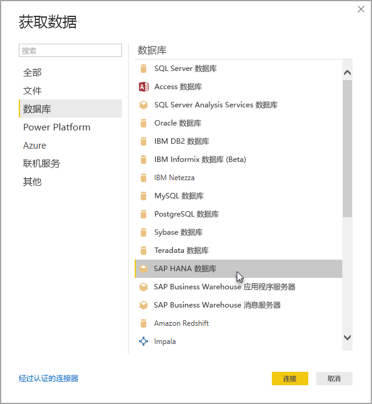

# 在 Power BI Desktop 中使用 SAP HANA
使用 Power BI Desktop，你现在可以访问 **SAP HANA** 数据库。 若要使用 **SAP HANA**，必须在本地客户端计算机上按顺序安装 SAP HANA ODBC 驱动程序，以使 Power BI Desktop **SAP HANA** 数据连接能够正常运行。 可以从 [SAP 软件下载中心](https://support.sap.com/swdc)下载 SAP HANA ODBC 驱动程序。 在这里，搜索 Windows 计算机的 SAP HANA 客户端。 由于 **SAP 软件下载中心**的结构经常发生变化，因此没有有关站点导航的更多具体指导。

要连接 SAP HANA 数据库，请依次选择“获取数据”>“数据库”>“SAP HANA 数据库”，如下图所示   ：

连接到 SAP HANA 数据库时，请指定服务器名称。 然后从下拉框和输入框中指定端口。

在此版本中，Power BI Desktop 和 Power BI 服务支持 [DirectQuery](desktop-directquery-sap-hana.md) 模式中的 SAP HANA，而且对于使用 DirectQuery 模式中的 SAP HANA 的报表，用户可将其发布和上传到 Power BI 服务   。 在 DirectQuery 模式中不使用 **SAP HANA** 时你也可以向 Power BI Service 发布和上传报表。

## SAP HANA 支持的功能
此版本有很多适用于 **SAP HANA** 的功能，如以下列表所示：

* 适用于 SAP HANA 的 Power BI 连接器使用 SAP ODBC 驱动程序，以提供最佳使用体验 
* **SAP HANA** 支持 DirectQuery 和导入选项
* Power BI 支持 HANA 信息模型（如 Analytic 和计算视图），且具有经过优化的导航
* 通过 SAP HANA，还可以使用直接 SQL 功能连接到单行表和列表 
* 包括对 HANA 模型的优化导航
* Power BI 支持 **SAP HANA** 变量和输入参数
* 基于 HDI 容器的计算视图
  * 在 2019 年 8 月发布的 Power BI Desktop 版本中，以公共预览版形式推出对基于 HDI 容器的计算视图的支持。 要在 Power BI 中访问基于 HDI 容器的计算视图，请确保用于 Power BI 的 HANA 数据库用户有权访问其中存储着你要访问的视图的 HDI 运行时容器。 要授予此访问权限，必须创建一个可访问你的 HDI 容器的角色并将该角色分配给你要用于 Power BI 的 HANA 数据库用户（该用户必须还具备从 \_SYS\_BI 架构中的系统表进行读取的权限）。 要详细了解如何创建和分配数据库角色，请参阅 SAP 官方文档。 不妨先从阅读[此篇 SAP 博客文章](https://nam06.safelinks.protection.outlook.com/?url=https%3A%2F%2Fblogs.sap.com%2F2018%2F01%2F24%2Fthe-easy-way-to-make-your-hdi-container-accessible-to-a-classic-database-user%2F&data=02%7C01%7Cv-adbold%40microsoft.com%7Cf7e0a405fe334598ba0608d7096ef5b4%7C72f988bf86f141af91ab2d7cd011db47%7C1%7C0%7C636988244476739316&sdata=PuRu61GPRYp34mLuGbQk6gdbRikdgbxfqo8q1RBQtm0%3D&reserved=0)开始。
  * 请注意，附加到基于 HDI 的计算视图的 HANA 变量当前存在一些限制。 这些限制是由 HANA 端的错误造成，将在 SAP HANA 未来版本中得到解决。 首先，无法将 HANA 变量应用到基于 HDI 容器的计算视图的共享列中。 此限制可修复，方式是升级到 HANA 2 版本 37.02 及更高版本或 HANA 2 版本 42 及更高版本。 其次，变量和参数的多项默认值当前不在 Power BI UI 中显示。 这也是 SAP HANA 中的错误所致。但是，SAP 还未发布修补程序。

## SAP HANA 的限制
**SAP HANA** 的使用也具有一些限制，如下所示：

* NVARCHAR 字符串截断的最大长度为 4000 个 Unicode 字符
* 不支持 SMALLDECIMAL
* 不支持 VARBINARY
* 有效日期在 1899/12/30 和 9999/12/31 之间

## 后续步骤
有关 DirectQuery 和 SAP HANA 的详细信息，请查看以下资源：

* [DirectQuery 和 SAP HANA](desktop-directquery-sap-hana.md)
* [Power BI 中的 DirectQuery](desktop-directquery-about.md)
* [DirectQuery 支持的数据源](desktop-directquery-data-sources.md)
* [启用 SAP HANA 加密](desktop-sap-hana-encryption.md)

