# <a name="tutorial-shape-and-combine-data-in-power-bi-desktop"></a>教程：在 Power BI Desktop 中调整和合并数据

借助 Power BI Desktop，可连接到多个不同类型的数据源，然后调整数据以满足你的需求，使你能够创建可与其他人共享的视觉对象报表。 调整数据意味着转换数据：重命名列或表格、将文本更改为数字、删除行、将第一行设为标题等等  。 合并数据意味着连接到两个或多个数据源，根据需要调整它们，然后将其合并到有用的查询中  。

在本教程中，将了解如何：

* 使用查询编辑器调整数据。
* 连接不同的数据源。
* 合并这些数据源，以及创建要在报表中使用的数据模型。

本教程演示如何使用 Power BI Desktop 来调整查询，其中突出显示了最常见的任务。 有关此处所用查询的更多详细信息，包括如何从头开始创建查询，请参阅 [Power BI Desktop 入门](desktop-getting-started.md)。

Power BI Desktop 中的查询编辑器大量地使用右键单击菜单和“转换”功能区  。 大部分可在功能区选择的内容也可通过右键单击项目（如某列）并从所显示的菜单中进行选择。

## <a name="shape-data"></a>调整数据
在查询编辑器中调整数据时，需在查询编辑器加载并呈现该数据时，提供可由其执行的用于调整数据的分步指令。 原始数据源不受影响，将仅调整或整理这一特定的数据视图  。

指定的步骤（例如重命名表、转换数据类型或删除列）由查询编辑器记录。 每当此查询连接到数据源时，查询编辑器都会执行这些步骤，因此数据始终以指定的方式进行调整。 每当你使用查询编辑器，或任何人使用你的共享查询（如在 Power BI 服务上）时，都会出现此过程。 这些步骤在“应用的步骤”  下的“查询设置”  窗格中按顺序捕获。 接下来的几个段落会介绍其中的每个步骤。


通过 [Power BI Desktop 入门](desktop-getting-started.md)退休数据，调整该数据以满足我们的需求。 我们将添加一个自定义列，在所有数据具有同等因素的前提下计算排名，并将此列与现有列“排名”进行比较  。  

1. 从“添加列”功能区中，选择“自定义列”，这样即可添加自定义列   。

    

1. 在“自定义列”窗口的“新列名称”中，输入“新排名”    。 在“自定义列公式”中，输入以下数据  ：

    ```
    ([Cost of living] + [Weather] + [Health care quality] + [Crime] + [Tax] + [Culture] + [Senior] + [#"Well-being"]) / 8
    ```
 
1. 确保状态消息为“未检测到任何语法错误”，并选择“确定”   。

    

1. 为了保持列数据的一致性，请将新列值转换为整数。 要进行更改，右键单击列标题，然后选择“更改类型”\>“整数”  。 

    如需选择多列，请先选择一列然后按住 Shift，再选择其他相邻列，然后右键单击列标题  。 也可以使用 **CTRL** 键来选择不相邻的列。

    

1. 若要转换列数据类型，也就是将当前数据类型转换为另一种数据类型，请从“转换”功能区中选择“数据类型文本”    。 

   

1. 在“查询设置”中，“应用的步骤”列表反映应用到数据的所有调整步骤   。 若要删除调整过程中的步骤，请选择步骤左侧的“X”  。 

    在下图中，“应用的步骤”列表反映了迄今为止添加的步骤  ： 
     - **源**：正在连接到网站。
     - **导航**：选择该表。 
     - **已更改类型**：将基于文本的数字列从“文本”更改为“整数”   。 
     - **已添加自定义**：添加自定义列。
     - **已更改的类型 1**：最后应用的步骤。

       

## <a name="adjust-data"></a>调整数据

我们需要先执行一些更改以调整数据，才可以使用此查询：

   - 通过删除列来调整排名。

       我们已决定“生活成本”是结果中的一个非因素  。 删除此列后，我们发现数据保持不变。 

   - 修复一些错误。

       由于我们删除了一个列，因此需要重新调整“新排名”列中的计算，其中涉及到更改公式  。

   - 对数据进行排序。

       基于“新排名”和“排名”列对数据进行排序   。
 
   - 替换数据。

       我们将重点介绍如何替换特定值以及插入“应用的步骤”的要求  。

   - 更改表名称。 

       由于“表 0”不是表的有用描述符，因此，我们将更改其名称  。

1. 若要删除“生活成本”列，请选中此列并依次选择功能区中的“开始”选项卡和“删除列”    。

    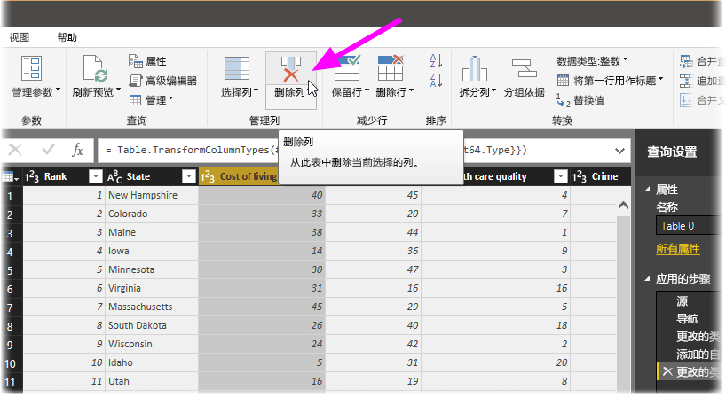

   请注意，新排名的值未发生更改，其原因在于步骤的顺序  。 由于查询编辑器按顺序记录步骤，但各个步骤相互独立，因此可在序列中上下移动每个“应用的步骤”  。 

1. 右键单击某个步骤。 查询编辑器会提供一个菜单，让你执行以下任务： 
   - **重命名**；为步骤重命名。
   - **删除**：删除步骤。
   - 删除到末尾   ：删除当前步骤以及所有后续步骤。
   - **上移**：在列表中向上移动该步骤。
   - **下移**：在列表中向下移动该步骤。

1. 将最后一步“删除列”向上移动到“已添加的自定义”步骤上方   。

   

1. 选择“已添加的自定义”步骤  。 

   请注意，数据现在显示出现“错误”，我们需要解决该错误  。

   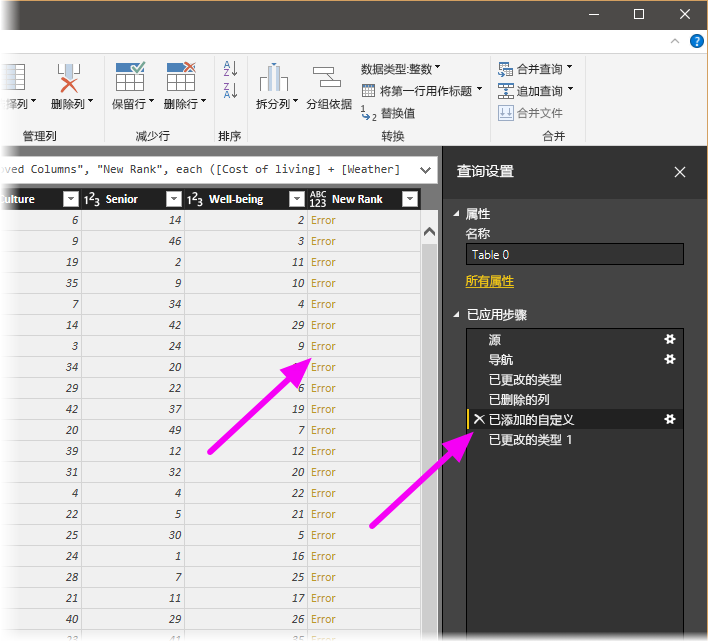

   可采用以下几种方法来获取每个错误的详细信息。 如果选择该单元格，而未单击“错误”这个词，查询编辑器将在窗口底部显示错误信息  。

   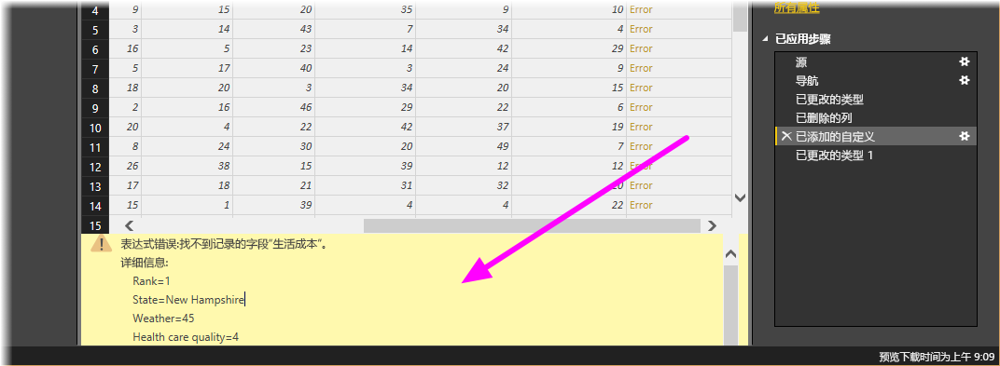

   如果直接选择“错误”这个词，则查询编辑器将在“查询设置”窗格中创建“应用的步骤”，并显示错误的相关信息    。 

1. 由于我们不需要显示有关错误的信息，因此请选择“取消”  。

1. 若要修复错误，请选择“新排名”列，然后选择“视图”选项卡的“公式栏”复选框来显示列的数据公式    。 

   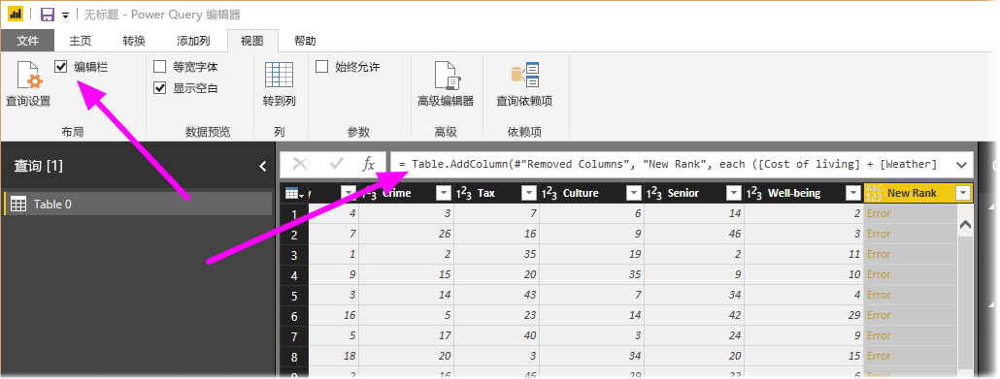

1. 删除“生活成本”参数并减少除数，方法是对公式进行如下更改  ： 
   ```
    Table.AddColumn(#"Removed Columns", "New Rank", each ([Weather] + [Health care quality] + [Crime] + [Tax] + [Culture] + [Senior] + [#"Well-being"]) / 7)
   ```

1. 选择公式框左侧的绿色复选标记，或按 Enter  。

  查询编辑器会将数据替换为修改后的值，并且“已添加的自定义”步骤顺利完成，未出现任何错误  。

   > [!NOTE]
   > 还可以通过使用功能区或右键单击菜单来选择“删除错误”，这将删除具有错误的任意行  。 但在本教程中，我们不希望这样操作，因为我们要保留表中的数据。

1. 基于“新排名”列对数据进行排序  。 首先选择最后一个应用的步骤“已更改类型 1”以显示最新数据  。 然后，选择“新排名”列标题旁边的下拉列表，并选择“升序排序”   。

   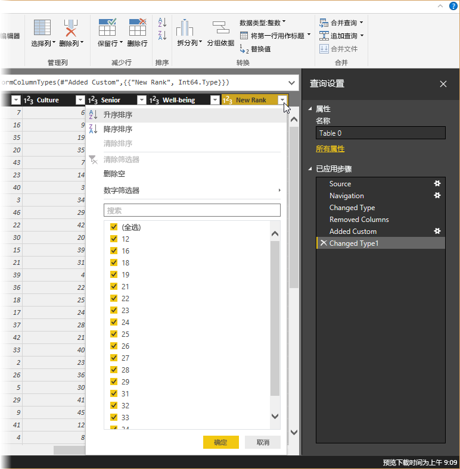

   数据现在会根据“新排名”进行排序  。 但是，如果查看“排名”列，将注意到在“新排名”值为一个并列值的情况下，数据未正确排序   。 我们将在下一步中修复此问题。

1. 若要解决数据排序问题，请选择“新排名”列并将“公式栏”中的公式更改为以下公式   ：

   ```
    = Table.Sort(#"Changed Type1",{{"New Rank", Order.Ascending},{"Rank", Order.Ascending}})
   ```

1. 选择公式框左侧的绿色复选标记，或按 Enter  。 

   现在，行已按照“新排名”和“排名”进行排序   。 此外，还可在列表的任何位置选择**所应用步骤**，然后继续在序列中此点处调整数据。 查询编辑器在当前选定的所应用步骤后直接自动插入一个新步骤  。 

1. 在“应用的步骤”中，选择自定义列前面的步骤，即步骤“已删除的列”   。 我们将在此替换亚利桑那州的“天气”排名值  。 右键单击包含亚利桑那州“天气”排名的相应单元格，然后选择“替换值”   。 请注意当前选择了哪个已应用的步骤  。

   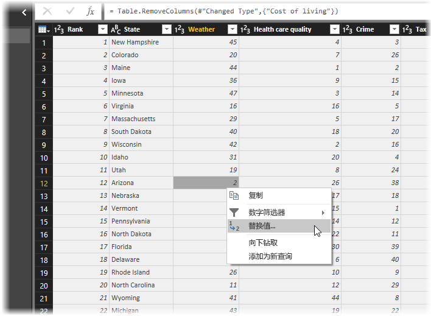

1. 选择“插入”  。

    因为我们要插入步骤，所以查询编辑器提醒我们这样做的危险；后续步骤可能导致查询中断。 

    

1. 将数据值更改为“51”  。 

   查询编辑器替换亚利桑那州的数据。 创建新的所应用步骤时，查询编辑器会根据操作对其命名；本例中为“已替换值”   。 如果查询中具有多个名称相同的步骤，则查询编辑器将对每个后续的所应用步骤添加一个编号（按顺序）以对其进行区分  。

1. 选择最后一个已应用的步骤，然后选择“已排序的行”   。 

   请注意，数据已根据亚利桑那州的新排名进行了更改。 之所以发生此更改是因为我们在“已添加自定义”步骤前，在正确的位置插入了“已替换值”步骤   。

1. 最后，我们想将此表格的名称更改为描述性内容。 在“查询设置”窗格的“属性”下，输入表的新名称，然后选择“输入”    。 将此表命名为 RetirementStats  。

   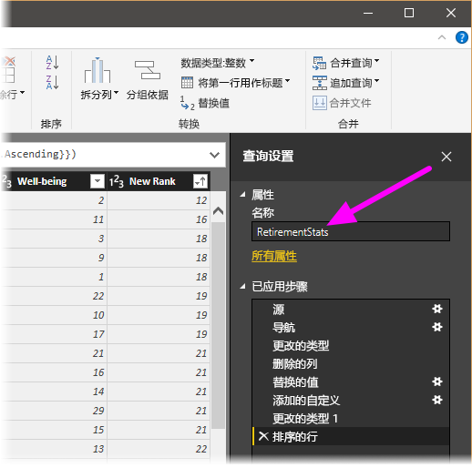

   在开始创建报表时，具有描述性的表格名称非常有用，特别是当连接到多个数据源，且它们均在“报表”视图的“字段”窗格中列出时   。

   现已按所需的范围调整了数据。 接下来，让我们连接到其他数据源，然后合并数据。

## <a name="combine-data"></a>合并数据
有关各州的那份数据很有趣，而且适用于生成其他分析工作和查询。 但是有一个问题：大多数数据使用两个字母的州名代码缩写，而不是该州的完整名称。 我们需要某种方式来建立州名及其缩写的关联。

我们很幸运；有另一个公共数据源可执行该项工作，但还需要进行相当多的调整，才能连接到我们的退休表。 若要调整数据，请执行以下步骤：

1. 从查询编辑器的“开始”功能区中选择“新源”\>“Web”   。 

2. 输入州缩写的网站地址 https://en.wikipedia.org/wiki/List_of_U.S._state_abbreviations ，然后选择“连接”   。

   导航器显示网站的内容。

    

1. 选择“代码和缩写”  。 

   > [!TIP]
   > 要将该表的数据缩减到我们所需的范围，将需要进行大量的调整。 是否有更快或更容易的方法完成以下步骤？ 是，我们可以创建两个表之间的关系  并基于该关系调整数据。 以下步骤对了解表的用法仍非常有用；但关系可以帮助你快速使用来自多个表的数据。
> 
> 

若要对数据进行调整，请执行以下步骤：

1. 删除首行。 因为它是网页表格创建方式的结果，不是所需的行。 从**开始**功能区中，选择**减少行 \> 删除行 \> 删除前几行**。

    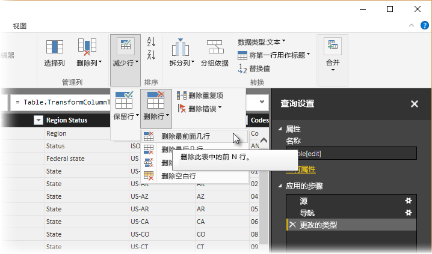

    将显示**删除前几行**窗口，让你执行要删除几行。

    > [!NOTE]
    > 如果 Power BI 意外导入表标题作为数据表中的行，可以从“主页”  选项卡，或者从功能区的“转换”  选项卡选择“将第一行用作标题”  ，以便修复表。

1. 删除底部的 26 行。 这些行的内容是美国区域，我们不需要包括这些行。 从**开始**功能区中，选择**减少行 \> 删除行 \> 删除后几行**。

    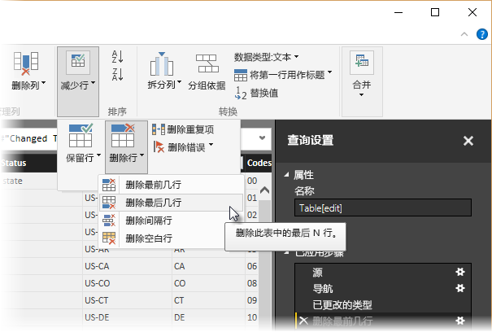

1. 由于 RetirementStats 表没有针对华盛顿特区的信息，我们需要将其从列表中筛选去除。 选择“区域状态”下拉箭头，然后清除“联邦特区”旁边的复选框   。

    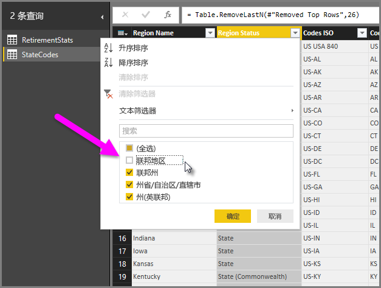

1. 删除一些不需要的列。 因为我们只需将每个州映射到其两个字母的官方缩写，因此可以删除下面的列：列 1、列 3、列 4，及列 6 到列 11      。 首先选择“列 1”，然后按住 Ctrl 键并选择要删除的所有其他列   。 从功能区的“开始”选项卡上，选择“删除列”\>“删除列”   。

   

   > [!NOTE]
   > 此时非常适合指出，查询编辑器中已应用步骤的序列  很重要，可能会影响数据调整方式。 同时也必须考虑一个步骤对另一个后续步骤可能会有什么影响；如果你从“所应用步骤”中删除一个步骤，则由于查询中步骤序列的影响，后续步骤可能不会按原本所期望的进行操作。

   > [!NOTE]
   > 如果将查询编辑器窗口大小重设为宽度缩小，部分功能区项会进行简缩，以充分利用可视空间。 在增加查询编辑器窗口的宽度时，功能区项将展开以充分利用已增加的功能区区域。

1. 重命名列和表。 可通过多种方法重命名列：首先，选择该列，然后从功能区的“转换”选项卡中选择“重命名”，或右键单击并选择“重命名”    。 下图具有指向这两个选项的箭头；只需任选其一。

   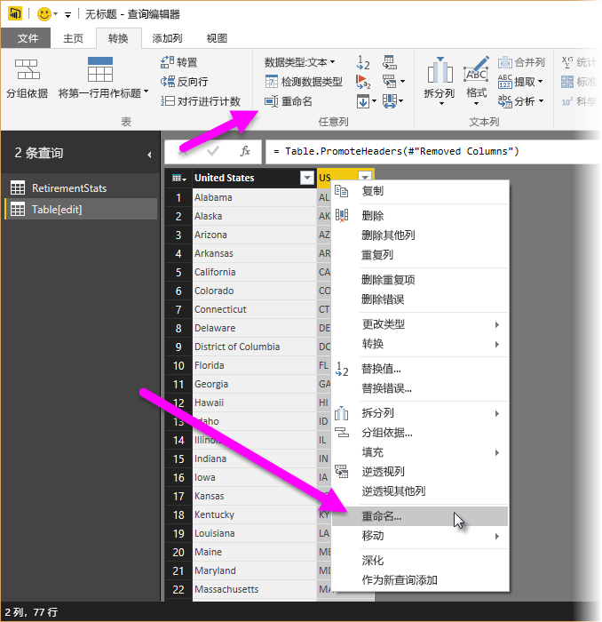

1. 将列重命名为“州名”和“州代码”   。 若要重命名表，请在“查询设置”窗格中输入名称   。 将此表命名为 StateCodes  。

## <a name="combine-queries"></a>合并查询

现已按所需方式对 StateCodes 表进行了调整，接下来将这两个表或查询合并成一个表或查询。 由于现有的表是针对数据应用查询后的结果，因此这些表通常称为“查询”  。

有两种主要方法可合并查询：合并和追加   。

- 当你有一列或多列要添加到另一个查询时，你可*合并*这些查询。 
- 当你有其他列要添加到现有查询时，你可*追加*查询。

在本例中，我们需要合并查询。 为此，请执行下列步骤：
 
1. 在查询编辑器的左窗格中，选择要将其他查询合并到其中的查询  。 在本例中选择 RetirementStats  。 

1. 从功能区的“开始”选项卡中，选择“合并”\>“合并查询”   。

   

   系统可能会提示你设置隐私级别，以确保对数据进行合并，且不包括或不传输无需传输的数据。

   随即显示“合并”窗口  。 这提示你选择想要合并到所选表中的表格，以及要用于合并的匹配列。 

1. 从 RetirementStats 表中选择“州”，然后选择“StateCodes”查询   。 

   选择了正确的匹配列后，会激活“确定”按钮  。

   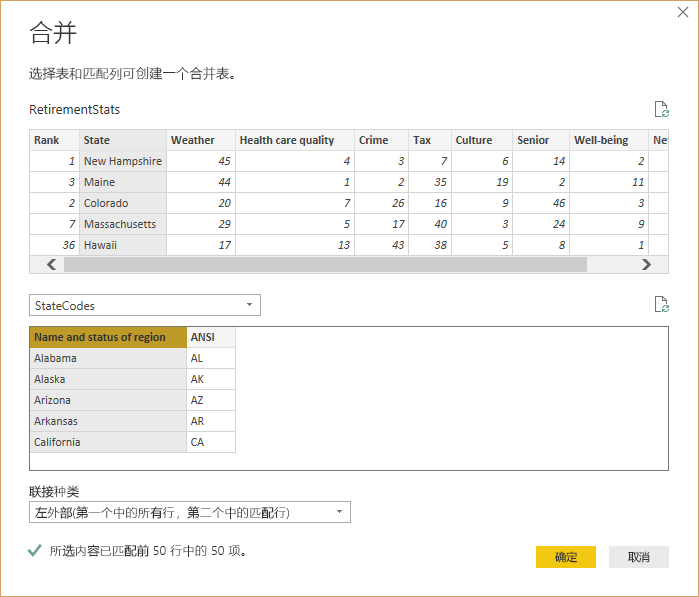

1. 选择“确定”。 

   查询编辑器在查询的结尾创建 NewColumn 列，其中包含与现有查询合并的表（查询）的内容  。 已合并查询中的所有列将压缩到 NewColumn 列中，但你可以扩展表，使之包含所需的任何列   。

   

1. 若要扩展已合并表格，并选择要包含的列，请选择扩展图示（）。 

   **展开**窗口随即出现。

   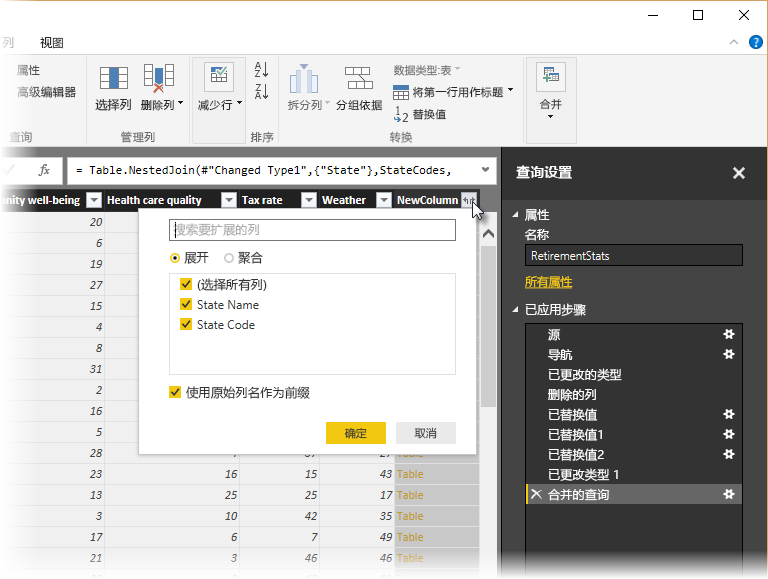

1. 在本例中，我们只需“州代码”列  。 选择该列，清除“使用原始列名作为前缀”，然后选择“确定”   。

   如果选中了“使用原始列名作为前缀”的复选框，合并的列将命名为“NewColumn.State Code”   。

   > [!NOTE]
   > 想了解如何引入 NewColumn 表？ 你可以试验一下，如果不喜欢结果，只需从**查询设置**窗格中**所应用步骤**列表删除该步骤，你的查询便会回到应用**展开**步骤之前的状态。 你可以不限次数地任意执行，直到展开过程看起来是你要的方式为止。

   现在，我们在单个查询（表）中组合了两个数据源，每个数据源都已根据需要进行调整。 此查询可以作为许多其他相关数据连接的基础，例如任何州的住房成本统计数据、人口统计数据或工作机会。

1. 若要应用更改并关闭查询编辑器，请从“主页”功能区选项卡中选择“关闭并应用”   。 

   转换后的数据集将在 Power BI Desktop 中显示，可随时用于创建报表。

   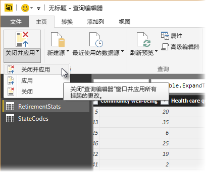

## <a name="next-steps"></a>后续步骤
有关 Power BI Desktop 及其功能的详细信息，请参阅以下资源：

* [什么是 Power BI Desktop？](desktop-what-is-desktop.md)
* [Power BI Desktop 中的查询概述](desktop-query-overview.md)
* [Power BI Desktop 中的数据源](desktop-data-sources.md)
* [连接到 Power BI Desktop 中的数据](desktop-connect-to-data.md)
* [Power BI Desktop 中的常见查询任务](desktop-common-query-tasks.md)   

