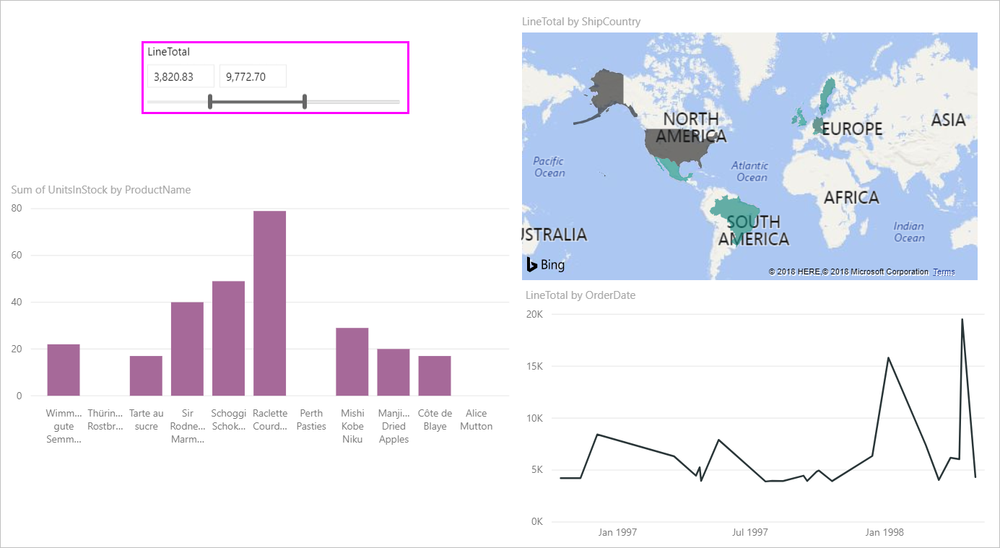
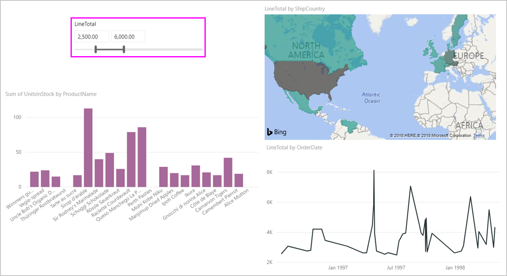

# 在 Power BI 中使用数值范围切片器

[!INCLUDE [applies-to](includes/applies-to.md)] [!INCLUDE [yes-desktop](includes/yes-desktop.md)] [!INCLUDE [yes-service](includes/yes-service.md)]

借助数值范围切片器，可以将各种类型的筛选器应用于数据模型中的任意数值列。 筛选数值数据有三个选项：介于两个数字之间、小于或等于某数字、大于或等于某数字。 这一简单技术是筛选数据的有效方法。

## 视频

在此视频中，Will 介绍了如何创建数值范围切片器。

> [!NOTE]
> 此视频使用较旧版本的 Power BI Desktop。

<iframe width="560" height="315" src="https://www.youtube.com/embed/zIZPA0UrJyA" frameborder="0" allowfullscreen></iframe> 

## 添加数值范围切片器

数值范围切片器的使用方法与其他任何切片器的使用方法相同。 只需为报表创建“切片器”视觉对象，然后选择一个数值作为“字段”值即可   。 在下图中，选择了“LineTotal”字段  。

选择“数值范围切片器”右上角的向下箭头，此时系统会显示一个菜单。

对于数值范围，可以从以下三个选项中进行选择：

* 介于 
* 小于或等于 
* 大于或等于 

从菜单中选择“介于”时，将显示一条滑块  。 可以使用滑块来选择介于数字之间的数值。 有时移动切片器栏的粒度会使其难以准确落在该数字上。 还可以使用滑块，选择其中一个框以键入所需的值。 如果要在特定数字上进行切片，这样做很方便。

在下图中，报表页筛选出了介于 2500.00 到 6000.00 之间的“LineTotal”值  。

选择“小于或等于”后，滑块条的左侧（下限值）图柄消失，只能调整滑块条的上限值  。 在下图中，我们将滑块条最大值设置为 5928.19。

最后，如果选择“大于或等于”，则右侧（上限值）滑块条图柄消失  。 然后可以调整下限值，如下图所示。 现在，只有 LineTotal 大于或等于 4902.99 的项才会显示在报表页上的视觉对象中  。

## 使用数值范围切片器对齐到整数

如果基础字段的数据类型为“整数”，则数值范围切片器将对齐到整数  。 此功能可使切片器与整数完全对齐。 “小数”字段允许输入或选择数字的小数部分  。 文本框中设置的格式与该字段设置的格式相匹配，但你可以键入或选择更精确的数字。

## 使用日期范围切片器显示格式设置

使用切片器显示或设置日期范围时，日期以“短日期”格式显示  。 用户的浏览器或操作系统区域设置确定日期格式。 因此，无论基础数据或模型的数据类型设置是什么，都将显示为这种格式。

例如，可以将基础数据类型设置为长日期格式。 在这种情况下，日期格式“dddd，yyyy 年 M 月 d 日”会将其它视觉对象或环境中的日期格式化为“星期三，2001 年 3 月 14 日”   。 但在日期范围切片器中，该日期在切片器中显示为 03/14/2001  。

在切片器中显示“短日期”格式可确保字符串的长度在切片器中保持一致和紧凑。

## 限制和注意事项

数值范围切片器具有以下限制和注意事项：

* 数值范围切片器筛选数据中的每个基础行，而不筛选任何聚合值。 例如，假设使用“销售额”字段  。 然后，切片器将根据销售额筛选每个交易记录，而不会根据视觉对象的每个数据点的销售额的总和来筛选每个交易记录。
* 当前无法处理度量值。
* 可以在数值切片器中键入任何数字，即使它超出基础列中的值范围。 如果知道数据将来可能会发生更改，这样做可以事先设置筛选器。
