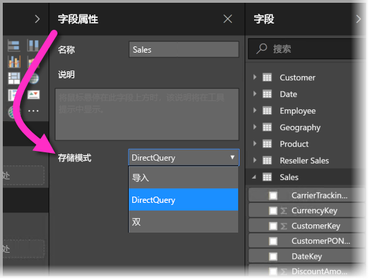
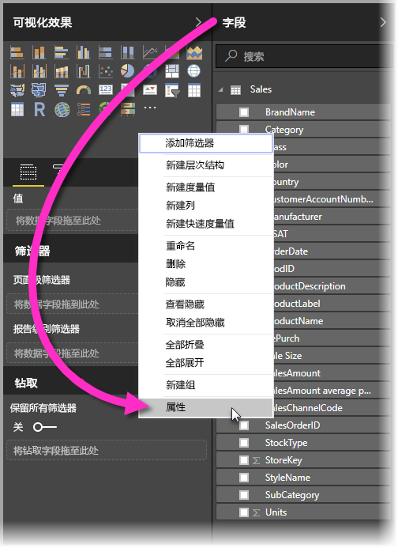
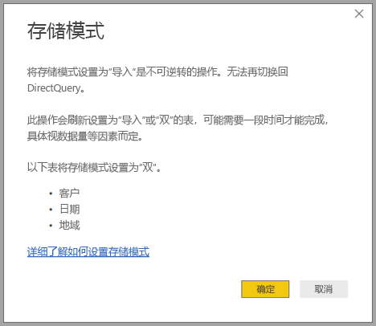

# Power BI Desktop 中的存储模式（预览版）

在 Microsoft Power BI Desktop 中，可以指定表的存储模式。 借助存储模式，可控制 Power BI Desktop 是否将表数据缓存到报表内存中。 

设置存储模式带来了许多优势。 可以为模型中的每个表单独设置存储模式。 这样做就实现了单一数据集，并带来了以下优势：

* **查询性能**：当用户与 Power BI 报表中的视觉对象交互时，数据分析表达式 (DAX) 查询会被提交到数据集。 通过正确设置存储模式将数据缓存到内存中，可提升报表的查询性能和交互性。

* **大型数据集**：未缓存表不会出于缓存目的占用内存。 可以对大型数据集启用交互式分析，这些数据集因过大或过于昂贵而无法完全缓存到内存中。 可以选择哪些表值得缓存，而哪些不值得。

* **数据刷新优化**：无需刷新未缓存表。 可以只缓存满足服务级别协议和业务需求所需的数据，从而减少刷新次数。

* **准实时需求**：不缓存可能会让具有准实时需求的表受益，以减少数据延迟。

* **写回**：借助写回，业务用户可以更改单元格值，从而探索模拟方案。 自定义应用程序可以将更改应用到数据源。 未缓存表可以立即显示更改，可便于执行即时效果分析。

Power BI Desktop 中的存储模式设置是以下三个相关功能之一：

* **复合模型**：允许报表有任意组合的两个或多个数据连接，包括 DirectQuery 连接或“导入”。 有关详细信息，请参阅 [Power BI Desktop 中的复合模型（预览版）](desktop-composite-models.md)。

* **多对多关系**：借助复合模型，可以在表之间建立多对多关系。 多对多关系功能删除了对表中唯一值的要求。 它还删除了旧解决办法，如为建立关系而仅引入新表。 有关详细信息，请参阅 [Power BI Desktop 中的多对多关系（预览版）](desktop-many-to-many-relationships.md)。

* **存储模式**：现在可以指定哪些视觉对象需要查询后端数据源。 导入的是不需要查询的视觉对象，即使基于 DirectQuery，也不例外。 此功能有助于提升性能，并减少后端负载。 以前，甚至是切片器等简单视觉对象，也会启动发送至后端源的查询。 本文进一步介绍了存储模式。

## 使用存储模式属性

存储模式是可以对模型中的所有表进行设置的属性。 若要设置存储模式，请在“字段”窗格中右键单击要设置其属性的表，再选择“属性”。

表的“字段属性”窗格中的“存储模式”下拉列表内显示当前属性。 可以在其中查看当前存储模式或修改存储模式。

存储模式有以下三个值：

* **导入**：如果你将值设置为“导入”，系统缓存的是导入表。 如果查询提交到 Power BI 数据集，且返回“导入”模式表数据，那么就只能通过缓存数据完成。

* **DirectQuery**：如果你使用此设置，系统不会缓存 DirectQuery 表。 如果查询提交到 Power BI 数据集（例如，数据分析表达式 (DAX) 查询），且返回 DirectQuery 表数据，那么就只能通过对数据源执行按需查询完成。 提交到数据源的查询使用相应数据源的查询语言（例如，SQL）。

* **双**：双表可充当缓存表，也可以充当未缓存表，具体视提交到 Power BI 数据集的查询的上下文而定。 在一些情况下，查询是通过缓存数据完成。 在另一些情况下，查询是通过对数据源执行按需查询完成。

将表更改为“导入”是无法撤消的操作。 无法将此属性更改回“DirectQuery”或“双”。

## DirectQuery 表和“双”表约束

“双”模式表与“DirectQuery”模式表的功能约束相同。 这些约束包括有限 M 转换，以及计算列中的受限 DAX 函数。 有关详细信息，请参阅[使用 DirectQuery 的影响](desktop-directquery-about.md#implications-of-using-directquery)。

## 双传播
请考虑下列简单模型，其中所有表都来自支持导入和 DirectQuery 的单个源。

让我们假设 DirectQuery 将从此模型中的所有表开始。 然后，如果将“SurveyResponse”表的存储模式更改为“导入”，便会看到以下警告窗口：

维度表（客户、地域和日期）可设置为“双”模式表，以减少数据集中的弱关系数，并提高性能。 弱关系通常涉及至少一个 DirectQuery 表，其中联接逻辑无法推送到源系统。 “双”模式表可以充当 DirectQuery 或导入这一点可避免这种情况。

传播逻辑旨在帮助包含多个表的模型。 假设你有一个带 50 个表的模型，只有某些事实（事务）表需要进行缓存。 Power BI Desktop中的逻辑会计算出必须设置为“双”的维度表的最小集，因此你不必再动手计算。

传播逻辑仅遍历到 1 对多关系的一端。

## 存储模式的使用情况示例
继续以上一部分中的示例为例，假设应用以下存储模式属性设置：

| 表格                   | 存储模式         |
| ----------------------- |----------------------| 
| *Sales*                 | DirectQuery          | 
| *SurveyResponse*        | 导入               | 
| *Date*                  | 双                 | 
| *Customer*              | 双                 | 
| *Geography*             | 双                 | 

设置这些存储模式属性会导致以下行为，前提是“Sales”表有大量数据。
* 由于 Power BI Desktop 缓存维度表（“Date”、“Customer”和“Geography”），因此当报表检索要显示的切片器值时，初始报表的加载速度应该会很快。
* 如果不缓存“Sales”表，Power BI Desktop 实现以下结果：
    * 数据刷新速度加快，内存占用减少。
    * 基于“Sales”表的报表查询在 DirectQuery 模式下运行。 这些查询可能需要更长时间才能完成，但更接近实时，因为缓存延迟未引入。

* 由于基于“SurveyResponse”表的报表查询从内存中缓存返回，因此速度应相对较快。

## 命中或错过缓存的查询

通过将 SQL Profiler 连接到 Power BI Desktop 的诊断端口，可以执行基于以下事件的跟踪，从而确定哪些查询命中或错过了内存中缓存：

* Queries Events\Query Begin
* Query Processing\Vertipaq SE Query Begin
* Query Processing\DirectQuery Begin

对于每个“Query Begin”事件，使用相同的 ActivityID 查看其他事件。 例如，如果没有“DirectQuery Begin”事件，但有“Vertipaq SE Query Begin”事件，表明已通过缓存对查询进行应答。

引用“双”模式表的查询从缓存中返回数据（若有），否则会还原为“DirectQuery”模式。

继续以前面的示例为例，以下查询只引用“双”模式“Date”表中的列。 因此，查询应该能命中缓存。

以下查询仅引用“Sales”表中的列，该表处于“DirectQuery”模式。 因此，它不应命中缓存。

下面的查询非常有趣，因为它结合了这两个列。 此查询未命中缓存。 最初可能希望它从缓存中检索 CalendarYear 值，并从源中检索 SalesAmount 值，然后合并结果；但这种方法的效率要低于将 SUM/GROUP BY 运算提交到源系统中。 如果该操作向下推送到数据源，返回的行数可能会少得多。 

> [!NOTE]
> 合并缓存表和非缓存表时，此行为不同于 [Power BI Desktop 中的多对多关系（预览版）](desktop-many-to-many-relationships.md)。

## 缓存应保持同步

上一部分中显示的查询表明，“双”模式表有时会命中缓存，有时也不会。 因此，如果缓存已过期，可能返回不同的值。 查询执行不会试图掩盖数据问题，例如，通过筛选 DirectQuery 结果以匹配缓存值。 了解数据流是你的责任，并应相应地进行设计。 如有必要，有一些现成的技术可以在源中处理此类情况。

“双”存储模式是一种性能优化。 只有在不影响满足业务需求的情况下，才能使用它。 对于备用行为，请考虑使用 [Power BI Desktop 中的多对多关系（预览版）](desktop-many-to-many-relationships.md)一文中所述的技术。

## 数据视图
如果数据集中至少有一个表的“存储模式”设置为“导入”或“双”，系统便会显示“数据视图”选项卡。

在“数据视图”中选择“双”模式表和“导入”模式表后会看到缓存数据。 “DirectQuery”模式表不显示数据，而是显示消息，以指明无法显示 DirectQuery 表。

## 限制和注意事项

这一版的存储模式及其与复合模型的相关性有一些限制。

以下 Live Connect（多维）源无法用于复合模型：

* SAP HANA
* SAP Business Warehouse
* SQL Server Analysis Services
* Power BI 数据集
* Azure Analysis Services

使用 DirectQuery 连接到这些多维数据源时，既无法同时连接到另一个 DirectQuery 源，也无法将它与导入数据相结合。

使用复合模型时，仍要遵守现有的 DirectQuery 使用限制。 现在每个表都要遵循其中许多限制，具体视表的存储模式而定。 例如，导入表上的计算列可以引用其他表，但是 DirectQuery 表上的计算列仍限制为只能引用同一表上的列。 如果模型中的任何一个表都是 DirectQuery，则其他限制适用于整个模型。 例如，如果模型中任意表的存储模式为“DirectQuery”，QuickInsights 和问答功能对模型不可用。 

## 后续步骤

若要详细了解复合模型和 DirectQuery，请参阅以下文章：
* [Power BI Desktop 中的复合模型（预览版）](desktop-composite-models.md)
* [Power BI Desktop 中的多对多关系（预览版）](desktop-many-to-many-relationships.md)
* [在 Power BI 中使用 DirectQuery](desktop-directquery-about.md)
* [Power BI 中 DirectQuery 支持的数据源](desktop-directquery-data-sources.md)
