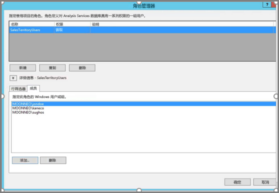
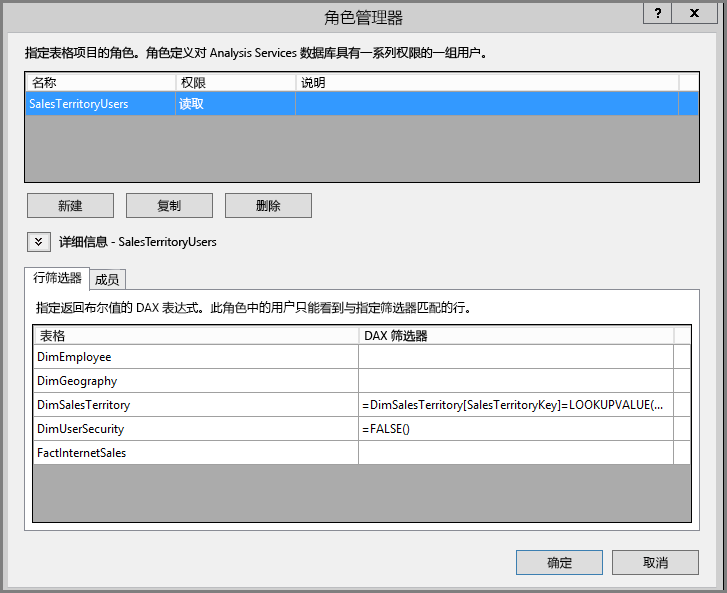
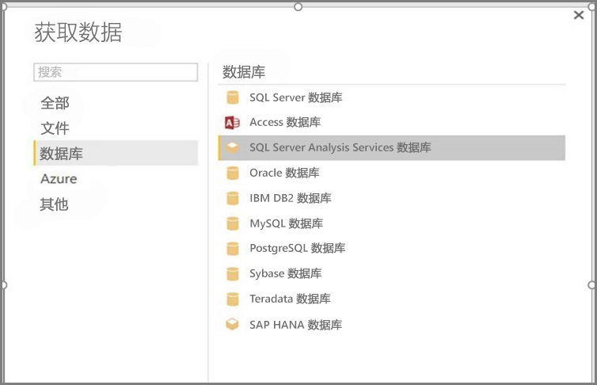
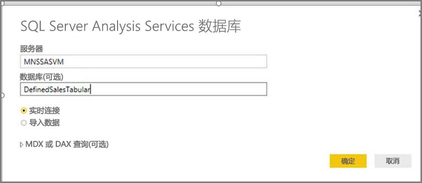
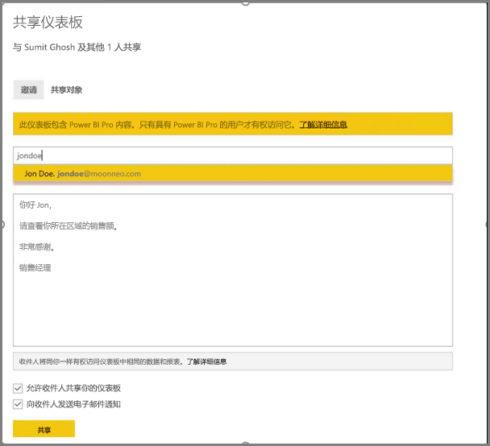

# <a name="implement-row-level-security-in-an-analysis-services-tabular-model"></a>在 Analysis Services 表格模型中实现行级别安全性

本教程将通过使用示例数据集完成以下步骤来演示如何在 Analysis Services 表格模型  中实现[行级别安全性  ](service-admin-rls.md)以及如何在 Power BI 报表中使用它。

* 在 [AdventureworksDW2012 数据库](https://github.com/Microsoft/sql-server-samples/releases/tag/adventureworks)中创建新的安全表
* 生成含有所需事实数据表和维度表的表格模型
* 定义用户角色和权限
* 将模型部署到 *Analysis Services 表格*实例
* 生成 Power BI Desktop 报表，为访问报表的用户显示量身定制的数据
* 将报表部署到 *Power BI* 服务。
* 基于报表创建新的仪表板
* 与您的同事共享仪表板

本教程要求使用 [AdventureworksDW2012 数据库](https://github.com/Microsoft/sql-server-samples/releases/tag/adventureworks)。

## <a name="task-1-create-the-user-security-table-and-define-data-relationship"></a>任务 1：创建用户安全表并定义数据关系

可以找到许多介绍如何使用 SQL Server Analysis Services (SSAS) 表格  模型定义行级别动态安全性的文章。 对于我们的示例，我们参考[通过使用行筛选器实现动态安全性](/analysis-services/tutorial-tabular-1200/supplemental-lesson-implement-dynamic-security-by-using-row-filters)。

此处的步骤要求使用 AdventureworksDW2012 关系数据库。

1. 在 AdventureworksDW2012 中，创建 `DimUserSecurity` 表，如下所示。 可以使用 [SQL Server Management Studio (SSMS)](/sql/ssms/download-sql-server-management-studio-ssms) 来创建表。

   

1. 创建并保存表后，需要在 `DimUserSecurity` 表的 `SalesTerritoryID` 列与 `DimSalesTerritory` 表的 `SalesTerritoryKey` 列之间建立关系，如下所示。

   在 SSMS 中，右键单击 DimUserSecurity  ，然后选择“设计”  。 然后，选择“表设计器”   > “关系...”  。完成后，保存表。

   

1. 将用户添加到表。 右键单击 DimUserSecurity  ，然后选择“编辑前 200 行”  。 添加了用户后，`DimUserSecurity` 表应类似于以下示例：

   

   你在即将开始的任务中将看到这些用户。

1. 接下来，使用 `DimSalesTerritory` 表执行内部联接  ，该表显示与用户关联的区域详细信息。 此处的 SQL 代码执行内部联接，下图显示表随后的显示形式。

    ```sql
    select b.SalesTerritoryCountry, b.SalesTerritoryRegion, a.EmployeeID, a.FirstName, a.LastName, a.UserName from [dbo].[DimUserSecurity] as a join [dbo].[DimSalesTerritory] as b on a.[SalesTerritoryID] = b.[SalesTerritoryKey]
    ```

   由于在步骤 2 中创建的关系，联接的表显示负责各个销售区域的人员。 例如，可以看到 Rita Santos  负责 Australia  。

## <a name="task-2-create-the-tabular-model-with-facts-and-dimension-tables"></a>任务 2：创建含事实数据表和维度表的表格模型

准备好关系数据仓库后，需要定义表格模型。 可以使用 [SQL Server Data Tools](/sql/ssdt/sql-server-data-tools) (SSDT) 创建模型。 有关详细信息，请参阅[创建新的表格模型项目](/sql/analysis-services/lesson-1-create-a-new-tabular-model-project)。

1. 如下所示，将所有必需表导入模型。

    

1. 在导入必需的表之后，需要定义一个名为 SalesTerritoryUsers  的具有读取权限的角色。 在 SQL Server Data Tools 中选择“模型”菜单，然后选择“角色”   。 在“角色管理器”  中，选择“新建”  。

1. 在“角色管理器”  中的“成员”  下，添加通过[任务 1](#task-1-create-the-user-security-table-and-define-data-relationship) 在 `DimUserSecurity` 表中定义的用户。

    

1. 接下来，为 `DimSalesTerritory` 和 `DimUserSecurity` 表添加适当的函数，如下面的“行筛选器”  选项卡下所示。

    

1. `LOOKUPVALUE` 函数返回某个列的值，该列中的 Windows 用户名与 `USERNAME` 函数返回的用户名匹配。 然后，可以将查询限定为 `LOOKUPVALUE` 返回的值与同一表或相关表中的值相匹配的情况。 在 **DAX 筛选器**列中，键入以下公式︰

    ```dax
        =DimSalesTerritory[SalesTerritoryKey]=LOOKUPVALUE(DimUserSecurity[SalesTerritoryID], DimUserSecurity[UserName], USERNAME(), DimUserSecurity[SalesTerritoryID], DimSalesTerritory[SalesTerritoryKey])
    ```

    在此公式中，`LOOKUPVALUE` 函数会返回 `DimUserSecurity[SalesTerritoryID]` 列的所有值，其中 `DimUserSecurity[UserName]` 与当前登录的 Windows 用户名相同，`DimUserSecurity[SalesTerritoryID]` 与 `DimSalesTerritory[SalesTerritoryKey]`相同。

    > [!IMPORTANT]
    > 在使用行级别安全性时，不支持使用 DAX 函数 [USERELATIONSHIP](/dax/userelationship-function-dax)。

   `LOOKUPVALUE` 返回的 Sales `SalesTerritoryKey` 集随后用于限制 `DimSalesTerritory` 中显示的行。 仅显示 `SalesTerritoryKey` 值位于 `LOOKUPVALUE` 函数返回的 ID 中的行。

1. 对于 `DimUserSecurity` 表，在“DAX 筛选器”  列中，添加以下公式：

    ```dax
        =FALSE()
    ```

    此公式指定所有列都解析为 `false`；这意味着无法查询 `DimUserSecurity` 表列。

现在，需要处理并部署模型。 有关详细信息，请参阅[部署](/sql/analysis-services/lesson-13-deploy)。

## <a name="task-3-add-data-sources-within-your-on-premises-data-gateway"></a>任务 3：在本地数据网关中添加数据源

表格模型部署完毕并可供使用后，需要向本地 Analysis Services 表格服务器添加数据源连接。

1. 若要允许 Power BI 服务访问本地分析服务，需要在环境中安装并配置[本地数据网关](service-gateway-onprem.md)。

1. 正确配置本地数据网关后，需要为 *Analysis Services* 表格实例创建一个数据源连接。 有关详细信息，请参阅[管理数据源 - Analysis Services](service-gateway-enterprise-manage-ssas.md)。

   

此过程完成后，网关便已配置完成，并且可与本地 Analysis Services 数据源进行交互。

## <a name="task-4-create-report-based-on-analysis-services-tabular-model-using-power-bi-desktop"></a>任务 4：使用 Power BI Desktop 基于 Analysis Services 表格模型创建报表

1. 启动 Power BI Desktop 并选择“获取数据”   > “数据库”  。

1. 从数据源列表中选择“SQL Server Analysis Services 数据库”，然后选择“连接”   。

   

1. 填写 Analysis Services 表格实例详细信息，然后选择“实时连接”  。 然后，选择“确定”  。
  
   

   使用 Power BI 时，动态安全性仅适用于实时连接。

1. 可以看到部署的模型位于 Analysis Services 实例中。 选择相应的模型，然后选择“确定”  。

   现在，Power BI Desktop 在画布右侧的“字段”  窗格中显示所有可用字段。

1. 在“字段”窗格中，从“FactInternetSales”表中选择“SalesAmount”度量值，从“SalesTerritory”表中选择“SalesTerritoryRegion”维度      。

1. 为了让此报表看上去简单明了，现在不会再添加任何列。 若要让数据表示形式更有意义，请将可视化效果更改为“环形图”  。

   

1. 等报表准备就绪后，你就可以将它直接发布到 Power BI 门户。 从 Power BI Desktop 的“主页”  功能区中选择“发布”  。

## <a name="task-5-create-and-share-a-dashboard"></a>任务 5：创建和共享仪表板

已创建报表并将其发布到 Power BI  服务。 现在，可以使用先前步骤中创建的示例来演示模型安全性方案。

在销售经理  角色中，用户 Grace 可以看到所有不同销售区域的数据。 Grace 会创建此报表并将其发布到 Power BI 服务。 此报表是在以前任务中创建的。

Grace 发布报表后，接下来需在 Power BI 服务中基于该报表创建名为 TabularDynamicSec 的仪表板  。 在下图中，请注意 Grace 可以看到所有销售区域的对应数据。

   

现在，Grace 与同事 Rita 共享此仪表板，后者负责澳大利亚地区的销售。

   

当 Rita 登录到 Power BI 服务并查看 Grace 创建的共享仪表板时，只能看到 Australia 区域的销售额。

恭喜！ Power BI 服务显示本地 Analysis Services 表格模型中定义的动态行级别安全性。 Power BI 使用 `EffectiveUserName` 属性将当前 Power BI 用户凭据发送到本地数据源，以运行查询。

## <a name="task-6-understand-what-happens-behind-the-scenes"></a>任务 6：了解幕后发生了什么

此任务假定你熟悉 [SQL Server Profiler](/sql/tools/sql-server-profiler/sql-server-profiler)，因为你需要通过 SQL Server Profiler 捕获本地 SSAS 表格实例上发生的事件。

只要用户 (Rita) 访问 Power BI 服务中的仪表板，会话就会初始化。 你会发现，**salesterritoryusers** 角色立即生效，有效用户名为 **<EffectiveUserName>rita@contoso.com</EffectiveUserName>**

       <PropertyList><Catalog>DefinedSalesTabular</Catalog><Timeout>600</Timeout><Content>SchemaData</Content><Format>Tabular</Format><AxisFormat>TupleFormat</AxisFormat><BeginRange>-1</BeginRange><EndRange>-1</EndRange><ShowHiddenCubes>false</ShowHiddenCubes><VisualMode>0</VisualMode><DbpropMsmdFlattened2>true</DbpropMsmdFlattened2><SspropInitAppName>PowerBI</SspropInitAppName><SecuredCellValue>0</SecuredCellValue><ImpactAnalysis>false</ImpactAnalysis><SQLQueryMode>Calculated</SQLQueryMode><ClientProcessID>6408</ClientProcessID><Cube>Model</Cube><ReturnCellProperties>true</ReturnCellProperties><CommitTimeout>0</CommitTimeout><ForceCommitTimeout>0</ForceCommitTimeout><ExecutionMode>Execute</ExecutionMode><RealTimeOlap>false</RealTimeOlap><MdxMissingMemberMode>Default</MdxMissingMemberMode><DisablePrefetchFacts>false</DisablePrefetchFacts><UpdateIsolationLevel>2</UpdateIsolationLevel><DbpropMsmdOptimizeResponse>0</DbpropMsmdOptimizeResponse><ResponseEncoding>Default</ResponseEncoding><DirectQueryMode>Default</DirectQueryMode><DbpropMsmdActivityID>4ea2a372-dd2f-4edd-a8ca-1b909b4165b5</DbpropMsmdActivityID><DbpropMsmdRequestID>2313cf77-b881-015d-e6da-eda9846d42db</DbpropMsmdRequestID><LocaleIdentifier>1033</LocaleIdentifier><EffectiveUserName>rita@contoso.com</EffectiveUserName></PropertyList>

基于有效用户名请求，Analysis Services 在查询本地 Active Directory 后将请求转换为真实的 `contoso\rita` 凭据。 Analysis Services 获取凭据后，Analysis Services 会返回用户有权查看和访问的数据。

如果仪表板发生更多活动，则通过 SQL Profiler 可以看到根据 DAX 查询设定，Analysis Services 表格模型会相应返回一个特定的查询。 例如，如果 Rita 从仪表板转到基础报表，则会进行以下查询。

   

还可在下方看到执行用于填充报表数据的 DAX 查询。
   
   ```dax
   EVALUATE
     ROW(
       "SumEmployeeKey", CALCULATE(SUM(Employee[EmployeeKey]))
     )
   
   <PropertyList xmlns="urn:schemas-microsoft-com:xml-analysis">``
             <Catalog>DefinedSalesTabular</Catalog>
             <Cube>Model</Cube>
             <SspropInitAppName>PowerBI</SspropInitAppName>
             <EffectiveUserName>rita@contoso.com</EffectiveUserName>
             <LocaleIdentifier>1033</LocaleIdentifier>
             <ClientProcessID>6408</ClientProcessID>
             <Format>Tabular</Format>
             <Content>SchemaData</Content>
             <Timeout>600</Timeout>
             <DbpropMsmdRequestID>8510d758-f07b-a025-8fb3-a0540189ff79</DbpropMsmdRequestID>
             <DbPropMsmdActivityID>f2dbe8a3-ef51-4d70-a879-5f02a502b2c3</DbPropMsmdActivityID>
             <ReturnCellProperties>true</ReturnCellProperties>
             <DbpropMsmdFlattened2>true</DbpropMsmdFlattened2>
             <DbpropMsmdActivityID>f2dbe8a3-ef51-4d70-a879-5f02a502b2c3</DbpropMsmdActivityID>
           </PropertyList>
   ```

## <a name="considerations"></a>注意事项

* Power BI 的本地行级别安全性只能用于实时连接。

* 处理模型后，数据的任何更改都将立即提供给从 Power BI 服务通过实时连接访问报表的用户。

