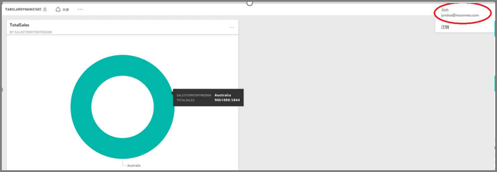

# <a name="dynamic-row-level-security-with-analysis-services-tabular-model"></a>通过 Analysis Services 表格模型实现动态行级别安全性

本教程将通过使用示例数据集完成以下步骤来演示如何在 **Analysis Services 表格模型**中实现[**行级别安全性**](service-admin-rls.md)以及如何在 Power BI 报表中使用它。 

* 在 [**AdventureworksDW2012** 数据库](https://github.com/Microsoft/sql-server-samples/releases/tag/adventureworks)中创建新的安全表
* 生成含有所需事实数据表和维度表的表格模型
* 定义用户角色和权限
* 将模型部署到 **Analysis Services 表格**实例
* 生成 Power BI Desktop 报表，为访问报表的用户显示量身定制的数据
* 将报表部署到 **Power BI** 服务。
* 基于报表创建新的仪表板
* 与您的同事共享仪表板 

本教程要求使用 [**AdventureworksDW2012** 数据库](https://github.com/Microsoft/sql-server-samples/releases/tag/adventureworks)。

## <a name="task-1-create-the-user-security-table-and-define-data-relationship"></a>任务 1：创建用户安全表并定义数据关系

可以找到许多介绍如何使用 **SQL Server Analysis Services (SSAS) 表格**模型定义行级别动态安全性的文章。 对于我们的示例，我们参考[通过使用行筛选器实现动态安全性](https://docs.microsoft.com/analysis-services/tutorial-tabular-1200/supplemental-lesson-implement-dynamic-security-by-using-row-filters)。 

此处的步骤要求使用 **AdventureworksDW2012** 关系数据库。

1. 在 **AdventureworksDW2012** 中，创建 **DimUserSecurity** 表，如下所示。 可以使用 [SQL Server Management Studio (SSMS)](https://docs.microsoft.com/sql/ssms/download-sql-server-management-studio-ssms) 来创建表。
   
   

2. 创建并保存表后，需要在 **DimUserSecurity** 表的 **SalesTerritoryID** 列和 **DimSalesTerritory** 表的 **SalesTerritoryKey** 列之间建立关系，如下所示。 

   在 SSMS  中，右键单击 DimUserSecurity  表，然后选择“设计”  。 然后，选择“表设计器”->“关系...”  。完成后，保存表。
   
   

3. 将用户添加到表中：右键单击 **DimUserSecurity** 表，然后选择“编辑前 200 行”  。 添加用户后，**DimUserSecurity** 表应显示类似如下的内容，但其中包含的是你自己的用户：
   
   
   
   你在即将开始的任务中将看到这些用户。

4. 接下来，使用 DimSalesTerritory  表执行内部联接  ，该表显示与用户关联的区域详细信息。 此处的 SQL 代码执行内部联接  ，下图显示表随后的显示形式。
   
       select b.SalesTerritoryCountry, b.SalesTerritoryRegion, a.EmployeeID, a.FirstName, a.LastName, a.UserName from [dbo].[DimUserSecurity] as a join  [dbo].[DimSalesTerritory] as b on a.[SalesTerritoryID] = b.[SalesTerritoryKey]
   
   

   由于在**步骤 2** 中创建的关系，该图显示负责各个销售区域的人员。 例如，可以看到 **Jon Doe** 负责 **Australia**。 

## <a name="task-2-create-the-tabular-model-with-facts-and-dimension-tables"></a>任务 2：创建含事实数据表和维度表的表格模型

1. 准备好关系数据仓库后，需要定义表格模型。 可以使用 [**SQL Server Data Tools (SSDT)** ](https://docs.microsoft.com/sql/ssdt/sql-server-data-tools) 创建模型。 有关详细信息，请参阅[创建新的表格模型项目](https://msdn.microsoft.com/library/hh231689.aspx)。

2. 如下所示，将所有必需表导入模型。
   
    

3. 在导入必需的表之后，您需要定义一个名为 **SalesTerritoryUsers**的具有**读取**权限的角色。 在 SQL Server Data Tools 中选择“模型”菜单，然后选择“角色”   。 在“角色管理器”对话框中，选择“新建”   。

4. 在“角色管理器”中的“成员”选项卡下，添加之前通过**任务 1 - 步骤 3** 在 **DimUserSecurity** 表中定义的用户   。
   
    

5. 接下来，为 **DimSalesTerritory** 和 **DimUserSecurity** 表添加适当的函数，如下面的**行筛选器**选项卡下所示。
   
    

6. 在此步骤中，使用 **LOOKUPVALUE** 函数返回某个列的值，该列中的 Windows 用户名与 **USERNAME** 函数返回的用户名匹配。 然后，可以将查询限定为 **LOOKUPVALUE** 返回的值与同一表或相关表中的值相匹配的情况。 在 **DAX 筛选器**列中，键入以下公式︰
   
       =DimSalesTerritory[SalesTerritoryKey]=LOOKUPVALUE(DimUserSecurity[SalesTerritoryID], DimUserSecurity[UserName], USERNAME(), DimUserSecurity[SalesTerritoryID], DimSalesTerritory[SalesTerritoryKey])

    在此公式中，**LOOKUPVALUE** 函数将返回 **DimUserSecurity[SalesTerritoryID]** 列的所有值，其中，**DimUserSecurity[UserName]** 与当前登录的 Windows 用户名相同，**DimUserSecurity[SalesTerritoryID]** 与 **DimSalesTerritory[SalesTerritoryKey]** 相同。
   
    > [!IMPORTANT]
    > 在使用行级别安全性时，不支持使用 DAX 函数 [USERELATIONSHIP](https://msdn.microsoft.com/query-bi/dax/userelationship-function-dax)。

   接下来，**LOOKUPVALUE** 返回的 Sales SalesTerritoryKey 集将用于限制 **DimSalesTerritory** 中显示的行。 仅显示 **SalesTerritoryKey** 值位于 **LOOKUPVALUE** 函数返回的 ID 中的行。

7. 对于 **DimUserSecurity** 表，在“DAX 筛选器”列中，添加以下公式  ：
   
       =FALSE()

    此公式指定所有列都解析为 `false`；这意味着无法查询 **DimUserSecurity** 表列。

8. 现在，需要处理并部署模型。 有关详细信息，请参阅[部署文章](https://msdn.microsoft.com/library/hh231693.aspx)。

## <a name="task-3-add-data-sources-within-your-on-premises-data-gateway"></a>任务 3：在本地数据网关中添加数据源

表格模型部署完毕并可供使用后，需要向本地 Analysis Services 表格服务器添加数据源连接。

1. 若要允许 **Power BI 服务**访问本地分析服务，需要在环境中安装并配置 **[本地数据网关](service-gateway-onprem.md)** 。

2. 正确配置本地数据网关后，需要为 **Analysis Services** 表格实例创建一个数据源连接。 有关详细信息，请参阅[管理数据源 - Analysis Services](service-gateway-enterprise-manage-ssas.md)。
   
   

  完成上一个步骤后，网关便已配置完成，并且可与本地 Analysis Services 数据源进行交互。 

## <a name="task-4-create-report-based-on-analysis-services-tabular-model-using-power-bi-desktop"></a>任务 4：使用 Power BI Desktop 基于 Analysis Services 表格模型创建报表

1. 启动 **Power BI Desktop** 并选择“获取数据”>“数据库”  。

2. 从数据源列表中选择“SQL Server Analysis Services 数据库”，然后选择“连接”   。
   
   

3. 填写 **Analysis Services** 表格实例详细信息，然后选择“实时连接”  。 然后，选择“确定”  。 使用 **Power BI** 时，动态安全性仅适用于**实时连接**。
   
   

4. 可以看到部署的模型位于 **Analysis Services** 实例中。 选择相应的模型，然后选择“确定”  。
   
   

   现在，Power BI Desktop  在画布右侧的“字段”  窗格中显示所有可用字段。

5. 在右侧的“字段”窗格中，从 “FactInternetSales” 表内选择 “SalesAmount” 度量值，从 “SalesTerritory” 表中选择 “SalesTerritoryRegion” 维度。     

6. 为了让此报表看上去简单明了，现在不会再添加任何列。 若要让数据表示形式更有意义，请将可视化效果更改为“环形图”  。
   
   

7. 等报表准备就绪后，你就可以将它直接发布到 Power BI 门户。 从 **Power BI Desktop** 的“主页”功能区中选择“发布”   。

## <a name="task-5-create-and-share-a-dashboard"></a>任务 5：创建和共享仪表板

1. 已创建报表并将其发布到 **Power BI** 服务。 现在，可以使用先前步骤中创建的示例来演示模型安全性方案。
   
   在**销售经理**角色中，Sumit 可以看到所有不同销售区域的数据。 Sumit 创建此报表（在先前任务步骤中创建的报表），并将其发布到 Power BI 服务。
   
   发布报表后，接下来 Sumit 需在 Power BI 服务中基于该报表创建名为 TabularDynamicSec 的仪表板  。 在下图中，请注意 Sumit 可以看到所有销售区域的对应数据。
   
   

2. 现在，Sumit 与他的同事 Jon Doe 共享此仪表板，Jon Doe 负责澳大利亚地区的销售。
   
   
   
   

3. 当登录到 Power BI 服务并查看 Sumit 创建的共享仪表板时，Jon Doe 应该只能看到其负责区域的销售额。   
   
   

    祝贺你！ **Power BI 服务**显示本地 **Analysis Services** 表格模型中定义的动态行级别安全性。 Power BI 使用 **EffectiveUserName** 属性将当前 Power BI 用户凭据发送到本地数据源，以运行查询。

## <a name="task-6-understand-what-happens-behind-the-scenes"></a>任务 6：了解幕后发生了什么

此任务假定你熟悉 [SQL Profiler](https://docs.microsoft.com/sql/tools/sql-server-profiler/sql-server-profiler)，因为你需要通过 SQL Server Profiler 捕获本地 SSAS 表格实例上发生的事件。

1. 只要用户 (Jon Doe) 访问 Power BI 服务中的仪表板，会话就会初始化。 你会发现，**salesterritoryusers** 角色立即生效，有效用户名为 **<EffectiveUserName>jondoe@moonneo.com</EffectiveUserName>**
   
       <PropertyList><Catalog>DefinedSalesTabular</Catalog><Timeout>600</Timeout><Content>SchemaData</Content><Format>Tabular</Format><AxisFormat>TupleFormat</AxisFormat><BeginRange>-1</BeginRange><EndRange>-1</EndRange><ShowHiddenCubes>false</ShowHiddenCubes><VisualMode>0</VisualMode><DbpropMsmdFlattened2>true</DbpropMsmdFlattened2><SspropInitAppName>PowerBI</SspropInitAppName><SecuredCellValue>0</SecuredCellValue><ImpactAnalysis>false</ImpactAnalysis><SQLQueryMode>Calculated</SQLQueryMode><ClientProcessID>6408</ClientProcessID><Cube>Model</Cube><ReturnCellProperties>true</ReturnCellProperties><CommitTimeout>0</CommitTimeout><ForceCommitTimeout>0</ForceCommitTimeout><ExecutionMode>Execute</ExecutionMode><RealTimeOlap>false</RealTimeOlap><MdxMissingMemberMode>Default</MdxMissingMemberMode><DisablePrefetchFacts>false</DisablePrefetchFacts><UpdateIsolationLevel>2</UpdateIsolationLevel><DbpropMsmdOptimizeResponse>0</DbpropMsmdOptimizeResponse><ResponseEncoding>Default</ResponseEncoding><DirectQueryMode>Default</DirectQueryMode><DbpropMsmdActivityID>4ea2a372-dd2f-4edd-a8ca-1b909b4165b5</DbpropMsmdActivityID><DbpropMsmdRequestID>2313cf77-b881-015d-e6da-eda9846d42db</DbpropMsmdRequestID><LocaleIdentifier>1033</LocaleIdentifier><EffectiveUserName>jondoe@moonneo.com</EffectiveUserName></PropertyList>

2. 基于有效用户名请求，Analysis Services 在查询本地 Active Directory 后将请求转换为真实的 moonneo/jondoe 凭据。 **Analysis Services** 获取凭据后，**Analysis Services** 会返回用户有权查看和访问的数据。

3. 如果仪表板发生更多活动，例如，当 Jon Doe 从仪表板转到基础报表时，通过 SQL Profiler 可以看到根据 DAX 查询设定，Analysis Services 表格模型会相应返回一个特定的查询。
   
   

4. 还可在下方看到执行用于填充报表数据的 DAX 查询。
   
   ```
   EVALUATE
     ROW(
       "SumEmployeeKey", CALCULATE(SUM(Employee[EmployeeKey]))
     )
   
   <PropertyList xmlns="urn:schemas-microsoft-com:xml-analysis">``
             <Catalog>DefinedSalesTabular</Catalog>
             <Cube>Model</Cube>
             <SspropInitAppName>PowerBI</SspropInitAppName>
             <EffectiveUserName>jondoe@moonneo.com</EffectiveUserName>
             <LocaleIdentifier>1033</LocaleIdentifier>
             <ClientProcessID>6408</ClientProcessID>
             <Format>Tabular</Format>
             <Content>SchemaData</Content>
             <Timeout>600</Timeout>
             <DbpropMsmdRequestID>8510d758-f07b-a025-8fb3-a0540189ff79</DbpropMsmdRequestID>
             <DbPropMsmdActivityID>f2dbe8a3-ef51-4d70-a879-5f02a502b2c3</DbPropMsmdActivityID>
             <ReturnCellProperties>true</ReturnCellProperties>
             <DbpropMsmdFlattened2>true</DbpropMsmdFlattened2>
             <DbpropMsmdActivityID>f2dbe8a3-ef51-4d70-a879-5f02a502b2c3</DbpropMsmdActivityID>
           </PropertyList>
   ```

## <a name="considerations"></a>注意事项

* Power BI 的本地行级别安全性只能用于实时连接。

* 处理模型后，数据的任何更改都将立即提供给从 Power BI 服务通过“实时连接”访问报表的用户。 

