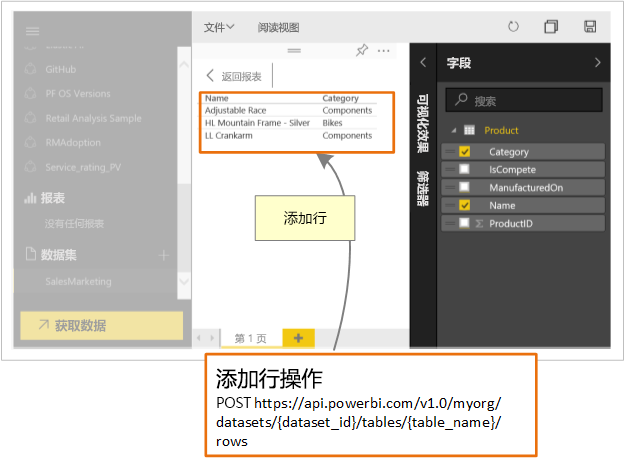

# 开发人员可以使用 Power BI API 做什么？

借助 Power BI REST API，可创建与 Power BI 报表、仪表板和磁贴相集成的应用。

借助 Power BI REST API，可在报表、数据集和工作区等 Power BI 对象上执行管理任务。

以下是一些可以使用 Power BI API 执行的操作。

| **了解详细信息的方法** | **参考信息** |
|----------------------------------------------------------------------------------|------------------------------------------------------------------------------------|
| 为 Power BI 用户和非 Power BI 用户嵌入仪表板、报表和磁贴。 | [如何嵌入 Power BI 仪表板、报表和磁贴](../embedded/embed-sample-for-customers.md) |
| 在 Power BI 对象上执行管理任务。 | [Power BI REST API 引用](/rest/api/power-bi/) |
| 扩展现有业务工作流以将关键数据推送到 Power BI 仪表板。 | [将数据推送到仪表板](walkthrough-push-data.md) |
| 进行 Power BI 身份验证。 | [进行 Power BI 身份验证](../embedded/get-azuread-access-token.md) |

> [!NOTE]
> Power BI API 仍以组的形式引用工作区。 对组的任何引用都意味着正使用工作区工作。

## API 开发人员工具

| 工具 | 说明 |
|---------|-------------|
| [样本工具](https://microsoft.github.io/PowerBI-JavaScript/demo) | 体验有关使用 Power BI 嵌入式分析客户端 API 的完整示例。 此工具也是演练不同类型的 Power BI Embedded 示例的快速方法。 |
| [Power BI 嵌入式分析客户端 API](/javascript/api/overview/powerbi/) | 获取有关 Power BI 客户端 API 的详细信息。 |
| [Postman](https://www.getpostman.com/) | 运行请求，进行测试、调试和监视，还可运行自动测试等等。 |

## 将数据推送到 Power BI

可使用 Power BI API [将数据推送到数据集](walkthrough-push-data.md)。 借助此功能，可以将行添加到数据集内的表。 新数据随后将在仪表板的磁贴上和报表的视觉对象上反映出来。

## GitHub 存储库

* [Power BI 开发人员示例](https://github.com/Microsoft/PowerBI-Developer-Samples)
* [.NET SDK](https://github.com/Microsoft/PowerBI-CSharp)
* [Power BI 嵌入式分析客户端 API](/javascript/api/overview/powerbi/)

## 后续步骤

* [将数据推送到数据集](walkthrough-push-data.md)
* [开发 Power BI 圆形卡片视觉对象](../visuals/develop-circle-card.md)
* [Power BI REST API 引用](rest-api-reference.md)
* [Power BI REST API](/rest/api/power-bi/)

更多问题？ [尝试咨询 Power BI 社区](https://community.powerbi.com/)