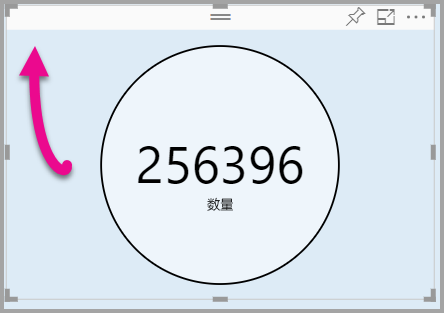

# <a name="tutorial-adding-formatting-options-to-a-power-bi-custom-visual"></a>教程：向 Power BI 自定义视觉对象添加格式设置选项

在本教程中，我们将演示如何向视觉对象添加公共属性。

在本教程中，了解如何：
> [!div class="checklist"]
> * 添加视觉对象属性。
> * 打包视觉对象。
> * 将自定义视觉对象导入到 Power BI Desktop 报表。

## <a name="adding-formatting-options"></a>添加格式设置选项

1. 在“Power BI”中，选择“格式页”。

    应看到一条消息 - 格式设置选项对此视觉对象不可用。

    

2. 在“Visual Studio Code”中，打开“capabilities.json”文件。

3. 在“dataViewMappings”数组前，添加“对象”（第 8 行后）。

    ```json
    "objects": {},
    ```
    

4. 保存“capabilities.json”文件。

5. 在“Power BI”中，再次查看格式设置选项。

    > [!Note]
    > 如果没有看到格式设置选项更改，则选择“重新加载自定义视觉对象”。

    

6. 将“标题”选项设置为“关闭”。 请注意，视觉对象不再在左上角显示度量值名称。

    

    

### <a name="adding-custom-formatting-options"></a>添加自定义格式设置选项

可以添加自定义属性，以配置圆圈颜色和边框宽度。

1. 在 PowerShell 中，停止定义视觉对象。

2. 在 Visual Studio Code 中的 capabilities.json 文件中，将以下 JSON 片段插入标记为 objects 的对象。

    ```json
    "circle": {
     "displayName": "Circle",
     "properties": {
         "circleColor": {
             "displayName": "Color",
             "description": "The fill color of the circle.",
             "type": {
                 "fill": {
                     "solid": {
                         "color": true
                     }
                 }
             }
         },
         "circleThickness": {
             "displayName": "Thickness",
             "description": "The circle thickness.",
             "type": {
                 "numeric": true
                 }
             }
         }
     },
    ```

    JSON 片段描述一个名为 circle 的组，该组包含名为 circleColor 和 circleThickness 的两个选项。

   

3. 保存“capabilities.json”文件。

4. 在“资源管理器”窗格中的“src”文件夹中，选择“settings.ts”。 此文件表示入门版视觉对象的设置。

5. 在“settings.ts”文件中，将两个类替换为以下代码。

    ```typescript
    export class CircleSettings {
     public circleColor: string = "white";
     public circleThickness: number = 2;
    }
    export class VisualSettings extends DataViewObjectsParser {
     public circle: CircleSettings = new CircleSettings();
    }
    ```

    

    此模块类定义两个类。 CircleSettings 类定义两个属性，其中含有匹配在“capabilities.json”文件（circleColor 和 circleThickness）中定义的对象的名称，并设置默认值。 VisualSettings 类继承 DataViewObjectParser 类并添加命名为“circle”的属性，该属性匹配“capabilities.json”文件中定义的对象，并返回“CircleSettings” 的实例。

6. 保存“settings.ts”文件。

7. 打开“visual.ts”文件。

8. 在“Visual”类中，添加以下属性。

    ```typescript
    private visualSettings: VisualSettings;
    ```
    此属性存储“VisualSettings”对象的引用，描述视觉对象设置。

    

9. 在“Visual”类中，在“更新”方法前添加以下方法。 此方法用于填充格式设置选项。

    ```typescript
    public enumerateObjectInstances(options: EnumerateVisualObjectInstancesOptions): VisualObjectInstanceEnumeration {
     const settings: VisualSettings = this.visualSettings ||
    VisualSettings.getDefault() as VisualSettings;
     return VisualSettings.enumerateObjectInstances(settings, options);
    }
    ```
    此方法用于填充格式设置选项。

    

10. 在“更新”方法中，在“radius”变量的声明后，添加以下代码。

    ```typescript
    this.visualSettings = VisualSettings.parse<VisualSettings>(dataView);
    this.visualSettings.circle.circleThickness = Math.max(0, this.visualSettings.circle.circleThickness)this.visualSettings.circle.circleThickness = Math.min(10, this.visualSettings.circle.circleThickness);
    ```
    此代码检索格式选项。 它将调整传递到“circleThickness”属性的任何值，如果为负值，则将其转换为 0，如果为大于 10 的值，则将其转换为 10。

    

11. 对于“circle 元素”，将传递到“填充样式”的值修改为以下表达式。

    ```typescript
    this.visualSettings.circle.circleColor
    ```

    

12. 对于“circle 元素”，将传递到“笔划宽度样式”的值修改为以下表达式。

    ```typescript
    this.visualSettings.circle.circleThickness
    ```

    

13. 保存 visual.ts 文件。

14. 在 PowerShell 中，启动视觉对象。

    ```powershell
    pbiviz start
    ```

15. 在“Power BI”中，在视觉对象上浮动的工具栏中，选择“切换自动重新加载”。

16. 在“视觉对象格式”选项中，展开“Circle”。

    

    修改“颜色”和“粗细”选项。

    将“粗细”选项修改为小于零的值，和大于 10 的值。 然后注意，视觉对象将该值更新为可承受的最小值或最大值。

## <a name="packaging-the-custom-visual"></a>打包自定义视觉对象

为自定义视觉对象项目输入属性值、更新图标文件和打包自定义视觉对象。

1. 在“PowerShell”中，停止自定义视觉对象。

2. 打开“Visual Studio Code”中的“pbiviz.json”文件。

3. 在“visual”对象中，将“displayName”属性修改为“Circle Card”。

    在“可视化效果”窗格中，将鼠标悬停在图标上方将显示显示名称。

    

4. 对于“description”属性，请输入以下文本。

    显示一个圆圈内带格式的度量值

5. （可选）在“作者”对象中，输入你的详细信息。

6. 保存“pbiviz.json”文件。

7. 在“资产”对象中，请注意，文档定义图标的路径。 图标是显示在“可视化效果”窗格中的图像。 它必须是 PNG 文件，20 x 20 像素。

8. 在 Windows 资源管理器中，复制 icon.png 文件，然后粘贴该文件，以替换位于资产文件夹中的默认文件。

9. 在 Visual Studio Code 中的“资源管理器”窗格中，展开资产文件夹，然后选择 icon.png 文件。

10. 查看图标。

    

11. 在 Visual Studio Code 中，确保已保存所有文件。

12. 若要打包自定义视觉对象，在 PowerShell 中，输入以下命令。

    ```powershell
    pbiviz package
    ```

    

现在，包被输出到项目的 dist 文件夹。 该包包含将自定义视觉对象导入到 Power BI 服务或 Power BI Desktop 报表所需的所有内容。 现在已打包自定义视觉对象，且它现在可供使用。

## <a name="importing-the-custom-visual"></a>导入自定义视觉对象

现在可以打开 Power BI Desktop 报表，并导入 Circle Card 自定义视觉对象。

1. 打开“Power BI Desktop”，使用任何示例数据集创建一个新报表。

2. 在“可视化效果”窗格中，选择“省略号”，然后从文件中选择“导入”。

    

3. 在“导入窗口”中，选择“导入”。

4. 在“打开”窗口中，导航到项目目录中的 dist 文件夹。

5. 选择“circleCard.pbiviz”文件，然后选择“打开”。

6. 视觉对象已成功导入后，选择“确定”。

7. 验证视觉对象已被添加到“可视化效果”窗格。

    

8. 将鼠标悬停在“Circle Card”图标，并注意显示的工具提示。

## <a name="debugging"></a>调试

有关调试自定义视觉对象的提示，请参阅[调试指南](https://microsoft.github.io/PowerBI-visuals/docs/how-to-guide/how-to-debug/)。

## <a name="next-steps"></a>后续步骤

可以将新开发的视觉对象提交到 AppSource，从而列出该视觉对象供其他人使用。 有关此过程的详细信息，请参阅[将自定义视觉对象发布到 AppSource](office-store.md)。