# <a name="tutorial-developing-a-power-bi-custom-visual"></a>教程：开发 Power BI 自定义视觉对象

我们正努力使开发人员能够轻松地将自定义视觉对象添加到 Power BI 中，以便在仪表板和报告中使用。 为了帮助你开始使用，我们已将所有可视化效果的代码发布到 GitHub 中。

除了可视化框架，我们还提供测试套件和工具来帮助社区针对 Power BI 生成高质量的自定义视觉对象。

本教程演示了如何开发名为“Circle Card”的 Power BI 自定义视觉对象，以便在圆圈内显示格式化的度量值。 Circle Card 视觉对象支持自定义填充颜色及其轮廓的粗细。

在 Power BI Desktop 报表中，卡片被修改为 Circle Card。

  

在本教程中，了解如何：
> [!div class="checklist"]
> * 创建 Power BI 自定义视觉对象。
> * 使用 D3 可视元素开发自定义视觉对象。
> * 使用可视元素配置数据绑定。
> * 设置数据值的格式。

## <a name="prerequisites"></a>先决条件

* 如果未注册 Power BI Pro，请在开始之前[注册以获得免费试用](https://powerbi.microsoft.com/pricing/)。
* 需要安装 [Visual Studio Code](https://www.visualstudio.com/)。
* 对于 Windows 用户，需要 [Windows PowerShell](https://docs.microsoft.com/powershell/scripting/setup/installing-windows-powershell?view=powershell-6) 版本 4 或更高版本，而对于 OSX 用户，则需要[终端](https://macpaw.com/how-to/use-terminal-on-mac)。

## <a name="setting-up-the-developer-environment"></a>设置开发人员环境

除了这些先决条件，还需要安装几项其他工具。

### <a name="installing-nodejs"></a>安装 node.js

1. 若要安装 Node.js，请在 Web 浏览器中导航到 [Node.js](https://nodejs.org)。

2. 下载最新功能 MSI 安装程序。

3. 运行安装程序，然后按安装步骤操作。 同意许可协议中的条款和所有默认设置。

   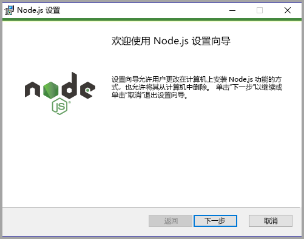

4. 重新启动计算机。

### <a name="installing-packages"></a>安装程序包

现在需要安装 pbiviz 包。

1. 重新启动计算机后，打开“Windows PowerShell”。

2. 若要安装 pbiviz，请输入以下命令。

    ```powershell
    npm i -g powerbi-visuals-tools
    ```

### <a name="creating-and-installing-a-certificate"></a>创建和安装证书

#### <a name="windows"></a>Windows

1. 若要创建证书，请输入以下命令。

    ```powershell
    pbiviz --create-cert
    ```

  它将返回生成通行短语的结果。 在本例中，通行短语是 15105661266553327。

  

2. 现在，我们需要安装证书。 若要安装证书，请输入以下命令。

    ```powershell
    pbiviz --install-cert
    ```

3. 在“证书导入向导”中，验证存储位置设置为“当前用户”。 选择“下一步”。

      

4. 在“导入文件”步骤中，选择“下一步”。

5. 在“私有密钥保护”步骤中，在“密码”框处粘贴从创建证书收到的通行短语。同样，在本例中，密码是 15105661266553327。

      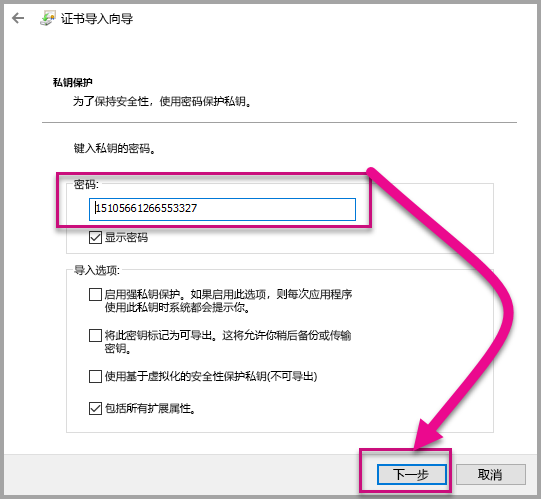

6. 在“证书存储”步骤，选择“将所有证书都放入下列存储区中”选项。 选择“浏览器”。

      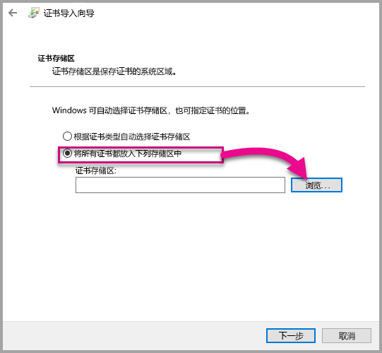

7. 在“选择证书存储区“窗口，”选择“受信任的根证书颁发机构”，然后选择“确定”。 然后选择“证书存储”屏幕上的“下一步”。

      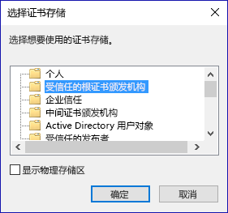

8. 若要完成导入，请选择“完成”。

9. 如果收到一条安全警告，选择“是”。

    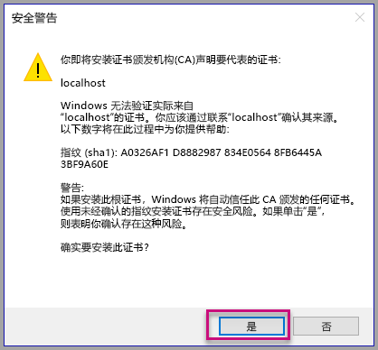

10. 当系统通知导入成功，选择“确定”。

    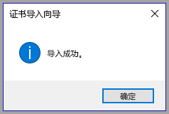

> [!Important]
> 不要关闭 Windows PowerShell 会话。

#### <a name="osx"></a>OSX

1. 如果左上角的锁处于锁定状态，则选择它以解除锁定。 搜索 localhost，并双击该证书。

    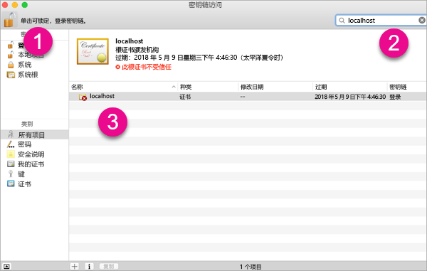

2. 选择“始终信任”并关闭窗口。

    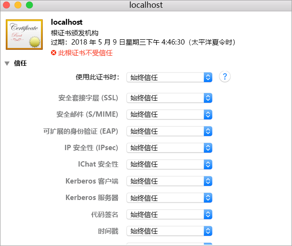

3. 输入用户名和密码。 选择“更新设置”。

    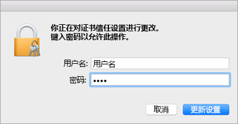

4. 关闭已打开的任何浏览器。

> [!NOTE]
> 如果未能识别证书，可能需要重启计算机。

## <a name="creating-a-custom-visual"></a>创建自定义视觉对象

环境设置已完成，现在可以创建自定义视觉对象了。

可以[下载](https://github.com/Microsoft/PowerBI-visuals-circlecard)本教程的完整源代码。

1. 验证已安装 Power BI Visual Tools 包。

    ```powershell
    pbiviz
    ```
    可以看到以下帮助输出。

    <pre><code>
        +syyso+/
    oms/+osyhdhyso/
    ym/       /+oshddhys+/
    ym/              /+oyhddhyo+/
    ym/                     /osyhdho
    ym/                           sm+
    ym/               yddy        om+
    ym/         shho /mmmm/       om+
        /    oys/ +mmmm /mmmm/       om+
    oso  ommmh +mmmm /mmmm/       om+
    ymmmy smmmh +mmmm /mmmm/       om+
    ymmmy smmmh +mmmm /mmmm/       om+
    ymmmy smmmh +mmmm /mmmm/       om+
    +dmd+ smmmh +mmmm /mmmm/       om+
            /hmdo +mmmm /mmmm/ /so+//ym/
                /dmmh /mmmm/ /osyhhy/
                    //   dmmd
                        ++

        PowerBI Custom Visual Tool

    Usage: pbiviz [options] [command]

    Commands:

    new [name]        Create a new visual
    info              Display info about the current visual
    start             Start the current visual
    package           Package the current visual into a pbiviz file
    update [version]  Updates the api definitions and schemas in the current visual. Changes the version if specified
    help [cmd]        display help for [cmd]

    Options:

    -h, --help      output usage information
    -V, --version   output the version number
    --install-cert  Install localhost certificate
    </code></pre>

    <a name="ssl-setup"></a>

2. 查看输出，包括支持的命令列表。

     

3. 若要创建自定义视觉对象项目，请输入以下命令。 “CircleCard”是项目的名称。

    ```PowerShell
    pbiviz new CircleCard
    ```
    

4. 导航到项目文件夹。

    ```powershell
    cd CircleCard
    ```
5. 启动自定义视觉对象。 托管在计算机上的 CircleCard 视觉对象现在正在运行。

    ```powershell
    pbiviz start
    ```

    

> [!Important]
> 不要关闭 Windows PowerShell 会话。

### <a name="testing-the-custom-visual"></a>测试自定义视觉对象

在本部分中，我们将通过上传 Power BI Desktop 报表，然后编辑报表以显示自定义视觉对象来测试 CircleCard 自定义视觉对象。

1. 登录到 [PowerBI.com](https://powerbi.microsoft.com/) > 转到“齿轮”图标> 然后选择“设置”。

      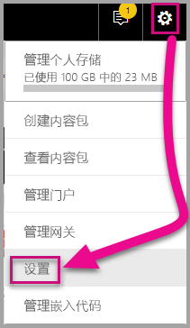

2. 选择“开发人员”，然后选中“启用开发人员视觉对象以用于测试”复选框。

    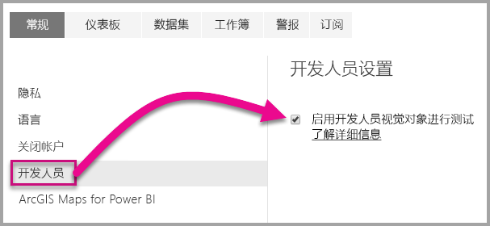

3. 上传 Power BI Desktop 报表。  

    获取数据 > 文件 > 本地文件。

    如果尚未创建 Power BI Desktop 报表，可以[下载](https://microsoft.github.io/PowerBI-visuals/docs/step-by-step-lab/images/US_Sales_Analysis.pbix)一个示例报表。

    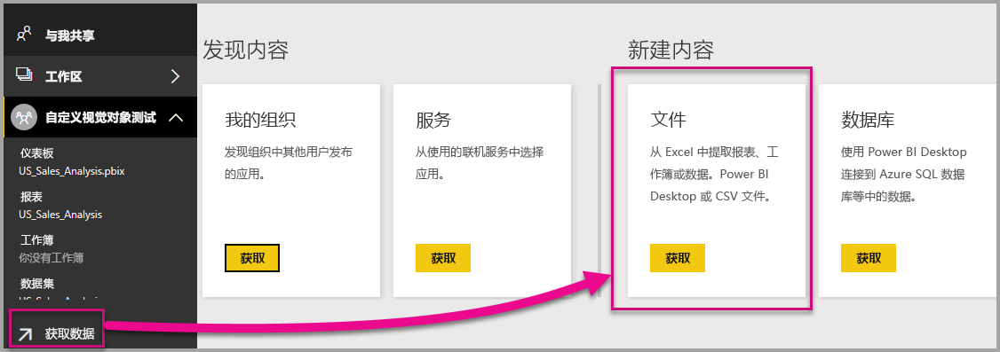 

    现在，若要查看报表，请选择导航窗格左侧“报表”部分中的“US_Sales_Analysis”。

    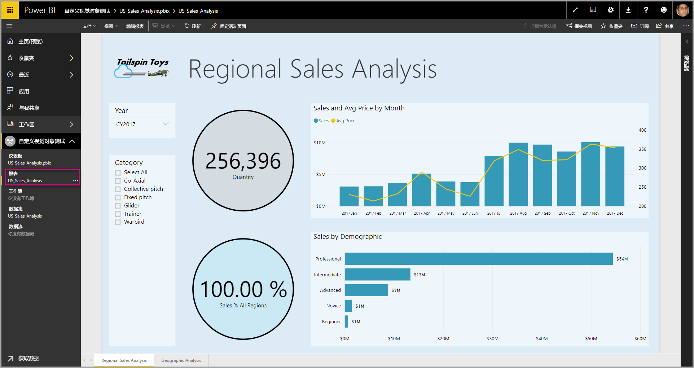

4. 现在需要在 Power BI 服务中编辑报表。

    转到“编辑报表”。

    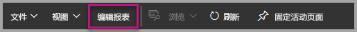

5. 从“可视化效果”窗格中选择“开发人员视觉对象”。

    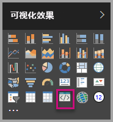

    > [!Note]
    > 此可视化对象表示在计算机上启动的自定义视觉对象。 只有在启用了开发人员设置的情况下才可用。

6. 请注意，已向报表画布添加了可视化效果。

    

    > [!Note]
    > 这是一个非常简单的视觉对象，它显示了 Update 方法调用的次数。 在此阶段，视觉对象尚未检索任何数据。

7. 在报表中选择新视觉对象的同时，转到“字段”窗格 > 展开“Sales” > 选择“Quantity”。

    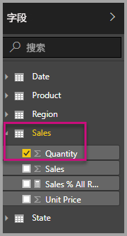

8. 然后，若要测试新视觉对象，请调整视觉对象的大小，并注意更新值的增量。

    

若要停止自定义视觉对象在 PowerShell 中运行，输入 Ctrl+C。 出现提示时终止批处理作业，输入“Y”，然后按 Enter。

## <a name="adding-visual-elements"></a>添加可视元素

现在需要安装 D3 JavaScript 库。 D3 是用于在 Web 浏览器中生成动态、交互式数据可视化效果的 JavaScript 库。 它利用了广泛实施的 SVG HTML5 和 CSS 标准。

现在可以开发自定义视觉对象来显示带文本的圆形。

> [!Note]
> 可从[此处](https://github.com/uve/circlecard)复制本教程中的多个文本条目。

1. 若要在 PowerShell 中安装 D3 库，输入以下命令。

    ```powershell
    npm i d3@3.5.5 --save
    ```

    

2. 若要安装 D3 库的类型定义，输入以下命令。

    ```powershell
    npm i @types/d3@3.5
    ```

    

    此命令将基于 JavaScript 文件安装 TypeScript 定义，使你能够在 TypeScript（这是 JavaScript 的一个超集）中开发自定义视觉对象。 Visual Studio Code 是用于开发 TypeScript 应用程序的理想 IDE。

3. 启动 [Visual Studio Code](https://code.visualstudio.com/)。

    可以使用以下命令从 PowerShell 启动“Visual Studio Code”。

    ```powershell
    code .
    ```

4. 在“资源管理器”窗格中，展开“node_modules”文件夹，以验证已安装 d3 库。

    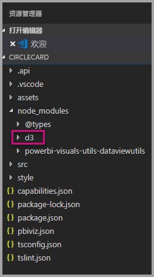

5. 通过展开“资源管理器”窗格中的 node_modules > @types > d3，注意 TypeScript 文件“index.d.ts”。

    

6. 选择“pbiviz.json”文件。

7. 若要注册 d3 库，请将以下文件引用输入到 externalJS 数组。 请务必在现有文件引用和新文件引用之间添加逗号。

    ```javascript
    "node_modules/d3/d3.min.js"
    ```
    

8. 保存“pbiviz.json”文件更改。

### <a name="developing-the-visual-elements"></a>开发可视元素

现在，我们可以探索如何开发自定义视觉对象来显示圆形和示例文本。

1. 在“资源管理器”窗格中，展开“src”文件夹，然后选择“visual.ts”。

    > [!Note]
    > 请注意“visual.ts”文件顶部的注释。 在 MIT 许可证条款下，授予权限以使用 Power BI 自定义视觉对象包是免费的。 作为协议的一部分，必须将注释保留在文件顶部。

2. 从 Visual 类中删除以下默认自定义视觉对象逻辑。
    * 四个类级别私有变量声明。
    * 来自构造函数的所有代码行。
    * 来自 update 方法的所有代码行。
    * 模块中所有剩余的行，包括 parseSettings 和 enumerateObjectInstances 方法。

    确认模块代码如下所示。

    ```typescript
    module powerbi.extensibility.visual {
    "use strict";
    export class Visual implements IVisual {

        constructor(options: VisualConstructorOptions) {

        }

        public update(options: VisualUpdateOptions) {

            }
        }
    }
    ```

3. 在 Visual 类声明下，插入以下类级别属性。

    ```typescript
     private host: IVisualHost;
     private svg: d3.Selection<SVGElement>;
     private container: d3.Selection<SVGElement>;
     private circle: d3.Selection<SVGElement>;
     private textValue: d3.Selection<SVGElement>;
     private textLabel: d3.Selection<SVGElement>; 
    ```

    

4. 将以下代码添加到构造函数。

    ```typescript
    this.svg = d3.select(options.element)
                 .append('svg')
                 .classed('circleCard', true);
    this.container = this.svg.append("g")
                         .classed('container', true);
    this.circle = this.container.append("circle")
                             .classed('circle', true);
    this.textValue = this.container.append("text")
                                 .classed("textValue", true);
    this.textLabel = this.container.append("text")
                                 .classed("textLabel", true);
    ```

    此代码在视觉对象中添加一个 SVG 组，然后添加三个形状：圆形和两个文本元素。

    若要设置文档中的代码格式，请右击选择 Visual Studio Code 文档的任意位置，然后选择“设置文档格式”。

      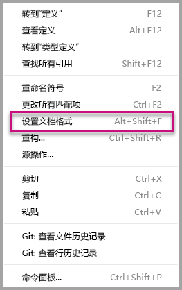

    为了提高可读性，建议每次粘贴代码段时设置文档格式。

5. 将以下代码添加到 update 方法。

    ```typescript
    let width: number = options.viewport.width;
    let height: number = options.viewport.height;
    this.svg.attr({
     width: width,
     height: height
    });
    let radius: number = Math.min(width, height) / 2.2;
    this.circle
     .style("fill", "white")
     .style("fill-opacity", 0.5)
     .style("stroke", "black")
     .style("stroke-width", 2)
    .attr({
     r: radius,
     cx: width / 2,
     cy: height / 2
    });
    let fontSizeValue: number = Math.min(width, height) / 5;
    this.textValue
     .text("Value")
     .attr({
         x: "50%",
         y: "50%",
         dy: "0.35em",
         "text-anchor": "middle"
     }).style("font-size", fontSizeValue + "px");
    let fontSizeLabel: number = fontSizeValue / 4;
    this.textLabel
     .text("Label")
     .attr({
         x: "50%",
         y: height / 2,
         dy: fontSizeValue / 1.2,
         "text-anchor": "middle"
     })
     .style("font-size", fontSizeLabel + "px");
    ```

    此代码设置视觉对象的宽度和高度，然后初始化可视元素的属性和样式。

6. 保存“visual.ts”文件。

7. 选择“capabilities.json”文件。

    在第 14 行，删除整个对象元素（14-60 行）。

8. 保存“capabilities.json”文件。

9. 在 PowerShell 中，启动定义视觉对象。

    ```powershell
    pbiviz
    ```

### <a name="toggle-auto-reload"></a>切换自动重新加载

1. 导航回 Power BI 报表。
2. 在开发人员视觉对象上浮动的工具栏中，选择“切换自动重新加载”。

    

    此选项可确保每次保存项目更改时，都会自动重新加载视觉对象。

3. 从“字段”窗格，将“Quantity”字段拖动到开发人员视觉对象中。

4. 确认视觉对象如下所示。

    

5. 调整视觉对象的大小。

    请注意，圆形和文本值可以根据视觉对象的可用维度进行缩放。

    update 方法在调整视觉对象期间被连续调用，并且会使可视元素以流畅方式重新缩放。

    现在已经开发了可视元素。

6. 请继续运行视觉对象。

## <a name="configuring-data-binding"></a>配置数据绑定

定义数据角色和数据视图映射，然后修改自定义视觉对象逻辑，以显示度量值及其显示名称。

### <a name="configuring-the-capabilities"></a>配置功能

修改“capabilities.json”文件以定义数据角色和数据视图映射。

1. 在 Visual Studio code 中，从“capabilities.json”文件的“dataRoles”数组内删除所有内容（3-12 行）。

2. 在“dataRoles”数组中插入以下代码。

    ```json
    {
     "displayName": "Measure",
     "name": "measure",
     "kind": "Measure"
    }
    ```
    “dataRoles”数组现定义类型“measure”的单个数据角色，即名为“measure”，显示为“Measure”。 此数据角色允许传递“measure”字段，或汇总字段。

3. 从“dataViewMappings”数组中删除所有内容（10-31 行）。

4. 在“dataViewMappings”数组中插入以下内容。

    ```json
            {
            "conditions": [
                { "measure": { "max": 1 } }
            ],
            "single": {
                "role": "measure"
            }
           }
    ```
    “dataViewMappings”数组现定义一个可以传递给名为“measure”的数据角色的字段。

5. 保存“capabilities.json”文件。

6. 在 Power BI 中，请注意，视觉对象现在可以通过“Measure”进行配置。

    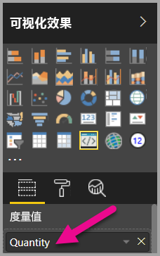

    > [!Note]
    > 视觉对象项目尚不包含数据绑定逻辑。

### <a name="exploring-the-dataview"></a>探索数据视图

1. 在视觉对象上方浮动的工具栏中，选择“显示数据视图”。

    

2. 向下扩展到“单个”，然后注意值。

    

3. 向下扩展到“元数据”，然后扩展到“column”数组，请特别注意“format”和“displayName”的值。

    

4. 若要切换回视觉对象，在视觉对象上方浮动的工具栏中，选择“显示数据视图”。

    

### <a name="configuring-data-binding"></a>配置数据绑定

1. 在 Visual Studio Code 的“visual.ts”文件中，添加以下语句作为 update 方法的第一个语句。

    ```typescript
    let dataView: DataView = options.dataViews[0];
    ```
    

    此语句将 dataView 分配给一个变量以方便访问，并声明变量来引用 dataView 对象。

2. 在 update 方法中，将 .text(“Value”)**替换为以下内容。

    ```typescript
    .text(dataView.single.value as string)
    ```
    

3. 在 update 方法中，将 .text(“Label”) 替换为以下内容。

    ```typescript
    .text(dataView.metadata.columns[0].displayName)
    ```
    

4. 保存“visual.ts”文件。

5. 在“Power BI”中查看视觉对象，此时将显示值和显示名称。

现在已配置数据角色并将视觉对象绑定到数据视图。

在下一教程中，你将学习如何将格式设置选项添加到自定义视觉对象。

## <a name="debugging"></a>调试

有关调试自定义视觉对象的提示，请参阅[调试指南](https://microsoft.github.io/PowerBI-visuals/docs/how-to-guide/how-to-debug/)。

## <a name="next-steps"></a>后续步骤

> [!div class="nextstepaction"]
> [添加格式设置选项](custom-visual-develop-tutorial-format-options.md)