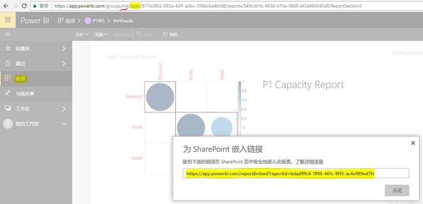

# 从应用嵌入报表或仪表板

在 Power BI 中，可以创建应用以便将相关仪表板和报表汇总到一处。 然后，将它们发布给你组织中的多名人员。 如果所有用户都是 Power BI 用户，这些应用的使用是相关的。 因此，你可以使用 Power BI 应用与他们共享内容。 本文为你提供了一些快速步骤，可以将内容从已发布的 Power BI 应用嵌入到第三方应用程序中。

## 获取供嵌入的报表 embedURL

1. 在用户工作区“我的工作区”  中实例化应用程序。 要么与自己分享，要么指导其他用户完成此流程。

2. 在 Power BI 服务中打开所需的报表。

3. 转到  “文件” >   “嵌入 SharePoint Online”，然后获取报表 embedURL。 embedURL 示例显示在下面的快照中。 或者，你可以调用 GetReports/GetReport REST API 并从响应中提取相应的报表 embedURL 字段。 当应用在用户工作区中实例化时，REST 调用不应将工作区标识符用作 URL 的一部分。

    

4. 通过 JavaScript SDK 使用在步骤 3 中检索到的 embedURL。

## 获取供嵌入的仪表板 embedURL

1. 在用户工作区“我的工作区”  中实例化应用程序。 要么与自己分享，要么指导其他用户完成此流程。

2. 调用 GetDashboards REST API 并从响应中提取相应的仪表板 embedURL 字段。 当应用在用户工作区中实例化时，REST 调用不应将工作区标识符用作 URL 的一部分。

3. 通过 JavaScript SDK 使用在步骤 2 中检索到的 embedURL。

## 后续步骤

了解如何为第三方客户和组织从应用工作区嵌入内容：

> [!div class="nextstepaction"]
>[为第三方客户嵌入内容](embed-sample-for-customers.md)

> [!div class="nextstepaction"]
>[为组织嵌入内容](embed-sample-for-your-organization.md)
