# <a name="tutorial-embed-a-power-bi-report-dashboard-or-tile-into-an-application-for-your-organization"></a>教程：为组织将 Power BI 报表、仪表板或磁贴嵌入应用程序

本教程演示了如何将报表集成到应用程序。 通过将 Power BI.NET SDK 和 Power BI JavaScript API 结合使用，可为你的组织将 Power BI 嵌入应用程序。 在 Power BI 中，可以使用“用户拥有数据”将报表、仪表板或磁贴嵌入应用程序。 借助“用户拥有数据”，应用程序可以扩展 Power BI 服务。

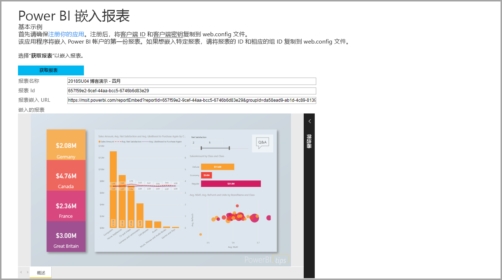

在本教程中，将学习以下任务：
>[!div class="checklist"]
>* 在 Azure 中注册应用程序。
>* 将 Power BI 报表嵌入到应用程序。

## <a name="prerequisites"></a>先决条件

若要开始操作，你需要拥有 Power BI Pro 帐户和 Microsoft Azure 订阅：

* 如果未注册 Power BI Pro，请在开始之前[注册免费试用版](https://powerbi.microsoft.com/en-us/pricing/)。
* 如果没有 Azure 订阅，请在开始之前先创建一个[免费帐户](https://azure.microsoft.com/free/?WT.mc_id=A261C142F)。
* 设置你自己的 [Azure Active Directory (Azure AD) 租户](create-an-azure-active-directory-tenant.md)。
* 安装 [Visual Studio](https://www.visualstudio.com/) 2013 版或更高版本。

## <a name="set-up-your-embedded-analytics-development-environment"></a>设置嵌入式分析开发环境

在开始将报表、仪表板和磁贴嵌入到应用程序中之前，请确保环境已设置为允许嵌入。 在设置过程中，执行以下操作之一：

- 可跟随[嵌入设置工具](https://aka.ms/embedsetup/UserOwnsData)完成操作，以便快速开始并下载示例应用程序，它会逐步引导你创建环境并嵌入报表。

- 如果选择手动设置环境，请执行以下各部分中的操作。

### <a name="register-an-application-in-azure-active-directory"></a>在 Azure Active Directory 中注册应用程序

若要允许应用程序访问 Power BI REST API，请向 Azure Active Directory 注册应用程序。 然后，你可以为应用程序建立标识，并指定对 Power BI REST 资源的权限。

1. 接受 [Microsoft Power BI API 条款](https://powerbi.microsoft.com/api-terms)。

2. 登录 [Azure 门户](https://portal.azure.com)。

    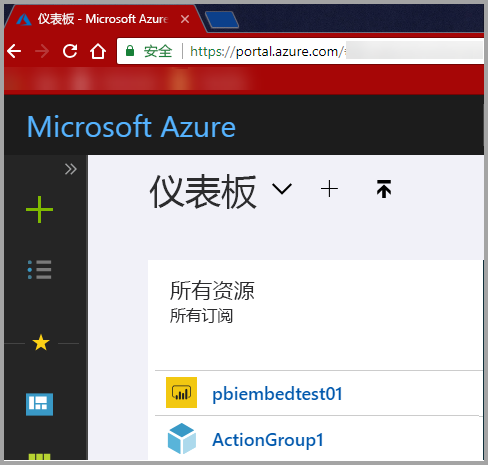

3. 在左侧导航窗格中，依次选择“所有服务”和“应用注册”。 然后选择“新应用程序注册”。

    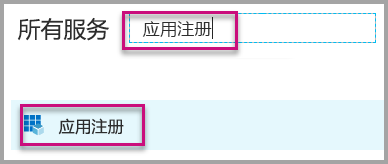</br>

    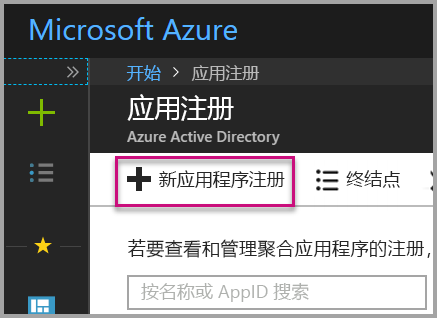

4. 按照提示进行操作，并创建新的应用程序。 对于“用户拥有数据”，使用“Web 应用/API”作为应用程序类型。 此外，还必须提供“登录 URL”，Azure AD 会使用其返回令牌响应。 输入特定于应用程序的值。 例如，`http://localhost:13526/`。

    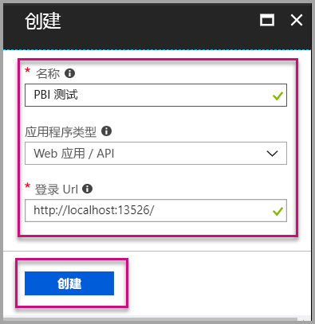

### <a name="apply-permissions-to-your-application-within-azure-active-directory"></a>在 Azure Active Directory 中向应用授予权限

除了在应用注册页中提供的信息之外，还必须为应用程序启用权限。 使用全局管理员帐户登录才可启用权限。

### <a name="use-the-azure-active-directory-portal"></a>使用 Azure Active Directory 门户

1. 在 Azure 门户中，转到[应用注册](https://portal.azure.com/#blade/Microsoft_AAD_IAM/ApplicationsListBlade)，然后选择要用于嵌入内容的应用。

    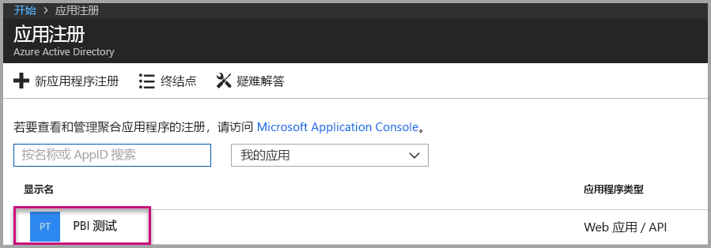

2. 选择**设置**。 然后，在“API 访问权限”下选择“所需权限”。

    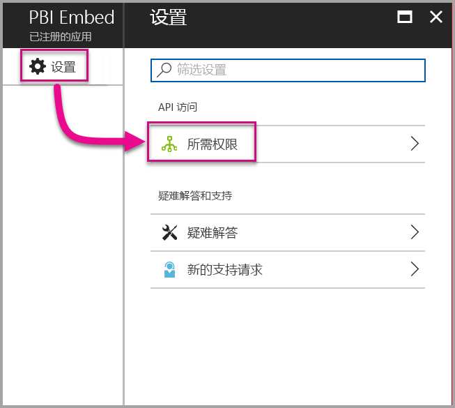

3. 选择“Microsoft Azure Active Directory”。 然后确保已选中“以登录用户身份访问目录”。 选择**保存**。

    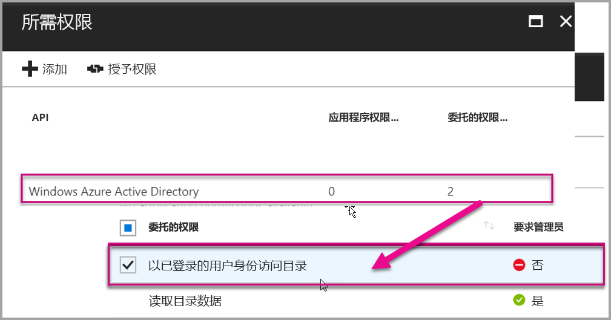

4. 选择**添加**。

    

5. 选择“选择 API”。

    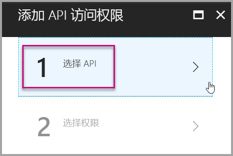

6. 选择“Power BI 服务”。 然后选择“选择”。

    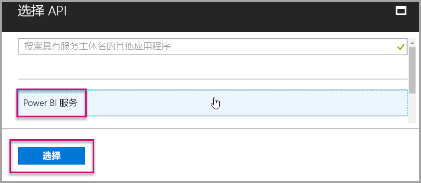

7. 选择“委派权限”下的所有权限。 逐一选中这些选项以保存所做的选择。 完成时选择“保存”。

    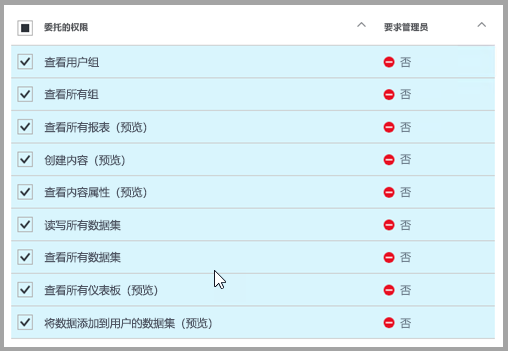

## <a name="set-up-your-power-bi-environment"></a>设置 Power BI 环境

### <a name="create-an-app-workspace"></a>创建应用工作区

如果为客户嵌入报表、仪表板或磁贴，则必须将内容放在应用工作区中：

1. 首先，创建工作区。 选择“工作区” > “创建应用工作区”。 此工作区是放置应用程序需要访问的内容的地方。

    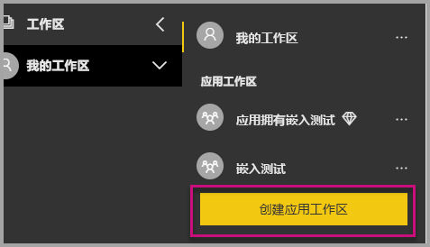

2. 为工作区命名。 如果对应的“工作区 ID”不可用，则进行编辑以给定一个唯一的 ID。 该名称也应是应用的名称。

    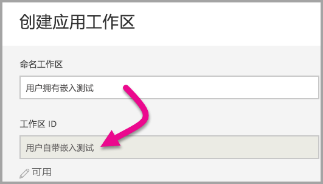

3. 需要设置几个选项。 如果你选择“公开”，则组织中的任何人都可以看到工作区内容。 “专用”是指只有工作区的成员可以查看其内容。

    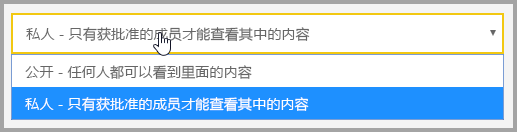

    创建组后，将不能更改“公开”/“私有”设置。

4. 此外，还可以选择成员是可以编辑还是具有仅查看访问权限。

    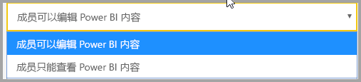

5. 添加你要允许其访问工作区的用户的电子邮件地址，然后选择“添加”。 无法添加组别名，只能添加单个用户别名。

6. 确定每个人员的身份是成员还是管理员。管理员可以编辑工作区本身，包括添加其他成员。 成员可以编辑工作区中的内容，除非他们只具有“仅查看”访问权限。 管理员和成员均可以发布应用。

    现在，可以查看新工作区。 Power BI 创建工作区并将其打开。 它将显示在你作为成员的工作区列表中。 作为管理员，你可以选择省略号(…) 返回并进行更改，添加新成员或更改其权限。

    

### <a name="create-and-publish-your-reports"></a>创建并发布报表

可以通过使用 Power BI Desktop 创建报表和数据集。 然后，可以将这些报表发布到应用工作区。 发布报表的最终用户需要拥有 Power BI Pro 许可证才可发布到应用工作区。

1. 从 GitHub 下载示例[博客演示](https://github.com/Microsoft/powerbi-desktop-samples)。

    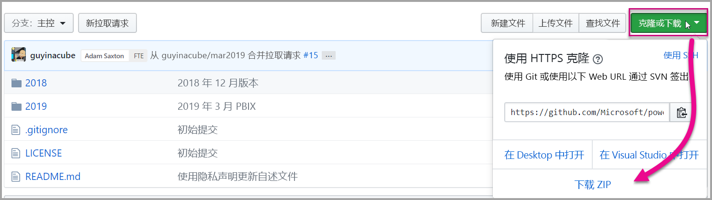

2. 在 Power BI Desktop 中打开示例 .pbix 报表。

   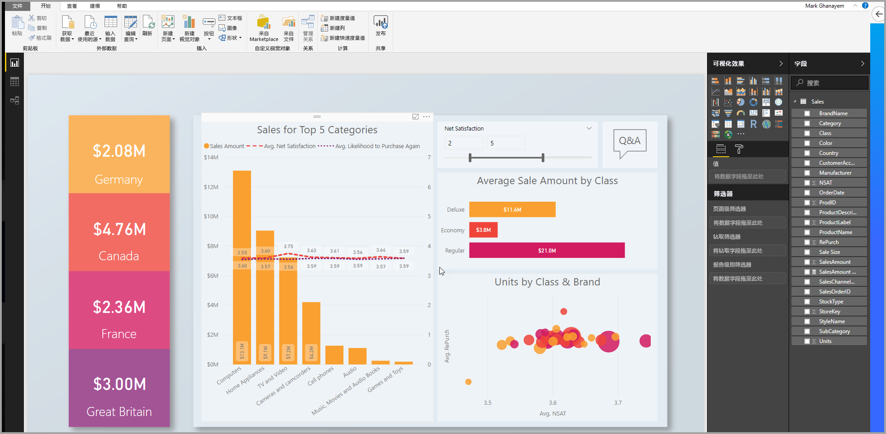

3. 发布到应用工作区。

   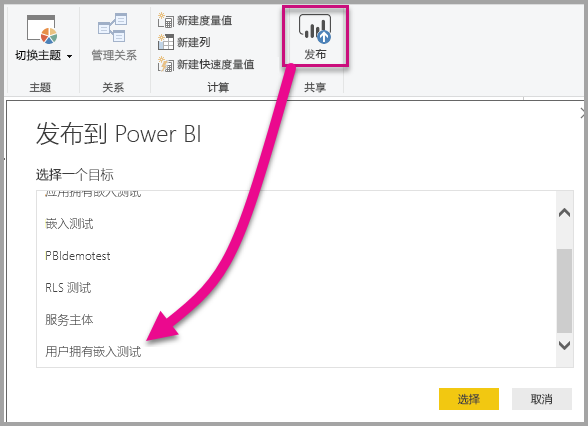

    现在即可在 Power BI 服务在线版中查看报表。

   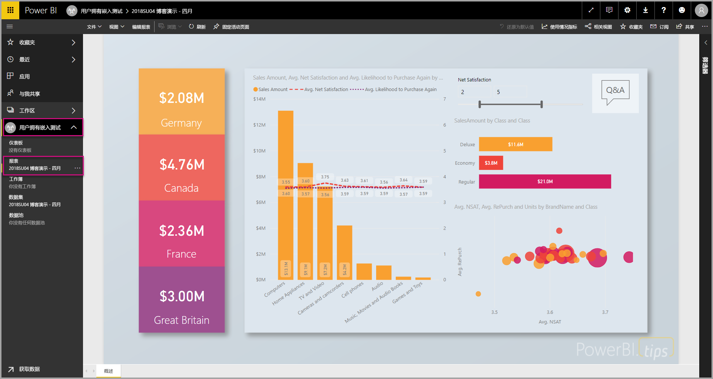

## <a name="embed-your-content-by-using-the-sample-application"></a>使用示例应用程序嵌入内容

若要使用示例应用程序嵌入内容，请按照这些步骤执行：

1. 要开始操作，请从 GitHub 下载[用户拥有数据示例](https://github.com/Microsoft/PowerBI-Developer-Samples)。 有三个不同的示例应用程序，分别用于[报表](https://github.com/Microsoft/PowerBI-Developer-Samples/tree/master/User%20Owns%20Data/integrate-report-web-app)、[仪表板](https://github.com/Microsoft/PowerBI-Developer-Samples/tree/master/User%20Owns%20Data/integrate-dashboard-web-app)和[磁贴](https://github.com/Microsoft/PowerBI-Developer-Samples/tree/master/User%20Owns%20Data/integrate-tile-web-app)。 本文主要讨论报表应用程序。

    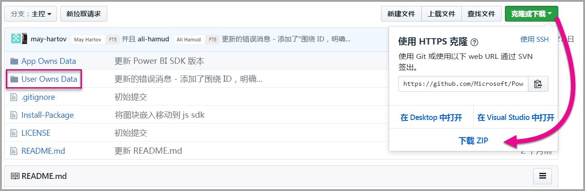

2. 在示例应用程序中打开 Cloud.config 文件。 有几个字段必须填充后才能成功运行应用程序：**ClientID** 和 **ClientSecret**。

    

    使用 Azure 中的“应用程序 ID”填写“ClientID”信息。 应用程序使用“ClientID”向你从其请求权限的用户标识其自身。

    若要获取“ClientID”，请执行下列步骤：

    1. 登录 [Azure 门户](https://portal.azure.com)。

        

    1. 在左侧导航窗格中，依次选择“所有服务”和“应用注册”。

        

    1. 选择要使用 ClientID 的应用程序。

        

    1. 你应该会看到列为 GUID 的“应用程序 ID”。 使用此“应用程序 ID”作为应用程序的“ClientID”。

        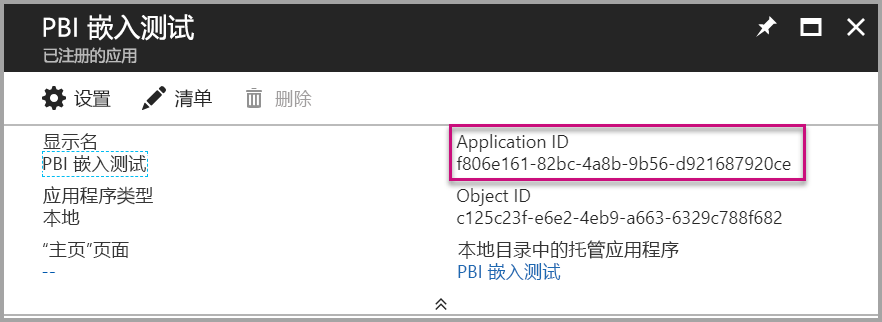

    1. 用 Azure 的“应用注册”部分的“密钥”部分，填写 ClientSecret 信息。

    1. 若要获取“ClientSecret”，请执行下列步骤：

        1. 登录 [Azure 门户](https://portal.azure.com)。

            

        1. 在左侧导航窗格中，依次选择“所有服务”和“应用注册”。

            

        1. 选择要使用 ClientSecret 的应用程序。

            

        1. 选择**设置**。

            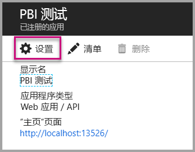

        1. 选择“密钥”。

            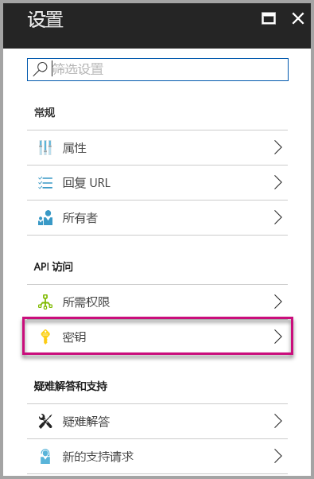

    1. 在“说明”框中输入一个名称并选择持续时间。 然后选择“保存”为应用程序获取“值”。 如果在保存密钥值后关闭“密钥”窗格，值字段会仅显示为隐藏状态。 此时，你无法检索密钥值。 如果忘记了密钥值，请在 Azure 门户中新建密钥值。

        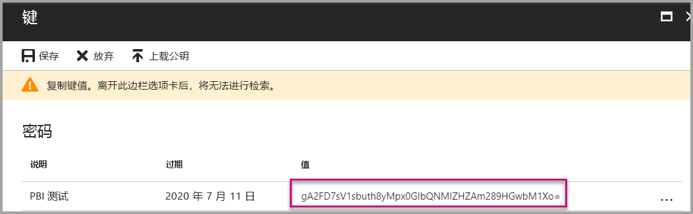

    1. 对于“groupId”，输入 Power BI 中的应用工作区 GUID。

        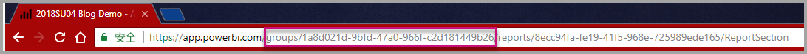

    1. 对于“reportId”，输入 Power BI 中的报表 GUID。

        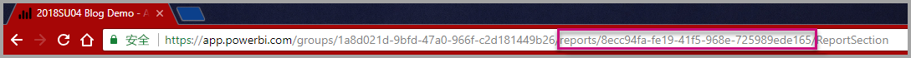

3. 运行应用程序：

    1. 首先在 Visual Studio 中选择“运行”。

        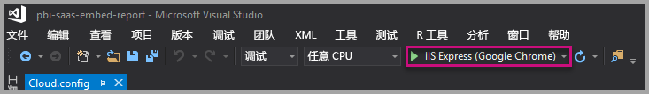

    1. 然后选择“获取报表”。

        

    1. 现在，可以在示例应用程序查看报表。

        

## <a name="embed-your-content-within-your-application"></a>在应用程序中嵌入内容

即使可以使用 [Power BI REST API](https://docs.microsoft.com/rest/api/power-bi/) 完成嵌入内容的步骤，也可使用 .NET SDK 编写本文中所述的示例代码。

若要将报表集成到 Web 应用，可使用 Power BI REST API 或 Power BI C# SDK。 也可以使用 Azure Active Directory 授权访问令牌来获取报表。 然后，使用相同的访问令牌加载报表。 Power BI Rest API 提供对特定 Power BI 资源的编程访问权限。 有关详细信息，请参阅 [Power BI REST API](https://docs.microsoft.com/rest/api/power-bi/) 和 [Power BI JavaScript API](https://github.com/Microsoft/PowerBI-JavaScript)。

### <a name="get-an-access-token-from-azure-ad"></a>从 Azure AD 获取访问令牌

在应用程序中，必须先从 Azure AD 获取访问令牌，然后才能调用 Power BI REST API。 有关详细信息，请参阅[对用户进行身份验证并获取 Power BI 应用的 Azure AD 访问令牌](get-azuread-access-token.md)。

### <a name="get-a-report"></a>获取报表

若要获取 Power BI 报表，请使用[获取报表](https://docs.microsoft.com/rest/api/power-bi/reports/getreports)操作，获取 Power BI 报表列表。 在报表列表中，可以获取报表 ID。

### <a name="get-reports-by-using-an-access-token"></a>使用访问令牌获取报表

[获取报表](https://docs.microsoft.com/rest/api/power-bi/reports/getreports)操作将返回报表的列表。 可以获取报表列表中的一个报表。

若要执行 REST API 调用，必须添加格式为“持有者 {访问令牌}”的授权标头。

#### <a name="get-reports-with-the-rest-api"></a>使用 REST API 获取报表

下面的代码示例演示如何使用 REST API 检索报表：

> [!NOTE]  
> [示例应用程序](#embed-your-content-using-the-sample-application)的 Default.aspx.cs 文件中提供了获取要嵌入内容项的示例。 示例包括报表、仪表板或磁贴。

```csharp
using Newtonsoft.Json;

//Get a Report. In this sample, you get the first Report.
protected void GetReport(int index)
{
    //Configure Reports request
    System.Net.WebRequest request = System.Net.WebRequest.Create(
        String.Format("{0}/Reports",
        baseUri)) as System.Net.HttpWebRequest;

    request.Method = "GET";
    request.ContentLength = 0;
    request.Headers.Add("Authorization", String.Format("Bearer {0}", accessToken.Value));

    //Get Reports response from request.GetResponse()
    using (var response = request.GetResponse() as System.Net.HttpWebResponse)
    {
        //Get reader from response stream
        using (var reader = new System.IO.StreamReader(response.GetResponseStream()))
        {
            //Deserialize JSON string
            PBIReports Reports = JsonConvert.DeserializeObject<PBIReports>(reader.ReadToEnd());

            //Sample assumes at least one Report.
            //You could write an app that lists all Reports
            if (Reports.value.Length > 0)
            {
                var report = Reports.value[index];

                txtEmbedUrl.Text = report.embedUrl;
                txtReportId.Text = report.id;
                txtReportName.Text = report.name;
            }
        }
    }
}

//Power BI Reports used to deserialize the Get Reports response.
public class PBIReports
{
    public PBIReport[] value { get; set; }
}
public class PBIReport
{
    public string id { get; set; }
    public string name { get; set; }
    public string webUrl { get; set; }
    public string embedUrl { get; set; }
}
```

#### <a name="get-reports-by-using-the-net-sdk"></a>使用 .NET SDK 获取报表

可以使用 .NET SDK 检索报表列表，而不用直接调用 REST API。 下面的代码示例演示如何列出报表：

```csharp
using Microsoft.IdentityModel.Clients.ActiveDirectory;
using Microsoft.PowerBI.Api.V2;
using Microsoft.PowerBI.Api.V2.Models;

var tokenCredentials = new TokenCredentials(<ACCESS TOKEN>, "Bearer");

// Create a Power BI Client object. It is used to call Power BI APIs.
using (var client = new PowerBIClient(new Uri(ApiUrl), tokenCredentials))
{
    // Get the first report all reports in that workspace
    ODataResponseListReport reports = client.Reports.GetReports();

    Report report = reports.Value.FirstOrDefault();

    var embedUrl = report.EmbedUrl;
}
```

### <a name="load-a-report-by-using-javascript"></a>使用 JavaScript 加载报表

可以使用 JavaScript 将报表加载到网页上的 div 元素中。 下面的代码示例演示如何从给定工作区检索报表：

> [!NOTE]  
> [示例应用程序](#embed-your-content-using-the-sample-application)的 Default.aspx.cs 文件中提供了加载要嵌入内容项的示例。 示例包括报表、仪表板或磁贴。

```javascript
<!-- Embed Report-->
<div> 
    <asp:Panel ID="PanelEmbed" runat="server" Visible="true">
        <div>
            <div><b class="step">Step 3</b>: Embed a report</div>

            <div>Enter an embed url for a report from Step 2 (starts with https://):</div>
            <input type="text" id="tb_EmbedURL" style="width: 1024px;" />
            <br />
            <input type="button" id="bEmbedReportAction" value="Embed Report" />
        </div>

        <div id="reportContainer"></div>
    </asp:Panel>
</div>
```

#### <a name="sitemaster"></a>Site.master

```javascript
window.onload = function () {
    // client side click to embed a selected report.
    var el = document.getElementById("bEmbedReportAction");
    if (el.addEventListener) {
        el.addEventListener("click", updateEmbedReporte, false);
    } else {
        el.attachEvent('onclick', updateEmbedReport);
    }

    // handle server side post backs, optimize for reload scenarios
    // show embedded report if all fields were filled in.
    var accessTokenElement = document.getElementById('MainContent_accessTokenTextbox');
    if (accessTokenElement !== null) {
        var accessToken = accessTokenElement.value;
        if (accessToken !== "")
            updateEmbedReport();
    }
};

// update embed report
function updateEmbedReport() {

    // check if the embed url was selected
    var embedUrl = document.getElementById('tb_EmbedURL').value;
    if (embedUrl === "")
        return;

    // get the access token.
    accessToken = document.getElementById('MainContent_accessTokenTextbox').value;

    // Embed configuration used to describe the what and how to embed.
    // This object is used when calling powerbi.embed.
    // You can find more information at https://github.com/Microsoft/PowerBI-JavaScript/wiki/Embed-Configuration-Details.
    var config = {
        type: 'report',
        accessToken: accessToken,
        embedUrl: embedUrl
    };

    // Grab the reference to the div HTML element that will host the report.
    var reportContainer = document.getElementById('reportContainer');

    // Embed the report and display it within the div container.
    var report = powerbi.embed(reportContainer, config);

    // report.on will add an event handler which prints to Log window.
    report.on("error", function (event) {
        var logView = document.getElementById('logView');
        logView.innerHTML = logView.innerHTML + "Error<br/>";
        logView.innerHTML = logView.innerHTML + JSON.stringify(event.detail, null, "  ") + "<br/>";
        logView.innerHTML = logView.innerHTML + "---------<br/>";
    }
  );
}
```

## <a name="using-a-power-bi-premium-dedicated-capacity"></a>使用 Power BI Premium 专用容量

至此，你已完成应用程序的开发，接下来请回到应用工作区了解专用容量。

### <a name="create-a-dedicated-capacity"></a>创建专用容量

通过创建专用容量，则可获得在应用工作区中拥有内容专用资源这一优势。 你可使用 [Power BI Premium](../service-premium.md) 创建专用容量。

下表列出了 [Microsoft Office 365](../service-admin-premium-purchase.md) 中可用的 Power BI Premium SKU：

| 容量节点 | vCore 总数<br/>（后端 + 前端） | 后端 vCore | 前端 vCore | DirectQuery/实时连接限制 | 高峰时间的最大显示页数 |
| --- | --- | --- | --- | --- | --- |
| EM1 |1 个 vCore |0.5 个 vCore，10 GB RAM |0.5 个 vCore |每秒 3.75 |150-300 |
| EM2 |2 个 vCore |1 个 vCore，10 GB RAM |1 个 vCore |每秒 7.5 |301-600 |
| EM3 |4 个 vCore |2 个 vCore，10 GB RAM |2 个 vCore |每秒 15 个 |601-1,200 |
| P1 |8 个 vCore |4 个 vCore，25 GB RAM |4 个 vCore |每秒 30 个 |1,201-2,400 |
| P2 |16 个 vCore |8 个 vCore，50 GB RAM |8 个 vCore |每秒 60 个 |2,401-4,800 |
| P3 |32 个 vCore |16 个 vCore，100 GB RAM |16 个 vCore |每秒 120 个 |4,801-9,600 |
| P4 |64 个 vCore |32 个 vCore，200 GB RAM |32 个 vCore |每秒 240 个 |9,601-19,200 |
| P5 |128 个 vCore |64 vCore，400 GB RAM |64 个 vCore |每秒 480 个 |19,201-38,400 |

> [!NOTE]
> - 当你尝试嵌入到 Microsoft Office 应用时，可以使用 EM SKU 访问具有免费 Power BI 许可证的内容。 但是，如果使用 Powerbi.com 或 Power BI 移动版时，将无法使用免费 Power BI 许可证访问内容。
> - 在尝试使用 Powerbi.com 或 Power BI 移动版嵌入到 Microsoft Office 应用时，可以使用免费 Power BI 许可证访问内容。

### <a name="assign-an-app-workspace-to-a-dedicated-capacity"></a>为应用工作区分配专用容量

创建专用容量后，可将该专用容量分配给应用工作区。 若要完成此过程，请按照下列步骤执行：

1. 在“Power BI 服务”中，展开工作区并选择用于嵌入内容的工作区的相应省略号。 然后选择“编辑工作区”。

    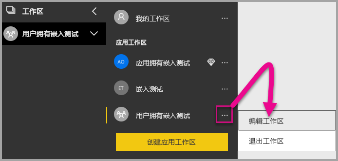

2. 展开“高级”，并启用“专用容量”。 选择你创建的专用容量。 然后，选择“保存”。

    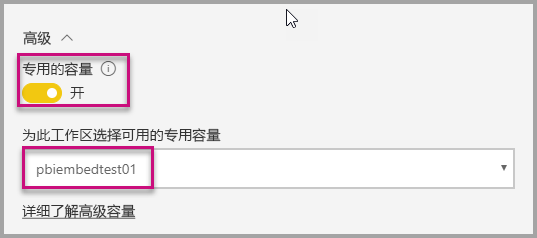

3. 选择“保存”后，应用工作区名称旁边应显示一个钻石形状。

    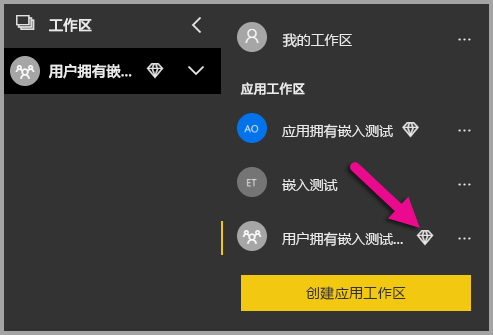

## <a name="admin-settings"></a>管理员设置

全局管理员或 Power BI 服务管理员可以为租户启用或禁用 REST API。 Power BI 管理员可以为整个组织或各个安全组设定此设置。 默认情况下，将为整个组织启用此功能。 你可以在 [Power BI 管理门户](../service-admin-portal.md)中进行这些更改。

## <a name="next-steps"></a>后续步骤

本教程介绍了如何使用 Power BI 组织帐户将 Power BI 内容嵌入应用程序。 接下来，可以尝试使用应用将 Power BI 内容嵌入应用程序。 此文，还可以尝试为客户嵌入 Power BI 内容：

> [!div class="nextstepaction"]
> [从应用嵌入内容](embed-from-apps.md)

> [!div class="nextstepaction"]
>[为客户嵌入内容](embed-sample-for-customers.md)

如有其他问题，请[尝试询问 Power BI 社区](http://community.powerbi.com/)。
