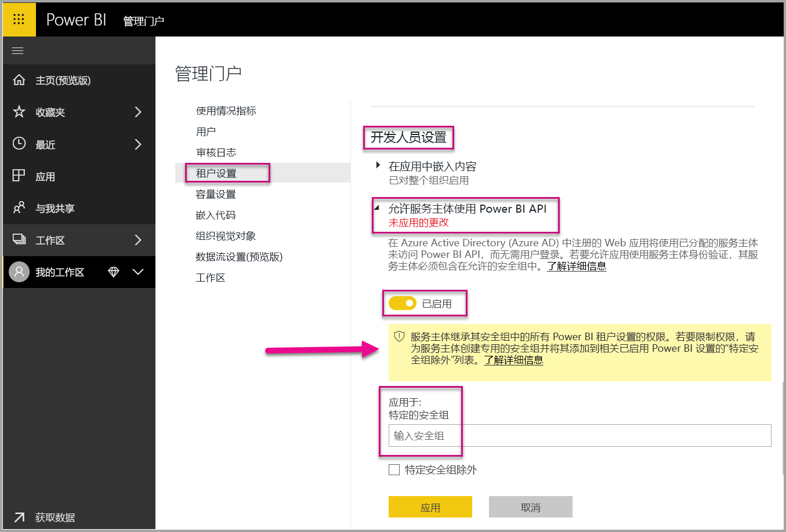
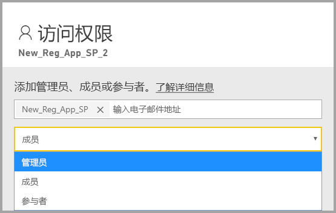
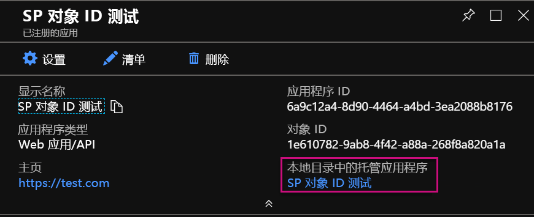

# <a name="service-principal-with-power-bi-preview"></a>Power BI 的服务主体（预览版）

使用服务主体，可将 Power BI 内容嵌入应用程序，并通过仅限应用的令牌在 Power BI 中使用自动化   。 使用 Power BI Premium Embedded 或自动处理 Power BI 任务和进程时，服务主体特别有用   。

使用 Power BI Embedded 时，使用服务主体具有优势。 主要优势是不需要主帐户（仅包含登录用户名和密码的 Power BI Pro 许可证）即可对应用程序进行身份验证。 服务主体使用应用程序 ID 和应用程序密码对应用程序进行身份验证。

努力自动处理 Power BI 任务时，还可编写如何处理和管理服务主体以进行缩放的脚本。

## <a name="application-and-service-principal-relationship"></a>应用程序和服务主体的关系

为了访问用于保护 Azure AD 租户的资源，需要访问权限的实体应表示安全主体。 此操作同时适用于用户（用户主体）和应用程序（服务主体）。

安全主体定义适用于 Azure AD 租户中的用户和应用程序的访问策略和权限。 此访问策略支持核心功能（例如，登录期间的用户和应用程序身份验证和资源访问期间的授权）。 有关详细信息，请参考 [Azure Active Directory (AAD) 中的应用程序和服务主体](https://docs.microsoft.com/azure/active-directory/develop/app-objects-and-service-principals)。

在 Azure 门户中注册 Azure AD 应用程序时，Azure AD 租户中将创建两个对象：

* [应用程序对象](https://docs.microsoft.com/azure/active-directory/develop/app-objects-and-service-principals#application-object)
* [服务主体对象](https://docs.microsoft.com/azure/active-directory/develop/app-objects-and-service-principals#service-principal-object)

将应用程序对象视为应用程序的全局表示形式以用于所有租户，将服务主体对象视为本地本地表示形式以用于特定租户   。

应用程序对象可充当派生常见和默认属性的模板，以用于创建对应的服务主体对象  。

每个使用应用程序的租户都需要服务主体 - 因此，它可以生成标识，以用于登录和访问受租户保护的资源。 单租户应用程序仅创建一个服务主体（在其主租户中）并允许在应用程序注册期间使用该服务主体。

## <a name="service-principal-with-power-bi-embedded"></a>Power BI Embedded 的服务主体

凭借服务主体，可以使用应用程序 ID 和应用程序密码屏蔽应用程序中的主帐户信息。 无需再将主帐户硬编码到应用程序中也可进行身份验证。

由于 Power BI API 和 Power BI .NET SDK 现支持使用服务主体调用，因此可以将 [Power BI REST API](https://docs.microsoft.com/rest/api/power-bi/) 与服务主体配合使用   。 例如，可以更改工作区，例如，创建工作区、添加或删除工作区中的用户，并将内容导入工作区。

如果 Power BI 项目和资源存储于[新的 Power BI 工作区](../service-create-the-new-workspaces.md)，则只能使用服务主体。

## <a name="service-principal-vs-master-account"></a>服务主体与主帐户

使用服务主体和标准主帐户（Power BI Pro 许可证）进行身份验证之间存在差异。 下表突出显示部分显著差异。

| 函数 | 主用户帐户 <br> （Power BI Pro 许可证） | 服务主体 <br> （仅限应用的令牌） |
|------------------------------------------------------|---------------------|-------------------|
| 可以登录 Power BI 服务  | 是 | 否 |
| 在 Power BI 管理门户中启用 | 否 | 是 |
| [用于应用工作区 (v1)](../service-create-workspaces.md) | 是 | 否 |
| [用于新的应用工作区 (v2)](../service-create-the-new-workspaces.md) | 是 | 是 |
| 如果与 Power BI Embedded 配合使用，则需要是工作区管理员 | 是 | 是 |
| 可以使用 Power BI REST API | 是 | 是 |
| 需要全局管理员才能创建 | 是 | 否 |
| 可以安装和管理本地数据网关 | 是 | 否 |

## <a name="get-started-with-a-service-principal"></a>开始使用服务主体

不同于主帐户的传统用法，使用服务主体（仅限应用的令牌）需要几个不同的部分才能设置。 要开始使用服务主体（仅限应用的令牌），则需要设置适当的环境。

1. 在 Azure Active Directory (AAD) 中[注册服务器端 Web 应用程序](register-app.md)，以便与 Power BI 配合使用。 注册应用程序之后，可以捕获应用程序 ID、应用程序密码和服务主体对象 ID 以访问 Power BI 内容。 可以使用 [PowerShell](https://docs.microsoft.com/powershell/azure/create-azure-service-principal-azureps?view=azps-1.1.0) 创建服务主体。

    下面是创建新的 Azure Active Directory 应用程序的示例脚本。

    ```powershell
    # The app id - $app.appid
    # The service principal object id - $sp.objectId
    # The app key - $key.value

    # Sign in as a user that is allowed to create an app.
    Connect-AzureAD

    # Create a new AAD web application
    $app = New-AzureADApplication -DisplayName "testApp1" -Homepage "https://localhost:44322" -ReplyUrls "https://localhost:44322"

    # Creates a service principal
    $sp = New-AzureADServicePrincipal -AppId $app.AppId

    # Get the service principal key.
    $key = New-AzureADServicePrincipalPasswordCredential -ObjectId $sp.ObjectId
    ```

   > [!Important]
   > 在使服务主体可用于 Power BI 后，应用程序的 AD 权限将不再有效。 然后，将通过 Power BI 管理门户管理应用程序权限。

2. 创建 [Azure Active Directory (AAD) 中的安全组](https://docs.microsoft.com/azure/active-directory/fundamentals/active-directory-groups-create-azure-portal)，并将所创建的应用程序添加到该安全组。 可以使用 [PowerShell](https://docs.microsoft.com/powershell/azure/create-azure-service-principal-azureps?view=azps-1.1.0) 创建 AAD 安全组。

    下面的示例脚本可用于创建新安全组并向该安全组添加应用程序。

    ```powershell
    # Required to sign in as a tenant admin
    Connect-AzureAD

    # Create an AAD security group
    $group = New-AzureADGroup -DisplayName <Group display name> -SecurityEnabled $true -MailEnabled $false -MailNickName notSet

    # Add the service principal to the group
    Add-AzureADGroupMember -ObjectId $($group.ObjectId) -RefObjectId $($sp.ObjectId)
    ```

3. Power BI 管理员需要启用 Power BI 管理门户中“开发人员设置”中的服务主体  。 将 Azure AD 中创建的安全组添加到“开发人员设置”中的“特定安全组”部分   。

   > [!Important]
   > 服务主体有权访问为整个组织启用的或者为包含服务主体的安全组启用的所有租户设置。 要限制服务主体访问特定租户设置，请只允许访问特定安全组，或者为服务主体创建一个专用安全组并将其排除在外。

    

4. 设置 [Power BI 环境](embed-sample-for-customers.md#set-up-your-power-bi-environment)。

5. 以管理员身份将服务主体添加到创建的新工作区  。 可以通过 [API](https://docs.microsoft.com/rest/api/power-bi/groups/addgroupuser) 或使用 Power BI 服务管理此任务。

    

6. 现在选择在示例应用程序或自己的应用程序中嵌入内容。

    * [使用示例应用程序嵌入内容](embed-sample-for-customers.md#embed-content-using-the-sample-application)
    * [在应用程序中嵌入内容](embed-sample-for-customers.md#embed-content-within-your-application)

7. 现在，你已准备好[移动到生产环境](embed-sample-for-customers.md#move-to-production)。

## <a name="migrate-to-service-principal"></a>改为使用服务主体

如果目前正在使用 Power BI 或 Power BI Embedded 的主帐户，则可改为使用服务主体。

完成[开始使用服务主体](#get-started-with-a-service-principal)部分中的前三个步骤，在完成后，按照以下说明操作。

如果已使用 Power BI 中的[新工作区](../service-create-the-new-workspaces.md)，则以管理员身份使用 Power BI 项目将服务主体添加到该工作区  。 但如果使用[传统工作区](../service-create-workspaces.md)，则将 Power BI 项目和资源复制并迁移到新工作区，然后以管理员身份将服务主体添加到这些工作区  。

没有用于将 Power BI 项目和资源从一个工作区移到另一个工作区的 UI 功能，因此需要使用 [API](https://powerbi.microsoft.com/pt-br/blog/duplicate-workspaces-using-the-power-bi-rest-apis-a-step-by-step-tutorial/) 才能完成此任务。 将 API 与服务主体配合使用时，需要使用服务主体对象 ID。

### <a name="how-to-get-the-service-principal-object-id"></a>如何获取服务主体对象 ID

要将服务主体分配到新的应用工作区，请使用 [Power BI REST API](https://docs.microsoft.com/rest/api/power-bi/groups/addgroupuser)。 若要引用服务主体用于操作或进行更改，请使用服务主体对象 ID - 例如，以管理员身份将服务主体应用于工作区  。

下面是从 Azure 门户获取服务主体对象 ID 的步骤。

1. 在 Azure 门户中创建新的应用注册。  

2. 然后在“本地目录中的托管应用程序”下，选择创建的应用程序的名称  。

   

    > [!Note]
    > 上图中的对象 ID 不是用于服务主体的对象 ID。

3. 选择“属性”查看对象 ID  。

    

以下是使用 PowerShell 检索服务主体对象 ID 的示例脚本。

   ```powershell
   Get-AzureADServicePrincipal -Filter "DisplayName eq '<application name>'"
   ```

## <a name="considerations-and-limitations"></a>注意事项和限制

* 服务主体仅适用于[新的应用工作区](../service-create-the-new-workspaces.md)。
* 使用服务主体时，不支持“我的工作区”  。
* 移动到生产环境时需要专用的高级容量。
* 无法使用服务主体登录 Power BI 门户。
* 在 Power BI 管理门户的开发人员设置中启用服务主体需要 Power BI 管理权限。
* 无法使用服务主体安装或管理本地数据网关。
* [为组织嵌入内容](embed-sample-for-your-organization.md)应用程序无法使用服务主体。
* 不支持[数据流](../service-dataflows-overview.md)管理。
* 服务主体目前不支持任何管理员 Api。

## <a name="next-steps"></a>后续步骤

* [注册应用](register-app.md)
* [适用于客户的 Power BI Embedded](embed-sample-for-customers.md)
* [Azure Active Directory 中的应用程序和服务主体对象](https://docs.microsoft.com/azure/active-directory/develop/app-objects-and-service-principals)
* [使用本地数据网关和服务主体 （预览版） 的行级别安全性](embedded-row-level-security.md#on-premises-data-gateway-with-service-principal-preview)
