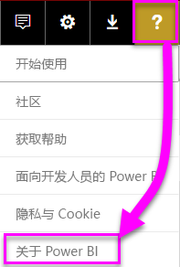
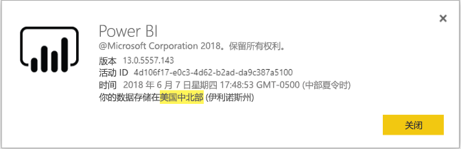

# <a name="frequently-asked-questions-about-power-bi-embedded"></a>有关 Power BI Embedded 的常见问题

* 如果你有其他问题，请[尝试询问 Power BI 社区](http://community.powerbi.com/)。
* 仍有问题？ 访问 [Power BI 支持页](https://powerbi.microsoft.com/support/)。

## <a name="general"></a>常规

### <a name="what-is-power-bi-embedded"></a>Power BI Embedded 是什么?

[Microsoft Power BI Embedded (PBIE)](azure-pbie-what-is-power-bi-embedded.md)允许应用程序开发人员将令人惊叹的完全交互式报表嵌入到他们的应用程序，而无需构建自己的数据可视化效果和从零开始的控件。

### <a name="who-is-the-target-audience-for-power-bi-embedded"></a>Power BI Embedded 的目标受众是谁？

开发人员和软件公司，也称为独立软件供应商 (Isv) 编写应用程序。

### <a name="how-is-power-bi-embedded-different-from-power-bi-the-service"></a>Power BI Embedded 与 Power BI 服务有什么不同？

Power BI 是“软件即服务”分析解决方案，为组织提供最关键业务数据的单一视图。

Microsoft 开发 Power BI Embedded 为 Isv 想要将视觉对象嵌入到其应用程序，以帮助其客户进行分析的决策。 从无需自行构建他们自己分析解决方案，Isv 可以节省。 [嵌入式分析](embedding.md)，业务用户可以访问业务数据，并对其生成应用程序中的见解，执行查询。


### <a name="what-is-the-difference-between-power-bi-premium-and-power-bi-embedded"></a>Power BI Premium 与 Power BI Embedded 之间的区别是什么？

Power BI Premium 是适用于企业希望提供其组织、 合作伙伴、 客户和供应商的单一视图的完整 BI 解决方案的容量。 Power BI Premium 可以帮助组织做出决策。 Power BI Premium 是 SaaS 产品，使用户能够使用通过移动应用、 内部开发应用，或在 Power BI 门户的内容。

Power BI Embedded 适用于 Isv 想要将视觉对象嵌入到其应用程序。 由于 Power BI Embedded 适用于应用程序开发人员，应用程序的客户可以使用存储在 Power BI Embedded 容量上的内容（包括组织内外的任何人），因此 Power BI Embedded 能帮助你的客户做出决策。 不能共享 Power BI Embedded 容量内容通过一键式发布到 Web 或一键式发布到 SharePoint。

### <a name="what-is-the-microsoft-recommendation-for-when-a-customer-should-buy-power-bi-premium-vs-power-bi-embedded"></a>Microsoft 建议客户购买 Power BI Premium 还是Power BI Embedded？

Microsoft 建议企业购买 Power BI Premium，企业级、 自助服务云 BI 解决方案。 我们建议 Isv 购买 Power BI Embedded 其云助力的嵌入式的分析组件。 但是，客户已购买的产品没有限制。

可能有某些情况的下，ISV （通常是大型），除了应用嵌入，希望使用 P SKU 可以获得预打包 Power BI 服务在其组织中的其他权益。 如果有些企业只是对构建业务线应用程序和嵌入分析感兴趣，并且对使用预打包 Power BI 服务不感兴趣，它们可能会决定在 Azure 中使用 A SKU。

### <a name="how-many-embed-tokens-can-i-create"></a>我可以创建多少嵌入令牌？

嵌入令牌具有 PRO 许可证适用于开发测试，以便 Power BI 主帐户或[服务主体](embed-service-principal.md)只能生成有限的数量的令牌。 [购买容量](#technical)以便在生产环境中嵌入。 多少嵌入的令牌时购买容量可以生成没有限制。 转到[可用功能](https://docs.microsoft.com/rest/api/power-bi/availablefeatures)查看使用量值，该值以百分比表示当前嵌入使用量。

## <a name="technical"></a>技术

### <a name="what-is-the-difference-between-the-a-skus-in-azure-and-the-em-skus-in-office-365"></a>Azure 中的 A SKU 与 Office 365 中的 EM SKU 之间有什么区别？

PowerBI.com 是企业软件即服务 (SaaS) 解决方案与许多功能，例如社交协作、 电子邮件订阅和其他功能。 PowerBI.com 帮助 Isv 租户级别设置和管理其内容的嵌入式的分析解决方案。

Power BI Embedded 是一个平台服务 (PaaS) 设置的 Api，开发人员可以使用创建嵌入式的分析解决方案。

下面是功能差异的部分列表。

| 功能 | Power BI Embedded | Power BI Premium 容量 | Power BI Premium 容量 |
|----------------------------------------------------------------------------------|-------------------|---------------------------|---------------------------|
|   | (A SKU) | (EM SKU) | (P SKU) |
| 从 Power BI 应用工作区嵌入项目 | Azure 容量 | Office 365 容量 | Office 365 容量 |
| 在嵌入应用程序中使用 Power BI 报表 | 是 | 是 | 是 |
| 在 SharePoint 中使用 Power BI 报表 | 否 | 是 | 是 |
| 在 Dynamics 中使用 Power BI 报表 | 否 | 是 | 是 |
| 在 Teams 中使用 Power BI 报表（不包括移动应用） | 否 | 是 | 是 |
| 在 Powerbi.com 和 Power BI 移动版中使用免费的 Power BI 许可证访问内容 | 否 | 否 | 是 |
| 使用 MS Office 应用中嵌入的免费 Power BI 许可证访问内容 | 否 | 是 | 是 |

### <a name="power-bi-now-offers-three-skus-for-embedding-a-skus-em-skus-and-p-skus-which-one-should-i-purchase-for-my-scenario"></a>Power BI 现在提供三个用于嵌入的 SKU：A SKU、EM SKU 和 P SKU。 应该为我的方案购买哪一个？

|  |A SKU (Power BI Embedded)  |EM SKU (Power BI Premium)  |P SKU (Power BI Premium)  |
|---------|---------|---------|---------|
|Purchase  |Azure 门户 |Office |Office |
|用例 | 在自己的应用程序中嵌入内容 | <li> 在自己的应用程序中嵌入内容 <br><br><br> <li> 在 MS Office 应用程序中嵌入内容： <br> - [SharePoint](https://powerbi.microsoft.com/blog/integrate-power-bi-reports-in-sharepoint-online/) <br> - [Teams（不包括移动应用）](https://powerbi.microsoft.com/blog/power-bi-teams-up-with-microsoft-teams/) <br> - [Dynamics 365](https://docs.microsoft.com/dynamics365/customer-engagement/basics/add-edit-power-bi-visualizations-dashboard) | <li> 在自己的应用程序中嵌入内容 <br><br><br> <li> 在 MS Office 应用程序中嵌入内容： <br> - [SharePoint](https://powerbi.microsoft.com/blog/integrate-power-bi-reports-in-sharepoint-online/) <br> - [Teams（不包括移动应用）](https://powerbi.microsoft.com/blog/power-bi-teams-up-with-microsoft-teams/) <br> - [Dynamics 365](https://docs.microsoft.com/dynamics365/customer-engagement/basics/add-edit-power-bi-visualizations-dashboard) <br><br><br> <li> 通过 [Power BI 服务](https://powerbi.microsoft.com/)与 Power BI 用户共享内容  |
|账单 |每小时 |每月 |每月 |
|承诺  |无承诺 |每年  |每月/每年 |
|区别 |全弹性 - 可以在 Azure 门户中或通过 API 纵向/横向扩展、暂停/恢复资源  |可用于在 SharePoint Online 和 Microsoft Teams （不包括移动应用） 中嵌入内容 |合并嵌入在应用程序中并在相同的容量中使用 Power BI 服务 |

### <a name="what-are-the-prerequisites-to-create-a-pbie-capacity-in-azure"></a>在 Azure 中创建 PBIE 容量的先决条件是什么？

* 登录到你组织的目录 (Microsoft 帐户不受支持)。
* 你需要具有 Power BI 租户，即，在你的目录中的至少一个用户已注册 Power bi。 
* 需要在组织目录中有 Azure 订阅。

### <a name="how-can-i-monitor-power-bi-embedded-capacity-consumption"></a>如何监视 Power BI Embedded 容量消耗？

* 使用 [Power BI 管理门户](../service-admin-portal.md#power-bi-embedded)。

* 在 Power BI 中下载[指标应用](https://review.docs.microsoft.com/power-bi/service-admin-premium-monitor-capacity)。

* 使用 [Azure 诊断日志记录](azure-pbie-diag-logs.md)。

### <a name="can-my-capacity-scale-automatically-to-adjust-to-my-app-consumption"></a>可以我容量缩放是否自动调整到我的应用消耗？

虽然没有自动缩放现在，所有 Api 都都可以在任何时候缩放。

### <a name="why-creatingscalingresuming-a-capacity-results-in-putting-the-capacity-into-a-suspended-state"></a>为什么创建/缩放/恢复容量会导致将容量置于挂起状态？

（刻度/恢复/创建） 容量预配可能会失败。 获取详细信息 API 可用于检查一个容量预配状态：[容量 - 获取详细信息](https://docs.microsoft.com/rest/api/power-bi-embedded/capacities/getdetails)来检查容量的预配状态。

### <a name="can-i-only-create-power-bi-embedded-capacities-in-a-specific-region"></a>能否只在特定区域创建 Power BI Embedded 容量？

使用[多地理位置（预览）](embedded-multi-geo.md)功能，可在不同于 Power BI 主租户位置的区域中购买 [Power BI Embedded 容量](azure-pbie-create-capacity.md)

### <a name="how-can-i-find-my-pbi-tenant-region"></a>如何找到我的 PBI 租户区域？

PBI 门户可用于查找在 PBI 租户区域。

[https://app.powerbi.com/](https://app.powerbi.com/) > ? > 关于 Power BI




### <a name="what-does-the-cloud-solution-provider-csp-channel-support"></a>云解决方案提供商 (CSP) 通道的支持是什么？

* 可以为订阅类型为 CSP 的租户创建 PBIE
* 合作伙伴帐户可以登录到客户租户并为将客户租户用户指定为 Power BI 容量管理员的客户租户购买 PBIE

### <a name="why-do-i-get-an-unsupported-account-message"></a>为什么收到不受支持的帐户消息？

Power BI 要求使用组织帐户注册。 尝试注册 Power BI 中使用 Microsoft 帐户不受支持。

### <a name="can-i-use-apis-to-create-and-manage-azure-capacities"></a>可以使用 Api 来创建和管理 Azure 容量？

是的有 Powershell cmdlet 和 Azure 资源管理器 REST Api 可用于创建和管理 PBIE 资源。

* [Rest Api](https://docs.microsoft.com/rest/api/power-bi-embedded/)
* [Powershell cmdlet](https://docs.microsoft.com/powershell/module/azurerm.powerbiembedded/)

### <a name="what-is-the-pbi-embedded-dedicated-capacity-role-in-a-pbi-embedded-solution"></a>PBI Embedded 解决方案中的 PBI Embedded 专用容量角色是什么？

向[将解决方案提升到生产](embed-sample-for-customers.md#move-to-production)，您需要将应用程序使用的 Power BI 内容 （应用工作区） 分配给 Power BI Embedded (SKU) 的容量。

### <a name="in-what-azure-regions-is-pbi-embedded-available"></a>在哪些 Azure 区域是 PBI Embedded 可用？

[PAM](https://ecosystemmanager.azurewebsites.net/home) (EcoManager) - 请参阅“产品可用性管理器”

可用性区域（16 个 - 与 Power BI 的区域相同）

* 美国（6 个）- 美国东部、美国东部 2，美国中北部、美国中南部、美国西部、美国西部 2
* 欧洲（2 个）- 北欧、西欧
* 亚太地区（2 个）- 东南亚、东亚
* 巴西（1 个）- 巴西南部
* 日本（1 个）- 日本东部
* 澳大利亚（1 个）- 澳大利亚东南部
* 印度（1 个）- 印度西部
* 加拿大（1 个）- 加拿大中部
* 英国（1 个）- 英国南部

### <a name="what-is-power-bi-embeddeds-authentication-model"></a>Power BI Embedded 的身份验证模型是什么？

若要使用 Azure AD 进行身份验证主用户 （指定的 Power BI Pro 许可用户），或与 Power BI Embedded 将继续[服务主体](embed-service-principal.md)对 Power BI 内的应用程序进行身份验证。  

 ISV 可以实现其自己的身份验证和授权其应用程序。

如果已有 Azure AD 租户，可以使用现有目录。 您还可以创建一个新的嵌入的应用程序内容安全的 Azure AD 租户。

若要获取 AAD 令牌，可以使用 [Azure Active Directory 身份验证库](https://docs.microsoft.com/azure/active-directory/develop/active-directory-authentication-libraries)之一。 有适用于多个平台的客户端库。

### <a name="my-application-already-uses-aad-for-user-authentication-how-can-we-use-this-identity-when-authenticating-to-power-bi-in-a-user-owns-data-scenario"></a>我的应用程序已使用 AAD 进行用户身份验证。 对“用户拥有数据”方案中的 Power BI 进行身份验证时，如何才能使用此标识？

它是标准 OAuth 上的代理流 (<https://docs.microsoft.com/azure/active-directory/develop/web-api>)。 需要应用程序配置为需要 Power BI 服务 （包含所需作用域） 的权限。 向应用程序的用户令牌后，您只需调用到 ADAL API AcquireTokenAsync 使用用户访问令牌并将指定的 Power BI 资源 URL 为资源 ID:

```csharp
var context = new AD.AuthenticationContext(authorityUrl);
var userAssertion = new AD.UserAssertion(userAccessToken);
var clientAssertion = new AD.ClientAssertionCertificate(MyAppId, MyAppCertificate)
var authenticationResult = await context.AcquireTokenAsync(resourceId, clientAssertion, userAssertion);
```

### <a name="what-object-id-is-the-service-principal-object-id"></a>何种对象 ID 是服务主体对象 ID？

*对象 ID*已注册的应用程序的主屏幕是应用程序的对象 ID。

ID 中找到的对象*托管在本地目录中的应用程序 > 属性*部分是您需要使用的服务主体对象 ID。 此对象 ID 是以引用操作的服务主体或更改的服务主体对象 id。 例如，作为管理员的服务主体应用到工作区中。

### <a name="how-is-power-bi-embedded-different-from-other-azure-services"></a>Power BI Embedded 与其他 Azure 服务有什么不同？

在 Azure 中的 Power BI Embedded 在购买之前，必须具有一个 Power BI 帐户。 Power BI Embedded 部署区域确定你的 Power BI 帐户。 管理你在 Azure 中的 Power BI Embedded 资源，以便：

* 纵向/横向扩展
* 添加容量管理员
* 暂停/恢复服务

使用 PowerBI.com 将工作区分配/取消分配给 Power BI Embedded 容量。

### <a name="what-are-the-supported-deploy-regions"></a>什么是受支持部署区域？

澳大利亚东南部、巴西南部、加拿大中部、美国东部 2、印度西部、日本东部、美国中北部、欧洲北部、美国中南部、亚洲东南部、英国南部、欧洲西部、美国西部和美国西部 2。

### <a name="what-content-pack-data-types-can-you-embed"></a>可以嵌入的内容包数据类型？

您*不能*嵌入**仪表板**并**磁贴**从内容包数据集生成。 但是，你*可以*嵌入**报表**从内容包数据集生成。

### <a name="what-is-the-difference-between-using-row-level-security-rls-vs-javascript-filters"></a>使用行级别安全性 (RLS) vs 之间的区别是什么。JavaScript 筛选器有何区别？

通常会感到不知所措时与 JavaScript 的筛选器，使用 RLS，因为一种方法是如何控制什么特定的用户可以看到，和另一个是有关优化用户的视图。

对于 RLS，ISV 开发人员在模型创建和嵌入令牌生成过程中控制数据筛选。 最终用户只能看到 ISV 允许其看到的内容。 在这种情况下，用户可以选择查看少于已筛选的内容，但无法通过规避 RLS 配置查看多于已允许的内容。

对于客户端的筛选 (JavaScript)，ISV 可能会决定最终用户会看到在初始视图，但它们不能控制的更改最终用户可能会应用于视图本身。 由于用户的客户端 Javascript 代码可以触发的后端上筛选数据，因此不能将它视为安全。

有关详细信息，请参阅 [RLS 与 JavaScript 筛选器](embedded-row-level-security.md#using-rls-vs-javascript-filters)。

### <a name="how-do-i-manage-permissions-for-service-principals-with-power-bi"></a>如何管理 Power BI 的服务主体的权限？

启用后[服务主体](embed-service-principal.md)使用 Power BI，应用程序的 AD 权限才会生效了。 然后，将通过 Power BI 管理门户管理应用程序权限。

服务主体继承其安全组中的所有 Power BI 租户设置的权限。 若要限制权限，请为服务主体创建的专用的安全组，并将其添加到**特定安全组除外**相关，已启用 Power BI 设置的列表。

当你以管理员身份将服务主体添加到新工作区时，这种情况很重要  。 可以通过 [API](https://docs.microsoft.com/rest/api/power-bi/groups/addgroupuser) 或使用 Power BI 服务管理此任务。

### <a name="when-to-use-an-application-id-vs-a-service-principal-object-id"></a>何时使用应用程序 ID 与服务主体对象 ID？

传递应用程序 ID 进行身份验证时，[应用程序 ID](embed-sample-for-customers.md#application-id) 用于创建访问令牌  。

若要引用服务主体用于操作或进行更改，请使用[服务主体对象 ID](embed-service-principal.md#how-to-get-the-service-principal-object-id) - 例如，以管理员身份将服务主体应用于工作区  。

### <a name="can-you-manage-an-on-premises-data-gateway-with-service-principal"></a>能否使用服务主体管理本地数据网关？

无法像使用主帐户一样，使用[服务主体](embed-service-principal.md)管理本地数据网关（数据网关）。

使用主帐户，可以安装数据网关，向网关添加用户，连接数据源和执行其他管理任务。

使用服务主体，可以使用 SQL Server Analysis Services (SSAS) 本地实时连接数据源配置[行级别安全性 (RLS)](embedded-row-level-security.md#on-premises-data-gateway-with-service-principal-preview)。 使用服务主体与 Power BI Premium Embedded 集成时，可以通过这种方式管理用户及其对 SSAS 中数据的访问权限  。

### <a name="can-you-sign-into-the-power-bi-service-with-service-principal"></a>能否使用服务主体登录 Power BI 服务？

否，无法使用服务主体登录 Power BI。

此外，还无法以用户身份使用外部应用程序（SaaS 嵌入）中的内容，只有在生成嵌入令牌时才可以。

### <a name="what-are-the-best-practices-to-improve-performance"></a>提高性能的最佳做法有哪些？

[Power BI Embedded 性能](embedded-performance-best-practices.md)

## <a name="licensing"></a>许可

### <a name="how-do-i-purchase-power-bi-embedded"></a>如何购买 Power BI Embedded？

Power BI Embedded 是通过 Azure 提供的。

### <a name="what-happens-if-i-already-purchased-power-bi-premium-and-now-i-want-some-power-bi-embedded-in-azure-benefits"></a>如果我已经购买了 Power BI Premium，现在我想一些 Power BI Embedded 中的 Azure 权益会发生什么情况？

客户继续支付任何现有的 Power BI Premium 购买，直至其当前协议期结束，然后，此时，可能切换其 Power BI Premium 购买费用根据需要。

### <a name="do-i-still-have-to-buy-power-bi-premium-to-get-access-to-power-bi-embedded"></a>我是否仍需要购买 Power BI Premium 才能访问 Power BI Embedded？

否，Power BI Embedded 包括将解决方案部署并分发给客户所需的基于 Azure 的容量。

### <a name="whats-the-purchase-commitment-for-power-bi-embedded"></a>Power BI Embedded 的采购承诺是什么？

客户可以按小时为单位更改使用情况。 没有 Power BI Embedded 服务的任何月度或年度承诺。

### <a name="how-does-the-usage-of-power-bi-embedded-show-up-on-my-bill"></a>Power BI Embedded 的使用情况如何体现在我的账单上？

根据部署的节点类型，Power BI Embedded 按可预测的每小时费用收费。 向你收费，只要资源处于活动状态，即使没有使用。 需要暂停资源以停止计费。

### <a name="who-needs-a-power-bi-pro-license-for-power-bi-embedded-and-why"></a>谁需要 Power BI Embedded 的 Power BI Pro 许可证，为什么？

你需要 Power BI Pro 许可证或[服务主体](embed-service-principal.md)使用 REST Api。 若要将报表添加到 Power BI 工作区中，分析人员需要 Power BI Pro 许可证或服务主体。 若要管理的 Power BI 租户和容量，管理员则需要具有 Power BI Pro 许可证。

由于 Power BI Embedded 允许 Power BI 门户用于管理和验证嵌入式的内容，Power BI Pro 许可证需要在相应存储库中获取对报表的访问 PowerBI.com 中应用进行身份验证。

不过，若要在应用程序中[创建/编辑已嵌入报表](https://github.com/Microsoft/PowerBI-JavaScript/wiki/Create-Report-in-Embed-View)，最终用户无需 Pro 许可证，因为该用户根本就不需要是 Power BI 用户。

### <a name="can-i-get-started-for-free"></a>开始我可以免费使用吗？

可以，你可以对 Power BI Embedded 使用你的 [Azure 信用额度](https://azure.microsoft.com/free/)

### <a name="can-i-get-a-trial-experience-for-power-bi-embedded-in-azure"></a>可以在 Azure 中获得 Power BI Embedded 的试用体验吗？

由于 Power BI Embedded 是 Azure 的一部分，则可能要使用的服务[注册 azure 时获得的 200 美元信用额度](https://azure.microsoft.com/free/)。

### <a name="is-power-bi-embedded-available-for-national-clouds-us-government-germany-china"></a>Power BI Embedded 是否适用于国家云（美国政府版、德国版、中国版）？

Power BI Embedded 也是可用于[国家/地区云](embed-sample-for-customers-national-clouds.md)。

### <a name="is-power-bi-embedded-available-for-non-profits-and-educational"></a>Power BI Embedded 是否适合非营利组织和教育机构？

没有任何特殊的 Azure 定价为非盈利组织和教育机构。

## <a name="power-bi-workspace-collection"></a>Power BI 工作区集合

### <a name="what-is-power-bi-workspace-collection"></a>什么是 Power BI 工作区集合？

**Power BI 工作区集合**(**Power BI Embedded**版本 1) 一种解决方案基于**Power BI 工作区集合**Azure 资源。 此解决方案允许使用“Power BI 工作区集合”解决方案下的 Power BI 内容  、专用的 API 和用于向 Power BI 验证应用程序的工作区集合密钥，为客户创建 Power BI Embedded  应用程序。

### <a name="can-i-migrate-from-power-bi-workspace-collection-to-power-bi-embedded"></a>如何从 Power BI 工作区集合迁移到 Power BI Embedded？

1. 可以使用迁移工具将 Power BI 工作区集合  内容克隆到 Power BI - https://docs.microsoft.com/power-bi/developer/migrate-from-powerbi-embedded#content-migration。

2. 从使用 Power BI 内容的 Power BI Embedded  应用程序 POC 入手。

3. 为生产做好准备后，购买 Power BI Embedded  专用容量，并将你的 Power BI 内容（工作区）分配给该容量。

    > [!Note]
    > 当使用 Power BI Embedded 解决方案并行生成时，可以继续使用 Power BI 工作区集合   。 准备就绪后，可以让客户迁移到新的 Power BI Embedded 解决方案，停用 Power BI 工作区集合解决方案   。

有关详细信息，请参考[如何将 Power BI 工作区集合内容迁移到 Power BI Embedded](https://docs.microsoft.com/power-bi/developer/migrate-from-powerbi-embedded)

### <a name="is-power-bi-workspace-collection-on-a-deprecation-path"></a>不推荐使用路径上是 Power BI 工作区集合？

是的但已在使用的客户**Power BI 工作区集合**解决方案可以继续使用它之前不推荐使用。 客户还可以创建新的工作区集合，以及任何仍使用 Power BI 工作区集合解决方案的 Power BI Embedded 应用程序   。

但是，这也意味着新功能不会添加到任何**Power BI 工作区集合**解决方案。 我们鼓励客户打算将其迁移到新**Power BI Embedded**解决方案。

### <a name="when-is-power-bi-workspace-collection-support-discontinued"></a>何时停止 Power BI 工作区集合支持？

已在使用 Power BI 工作区集合  解决方案的客户可以继续使用它，直至 2018 年 6 月底或直至其支持协议结束。

### <a name="in-what-regions-can-i-create-a-pbi-workspace-collection"></a>在哪些区域中可以创建 PBI 工作区集合？

可用区域有：澳大利亚东南部、巴西南部、加拿大中部、美国东部 2、日本东部、美国中北部、欧洲北部、美国中南部、亚洲东南部、英国南部、欧洲西部、印度西部和美国西部。

### <a name="why-should-i-migrate-from-pbi-workspace-collection-to-power-bi-embedded"></a>为什么应当从 PBI 工作区集合迁移到 Power BI Embedded？

有一些新**Power BI Embedded**解决方案特性和功能，不能与**Power BI 工作区集合**。

一些功能为：
* 支持所有 PBI 数据源。 只有两个**Power BI 工作区集合**支持数据源。 
* Power BI Embedded  解决方案仅支持诸如常见问题、刷新、书签、嵌入仪表板和磁贴以及自定义菜单等新功能。
* 容量计费模型。

## <a name="embedding-setup-tool"></a>嵌入安装程序工具

### <a name="what-is-the-embedding-setup-tool"></a>什么是嵌入安装程序工具？

通过[工具](https://aka.ms/embedsetup)，可快速开始并下载示例应用程序，以便开始使用 Power BI 进行嵌入。

### <a name="which-solution-should-i-choose"></a>应选择哪种解决方案？

* 通过[为客户嵌入内容](embedding.md#embedding-for-your-customers)，可为没有 Power BI 帐户的用户嵌入仪表板和报表。 运行[为客户嵌入](https://aka.ms/embedsetup/AppOwnsData)解决方案。
* 通过[为组织嵌入内容](embedding.md#embedding-for-your-organization)，可以扩展 Power BI 服务。 运行[为组织嵌入](https://aka.ms/embedsetup/UserOwnsData)解决方案。

### <a name="ive-downloaded-the-sample-app-which-solution-do-i-choose"></a>我已下载示例应用，应选择哪种解决方案？

若要采用“为客户嵌入”  体验，请保存并解压缩 PowerBI-Developer-Samples.zip  文件。 然后打开 PowerBI-Developer-Samples-master\App Owns Data 文件夹并运行 PowerBIEmbedded_AppOwnsData.sln 文件   。

若要采用“为组织嵌入”  体验，请保存并解压缩 PowerBI-Developer-Samples.zip  文件。 然后打开 PowerBI-Developer-Samples-master\App Owns Data\integrate-report-web-app 文件夹并运行 pbi-saas-embed-report.sln 文件   。

### <a name="how-can-i-edit-my-registered-application"></a>如何编辑已注册的应用程序？

若要了解如何编辑已注册 Azure AD 的应用程序，请参阅[快速入门：在 Azure Active Directory 中更新应用程序](https://docs.microsoft.com/azure/active-directory/develop/quickstart-v1-update-azure-ad-app)。

### <a name="how-can-i-edit-my-power-bi-user-profile-or-data"></a>如何编辑我的 Power BI 用户配置文件或数据？

可以在[这里](https://docs.microsoft.com/power-bi/service-basic-concepts)了解如何编辑 Power BI 数据。

有关详细信息，请参阅[嵌入应用程序疑难解答](embedded-troubleshoot.md)。

更多问题？ [尝试参与 Power BI 社区](http://community.powerbi.com/)
