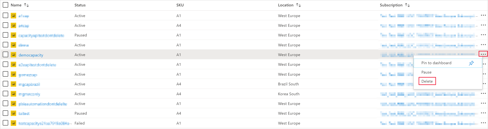

# <a name="create-power-bi-embedded-capacity-in-the-azure-portal"></a>在 Azure 门户中创建 Power BI Embedded 容量

本文介绍如何在 Microsoft Azure 中创建 [Power BI Embedded](azure-pbie-what-is-power-bi-embedded.md) 容量。 Power BI Embedded 通过帮助用户快速将令人惊叹的视觉对象、报表和仪表板添加到应用中，简化 Power BI 功能。

## <a name="before-you-begin"></a>准备阶段

若要完成本快速入门，需要以下项：

* **Azure 订阅：** 访问 [Azure 免费试用版](https://azure.microsoft.com/free/)，创建一个帐户。

* **Azure Active Directory：** 订阅必须与 Azure Active Directory (Azure AD) 租户关联。 此外，***需要使用该租户中的帐户登录 Azure***。 不支持 Microsoft 帐户。 若要了解详细信息，请参阅[身份验证和用户权限](https://docs.microsoft.com/azure/analysis-services/analysis-services-manage-users)。

* **Power BI 租户：** Azure AD 租户中必须至少有一个帐户已注册 Power BI。

* **资源组：** 使用已有资源组，或[创建新资源组](https://docs.microsoft.com/azure/azure-resource-manager/resource-group-overview)。

## <a name="create-a-capacity"></a>创建容量

创建 Power BI Embedded 容量之前，请先确保至少已登录 Power BI 一次。

# <a name="portal"></a>[门户](#tab/portal)

1. 登录到 [Azure 门户](https://portal.azure.com/)。

2. 在搜索框中，搜索  *Power BI Embedded*。

3. 在 Power BI Embedded 中，选择“添加”。

4. 填写所需的信息，然后单击“审阅 + 创建”。

    

    * “订阅”- 要为其创建容量的订阅。

    * “资源组”- 包含此新容量的资源组。 从现有资源组中进行选取，或者另外创建一个。 有关详细信息，请参阅 [Azure Resource Manager 概述](https://docs.microsoft.com/azure/azure-resource-manager/resource-group-overview)。

    * “资源名称”- 容量的资源名称。

    * “位置”- 为租户托管 Power BI 的位置。 你的默认位置位于主区域内，但可以使用 [Multi-Geo 选项](embedded-multi-geo.md)更改该位置。

    * “大小”- 所需的 [SKU](../../admin/service-admin-premium-purchase.md#purchase-a-skus-for-testing-and-other-scenarios)。 有关详细信息，请参阅 [SKU 内存和计算能力](/power-bi/developer/embedded/embedded-capacity)。

    * “Power BI 容量管理员”- 容量的管理员。
        >[!NOTE]
        >* 默认情况下，容量管理员是创建容量的用户。
        >* 可以选择其他用户或服务主体作为容量管理员。
        >* 容量管理员必须属于预配容量的租户。 企业到企业 (B2B) 用户不能成为容量管理员。

# <a name="azure-cli"></a>[Azure CLI](#tab/CLI)

### <a name="use-azure-cloud-shell"></a>使用 Azure Cloud Shell

Azure 托管 Azure Cloud Shell（一个可通过浏览器使用的交互式 shell 环境）。 可以将 Bash 或 PowerShell 与 Cloud Shell 配合使用来使用 Azure 服务。 可以使用 Azure Cloud Shell 预安装的命令来运行本文中的代码，而不必在本地环境中安装任何内容。

若要启动 Azure Cloud Shell，请执行以下操作：

| 选项 | 示例/链接 |
|-----------------------------------------------|---|
| 选择代码块右上角的“试用”。 选择“试用”不会自动将代码复制到 Cloud Shell。 |  |
| 转到 [https://shell.azure.com](https://shell.azure.com) 或选择“启动 Cloud Shell”按钮可在浏览器中打开 Cloud Shell。 | [](https://shell.azure.com) |
| 选择 [Azure 门户](https://portal.azure.com)右上角菜单栏上的 **Cloud Shell** 按钮。 |  |

若要在 Azure Cloud Shell 中运行本文中的代码，请执行以下操作：

1. 启动 Cloud Shell。

2. 选择代码块上的“复制”按钮以复制代码。

3. 在 Windows 和 Linux 上选择 **Ctrl**+**Shift**+**V** 将代码粘贴到 Cloud Shell 会话中，或在 macOS 上选择 **Cmd**+**Shift**+**V** 将代码粘贴到 Cloud Shell 会话中。

4. 选择 **Enter** 运行此代码。

## <a name="prepare-your-environment"></a>准备环境

Power BI Embedded 容量命令需要使用 2.3.1 或更高版本的 Azure CLI。 运行 `az --version` 查看安装的版本和依赖库。 若要安装或升级，请参阅[安装 Azure CLI](/cli/azure/install-azure-cli)。

1. 登录。

   如果使用的是 CLI 的本地安装，请使用 [az login](/cli/azure/reference-index#az-login) 命令登录。

    ```azurecli
    az login
    ```

    遵循终端中显示的步骤完成身份验证过程。

2. 安装 Azure CLI 扩展。

    使用 Azure CLI 的扩展引用时，必须先安装该扩展。  借助 Azure CLI 扩展，可访问尚未在核心 CLI 中提供的试验性和预发布的命令。  若要详细了解包含更新和卸载的扩展，请参阅[使用 Azure CLI 的扩展](/cli/azure/azure-cli-extensions-overview)。

    通过运行以下命令，安装 Power BI Embedded 容量扩展：

    ```azurecli
    az extension add --name powerbidedicated
    ```

### <a name="create-a-capacity-with-azure-cli"></a>使用 Azure CLI 创建容量

使用 [az Power BI embedded-capacity create](https://docs.microsoft.com/cli/azure/ext/powerbidedicated/powerbi/embedded-capacity?view=azure-cli-latest#ext-powerbidedicated-az-powerbi-embedded-capacity-create) 命令创建容量。

```azurecli
az powerbi embedded-capacity create --location westeurope
                                    --name
                                    --resource-group
                                    --sku-name "A1"
                                    --sku-tier "PBIE_Azure"
```

### <a name="delete-a-capacity-with-azure-cli"></a>使用 Azure CLI 删除容量

若要使用 Azure CLI 删除容量，请使用 [az powerbi embedded-capacity delete](https://docs.microsoft.com/cli/azure/ext/powerbidedicated/powerbi/embedded-capacity?view=azure-cli-latest#ext-powerbidedicated-az-powerbi-embedded-capacity-delete) 命令。

```azurecli
az powerbi embedded-capacity delete --name
                                    --resource-group
```

### <a name="manage-your-capacity-with-azure-cli"></a>使用 Azure CLI 管理容量

可以在 [az powerbi](https://docs.microsoft.com/cli/azure/ext/powerbidedicated/powerbi?view=azure-cli-latest) 中查看所有 Power BI Embedded Azure CLI 命令。

# <a name="arm-template"></a>[ARM 模板](#tab/ARM-template)

### <a name="use-resource-manager-template"></a>使用 Resource Manager 模板

[资源管理器模板](https://docs.microsoft.com/azure/azure-resource-manager/templates/overview)是定义项目基础结构和配置的 JavaScript 对象表示法 (JSON) 文件。 该模板使用声明性语法，使你可以声明要部署的内容，而不需要编写一系列编程命令来进行创建。 若要详细了解如何开发资源管理器模板，请参阅[资源管理器文档](https://docs.microsoft.com/azure/azure-resource-manager/)和[模板参考](https://docs.microsoft.com/azure/templates/)。

如果没有 Azure 订阅，请在开始之前创建一个[免费](https://azure.microsoft.com/free/)帐户。

### <a name="review-the-template"></a>查看模板

本快速入门中使用的模板来自 [Azure 快速启动模板](https://azure.microsoft.com/resources/templates/101-power-bi-embedded)。

```json
{
    "$schema": "https://schema.management.azure.com/schemas/2019-04-01/deploymentTemplate.json#",
    "contentVersion": "1.0.0.0",
    "parameters": {
        "name": {
            "type": "string",
            "metadata": {
              "description": "The capacity name, which is displayed in the Azure portal and the Power BI admin portal"
            }
        },
        "location": {
            "type": "string",
            "defaultValue": "[resourceGroup().location]",
            "metadata": {
              "description": "The location where Power BI is hosted for your tenant"
            }
        },
        "sku": {
            "type": "string",
            "allowedValues": [
                "A1",
                "A2",
                "A3",
                "A4",
                "A5",
                "A6"
            ],
            "metadata": {
              "description": "The pricing tier, which determines the v-core count and memory size for the capacity"
            }
        },
        "admin": {
            "type": "string",
            "metadata": {
              "description": "A user within your Power BI tenant, who will serve as an admin for this capacity"
            }
        }
    },
    "resources": [
        {
            "type": "Microsoft.PowerBIDedicated/capacities",
            "apiVersion": "2017-10-01",
            "name": "[parameters('name')]",
            "location": "[parameters('location')]",
            "sku": {
                "name": "[parameters('sku')]"
            },
            "properties": {
                "administration": {
                    "members": [
                        "[parameters('admin')]"
                    ]
                }
            }
        }
    ]
}
```

模板中定义了一个 Azure 资源，[Microsoft.PowerBIDedicated/capacities Az](https://docs.microsoft.com/azure/templates/microsoft.powerbidedicated/allversions) - 创建 Power BI Embedded 容量。

### <a name="deploy-the-template"></a>部署模板

1. 选择以下链接登录到 Azure 并打开一个模板。 该模板会创建 Power BI Embedded 容量。

    [](https://portal.azure.com/#create/Microsoft.Template/uri/https%3a%2f%2fraw.githubusercontent.com%2fAzure%2fazure-quickstart-templates%2fmaster%2f101-power-bi-embedded%2fazuredeploy.json)

2. 填写所需的信息，然后单击“审阅 + 创建”。

    

    * “订阅”- 要为其创建容量的订阅。

    * “资源组”- 包含此新容量的资源组。 从现有资源组中进行选取，或者另外创建一个。 有关详细信息，请参阅 [Azure Resource Manager 概述](https://docs.microsoft.com/azure/azure-resource-manager/resource-group-overview)。

    * “区域”- 容量所属的区域。

    * “名称”- 容量名称。

    * “位置”- 为租户托管 Power BI 的位置。 你的默认位置位于主区域内，但可以使用 [Multi-Geo 选项](https://docs.microsoft.com/power-bi/developer/embedded/embedded-multi-geo
)更改该位置。

    * “SKU”- 所需的 [SKU](../../admin/service-admin-premium-purchase.md#purchase-a-skus-for-testing-and-other-scenarios)。 有关详细信息，请参阅 [SKU 内存和计算能力](/power-bi/developer/embedded/embedded-capacity)。

    * “管理员”- 容量的管理员。
        >[!NOTE]
        >* 默认情况下，容量管理员是创建容量的用户。
        >* 可以选择其他用户或服务主体作为容量管理员。
        >* 容量管理员必须属于预配容量的租户。 企业到企业 (B2B) 用户不能成为容量管理员。

### <a name="validate-the-deployment"></a>验证部署

若要验证部署，请执行以下操作：

1. 登录到 [Azure 门户](https://portal.azure.com/)。

2. 在搜索框中，搜索  *Power BI Embedded*。

3. 查看 Power BI Embedded 容量列表，验证是否已列出所创建的新容量。

    

### <a name="clean-up-resources"></a>清理资源

若要删除创建的容量，请按照以下步骤操作：

1. 登录到 [Azure 门户](https://portal.azure.com/)。

2. 在搜索框中，搜索  *Power BI Embedded*。

3. 打开创建的容量的上下文菜单，然后单击“删除”。

    

4. 在“确认”页上，输入容量的名称，然后单击“删除”。

    

---

## <a name="next-steps"></a>后续步骤

>[!div class="nextstepaction"]
>[管理容量](../../admin/service-admin-premium-manage.md)

>[!div class="nextstepaction"]
>[在 Azure 门户中暂停和启动 Power BI Embedded 容量](azure-pbie-pause-start.md)

>[!div class="nextstepaction"]
>[为客户将 Power BI 内容嵌入应用程序](embed-sample-for-customers.md)

>[!div class="nextstepaction"]
>[有更多疑问？请尝试咨询 Power BI 社区](https://community.powerbi.com/)
