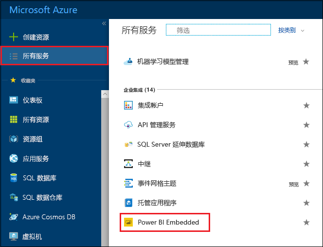
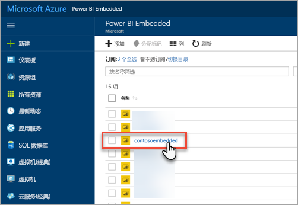
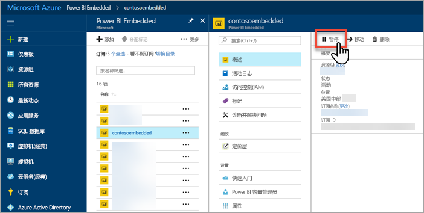
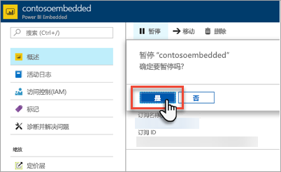
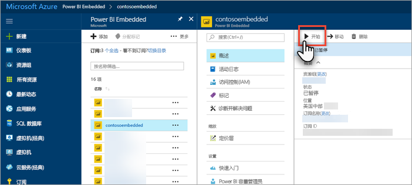
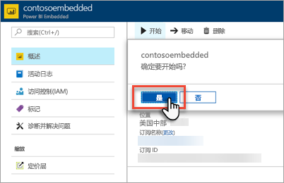

# 在 Azure 门户中暂停和启动 Power BI Embedded 容量

本文介绍如何在 Microsoft Azure 中暂停和启动 Power BI Embedded 容量。 这里假设你已创建 Power BI Embedded 容量。 如果还没有，请参阅[在 Azure 门户中创建 Power BI Embedded 容量](azure-pbie-create-capacity.md)开始创建。

如果没有 Azure 订阅，请在开始之前先创建一个[免费帐户](https://azure.microsoft.com/free/)。

## 暂停容量

暂停容量可以避免付费。 如果在某段时间内不需要使用容量，那么暂停容量是一个不错的选择。 请使用以下步骤暂停容量。

> [!NOTE]
> 暂停容量可能会导致内容在 Power BI 中不可用。 在暂停之前，请确保从容量中取消分配工作区，以防发生中断。

1. 登录到 [Azure 门户](https://portal.azure.com/)。

2. 选择“所有服务” > “Power BI Embedded”以查看容量。

    

3. 选择要暂停的容量。

    

4. 在容量详细信息中选择“暂停”  。

    

5. 选择“是”，确认要暂停容量  。

    

## 启动容量

通过启动容量来恢复使用。 启动容量也会恢复计费。

1. 登录到 [Azure 门户](https://portal.azure.com/)。

2. 选择“所有服务” > “Power BI Embedded”以查看容量。

    

3. 选择要启动的容量。

    

4. 在容量详细信息中选择“启动”  。

    

5. 选择“是”，确认要启动容量  。

    

如果为此容量分配了任何内容，则启动容量后便可使用这些内容。

## 后续步骤

如果要纵向扩展或减少容量，请参阅[缩放 Power BI Embedded 容量](azure-pbie-scale-capacity.md)。

若要开始在应用程序中嵌入 Power BI 内容，请参阅[如何嵌入 Power BI 仪表板、报表和磁贴](https://powerbi.microsoft.com/documentation/powerbi-developer-embedding-content/)。

更多问题？ [尝试咨询 Power BI 社区](https://community.powerbi.com/)