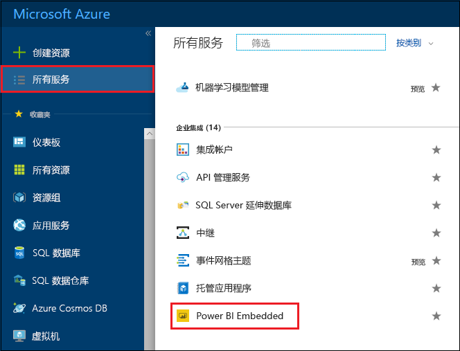
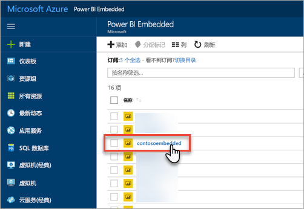
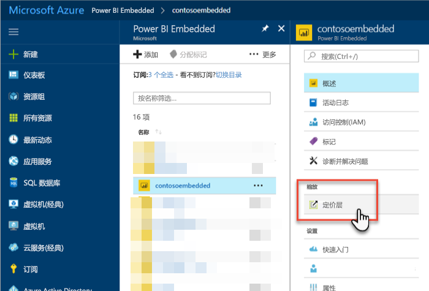
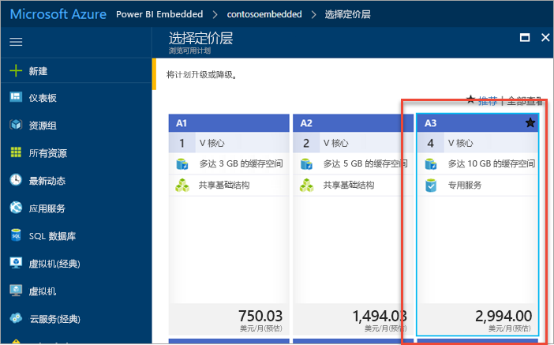
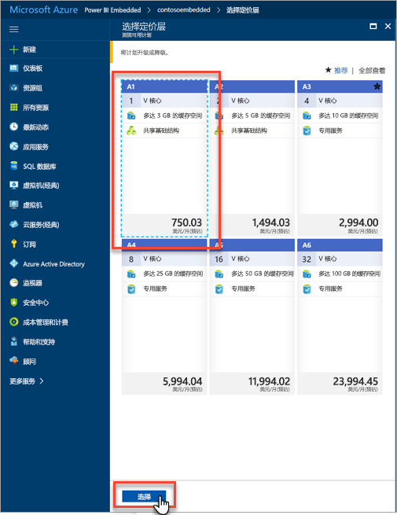
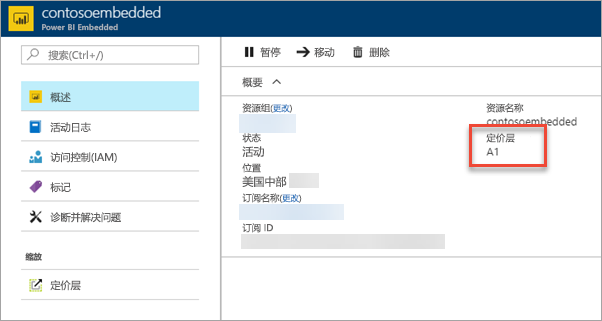

# 在 Azure 门户中缩放 Power BI Embedded 容量

本文介绍如何在 Microsoft Azure 中缩放 Power BI Embedded 容量。 缩放操作可增加或减少容量的大小。

这里假设你已创建 Power BI Embedded 容量。 如果还没有，请参阅[在 Azure 门户中创建 Power BI Embedded 容量](azure-pbie-create-capacity.md)开始创建。

> [!NOTE]
> 缩放操作可能需要大约一分钟。 在此期间，容量不可用。 可能无法加载嵌入的内容。

## 缩放容量

1. 登录到 [Azure 门户](https://portal.azure.com/)。

2. 选择“所有服务” > “Power BI Embedded”以查看容量   。

    

3. 选择要缩放的容量。

    

4. 在容量内选择“缩放”下的“定价层”   。

    

    你当前的定价层以蓝色框出。

    

5. 若要纵向扩展或减少容量，请选择要移动到的新层。 选择新层时会将所选层用蓝色虚线边框框起来。 选择“选择”以缩放到新层  。

    

    缩放容量可能需要一两分钟才能完成。

6. 通过查看概述选项卡确认你的定价层。系统会列出当前的定价层。

    

## 后续步骤

若要暂停或启动容量，请参阅[在 Azure 门户中暂停和启动 Power BI Embedded 容量](azure-pbie-pause-start.md)。

若要开始在应用程序中嵌入 Power BI 内容，请参阅[如何嵌入 Power BI 仪表板、报表和磁贴](https://powerbi.microsoft.com/documentation/powerbi-developer-embedding-content/)。

更多问题？ [尝试咨询 Power BI 社区](https://community.powerbi.com/)
