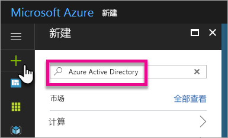
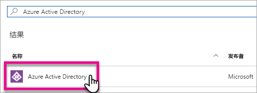
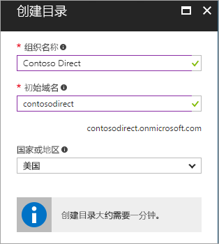
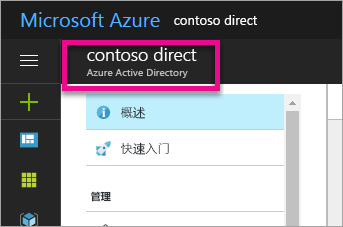
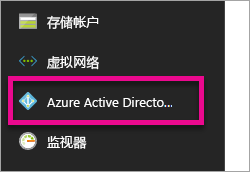
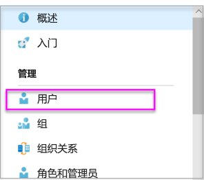
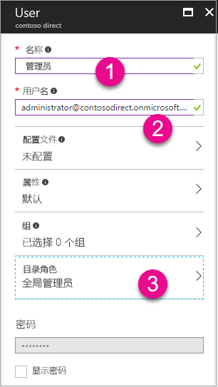
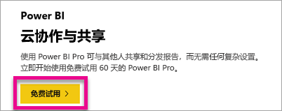

# 创建要用于 Power BI 的 Azure Active Directory 租户

了解如何为调用 [Power BI REST API](../automation/rest-api-reference.md) 的自定义应用程序创建新 Azure Active Directory (Azure AD) 租户。

租户表示 Azure Active Directory 中的组织。 它是专用的 Azure AD 服务实例，组织在注册 Azure、Microsoft Intune 或 Office 365 等 Microsoft 云服务时收到并拥有该服务实例。 各个 Azure AD 租户各不相同，相互独立。

拥有 Azure AD 租户后，可以定义应用程序并为其分配权限，以便该应用程序可以调用 [Power BI REST API](../automation/rest-api-reference.md)。

你的组织可能已拥有你可用于应用程序的 Azure AD 租户。 还可以专门为应用程序创建新租户。 本文介绍如何创建新租户。

## 创建 Azure Active Directory 租户

要将 Power BI 集成到自定义应用程序中，需要在 Azure AD 中定义应用程序，该应用程序需要 Azure AD 目录。 此目录便是租户  。 如果组织尚未拥有租户，原因是未使用 Power BI 或 Office 365，那么[需要设置开发环境](https://docs.microsoft.com/azure/active-directory/develop/active-directory-howto-tenant)。 如果不希望应用程序与组织的租户混淆，还需要创建一个租户，从而使两者保持独立。 或者，你可能只是出于测试目的创建租户。

创建新的 Azure AD 租户：

1. 浏览到 [Azure 门户](https://portal.azure.com)使用具备 Azure 订阅的帐户登录。

2. 选择“加号图标 (+)”  并搜索“Azure Active Directory”  。

    

3. 在搜索结果中选择“Azure Active Directory”  。

    

4. 选择“创建”  。

5. 提供“组织名称”和“初始域名”   。 然后选择“创建”  。 目录已创建。

    

   > [!NOTE]
   > 初始域是 onmicrosoft.com 的一部分。 以后可以添加其他域名。 可以向租户目录分配多个域。

6. 创建完目录后，选择信息框来管理新目录。

下一步，添加租户用户。

## 创建 Azure Active Directory 租户用户

已有目录，现在请创建至少两个用户。 一个是租户“全局管理员”，另一个是进行嵌入的主用户。 可以将后者视为服务帐户。

1. 在 Azure 门户中，确保位于 Azure Active Directory 浮出视窗上。

    

    如果没有位于其上，请从左侧服务导航上选择 Azure Active Directory 图标。

    

2. 在“管理”下选择“用户”   。

    

3. 选择“所有用户”  ，然后选择“+ 新建用户”  。

4. 为租户全局管理员提供“名称”和“用户名”   。把“目录角色”更改为“全局管理员”   。 还可以显示临时密码。 完成后，选择“创建”  。

    

5. 为普通租户用户执行相同的操作。 此帐户可用于主嵌入帐户。 本次将“目录角色”保留为“用户”   。 记下密码，然后选择“创建”  。

    

6. 使用在步骤 5 中创建的用户帐户注册 Power BI。 转到 [powerbi.com](https://powerbi.microsoft.com/get-started/)，然后选择“Power BI - 云协作和共享”下的“免费试用”   。

    

    注册时，系统将提示免费试用 Power BI Pro 的期限为 60 天。 可以选择成为 Pro 用户，这样可获得[开始开发嵌入式解决方案](embed-sample-for-customers.md)选项。

   > [!NOTE]
   > 请确保使用用户帐户的电子邮件地址进行注册。

## 后续步骤

现在已有 Azure AD 租户，可以使用此租户测试 Power BI 中的项。 还可以在应用程序中嵌入 Power BI 仪表板和报表。 有关详细信息，请参阅[如何嵌入 Power BI 仪表板、报表和磁贴](embed-sample-for-customers.md)。

[什么是 Azure Active directory？](https://docs.microsoft.com/azure/active-directory/active-directory-whatis) 
 
[快速入门：设置开发环境](https://docs.microsoft.com/azure/active-directory/develop/active-directory-howto-tenant)  

更多问题？ [尝试咨询 Power BI 社区](https://community.powerbi.com/)
