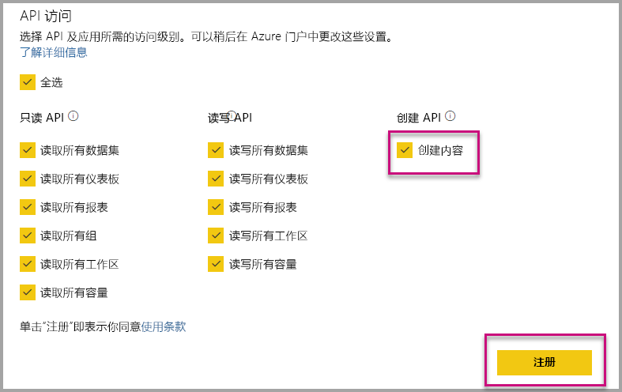

# 在为组织嵌入内容时自动安装 Power BI 应用

要嵌入应用中的内容，执行嵌入操作的用户必须有权[访问应用](../../collaborate-share/service-create-distribute-apps.md)。 如果为用户安装了应用，嵌入工作会顺利进行。 有关详细信息，请参阅[从应用嵌入报表或仪表板](./index.yml)。 可以在 PowerBI.com 中定义为所有应用均可[自动安装](https://powerbi.microsoft.com/blog/automatically-install-apps/)。 但此操作是在租户级别完成，并会应用到所有应用。

## 嵌入内容时自动安装应用

如果用户有权访问应用，但应用未安装，嵌入就会失败。 为避免这类失败，如果要从应用嵌入内容，可允许在嵌入内容时自动安装应用。 此操作意味着如果未安装用户尝试嵌入的应用，系统会自动安装该应用。 这样便会立即嵌入所需内容，从而为用户提供流畅体验。

## 为 Power BI 用户（用户拥有数据）嵌入内容

要允许自动为用户安装应用，在[注册应用程序](register-app.md#register-an-azure-ad-app)时需为应用提供“内容创建”权限或如果已注册应用，则为其添加该权限。

接下来，需要在嵌入 URL 中提供应用 ID。 要提供应用 ID，应用创建者必须先安装应用，然后使用一个受支持的 [Power BI Rest API](/rest/api/power-bi/) 调用 - [获取报表](/rest/api/power-bi/reports/getreports)或[获取仪表板](/rest/api/power-bi/dashboards/getdashboards)。 然后，应用创建者需要从 REST API 响应中获取嵌入 Url。 如果内容来自应用，则应用 ID 显示在 URL 中。  拥有嵌入 URL 后，可以用它定期嵌入内容。

## 安全嵌入内容

要自动安装应用，应用创建者须先安装应用，然后在 PowerBI.com 上转到该应用，导航到报表，并以常用方式获取链接。 所有其他有权访问该应用并可使用该链接的用户都可以嵌入报表。

## 注意事项和限制

* 只能通过此方案嵌入报表和仪表板。

* “应用拥有数据”和“SharePoint 嵌入”方案目前不支持此功能。