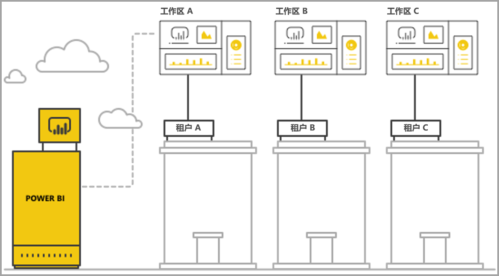
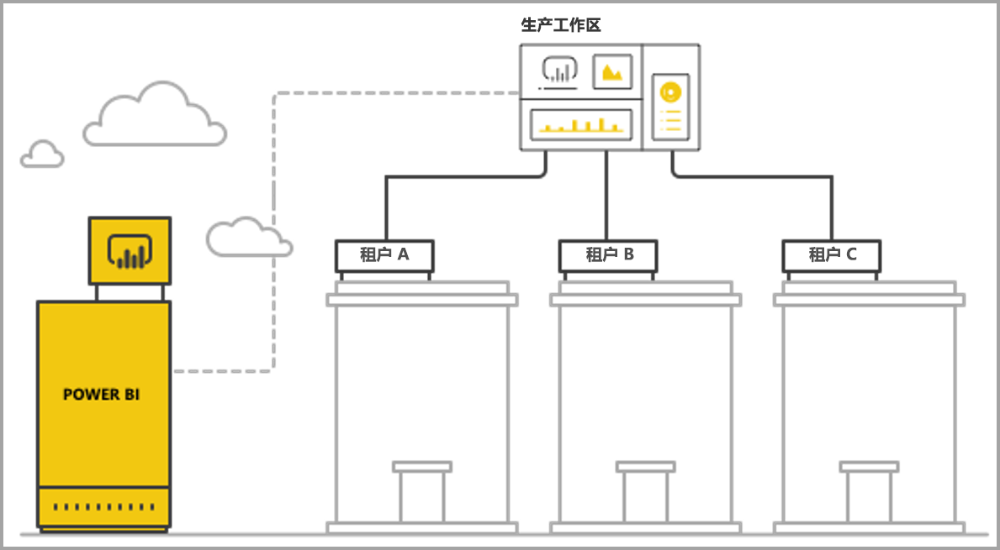

# 使用 Power BI 嵌入式分析来管理多租户

在设计多租户 SaaS 应用程序时，必须仔细选择最适合你的 SaaS 应用程序需求的租赁模型。 此过程同样适用于作为 SaaS 应用程序的嵌入式分析部分的 Power BI。 租赁模型确定如何映射和管理 Power BI 及存储帐户内每个租户的数据。 租赁模型会影响应用程序设计和管理。 稍后切换到不同模型可能会导致成本高昂且具破坏性。

使用 Power BI Embedded，有两种维护租户间分离的主要基本方法。

   1. **基于工作区的隔离** - 为每个租户创建一个独立的 Power BI 工作区。
   2. **基于行级别安全性的隔离** - 在其中使用基础数据来控制和管理对每个用户或组的数据的访问。

本文介绍了不同方法，并根据几个评估条件对其进行分析。

## 概念和术语

**[AAD](/azure/active-directory/fundamentals/active-directory-whatis)** - Azure Active Directory。

**AAD 应用程序** - AAD 中的应用程序标识。 身份验证需要 AAD 应用程序。

**SaaS 应用程序（软件即服务）** - 由企业或 ISV 实现的通常为联机服务的系统。 它还是服务多个客户租户（组织）的相关软件系统。 在本文中，SaaS 应用程序使用 Power BI Embedded 将分析内容提供给不同租户  。 Power BI Embedded 也适用于联机连接的所有类型的应用程序。

**租户** – 使用 SaaS 应用程序的单个客户（组织）以及该客户为 SaaS 应用程序带来的任何资源或数据。

**[Power BI](../../fundamentals/power-bi-overview.md)** - 作为 Power BI Embedded 平台的 Power BI 云服务。

**Power BI 租户** - 是一组与单一 AAD 租户关联的 Power BI 资源。

**[Power BI 工作区](../../collaborate-share/service-create-workspaces.md)** - Power BI 中的内容容器。

**Power BI 项目** – Power BI 工作区中有多个 Power BI 项目，例如仪表板、报表、数据集和数据流。

**[Power BI Embedded](azure-pbie-what-is-power-bi-embedded.md)** - 一组公共 API，允许开发人员构建管理 Power BI 内容和嵌入 Power BI 元素的应用程序。

**[行级别安全性 (RLS)](embedded-row-level-security.md)** - 能够控制用户对表中单行数据的访问。 可以在数据源级别或 Power BI 语义模型中实现行级别安全性。

**主用户** - 表示 Power BI 中的 SaaS 应用程序以及 SaaS 应用程序在调用 Power BI API 时使用的标识。 必须是具有 Power BI Pro 许可证的 AAD 用户。

**AAD 应用程序用户（服务主体）** - 表示 Power BI 中的 SaaS 应用程序以及 SaaS 应用程序在调用 Power BI API 时使用的标识。 必须是 AAD Web 应用程序。 可以替换主  用户以使用 Power BI 进行身份验证。

**容量** - 一组专用于运行 Power BI 服务的资源。 [Power BI Premium 容量](../../admin/service-premium-what-is.md)适用于在内部使用 Power BI 的企业公司，而 [Power BI Embedded 容量](azure-pbie-create-capacity.md)旨在让应用程序开发人员开发第三方 SaaS 应用程序。

**[Power BI Pro 许可证](../../admin/service-admin-purchasing-power-bi-pro.md)** - 基于用户的许可证，授权将内容发布到工作区，无需高级容量即可使用应用，共享仪表板并订阅仪表板及报表。

**[数据连接模式](../../connect-data/desktop-directquery-about.md)** - 将数据源连接到 Power BI，可在不同模式下完成：

   * 导入 - 这是获取数据的最常见方法。
   * DirectQuery - 直接连接到源存储库中的数据。
   * 实时连接 - 另一种直接连接到 Analysis Services 数据（Azure 和本地）的模式。

## 评估条件

SaaS 应用程序的正确租赁模型的最佳选择取决于特定业务和技术要求、数据体系结构等。 深入了解这些需求以及可用的租赁模型选项和利弊有助于为 SaaS 应用程序定义可靠、高性能、经济高效且可缩放的体系结构。

以下是在选择不同租赁模型时要考虑的一组领域。

### 数据体系结构

通常，使用 Power BI Embedded 构建应用程序的开发人员已经拥有一个或多个租户数据库。 Power BI Embedded 的租赁模型与数据库的租赁模型类似，使用该模型更方便。 如果未定义数据库租赁模型，那么在决定数据体系结构之前，可能需要考虑其他方面。

### 数据隔离

存储的数据有多敏感？ 需要在什么级别隔离不同的客户租户？ 答案可能因行业或具有特定要求的特定客户而异。

### 可伸缩性

要找到最佳解决方案，定义在可预见未来所达到的规模。 请记住，当使用率和数据增加时，现在适合的解决方案可能无法满足未来需求。 在分析可伸缩性时，请考虑以下列表：

   * 租户（客户）数。
   * 每个租户的报表、仪表板和数据集数目。
   * 每个数据集上的数据大小和刷新频率。
   * 用户数。
   * 高峰时的并发用户数。

某些 SaaS 应用程序的客户数和使用率可能很低，但数据量很大。 其他则可能有大量客户和高使用率，但每个客户只有少量的数据和报表。 在任何情况下，高数量都可能会影响未来成本和操作复杂性。

### 自动化和操作复杂性

识别需要自动化的频繁发生的过程。

   * 载入新租户的频率如何？ 需要执行哪些操作才能完全载入租户？
   * 需要部署的全新或更新的 Power BI 内容的发布节奏如何？
   * 为每个租户定义了多少个行级别的安全角色？  

确定这些过程和处理方式可以帮助你理解维护每个模型所涉及的操作复杂性。

### 数据驻留要求和支持多个地理区域的要求

Power BI Embedded 支持多地理位置部署（预览功能）。 [多地理位置](embedded-multi-geo.md)支持将 Power BI Embedded 资源部署到不同区域，并将特定内容分配到特定区域。 此功能可以在所有模型中使用，但会对要管理的内容数量和成本产生影响。 目前多地理位置功能是为满足数据驻留要求而设计的，并没有通过将让数据更接近使用者来提高性能。

### 开销

[Power BI Embedded](azure-pbie-what-is-power-bi-embedded.md) 具有基于资源的购买模型，如 Power BI Premium  。 你可以购买一个或多个具有固定计算能力和内存的容量。 使用 Power BI Embedded  时，此容量是主要成本项。 使用容量的用户数没有限制。 唯一限制是容量性能。 [Power BI Pro 许可证](../../admin/service-admin-licensing-organization.md)是需要访问 Power BI 门户的每个主  用户或特定用户所必需的。

建议通过模拟实际环境和使用情况，并在容量上运行负载测试，来测试和衡量容量上的预期负载。 可以使用 Azure 容量或[高级容量指标应用程序](../../admin/service-admin-premium-monitor-capacity.md)中可用的各种指标来衡量负载和性能。

### 内容自定义和创作

用户可以通过两种方法利用 SaaS 应用程序编辑和创建报表或将数据上传到服务中，以作为流程的一部分：

   * [在嵌入式 iFrame 中编辑/创建模式](https://github.com/Microsoft/PowerBI-JavaScript/wiki/Create-Report-in-Embed-View) - 用户可以在 SaaS 应用程序中查看报表或新的空白画布。 这样它们可以使用 Power BI 工具栏创建基于工作区中数据集的内容。 建议使用此选项，因为它是在用户所熟悉环境中的上下文中。 可以更轻松地开始使用和编辑，且用户可以创建附加到现有数据集的报表。

   * 使用 Power BI Desktop 创建内容并通过 SaaS 应用程序 UI 将其上传到工作区。 在此方法中，用户有更多工具来配合使用 Power BI Desktop。 但是不建议使用此方法，因为用户需要熟悉 SaaS 应用程序上下文之外的其他工具。 上传 PBIX 文件意味着用户会添加其他数据集，可能是工作区中已经存在的数据集副本。

## 基于 Power BI 工作区的隔离

借助基于 Power BI 工作区的隔离，SaaS 应用程序支持单个 Power BI 租户中的多个租户。 基于工作区的隔离包含不同租户使用的所有 Power BI 内容。 通过创建多个工作区，租户分离在 Power BI 工作区级别完成。 每个工作区都包含该租户相关的数据集、报表和仪表板。 此外，每个工作区仅连接到该租户的数据。 如果需要其他隔离，可以为每个工作区及其内容创建主  用户或服务主体。

### 数据体系结构

可以通过两种主要方法来管理租户的数据。

* 每个租户对应一个单独数据库
* 单个多租户数据库

如果 SaaS 应用程序存储为每个租户保留一个单独的数据库，自然选择在 Power BI 中使用单租户数据集，每个数据集的连接字符串指向匹配的数据库。

如果 SaaS 应用程序存储为所有租户使用多租户数据库，很容易通过工作区将租户分隔开来。 可以使用仅检索相关租户数据的参数化数据库查询来配置 Power BI 数据集的数据库连接。 可以使用 [Power BI Desktop](../../transform-model/desktop-query-overview.md) 或使用 [API](/rest/api/power-bi/datasets/updatedatasourcesingroup) 与查询上的[参数](/rest/api/power-bi/datasets/updateparametersingroup)更新连接。

### 数据隔离

此租赁模型中的数据都在工作区级别隔离。 工作区和租户之间的简单映射可防止一个租户中的用户看到另一个租户的内容。 使用单个主  用户要求你有权访问所有不同工作区。 显示最终用户的数据的配置是在[生成嵌入令牌](/rest/api/power-bi/embedtoken)（这是一个仅后端进程，最终用户无法看到或更改）期间定义的。

若要添加其他隔离，应用程序开发人员可以为每个工作区定义一个主  用户或应用程序，而不是有权访问多个工作区的单个主  用户或应用程序。 这样一来，可以确保任何人为错误或凭据泄漏不会导致多个客户的数据被公开。

### 可伸缩性

此模型的一个优点是，将数据划分到每个租户的多个数据集中可以克服[单个数据集的大小限制](../../admin/service-premium-what-is.md)（当前容量为 10 GB）。 容量过载时，可以收回未使用的数据集，为活动数据集释放内存。 此任务不适用于单个大型数据集。 如果需要，还可以使用多个数据集将租户划分为多个 Power BI 容量。

尽管有这些优势，还必须考虑 SaaS 应用程序在未来可能达到的规模。 例如，用户可能会在可管理项目的数量上遇到限制。 请参阅本文后续部分中的部署[限制](#summary-comparison-of-the-different-approaches)，获取详细信息。 SKU 使用的容量限制了数据集需要满足的内存大小、可以同时运行的刷新数以及数据刷新的最大频率。 建议在管理数百或数千个数据集时进行测试。 此外建议考虑平均使用量和峰值使用量，以及与其他租户管理方式不同的具有大型数据集或不同使用模式的任何特定租户。

### 自动化和操作复杂性

使用基于 Power BI 工作区的隔离，应用程序开发人员可能需要管理数百或数千个项目。 务必要定义在应用程序生命周期管理中经常发生的流程，并确保你有正确的工具集来在此租赁模型中大规模执行这些操作。 某些操作示例包括：

   * 添加新租户（客户）
   * 为部分或所有租户更新报表或仪表板
   * 为部分或所有租户更新数据集架构
   * 针对特定租户的未计划自定义
   * 数据集刷新频率

例如，为新租户中创建工作区是一项常见任务，需要实现自动化。 使用 [Power BI REST API](/rest/api/power-bi/)，可以[在创建工作区时实现完全自动化](https://powerbi.microsoft.com/blog/duplicate-workspaces-using-the-power-bi-rest-apis-a-step-by-step-tutorial/)。

### 多地理位置需要

多地理位置涉及所需区域的购买容量及为该容量分配工作区。 如果需要在不同区域中支持不同租户，则需要将租户工作区分配给所需区域中的容量。 这是一项简单操作，其成本并不比将所有工作区置于同一容量要高。 但是，如果租户需要数据驻留在多个区域，则工作区中的所有项目都需要在每个区域容量中复制，从而增加了成本和管理的复杂性。

### 开销

使用 Power BI Embedded 的应用程序开发人员需要[购买 Power BI Embedded 容量才能投入生产](move-to-production.md)。  请务必了解基于工作区的隔离模型的影响及其对容量的影响。

基于工作区的隔离模型适用于容量，原因如下：

   * 可以独立分配给容量的最小对象是工作区，也就是说，你不能分配报表等，因此通过按工作区分隔租户，可以在管理每个租户及其性能需求，以及通过扩展/缩减来优化容量利用率方面获得充分灵活性。 例如，大容量和高波动性的大型基本租户可以在单独容量中管理，以确保一致服务水平，同时将较小租户分组到另一个容量中以优化成本。

   * 分隔工作区还意味着在租户之间分隔数据集，以便数据模型可以位于较小区块中，而不是在单个大型数据集中。 此任务使容量能够更好地管理内存使用，在不需要时删除小的和未使用的数据集，同时保证用户对性能满意。

应用程序开发人员需要考虑并行刷新的数量限制，因为当有多个数据集时，刷新进程可能需要额外的容量。

### 内容自定义和创作

对于内容创建的主要用例，应用程序开发人员需要仔细考虑哪些租户可具有编辑功能，以及每个租户中有多少用户可以编辑。 允许每个租户中的多个用户进行编辑可能会导致生成许多内容，从而达到数据集限制，例如每个数据集的报表数，或工作区中的数据集数。 如果向用户提供此功能，建议密切监视内容生成并根据需要进行扩展。 出于相同原因，不建议将此功能用于内容个性化，那样每个用户都可以对报表稍作更改并将其保存为自己的报表。 如果 SaaS 应用程序允许内容个性化，可以考虑为特定于用户的内容引入和传达工作区保留策略，以便在最终用户搬到新位置、离开公司或不再使用该平台时方便删除内容。

## 基于行级别安全性的隔离

借助基于行级别安全性的隔离，SaaS 应用程序可以使用单个工作区来承载多个租户。 这意味着每个 Power BI 项目报表、仪表板和数据集都在所有租户使用过之后创建的。 租户之间的数据分离是在多租户数据集中使用[行级别安全性](embedded-row-level-security.md)实现的。 当最终用户登录 SaaS 应用程序并打开内容时，将为该用户会话生成一个嵌入令牌，其中的角色和筛选器将确保用户只看到允许他们看到的数据。 如果不允许来自同一租户的用户查看相同数据，应用程序开发人员需要在租户之间和同一租户内部实现分层角色。

### 数据体系结构

当所有租户的数据均存储在单个数据仓库中，实现基于行级别安全性的隔离是最合适的。 在这种情况下，应用程序开发人员只能通过直接查询或数据导入将相关数据从数据仓库传递到 Power BI 数据集。 如果数据库中的数据是按每个租户分离的，则需要将其合并到单个数据集，这将降低数据库中存在的租户之间的分离程度。

### 数据隔离

对于基于行级别安全性的隔离，数据分离是使用数据集上的[行级别安全性定义](embedded-row-level-security.md)实现的，这意味着所有数据都是共存的。 这种形式的数据分离更容易受到开发人员错误导致的数据泄漏的影响。 即使行级别的安全性是在后端完成的，并且从最终用户那里得到了保护，如果数据高度敏感，或者客户要求进行数据分离，则最好使用基于工作区的隔离。

### 可伸缩性

使用基于行级别安全性的隔离，数据需要符合数据集的大小限制（当前为 10 GB）。 随着[增量刷新](../../admin/service-premium-incremental-refresh.md)的引入和即将发布的 Power BI 数据集的 XMLA 终结点，预计数据集大小限制将显著增加。 但是，数据仍然需要适合容量内存，有足够的剩余内存来运行数据刷新。 大规模部署需要大容量，以避免用户由于内存超过当前容量的限制而遇到问题。 大规模处理的其他方法包括使用[聚合](../../transform-model/desktop-aggregations.md)或直接使用 DirectQuery 或实时连接连接到数据源，而不是在 Power BI 容量中缓存所有数据。

### 自动化和操作复杂性

与基于工作区的隔离相比，使用基于行级别安全性的隔离来管理项目要好得多，因为对于每个环境（开发/测试/生产），项目只有一个版本，而不是每个租户一个版本。 对于大型规模，管理项目意味着管理和更新数十个项目，而不是数千到数万个。

Power BI 还没有修改或创建 RLS 角色和规则的 API。 只能在 Power BI Desktop 中手动添加或更改角色。 如果需要应用 RLS 层次结构，需仔细计划，否则可能会非常复杂，且管理容易出错。

如果应用程序开发人员需要管理许多需要频繁创建或更新的角色和角色定义，从可管理性角度来看，基于行级别安全性的隔离是不可缩放的。

另一个操作复杂性是需要密切监视内存使用情况，并构建可靠的警报和缩放机制，以确保用户获得流畅体验。  

### 多地理位置需要

由于所有数据都存储在单个数据集中，因此很难满足数据驻留要求，即需要将某些数据绑定到特定位置。 它还会显著增加使用多个区域的成本，因为所有数据都被复制并存储在每个区域中。 如果只有有限数量的租户需要不同地理位置，可以使用上述基于工作区的隔离模型，只将这些租户的数据保存在不同区域。

### 开销

基于行级别安全性的隔离的主要成本来自数据集的内存占用。 需要足够的容量来存储数据集，并为内存需求中的任何峰值保留一些额外的内存缓冲区。 缓解此情况的一种方法是将数据存储在 SQL Server 数据库或 SQL Server Analysis Services 多维数据集中，并使用直接查询或实时连接从数据源实时检索数据。 这种方法增加了数据源的成本，但由于内存需求减少了对大容量的需求，从而降低了 Power BI 容量的成本。

### 内容自定义和创作

当最终用户编辑或创建报表时，他们可以使用生产多租户数据集。 为此，建议只使用嵌入式 iFrame 选项来编辑或[创建报表](https://github.com/Microsoft/PowerBI-JavaScript/wiki/Create-Report-in-Embed-View)，因为它依赖于相同的数据集，并应用行级别安全性。 让用户上传带有附加数据集的 PBIX 文件可能成本高昂，而且很难在基于行安全性的隔离中管理。 此外，当用户在同一个工作区中生成新内容时，需确保生产工作区不会达到其限制，并生成可靠的机制来区分哪些内容连接到哪个租户。

## 不同方法的总结比较

> [!Important]
> 以下分析基于产品的当前状态。 随着每月新功能的发布，我们将继续提供新功能和特性来解决现有限制和缺点。 请务必查看我们的每月博客文章了解新增功能，然后回到本文查看新功能如何影响租赁模型建议。

| 评估条件 | 基于工作区   | 基于行级别安全性  |
|---------------------|-------------------|---------------------------|
| 数据体系结构  | 每个租户对应一个单独数据库时最简单  | 所有租户的所有数据都在单个数据仓库中时最简单   |
| 数据隔离  | 良好。 每个租户都有一个专用数据集。  | 适中。 所有数据都在同一个共享数据集但通过访问控制托管。  |
| 可伸缩性  | 中等。 将数据分解为多个数据集可实现优化。  | 最低。 受数据集限制。  |
| 多地理位置需要  | 非常适合大多数租户仅在一个区域的情况。  | 不建议。 需要将整个数据集存储在多个区域中。  |
| 自动化和操作复杂性  | 为单个租户提供良好的自动化功能。   大规模管理多个项目时非常复杂。  | 可轻松管理 Power BI 项目，但大规模管理 RLS 时非常复杂。  |
| 开销  | 中低。 可以优化利用率以降低每个租户的成本。  需要频繁刷新时可能会增加。  | 如果使用导入模式会产生中高成本。  如果使用直接查询模式会产生中低成本。  |
| 内容自定义和创作  | 合适的选择。 可能会达到大规模限制。  | 只在嵌入式 iFrame 中生成内容  |

## 部署注意事项和限制

Power BI 项目限制： 

* 单个用户/应用程序可以是成员/管理员的工作区 V1（组）的数量是 250。
* 单个用户/应用程序可以是成员/管理员的工作区 V2（文件夹）的数量是 1000。
* 单个工作区中的数据集数量为 1000。
* 连接到单个数据集的报表/仪表板数为 1000。
* 上传 .pbix 文件的数据集内存大小限制为 10 GB  。

Power BI 容量注意事项和限制： 

* 每个容量只能根据[购买的 SKU](../../admin/service-premium-what-is.md) 使用其已分配的内存和 V 核心。
* 有关每个 SKU 建议的数据集大小，请参考[高级大型数据集](../../admin/service-premium-what-is.md#large-datasets)。
* 容量的最大数据集大小为 10 GB。
* 一天中导入模式  数据集的计划刷新数是 48。
* 导入模式  数据集的计划刷新的间隔时间是 30 分钟。
* 有关可以在一个容量上同时运行的刷新数目，请参考[资源管理和优化](../../admin/service-premium-what-is.md#capacity-nodes)。
* 缩放容量的平均时间为 1 到 2 分钟。 在此期间，容量不可用。 建议使用扩展方法[避免停机时间](https://powerbi.microsoft.com/blog/power-bi-developer-community-november-update-2018/#scale-script)。

## 后续步骤

* [Power BI 嵌入式分析](embedding.md)
* [Power BI Embedded](azure-pbie-what-is-power-bi-embedded.md)
* [Power BI Premium](../../admin/service-premium-what-is.md)
* [行级别安全性](embedded-row-level-security.md)