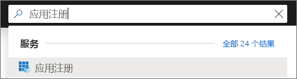
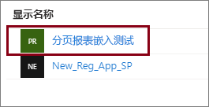
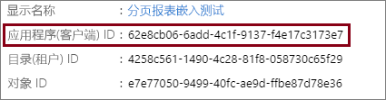
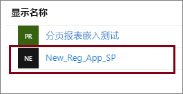

# <a name="tutorial-embed-power-bi-paginated-reports-into-an-application-for-your-customers-preview"></a>教程：在应用程序中为客户嵌入 Power BI 分页报表（预览版）

借助 **Azure 中的 Power BI Embedded** 或 **Office 中的 Power BI 嵌入**，可使用“应用拥有数据”将分页报表嵌入应用程序中。 **应用拥有数据**是指将使用 Power BI 的应用程序作为其嵌入式分析平台。 作为 **ISV** 或**开发者**，你可创建在完全集成并交互的应用程序中显示分页报表的 Power BI 内容，而无需用户拥有 Power BI 许可证。 本教程演示如何使用 Power BI .NET SDK 以及 Power BI JavaScript API 将分页报表集成到应用程序中。


在本教程中，了解如何：
> [!div class="checklist"]
> * 在 Azure 中注册应用程序。
> * 将 Power BI 分页报表嵌入到应用程序中。

## <a name="prerequisites"></a>先决条件

若要开始使用，则需要具有：

* [服务主体（仅限应用的令牌）](embed-service-principal.md)
* [Microsoft Azure](https://azure.microsoft.com/) 订阅
* 自己的 [Azure Active Directory 租户](create-an-azure-active-directory-tenant.md)设置
* [容量](#create-a-dedicated-capacity)至少为 A4 或 P1，并已启用[分页报表](../../service-admin-premium-workloads.md#paginated-reports)工作负荷

如果没有 Azure 订阅，请在开始之前先创建一个[免费帐户](https://azure.microsoft.com/free/?WT.mc_id=A261C142F)。

> [!IMPORTANT]
> * 必须使用“服务主体”  。 主用户不受支持。
> * 不支持需要单点登录 (SSO) 的数据源。
> * Power BI 数据集不支持作为[数据源](../../service-get-data.md)。

## <a name="set-up-your-power-bi-environment"></a>设置 Power BI 环境

嵌入分页报表需要将工作区分配给专用容量，并将报表上传到工作区。

### <a name="create-an-app-workspace"></a>创建应用工作区

由于使用[服务主体](embed-service-principal.md)登录应用程序，需要使用[新工作区](../../service-create-the-new-workspaces.md)。 作为*服务主体*，你还必须是应用程序所涉及的应用工作区的管理员或成员。

### <a name="create-a-dedicated-capacity"></a>创建专用容量

在将分页报表导入或上传到嵌入之前，至少必须为包含该报表的工作区分配 A4 或 P1 容量。 有两种类型的容量可供选择：
* **Power BI Premium**：对于嵌入分页报表，需要 *P* SKU 容量。 嵌入 Power BI 内容时，此解决方案称为 *Power BI 嵌入*。 有关此订阅的详细信息，请参阅[什么是 Power BI Premium？](../../service-premium-what-is.md)
* **Azure Power BI Embedded**：可从 [Microsoft Azure 门户](https://portal.azure.com)购买专用容量。 此订阅使用 *A* SKU。 对于嵌入分页报表，至少需要 *A4* 订阅。 有关如何创建 Power BI Embedded 容量的详细信息，请参阅[在 Azure 门户中创建 Power BI Embedded 容量](azure-pbie-create-capacity.md)。

下表介绍每个 SKU 的资源和限制。 若要确定最能满足你需求的容量，请参阅[应该为我的方案购买哪一个 SKU](https://docs.microsoft.com/power-bi/developer/embedded-faq#which-solution-should-i-choose) 表。

| 容量节点 | 总虚拟核心 | 后端 V 核心 | RAM (GB) | 前端 V 核心 | 
| --- | --- | --- | --- | --- |
| P1/A4 | 8 | 4 | 25 | 4 |
| P2/A5 | 16 | 8 | 50 | 8 |
| P3/A6 | 32 | 16 | 100 | 16 |
| | | | | |

### <a name="assign-an-app-workspace-to-a-dedicated-capacity"></a>为应用工作区分配专用容量

创建专用容量后，可将该专用容量分配给应用工作区。

若要使用[服务主体](embed-service-principal.md)将专用容量分配给工作区，请使用 [Power BI REST API](https://docs.microsoft.com/rest/api/power-bi/capacities/groups_assigntocapacity)。 使用 Power BI REST API 时，请务必使用[服务主体对象 ID](embed-service-principal.md#how-to-get-the-service-principal-object-id)。

### <a name="create-and-upload-your-paginated-reports"></a>创建并上传分页报表

可使用 [Power BI 报表生成器](../../paginated-reports/paginated-reports-report-builder-power-bi.md#create-reports-in-power-bi-report-builder)创建分页报表，然后[将报表上传到服务](../../paginated-reports/paginated-reports-quickstart-aw.md#upload-the-report-to-the-service)。

可使用 [Power BI REST API](https://docs.microsoft.com/rest/api/power-bi/imports/postimportingroup) 将分页报表导入新工作区。

## <a name="embed-content-using-the-sample-application"></a>使用示例应用程序嵌入内容

为了便于演示，故意采用简单的示例。 应该由你或开发者保护应用程序机密。

请按照以下步骤，使用示例应用程序开始嵌入内容。

1. 下载 [Visual Studio](https://www.visualstudio.com/)（2013 版或更高版本）。 请务必下载最新版 [NuGet 包](https://www.nuget.org/profiles/powerbi)。

2. 从 GitHub 下载[应用拥有数据示例](https://github.com/Microsoft/PowerBI-Developer-Samples)。

    

3. 在示例应用程序中打开 Web.config 文件  。 必须填写以下字段，才能运行应用程序。 为“AuthenticationType”选择“ServicePrincipal”   。

    填写以下字段：
    * [applicationId](#application-id)
    * [workspaceId](#workspace-id)
    * [reportId](#report-id)
    * [applicationsecret](#application-secret)
    * [tenant](#tenant)

    > [!Note]
    > 本示例中的默认 AuthenticationType 是 MasterUser  。 请确保将其更改为“ServicePrincipal”  。 


    

### <a name="application-id"></a>应用程序 ID

将 Azure  中的“应用 ID”  填入“applicationId”  字段。 应用使用“applicationId”  对你向其请求获取权限的用户标识自身。

若要获取“applicationId”  ，请按以下步骤操作：

1. 登录到 [Azure 门户](https://portal.azure.com)。

2. 在左侧导航窗格中，选择“所有服务”，并搜索“应用注册”   。

    

3. 选择需要 applicationId 的应用程序  。

    

4. 存在列为 GUID 的“应用程序 ID”  。 使用此“应用 ID”  作为应用的“applicationId”  。

    

### <a name="workspace-id"></a>工作区 ID

使用 Power BI 中的“应用工作区(组) GUID”填写“workspaceId”信息  。 若要获取此信息，可以在登录 Power BI 服务时使用 URL，也可以使用 PowerShell。

URL <br>


PowerShell <br>

```powershell
Get-PowerBIworkspace -name "Paginated Report Embed"
```

   

### <a name="report-id"></a>报表 ID

使用 Power BI 中的“报表 GUID”填写“reportId”信息  。 若要获取此信息，可以在登录 Power BI 服务时使用 URL，也可以使用 PowerShell。

URL<br>


PowerShell <br>

```powershell
Get-PowerBIworkspace -name "Paginated Report Embed" | Get-PowerBIReport
```


### <a name="application-secret"></a>应用程序密码

将 Azure  的“应用注册”  部分中的“密钥”  部分信息填入“ApplicationSecret”  字段。

若要获取“ApplicationSecret”  ，请按以下步骤操作：

1. 登录 [Azure 门户](https://portal.azure.com)。

2. 在左侧导航窗格中，选择“所有服务”，并搜索“应用注册”   。

    

3. 选择需要使用“ApplicationSecret”  的应用。

    

4. 在“管理”下选择“证书和密码”   。

5. 选择“新的客户端密码”  。

6. 在“说明”框中输入一个名称并选择持续时间。  然后选择“保存”为应用程序获取“值”。   如果在保存密钥值后关闭“密钥”窗格，  值字段会仅显示为隐藏状态。 此时，你无法检索密钥值。 如果忘记了密钥值，请在 Azure 门户中新建密钥值。

    

### <a name="tenant"></a>租户

使用 Azure 租户 ID 填写“租户”信息  。 若要获取此信息，可以在登录 Power BI 服务时使用 [Azure AD 管理中心](/onedrive/find-your-office-365-tenant-id)，也可以使用 PowerShell。

### <a name="run-the-application"></a>运行应用程序

1. 在“Visual Studio”  中选择“运行”  。

    

2. 然后，选择“嵌入报表”  。

    

3. 现在，可以在示例应用程序查看报表。

    

## <a name="embed-power-bi-paginated-reports-within-your-application"></a>在应用程序中嵌入 Power BI 分页报表

即使已使用 [Power BI REST API](https://docs.microsoft.com/rest/api/power-bi/) 完成嵌入 Power BI 分页报表的步骤，也可使用 **.NET SDK** 编写本文中所述的示例代码。

在应用程序中为客户嵌入 Power BI 分页报表时，需要具有 Azure AD [服务主体](embed-service-principal.md)，并获取 Power BI 应用程序的 [Azure AD 访问令牌](get-azuread-access-token.md#access-token-for-non-power-bi-users-app-owns-data)，然后才能调用 [Power BI REST API](https://docs.microsoft.com/rest/api/power-bi/)  。

若要使用**访问令牌**创建 Power BI 客户端，可创建便于与 [Power BI REST API](https://docs.microsoft.com/rest/api/power-bi/) 进行交互的 Power BI 客户端对象。 使用 Microsoft.Rest.TokenCredentials   对象包装 AccessToken，以创建 Power BI 客户端对象。

```csharp
using Microsoft.IdentityModel.Clients.ActiveDirectory;
using Microsoft.Rest;
using Microsoft.PowerBI.Api.V2;

var tokenCredentials = new TokenCredentials(authenticationResult.AccessToken, "Bearer");

// Create a Power BI Client object. it's used to call Power BI APIs.
using (var client = new PowerBIClient(new Uri(ApiUrl), tokenCredentials))
{
    // Your code to embed items.
}
```

### <a name="get-the-paginated-report-you-want-to-embed"></a>获取想要嵌入的分页报表

可使用 Power BI 客户端对象检索对要嵌入的项的引用。

下面的代码示例展示了如何从给定工作区检索首个报表。

[示例应用程序](https://github.com/Microsoft/PowerBI-Developer-Samples)的 Services\EmbedService.cs 文件中提供了获取内容项的示例，内容项包括报表、仪表板和希望嵌入的磁贴。 

```csharp
using Microsoft.PowerBI.Api.V2;
using Microsoft.PowerBI.Api.V2.Models;

// You need to provide the workspaceId where the dashboard resides.
ODataResponseListReport reports = await client.Reports.GetReportsInGroupAsync(workspaceId);

// Get the first report in the group.
Report report = reports.Value.FirstOrDefault();
```

### <a name="create-the-embed-token"></a>创建嵌入令牌

生成嵌入令牌，此令牌可通过 JavaScript API 进行使用。 若要创建嵌入令牌用于嵌入 Power BI 分页报表，请使用 [Reports GenerateTokenForCreateInGroup](https://docs.microsoft.com/rest/api/power-bi/embedtoken/reports_generatetokenforcreateingroup) API。

[示例应用程序](https://github.com/Microsoft/PowerBI-Developer-Samples)的  *Services\EmbedService.cs* 文件中提供创建嵌入令牌的示例。

```csharp
using Microsoft.PowerBI.Api.V2;
using Microsoft.PowerBI.Api.V2.Models;

// Generate Embed Token.
var generateTokenRequestParameters = new GenerateTokenRequest(accessLevel: "view");
EmbedToken tokenResponse = client.Reports.GenerateTokenInGroup(workspaceId, report.Id, generateTokenRequestParameters);

// Generate Embed Configuration.
var embedConfig = new EmbedConfig()
{
    EmbedToken = tokenResponse,
    EmbedUrl = report.EmbedUrl,
    Id = report.Id
};
```

### <a name="load-an-item-using-javascript"></a>使用 JavaScript 加载项

可使用 JavaScript 将分页报表加载到网页上的 div 元素中。

有关使用 JavaScript API 的完整示例，可以使用[演练工具](https://microsoft.github.io/PowerBI-JavaScript/demo)。 操场工具是演练不同类型的 Power BI Embedded 示例的快速方法。 还可以通过访问 [PowerBI JavaScript wiki](https://github.com/Microsoft/powerbi-javascript/wiki) 页，获取有关 JavaScript API 的详细信息。

## <a name="next-steps"></a>后续步骤

本教程介绍了如何在应用程序中为客户嵌入 Power BI 分页报表。 你也可以尝试为客户或组织嵌入 Power BI 内容。

> [!div class="nextstepaction"]
>[为客户嵌入内容](embed-sample-for-customers.md)

> [!div class="nextstepaction"]
>[为组织嵌入内容](embed-sample-for-your-organization.md)

更多问题？ [尝试咨询 Power BI 社区](https://community.powerbi.com/)
