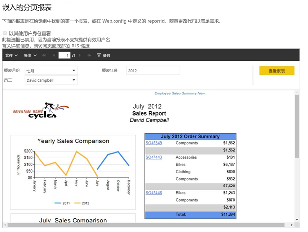
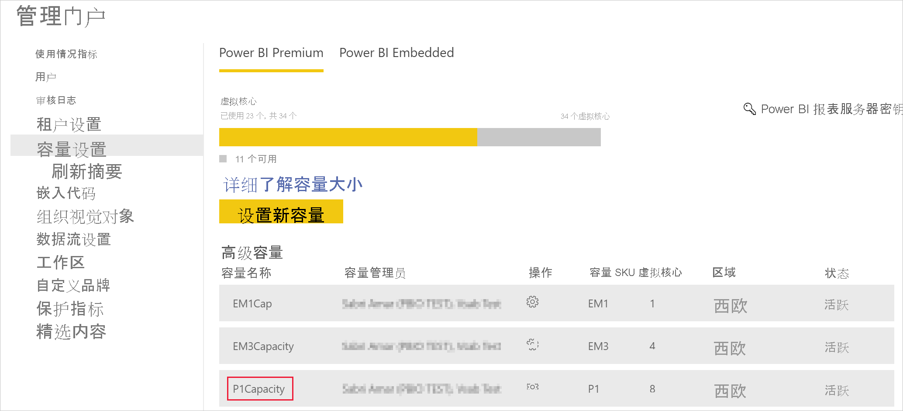
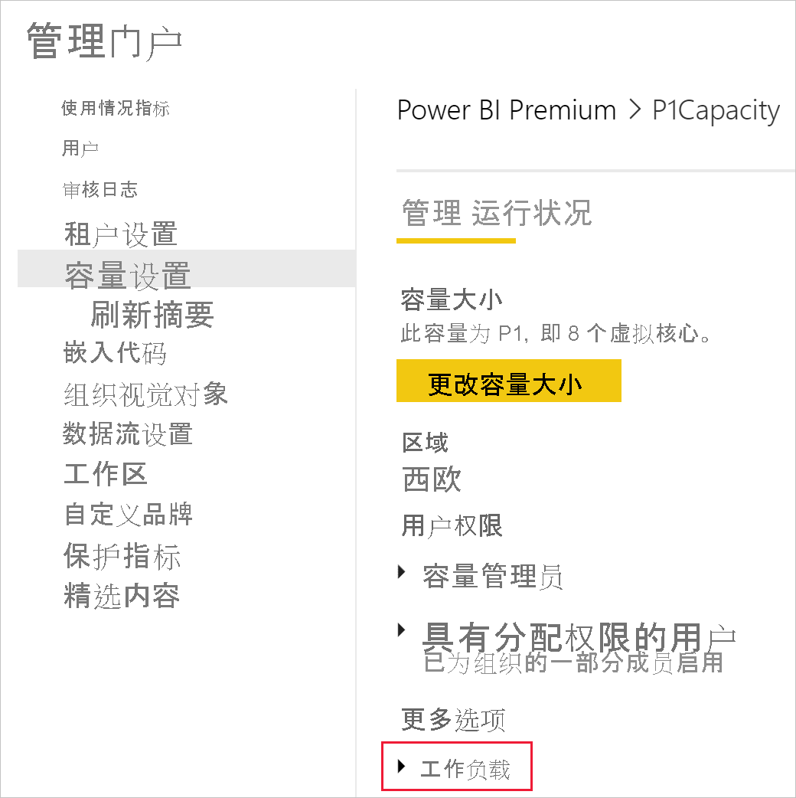
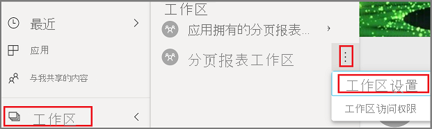
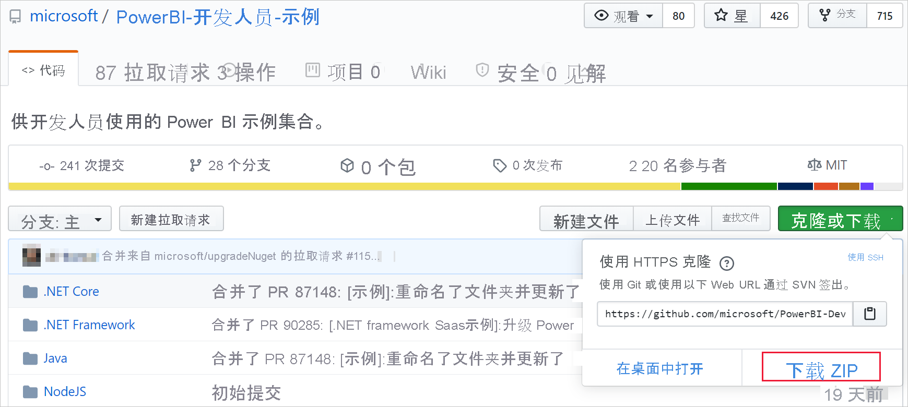
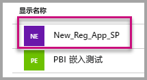
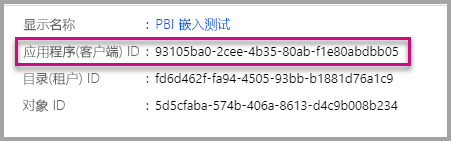
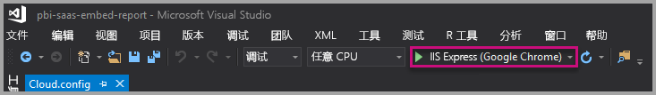

# <a name="tutorial-embed-power-bi-paginated-reports-into-an-application-for-your-organization"></a>教程：在应用程序中为组织嵌入 Power BI 分页报表

在 Power BI 中，可以使用“用户拥有数据”方案将分页报表嵌入到组织的应用程序中。

分页报表是设计用于高质量打印的报表。 通常，这些报表包含大量数据，以适合打印页面的方式呈现。
要了解 Power BI 如何支持分页报表，请参阅 [Power BI Premium 中的分页报表是什么？](../../paginated-reports/paginated-reports-report-builder-power-bi.md)

借助“用户拥有数据”，应用程序可以扩展 Power BI 服务以使用嵌入式分析。 本教程演示了如何将分页报表集成到应用程序。

通过将 Power BI.NET SDK 和 Power BI JavaScript API 结合使用，可为组织将 Power BI 嵌入应用程序。



在本教程中，将学习以下任务：
> [!div class="checklist"]
> * 在 Azure 中注册应用程序。
> * 使用 Power BI 租户将 Power BI 分页报表嵌入应用程序中。

## <a name="prerequisites"></a>先决条件
若要开始使用，则需要具有：

* [Power BI Pro 帐户](../../admin/service-admin-purchasing-power-bi-pro.md)。

* 需要设置自己的 [Azure Active Directory 租户](create-an-azure-active-directory-tenant.md)。

* 至少为 P1 容量。 请参阅[用于分页报表的高级容量的大小是多少？](../../paginated-reports/paginated-reports-faq.md#what-size-premium-capacity-do-i-need-for-paginated-reports)

如果未注册 Power BI Pro，请在开始之前[注册以获得免费试用](https://powerbi.microsoft.com/pricing/)。

## <a name="set-up-your-power-bi-environment"></a>设置 Power BI 环境

按照此部分中的说明设置用于嵌入分页报表的 Power BI。

### <a name="register-a-server-side-web-application-app"></a>注册服务器端 Web 应用

按照[注册 Azure AD 应用程序以使用 Power BI](register-app.md) 中的说明来注册服务器端 Web 应用程序应用。

>[!NOTE]
>注册应用时，请确保执行以下操作：
>* 获取应用程序密码
>* 将 Report.ReadAll 权限（范围）应用到应用。

### <a name="create-a-capacity"></a>创建容量

通过创建容量，可以获得在应用工作区中拥有内容资源这一优势。 对于分页报表，必须为应用工作区准备至少 P1 容量。 可以使用 [Power BI Premium](../../admin/service-premium-what-is.md) 创建容量。

下表列出了可用于为 [Microsoft Office 365](../../admin/service-admin-premium-purchase.md) 中的分页报表创建容量的 Power BI Premium SKU：

| 容量节点 | vCore 总数<br/>（后端 + 前端） | 后端 vCore | 前端 vCore | DirectQuery/实时连接限制 |
| --- | --- | --- | --- | --- | --- |
| P1 |8 个 vCore |4 个 vCore，25 GB RAM |4 个 vCore |每秒 30 个 |
| P2 |16 个 vCore |8 个 vCore，50 GB RAM |8 个 vCore |每秒 60 个 |
| P3 |32 个 vCore |16 个 vCore，100 GB RAM |16 个 vCore |每秒 120 个 |
| P4 |64 个 vCore |32 个 vCore，200 GB RAM |32 个 vCore |每秒 240 个 |
| P5 |128 个 vCore |64 vCore，400 GB RAM |64 个 vCore |每秒 480 个 |
|||||

### <a name="enable-paginated-reports-workload"></a>启用分页报表工作负荷

需要在容量上启用分页报表工作负载。

1. 登录到[“Power BI”>“管理门户”>“容量设置”](https://app.powerbi.com/admin-portal/capacities)。

2. 选择要将分页报表上传到其中的工作区的容量。

    

3. 展开“工作负荷”。

    

4. 激活分页报表工作负荷。

    

### <a name="assign-an-app-workspace-to-a-capacity"></a>将应用工作区分配到容量

创建容量后，可将应用工作区分配给该容量。 若要完成此过程，请按照下列步骤执行：

1. 在“Power BI 服务”中，展开工作区并选择用于嵌入内容的工作区的“更多”。 然后选择“工作区设置”。

    

2. 选择“高级”，并启用“容量”。 选择你创建的容量。 然后，选择“保存”。

    

3. 选择“保存”后，应用工作区名称旁边应显示一个钻石形状。

    

### <a name="create-and-publish-your-power-bi-paginated-reports"></a>创建并发布 Power BI 分页报表

可使用 [Power BI Report Builder](../../paginated-reports/paginated-reports-report-builder-power-bi.md#create-reports-in-power-bi-report-builder) 创建分页报表。 然后可以将[报表上传](../../paginated-reports/paginated-reports-quickstart-aw.md#upload-the-report-to-the-service)到分配有至少 P1 容量的应用工作区，并启用[分页报表工作负荷](#enable-paginated-reports-workload)。 上传报表的最终用户需要具有 Power BI Pro 许可证才能发布到应用工作区。
   
## <a name="embed-your-content-by-using-the-sample-application"></a>使用示例应用程序嵌入内容

为了便于演示，故意采用简单的示例。

请按照以下步骤，使用示例应用程序开始嵌入内容。

1. 下载 [Visual Studio](https://www.visualstudio.com/)（2013 版或更高版本）。 请务必下载最新版 [NuGet 包](https://www.nuget.org/profiles/powerbi)。

2. 下载 [PowerBI-开发人员-示例](https://github.com/Microsoft/PowerBI-Developer-Samples)，并依次打开“.NET Framework”>“为组织嵌入”>“集成-Web-应用”>“PBIWebApp”。

    

3. 打开示例应用程序中的“Cloud.config”文件，并填写以下字段以运行应用程序：
    * [应用程序 ID](#application-id)
    * [工作区 ID](#workspace-id)
    * [报表 ID](#report-id)
    * [AADAuthorityUrl](#aadauthorityurl)

    

### <a name="application-id"></a>应用程序 ID

将 Azure 中的“应用 ID”填入“applicationId”字段。 应用使用“applicationId”对你向其请求获取权限的用户标识自身。

若要获取“applicationId”，请按以下步骤操作：

1. 登录到 [Azure 门户](https://portal.azure.com)。

2. 在左侧导航窗格中，依次选择“所有服务”和“应用注册”。

3. 选择需要 applicationId 的应用程序。

    

4. 存在列为 GUID 的“应用程序 ID”。 使用此“应用 ID”作为应用的“applicationId”。

    

### <a name="workspace-id"></a>工作区 ID

使用 Power BI 中的“应用工作区(组) GUID”填写“workspaceId”信息。 若要获取此信息，可以在登录 Power BI 服务时使用 URL，也可以使用 PowerShell。

URL <br>


PowerShell <br>

```powershell
Get-PowerBIworkspace -name "User Owns Embed Test"
```

   

### <a name="report-id"></a>报表 ID

使用 Power BI 中的“报表 GUID”填写“reportId”信息。 若要获取此信息，可以在登录 Power BI 服务时使用 URL，也可以使用 PowerShell。


PowerShell <br>

```powershell
Get-PowerBIworkspace -name "User Owns Embed Test" | Get-PowerBIReport -Name "Sales Paginated Report"
```


### <a name="aadauthorityurl"></a>AADAuthorityUrl

填入允许你在组织租户内或通过来宾用户嵌入内容的 URL 的 AADAuthorityUrl 信息。

如果通过组织租户嵌入，使用 URL： https://login.microsoftonline.com/common/oauth2/authorize。

如果通过来宾嵌入，使用 URL `https://login.microsoftonline.com/report-owner-tenant-id` （用报表所有者的租户 ID 替换 report-owner-tenant-id） 。

### <a name="run-the-application"></a>运行应用程序

1. 在“Visual Studio”中选择“运行”。

    

2. 然后，选择“嵌入报表”。 根据你选择测试使用的内容（报表、仪表板或磁贴），在应用程序中选择该选项。

    

3. 现在，可以在示例应用程序查看报表。

    

## <a name="next-steps"></a>后续步骤

本教程介绍了如何使用 Power BI 组织帐户将 Power BI 分页报表嵌入应用程序。 

> [!div class="nextstepaction"]
> [从应用嵌入内容](embed-from-apps.md)

> [!div class="nextstepaction"]
>[为客户嵌入 Power BI 内容](embed-sample-for-customers.md)

> [!div class="nextstepaction"]
>[为客户嵌入 Power BI 分页报表](embed-paginated-reports-customers.md)

如有其他问题，请[尝试询问 Power BI 社区](http://community.powerbi.com/)。