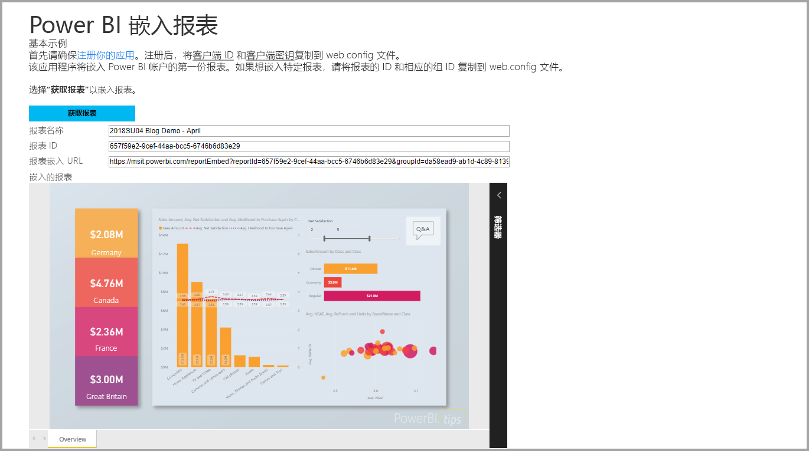
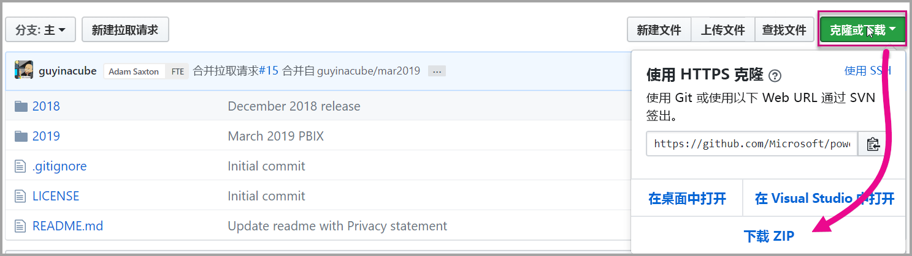
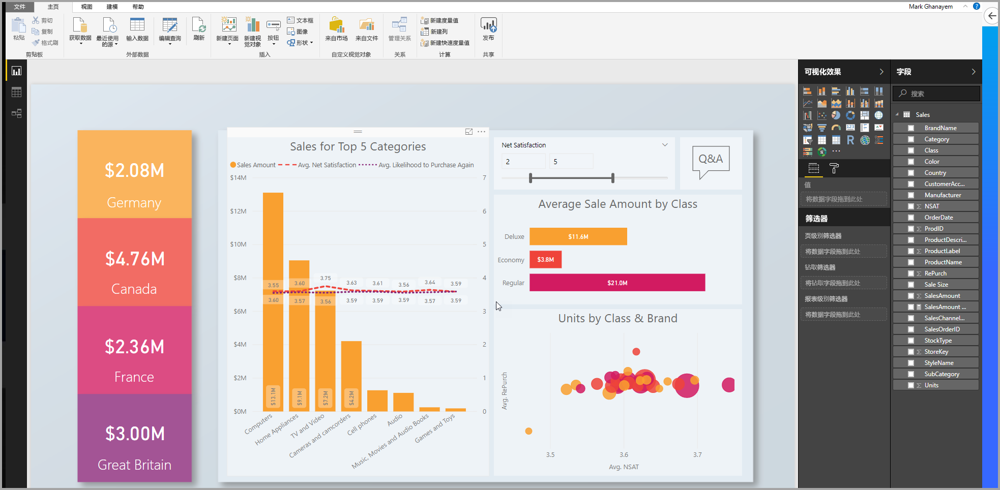
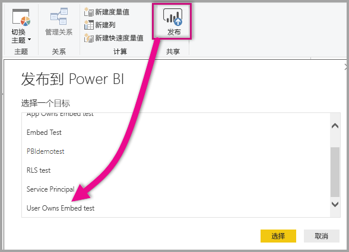
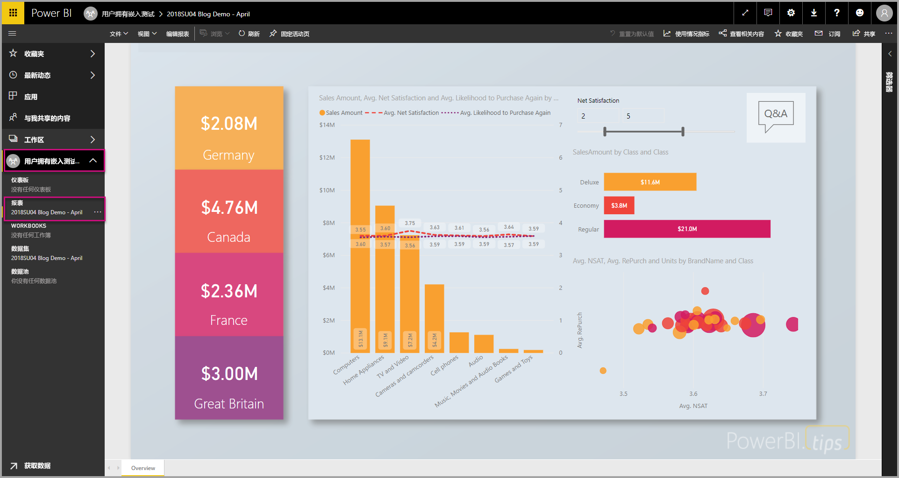
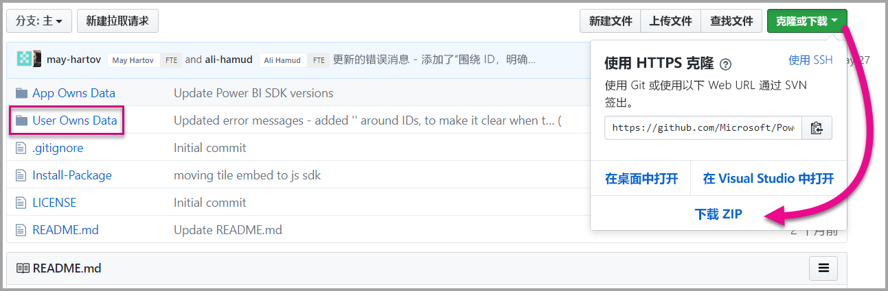
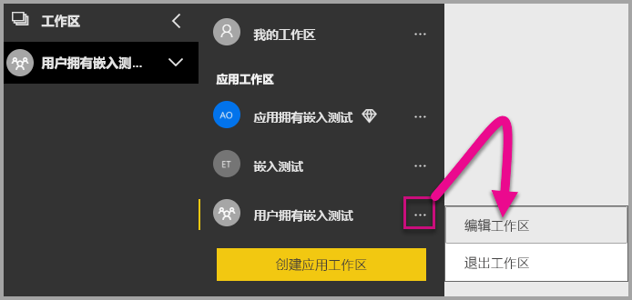
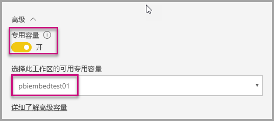
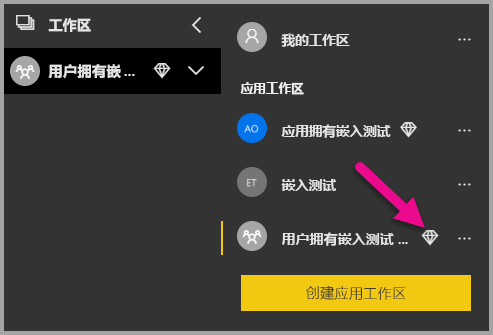

# <a name="tutorial-embed-power-bi-content-into-an-application-for-your-organization"></a>教程：为组织将 Power BI 内容嵌入应用程序

在 Power BI  中，可以使用“用户拥有数据”将报表（Power BI 或分页）、仪表板或磁贴嵌入应用程序。 借助“用户拥有数据”，应用程序可以扩展 Power BI 服务以使用嵌入式分析  。 本教程演示了如何将报表（Power BI 或分页）集成到应用程序。 通过将 Power BI.NET SDK 和 Power BI JavaScript API 结合使用，可为组织将 Power BI 嵌入应用程序。



在本教程中，将学习以下任务：
> [!div class="checklist"]
> * 在 Azure 中注册应用程序。
> * 使用 Power BI 租户将 Power BI 或分页报表嵌入应用程序中。

## <a name="prerequisites"></a>先决条件

若要开始使用，则需要具有：

* [Power BI Pro 帐户](../../service-self-service-signup-for-power-bi.md)。
* [Microsoft Azure](https://azure.microsoft.com/) 订阅。
* 需要设置自己的 [Azure Active Directory 租户](create-an-azure-active-directory-tenant.md)。
* 要嵌入分页报表，至少需要 P1 容量，请参阅[需要多大的 Premium 容量才能使用分页报表？](../../paginated-reports/paginated-reports-faq.md#what-size-premium-capacity-do-i-need-for-paginated-reports)

如果未注册 Power BI Pro  ，请在开始之前[注册以获得免费试用](https://powerbi.microsoft.com/pricing/)。

如果没有 Azure 订阅，请在开始之前先创建一个[免费帐户](https://azure.microsoft.com/free/?WT.mc_id=A261C142F)。

## <a name="set-up-your-embedded-analytics-development-environment"></a>设置嵌入式分析开发环境

开始将报表、仪表板或磁贴嵌入应用前，需要先确保环境允许通过 Power BI 进行嵌入。

你可通过完成[嵌入安装工具](https://aka.ms/embedsetup/UserOwnsData)，快速开始并下载可帮助你逐步创建环境和嵌入报表的示例应用程序。 在嵌入分页报表的情况下，需要至少将 P1 容量分配给创建的工作区。

如果选择手动设置环境，则可以继续进行下面的操作。

### <a name="register-an-application-in-azure-active-directory"></a>在 Azure Active Directory 中注册应用程序

向 Azure Active Directory [注册应用程序](register-app.md)，以允许应用程序访问 [Power BI REST API](https://docs.microsoft.com/rest/api/power-bi/)。 通过注册应用，可以建立应用标识，并指定对 Power BI REST 资源的权限。

你必须继续注册服务器端 Web 应用程序  。 注册服务器端 Web 应用程序以创建应用程序密码。

在 Azure 中创建应用程序后，在 Azure 中打开应用程序，导航到“身份验证”，然后在“重定向 URI”中添加“/重定向”到“重定向 URI”     。

## <a name="set-up-your-power-bi-environment"></a>设置 Power BI 环境

### <a name="create-a-workspace"></a>创建工作区

如果为客户嵌入报表、仪表板或磁贴，则必须将内容放在工作区中。 具有可以设置的不同类型工作区：[传统工作区](../../service-create-workspaces.md)或[新工作区](../../service-create-the-new-workspaces.md)。

### <a name="create-and-publish-your-power-bi-reports"></a>创建并发布 Power BI 报表

可以通过使用 Power BI Desktop 创建报表和数据集。 然后，可以将这些报表发布到工作区。 发布报表的最终用户需要拥有 Power BI Pro 许可证才可发布到工作区。

1. 从 GitHub 下载示例[演示](https://github.com/Microsoft/powerbi-desktop-samples)。

    

2. 在 Power BI Desktop 中打开示例 .pbix 报表。

   

3. 发布到工作区。

   

    现在即可在 Power BI 服务在线版中查看报表。

   
   
### <a name="create-and-publish-your-paginated-reports"></a>创建并发布分页报表

可使用 [Power BI 报表生成器](../../paginated-reports/paginated-reports-report-builder-power-bi.md#create-reports-in-power-bi-report-builder)创建分页报表。 然后可以将[报表上传](../../paginated-reports/paginated-reports-quickstart-aw.md#upload-the-report-to-the-service)到分配有至少 P1 容量的工作区。 上传报表的最终用户需要具有 Power BI Pro 许可证才能发布到工作区。
   
## <a name="embed-your-content-by-using-the-sample-application"></a>使用示例应用程序嵌入内容

为了便于演示，故意采用简单的示例。

请按照以下步骤，使用示例应用程序开始嵌入内容。

1. 下载 [Visual Studio](https://www.visualstudio.com/)（2013 版或更高版本）。 请务必下载最新版 [NuGet 包](https://www.nuget.org/profiles/powerbi)。

2. 要开始操作，请从 GitHub 下载[用户拥有数据示例](https://github.com/Microsoft/PowerBI-Developer-Samples)。

    

3. 在示例应用程序中打开 Cloud.config 文件。 

    必须填写以下字段，才能运行应用程序。

    | 字段 |
    |--------------------|
    | **[应用程序 ID](#application-id)** |
    | **[工作区 ID](#workspace-id)** |
    | **[报表 ID](#report-id)** |
    | **[AADAuthorityUrl](#aadauthorityurl)** |

    

### <a name="application-id"></a>应用程序 ID

将 Azure  中的“应用 ID”  填入“applicationId”  字段。 应用使用“applicationId”  对你向其请求获取权限的用户标识自身。

若要获取“applicationId”  ，请按以下步骤操作：

1. 登录到 [Azure 门户](https://portal.azure.com)。

2. 在左侧导航窗格中，依次选择“所有服务”  和“应用注册”  。

3. 选择需要 applicationId 的应用程序  。

    

4. 存在列为 GUID 的“应用程序 ID”  。 使用此“应用 ID”  作为应用的“applicationId”  。

    

### <a name="workspace-id"></a>工作区 ID

使用 Power BI 中的“工作区(组) GUID”填写“workspaceId”信息  。 若要获取此信息，可以在登录 Power BI 服务时使用 URL，也可以使用 PowerShell。

URL <br>


PowerShell <br>

```powershell
Get-PowerBIworkspace -name "User Owns Embed Test"
```

   

### <a name="report-id"></a>报表 ID

使用 Power BI 中的“报表 GUID”填写“reportId”信息  。 若要获取此信息，可以在登录 Power BI 服务时使用 URL，也可以使用 PowerShell。

Power BI 报表 URL <br>


分页报表 URL<br>


PowerShell <br>

```powershell
Get-PowerBIworkspace -name "User Owns Embed Test" | Get-PowerBIReport
```


### <a name="aadauthorityurl"></a>AADAuthorityUrl

填入允许你在组织租户内或通过来宾用户嵌入内容的 URL 的 AADAuthorityUrl 信息  。

如果通过组织租户嵌入，使用 URL： https://login.microsoftonline.com/common/oauth2/authorize  。

如果通过来宾嵌入，使用 URL https://login.microsoftonline.com/report-owner-tenant-id （用报表所有者的租户 ID 替换 report-owner-tenant-id）   。

### <a name="run-the-application"></a>运行应用程序

1. 在“Visual Studio”  中选择“运行”  。

    

2. 然后，选择“嵌入报表”  。 根据你选择测试使用的内容（报表、仪表板或磁贴），在应用程序中选择该选项。

    

3. 现在，可以在示例应用程序查看报表。

    

## <a name="embed-your-content-within-your-application"></a>在应用程序中嵌入内容

即使可以使用 [Power BI REST API](https://docs.microsoft.com/rest/api/power-bi/) 完成嵌入内容的步骤，也可使用 .NET SDK 编写本文中所述的示例代码。

若要将报表集成到 Web 应用，可使用 Power BI REST API 或 Power BI C# SDK。 也可以使用 Azure Active Directory 授权访问令牌来获取报表。 然后，使用相同的访问令牌加载报表。 Power BI Rest API 提供对特定 Power BI 资源的编程访问权限。 有关详细信息，请参阅 [Power BI REST API](https://docs.microsoft.com/rest/api/power-bi/) 和 [Power BI JavaScript API](https://github.com/Microsoft/PowerBI-JavaScript)。

### <a name="get-an-access-token-from-azure-ad"></a>从 Azure AD 获取访问令牌

在应用程序中，必须先从 Azure AD 获取访问令牌，然后才能调用 Power BI REST API。 有关详细信息，请参阅[对用户进行身份验证并获取 Power BI 应用的 Azure AD 访问令牌](get-azuread-access-token.md)。

### <a name="get-a-report"></a>获取报表

若要获取 Power BI 或分页报表，请使用[获取报表](https://docs.microsoft.com/rest/api/power-bi/reports/getreports)操作，获取 Power BI 和分页报表列表。 在报表列表中，可以获取报表 ID。

### <a name="get-reports-by-using-an-access-token"></a>使用访问令牌获取报表

[获取报表](https://docs.microsoft.com/rest/api/power-bi/reports/getreports)操作将返回报表的列表。 可以获取报表列表中的一个报表。

若要执行 REST API 调用，必须添加格式为“持有者 {访问令牌}”  的授权  标头。

#### <a name="get-reports-with-the-rest-api"></a>使用 REST API 获取报表

下面的代码示例演示如何使用 REST API 检索报表：

> [!Note]
> [示例应用程序](https://github.com/Microsoft/PowerBI-Developer-Samples)的 Default.aspx.cs 文件中提供了获取要嵌入的内容项的示例。 示例包括报表、仪表板或磁贴。

```csharp
using Newtonsoft.Json;

//Get a Report. In this sample, you get the first Report.
protected void GetReport(int index)
{
    //Configure Reports request
    System.Net.WebRequest request = System.Net.WebRequest.Create(
        String.Format("{0}/Reports",
        baseUri)) as System.Net.HttpWebRequest;

    request.Method = "GET";
    request.ContentLength = 0;
    request.Headers.Add("Authorization", String.Format("Bearer {0}", accessToken.Value));

    //Get Reports response from request.GetResponse()
    using (var response = request.GetResponse() as System.Net.HttpWebResponse)
    {
        //Get reader from response stream
        using (var reader = new System.IO.StreamReader(response.GetResponseStream()))
        {
            //Deserialize JSON string
            PBIReports Reports = JsonConvert.DeserializeObject<PBIReports>(reader.ReadToEnd());

            //Sample assumes at least one Report.
            //You could write an app that lists all Reports
            if (Reports.value.Length > 0)
            {
                var report = Reports.value[index];

                txtEmbedUrl.Text = report.embedUrl;
                txtReportId.Text = report.id;
                txtReportName.Text = report.name;
            }
        }
    }
}

//Power BI Reports used to deserialize the Get Reports response.
public class PBIReports
{
    public PBIReport[] value { get; set; }
}
public class PBIReport
{
    public string id { get; set; }
    public string reportType { get; set }
    public string name { get; set; }
    public string webUrl { get; set; }
    public string embedUrl { get; set; }
}
```

#### <a name="get-reports-by-using-the-net-sdk"></a>使用 .NET SDK 获取报表

可以使用 .NET SDK 检索报表列表，而不用直接调用 REST API。 下面的代码示例演示如何列出报表：

```csharp
using Microsoft.IdentityModel.Clients.ActiveDirectory;
using Microsoft.PowerBI.Api.V2;
using Microsoft.PowerBI.Api.V2.Models;

var tokenCredentials = new TokenCredentials(<ACCESS TOKEN>, "Bearer");

// Create a Power BI Client object. It is used to call Power BI APIs.
using (var client = new PowerBIClient(new Uri(ApiUrl), tokenCredentials))
{
    // Get the first report all reports in that workspace
    ODataResponseListReport reports = client.Reports.GetReports();

    Report report = reports.Value.FirstOrDefault();

    var embedUrl = report.EmbedUrl;
}
```

### <a name="load-a-report-by-using-javascript"></a>使用 JavaScript 加载报表

可以使用 JavaScript 将报表加载到网页上的 div 元素中。 下面的代码示例演示如何从给定工作区检索报表：

> [!NOTE]  
> [示例应用程序](https://github.com/Microsoft/PowerBI-Developer-Samples)的 Default.aspx.cs 文件中提供了加载要嵌入内容项的示例  。

```javascript
<!-- Embed Report-->
<div> 
    <asp:Panel ID="PanelEmbed" runat="server" Visible="true">
        <div>
            <div><b class="step">Step 3</b>: Embed a report</div>

            <div>Enter an embed url for a report from Step 2 (starts with https://):</div>
            <input type="text" id="tb_EmbedURL" style="width: 1024px;" />
            <br />
            <input type="button" id="bEmbedReportAction" value="Embed Report" />
        </div>

        <div id="reportContainer"></div>
    </asp:Panel>
</div>
```

#### <a name="sitemaster"></a>Site.master

```javascript
window.onload = function () {
    // client side click to embed a selected report.
    var el = document.getElementById("bEmbedReportAction");
    if (el.addEventListener) {
        el.addEventListener("click", updateEmbedReport, false);
    } else {
        el.attachEvent('onclick', updateEmbedReport);
    }

    // handle server side post backs, optimize for reload scenarios
    // show embedded report if all fields were filled in.
    var accessTokenElement = document.getElementById('MainContent_accessTokenTextbox');
    if (accessTokenElement !== null) {
        var accessToken = accessTokenElement.value;
        if (accessToken !== "")
            updateEmbedReport();
    }
};

// update embed report
function updateEmbedReport() {

    // check if the embed url was selected
    var embedUrl = document.getElementById('tb_EmbedURL').value;
    if (embedUrl === "")
        return;

    // get the access token.
    accessToken = document.getElementById('MainContent_accessTokenTextbox').value;

    // Embed configuration used to describe the what and how to embed.
    // This object is used when calling powerbi.embed.
    // You can find more information at https://github.com/Microsoft/PowerBI-JavaScript/wiki/Embed-Configuration-Details.
    var config = {
        type: 'report',
        accessToken: accessToken,
        embedUrl: embedUrl
    };

    // Grab the reference to the div HTML element that will host the report.
    var reportContainer = document.getElementById('reportContainer');

    // Embed the report and display it within the div container.
    var report = powerbi.embed(reportContainer, config);

    // report.on will add an event handler which prints to Log window.
    report.on("error", function (event) {
        var logView = document.getElementById('logView');
        logView.innerHTML = logView.innerHTML + "Error<br/>";
        logView.innerHTML = logView.innerHTML + JSON.stringify(event.detail, null, "  ") + "<br/>";
        logView.innerHTML = logView.innerHTML + "---------<br/>";
    }
  );
}
```

## <a name="using-a-power-bi-premium-dedicated-capacity"></a>使用 Power BI Premium 专用容量

至此，你已完成应用程序的开发，接下来请回到工作区了解专用容量。

### <a name="create-a-dedicated-capacity"></a>创建专用容量

通过创建专用容量，则可获得在工作区中拥有内容专用资源这一优势。 对于分页报表，必须为工作区准备至少 P1 容量。 你可使用 [Power BI Premium](../../service-premium-what-is.md) 创建专用容量。

下表列出了 [Microsoft Office 365](../../service-admin-premium-purchase.md) 中可用的 Power BI Premium SKU：

| 容量节点 | vCore 总数<br/>（后端 + 前端） | 后端 vCore | 前端 vCore | DirectQuery/实时连接限制 |
| --- | --- | --- | --- | --- | --- |
| EM1 |1 个 vCore |0.5 个 vCore，10 GB RAM |0.5 个 vCore |每秒 3.75 |
| EM2 |2 个 vCore |1 个 vCore，10 GB RAM |1 个 vCore |每秒 7.5 |
| EM3 |4 个 vCore |2 个 vCore，10 GB RAM |2 个 vCore |每秒 15 个 |
| P1 |8 个 vCore |4 个 vCore，25 GB RAM |4 个 vCore |每秒 30 个 |
| P2 |16 个 vCore |8 个 vCore，50 GB RAM |8 个 vCore |每秒 60 个 |
| P3 |32 个 vCore |16 个 vCore，100 GB RAM |16 个 vCore |每秒 120 个 |
| P4 |64 个 vCore |32 个 vCore，200 GB RAM |32 个 vCore |每秒 240 个 |
| P5 |128 个 vCore |64 vCore，400 GB RAM |64 个 vCore |每秒 480 个 |

> [!NOTE]
> - 尝试通过 Microsoft Office 应用实现嵌入时，可以使用 EM SKU 和免费 Power BI 许可证来访问内容。 但是，如果使用 Powerbi.com 或 Power BI 移动版时，将无法使用免费 Power BI 许可证访问内容。
> - 在尝试使用 Powerbi.com 或 Power BI 移动版嵌入到 Microsoft Office 应用时，可以使用免费 Power BI 许可证访问内容。

### <a name="assign-a-workspace-to-a-dedicated-capacity"></a>为工作区分配专用容量

创建专用容量后，可将该专用容量分配给工作区。 若要完成此过程，请按照下列步骤执行：

1. 在“Power BI 服务”中，展开工作区并选择用于嵌入内容的工作区的相应省略号。 然后选择“编辑工作区”  。

    

2. 展开“高级”  ，并启用“专用容量”  。 选择你创建的专用容量。 然后，选择“保存”  。

    

3. 选择“保存”后，应该会在工作区名称旁边看到一个钻石图形  。

    

## <a name="admin-settings"></a>管理员设置

全局管理员或 Power BI 服务管理员可以为租户启用或禁用 REST API。 Power BI 管理员可以为整个组织或各个安全组设定此设置。 默认情况下，将为整个组织启用此功能。 你可以在 [Power BI 管理门户](../../service-admin-portal.md)中进行这些更改。

## <a name="next-steps"></a>后续步骤

本教程介绍了如何使用 Power BI 组织帐户将 Power BI 内容嵌入应用程序。 接下来，可以尝试使用应用将 Power BI 内容嵌入应用程序。 还可以尝试为客户嵌入 Power BI 内容（尚不支持嵌入分页报表）：

> [!div class="nextstepaction"]
> [从应用嵌入内容](embed-from-apps.md)

> [!div class="nextstepaction"]
>[为客户嵌入内容](embed-sample-for-customers.md)

如有其他问题，请[尝试询问 Power BI 社区](https://community.powerbi.com/)。
