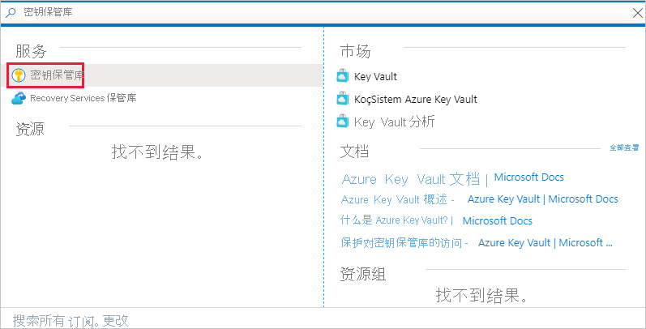
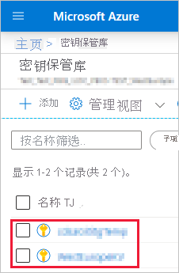
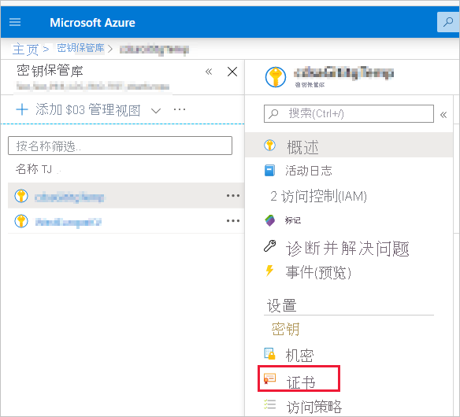
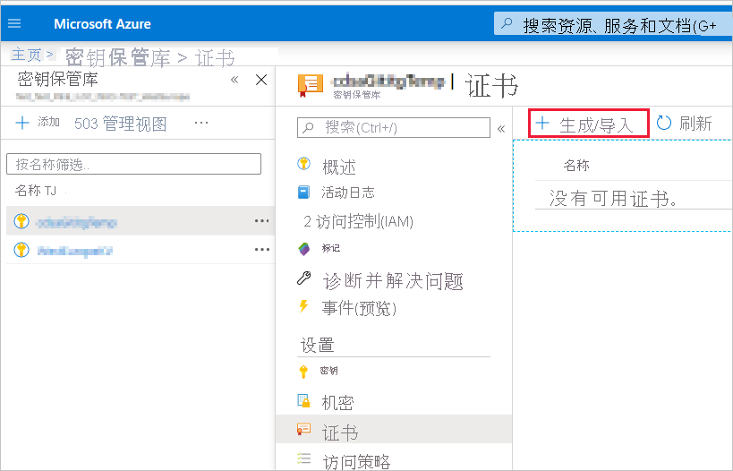
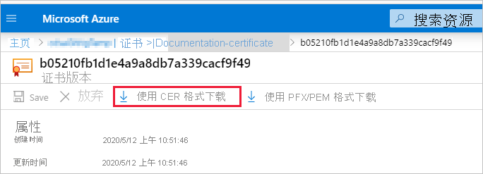
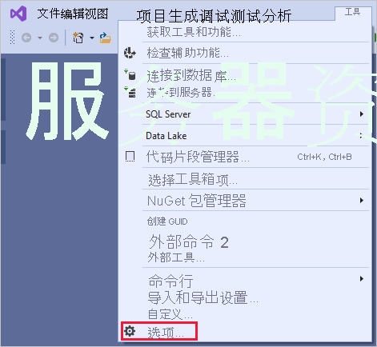
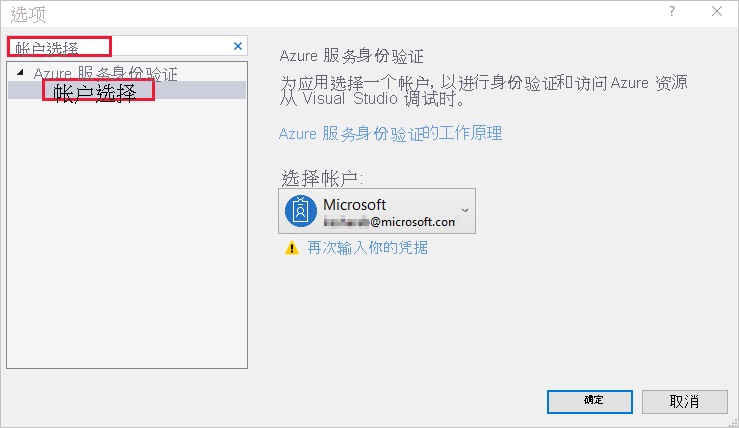

# <a name="embed-power-bi-content-with-service-principal-and-a-certificate"></a>使用服务主体和证书嵌入 Power BI 内容

[!INCLUDE[service principal overview](../../includes/service-principal-overview.md)]

>[!NOTE]
>建议使用证书而不是机密密钥来保护后端服务。 [详细了解如何使用机密密钥或证书从 Azure AD 获取访问令牌](/azure/architecture/multitenant-identity/client-assertion)。

## <a name="certificate-based-authentication"></a>基于证书的身份验证

凭借基于证书的身份验证，你可以通过 Azure Active Directory (Azure AD) 使用 Windows、Android 或 iOS 设备上或 [Azure 密钥保管库](/azure/key-vault/basic-concepts)中保存的客户端证书进行身份验证。

借助这种身份验证方法，可使用 CA 从一个中心位置管理证书，以便进行轮换或吊销。

要详细了解 Azure AD 中的证书，请参阅[客户端凭据流](https://github.com/AzureAD/microsoft-authentication-library-for-dotnet/wiki/Client-credential-flows) GitHub 页面。

## <a name="method"></a>方法

要将服务主体和证书与嵌入的分析结合使用，请按照以下步骤操作：

1. 创建 Azure AD 应用程序。

2. 创建 Azure AD 安全组。

3. 启用 Power BI 服务管理设置。

4. 将服务主体添加到工作区中。

5. 创建证书。

6. 设置证书身份验证。

7. 从 Azure 密钥保管库获取证书。

8. 使用服务主体和证书进行身份验证。

## <a name="step-1---create-an-azure-ad-application"></a>第 1 步 - 创建 Azure AD 应用程序

[!INCLUDE[service principal create app](../../includes/service-principal-create-app.md)]

### <a name="creating-an-azure-ad-app-using-powershell"></a>使用 PowerShell 创建 Azure AD 应用程序

此部分中包含使用 [PowerShell](/powershell/azure/create-azure-service-principal-azureps) 新建 Azure AD 应用程序的示例脚本。

```powershell
# The app ID - $app.appid
# The service principal object ID - $sp.objectId
# The app key - $key.value

# Sign in as a user that's allowed to create an app
Connect-AzureAD

# Create a new Azure AD web application
$app = New-AzureADApplication -DisplayName "testApp1" -Homepage "https://localhost:44322" -ReplyUrls "https://localhost:44322"

# Creates a service principal
$sp = New-AzureADServicePrincipal -AppId $app.AppId
```

[!INCLUDE[service create steps two, three and four](../../includes/service-principal-create-steps.md)]

## <a name="step-5---create-a-certificate"></a>第 5 步 - 创建证书

可以从受信任的证书颁发机构获取证书，也可以自行生成证书。

本部分介绍如何使用 [Azure 密钥保管库](/azure/key-vault/create-certificate)创建证书，以及下载包含公钥的 .cer 文件。

1. 登录 [Microsoft Azure](https://ms.portal.azure.com/#allservices)。

2. 搜索“密钥保管库”，然后单击“密钥保管库”链接 。

    

3. 单击要向其添加证书的密钥保管库。

    

4. 单击“ **证书** ”。

    

5. 单击“生成/导入”。

    

6. 按如下所示配置“创建证书”字段：

    * **证书创建方法** - 常规

    * **证书名称** - 输入证书名称

    * **证书颁发机构 (CA) 类型** - 自签名证书

    * **使用者** - [X.500](https://wikipedia.org/wiki/X.500) 可分辨名称

    * **DNS 名称** - 0 DNS 名称

    * **有效期（月）** - 输入证书的有效期

    * **内容类型** - PKCS #12

    * **生存期操作类型** - 在达到给定生存期百分比时自动续订

    * **生存期百分比** - 80

    * **高级策略配置** - 未配置

7. 单击“创建”。 新创建的证书默认处于禁用状态。 可能需要长达五分钟的时间才会启用。

8. 选择你创建的证书。

9. 单击“以 CER 格式下载”。 下载的文件包含公钥。

    

## <a name="step-6---set-up-certificate-authentication"></a>第 6 步 - 设置证书身份验证

1. 在 Azure AD 应用程序中，单击“证书和机密”选项卡。

     

2. 单击“上传证书”，上传你在本教程的[第一步](#step-5---create-a-certificate)中创建并下载的 .cer 文件。 .cer 文件包含公钥。

## <a name="step-7---get-the-certificate-from-azure-key-vault"></a>第 7 步 - 从 Azure 密钥保管库获取证书

使用托管服务标识 (MSI) 从 Azure 密钥保管库获取证书。 此过程涉及获取同时包含公钥和私钥的 .pfx 证书。

请参阅从 Azure 密钥保管库读取证书的代码示例。 如果要使用 Visual Studio，请参阅[将 Visual Studio 配置为使用 MSI](#configure-visual-studio-to-use-msi)。

```csharp
private X509Certificate2 ReadCertificateFromVault(string certName)
{
    var serviceTokenProvider = new AzureServiceTokenProvider();
    var keyVaultClient = new KeyVaultClient(new KeyVaultClient.AuthenticationCallback(serviceTokenProvider.KeyVaultTokenCallback));
    CertificateBundle certificate = null;
    SecretBundle secret = null;
    try
    {
        certificate = keyVaultClient.GetCertificateAsync($"https://{KeyVaultName}.vault.azure.net/", certName).Result;
        secret = keyVaultClient.GetSecretAsync(certificate.SecretIdentifier.Identifier).Result;
    }
    catch (Exception)
    {
        return null;
    }

    return new X509Certificate2(Convert.FromBase64String(secret.Value));
}
```

## <a name="step-8---authenticate-using-service-principal-and-a-certificate"></a>第 8 步 - 使用服务主体和证书进行身份验证

通过连接到 Azure 密钥保管库，你可以使用服务主体和 Azure 密钥保管库中存储的证书对应用进行身份验证。

要连接并从 Azure 密钥保管库读取证书，请参阅下面的代码。

>[!NOTE]
>如果你已有组织创建的证书，请将 .pfx 文件上传到 Azure 密钥保管库。

```csharp
// Preparing needed variables
var Scope = "https://analysis.windows.net/powerbi/api/.default"
var ApplicationId = "{YourApplicationId}"
var tenantSpecificURL = "https://login.microsoftonline.com/{YourTenantId}/"
X509Certificate2 certificate = ReadCertificateFromVault(CertificateName);

// Authenticating with a SP and a certificate
public async Task<AuthenticationResult> DoAuthentication(){
    IConfidentialClientApplication clientApp = null;
    clientApp = ConfidentialClientApplicationBuilder.Create(ApplicationId)
                                                    .WithCertificate(certificate)
                                                    .WithAuthority(tenantSpecificURL)
                                                    .Build();
    try
    {
        authenticationResult = await clientApp.AcquireTokenForClient(Scope).ExecuteAsync();
    }
    catch (MsalException)
    {
        throw;
    }
    return authenticationResult
}
```

## <a name="configure-visual-studio-to-use-msi"></a>将 Visual Studio 配置为使用 MSI

创建嵌入式解决方案时，将 Visual Studio 配置为使用托管服务标识 (MSI) 可能会很有用。 [MSI](/azure/active-directory/managed-identities-azure-resources/overview) 是用于管理 Azure AD 标识的一项功能。 配置后，它将允许 Visual Studio 针对你的 Azure 密钥保管库进行身份验证。

1. 在 Visual Studio 中打开项目。

2. 单击“工具” > “选项” 。

     

3. 搜索“帐户选择”并单击“帐户选择” 。

    

4. 添加有权访问你 Azure 密钥保管库的帐户。

[!INCLUDE[service principal limitations](../../includes/service-principal-limitations.md)]

## <a name="next-steps"></a>后续步骤

>[!div class="nextstepaction"]
>[注册应用](register-app.md)

>[!div class="nextstepaction"]
>[适用于客户的 Power BI Embedded](embed-sample-for-customers.md)

>[!div class="nextstepaction"]
>[Azure Active Directory 中的应用程序和服务主体对象](/azure/active-directory/develop/app-objects-and-service-principals)

>[!div class="nextstepaction"]
>[配合使用本地数据网关与服务主体的行级别安全性](embedded-row-level-security.md#on-premises-data-gateway-with-service-principal)

>[!div class="nextstepaction"]
>[使用服务主体和应用程序机密嵌入 Power BI 内容](embed-service-principal.md)