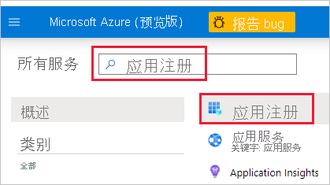
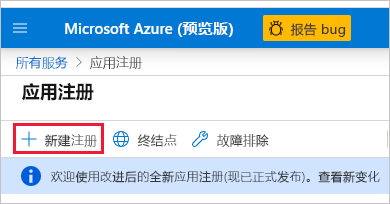
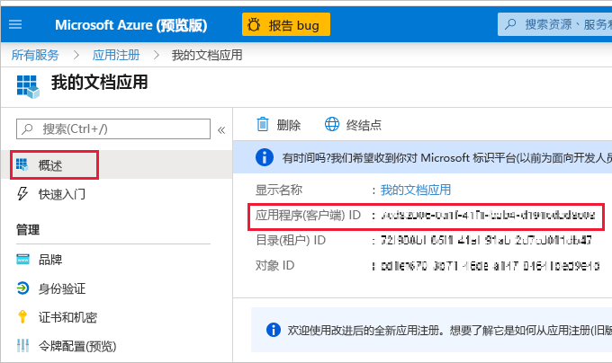
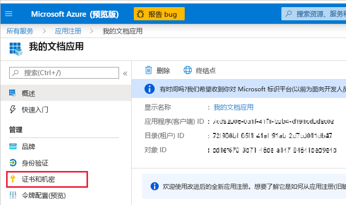
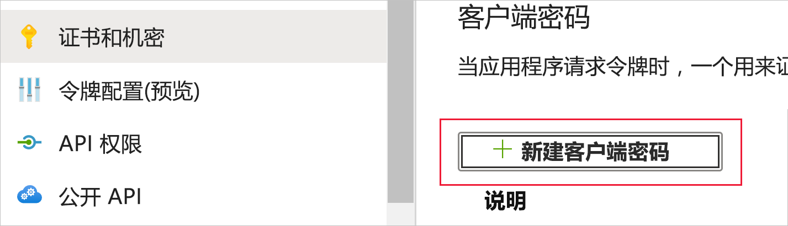
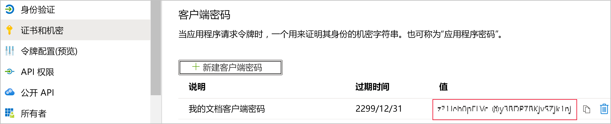

# <a name="embed-power-bi-content-with-service-principal-and-an-application-secret"></a>使用服务主体和应用程序机密嵌入 Power BI 内容

服务主体是一种身份验证方法，可用于让 Azure AD 应用程序访问 Power BI 服务内容和 API。

在 Azure Active Directory (Azure AD) 应用程序创建后，[服务主体对象](/azure/active-directory/develop/app-objects-and-service-principals#service-principal-object)也随之创建。 借助服务主体对象（亦称为“服务主体”），Azure AD 可以对应用程序进行身份验证。 经过身份验证后，应用程序可以访问 Azure AD 租户资源。

为了进行身份验证，服务主体使用 Azure AD 应用程序的应用程序 ID，以及下列项之一：

* 证书
* 应用程序密码

本文介绍了如何使用应用程序 ID 和应用程序密码进行服务主体身份验证。

>[!NOTE]
>Azure AD 建议使用证书而不是机密密钥来保护后端服务。
>* [详细了解如何使用机密密钥或证书从 Azure AD 获取访问令牌](/azure/architecture/multitenant-identity/client-assertion)。
>* 若要使用证书保护解决方案，请完成本文中的说明，然后按照[使用服务主体和证书嵌入 Power BI 内容](embed-service-principal-certificate.md)中所述的步骤进行操作。

## <a name="method"></a>方法

若要使用服务主体和应用程序 ID 嵌入式分析，请按照以下步骤操作：

1. 创建 [Azure AD 应用程序](/azure/active-directory/manage-apps/what-is-application-management)。

    1. 创建 Azure AD 应用程序密码。
    
    2. 获取应用程序的应用程序 ID 和应用程序密码。

    >[!NOTE]
    >“第 1 步”中介绍了这些步骤。 若要详细了解如何创建 Azure AD 应用程序，请参阅[创建 Azure AD 应用程序](/azure/active-directory/develop/howto-create-service-principal-portal)一文。

2. 创建 Azure AD 安全组。

3. 启用 Power BI 服务管理设置。

4. 将服务主体添加到工作区中。

5. 嵌入内容。

> [!IMPORTANT]
> 在使服务主体可用于 Power BI 后，应用程序的 AD 权限将不再有效。 然后，将通过 Power BI 管理门户管理应用程序权限。

## <a name="step-1---create-an-azure-ad-app"></a>第 1 步 - 创建 Azure AD 应用程序

使用下面的一种方法来创建 Azure AD 应用程序：

* [在 Microsoft Azure 门户中创建应用](embed-service-principal.md#creating-an-azure-ad-app-in-the-microsoft-azure-portal)

* [使用 PowerShell 创建应用](embed-service-principal.md#creating-an-azure-ad-app-using-powershell)

### <a name="creating-an-azure-ad-app-in-the-microsoft-azure-portal"></a>在 Microsoft Azure 门户中创建 Azure AD 应用程序

1. 登录 [Microsoft Azure](https://ms.portal.azure.com/#allservices)。

2. 搜索“应用程序注册”，然后单击“应用程序注册”链接。

    

3. 单击“新建注册”。

    

4. 填写所需信息：
    * **名称** - 输入应用程序名称
    * **受支持的帐户类型** - 选择受支持的帐户类型
    * （可选）**重定向 URI** - 视需要输入 URI

5. 单击“注册”。

6. 注册后，可以从“概览”选项卡中获取“应用程序 ID”。复制并保存“应用程序 ID”，以供日后使用。

    

7. 单击“证书和密码”选项卡。

     

8. 单击“新建客户端密码”

    

9. 在“添加客户端密码”窗口中，输入描述，指定所需的客户端密码到期时间，然后单击“添加”。

10. 复制并保存“客户端密码”值。

    

    >[!NOTE]
    >在你离开此窗口后，客户端密码值将会隐藏起来，你将无法再次查看或复制它。

### <a name="creating-an-azure-ad-app-using-powershell"></a>使用 PowerShell 创建 Azure AD 应用程序

此部分中包含使用 [PowerShell](/powershell/azure/create-azure-service-principal-azureps) 新建 Azure AD 应用程序的示例脚本。

```powershell
# The app ID - $app.appid
# The service principal object ID - $sp.objectId
# The app key - $key.value

# Sign in as a user that's allowed to create an app
Connect-AzureAD

# Create a new Azure AD web application
$app = New-AzureADApplication -DisplayName "testApp1" -Homepage "https://localhost:44322" -ReplyUrls "https://localhost:44322"

# Creates a service principal
$sp = New-AzureADServicePrincipal -AppId $app.AppId

# Get the service principal key
$key = New-AzureADServicePrincipalPasswordCredential -ObjectId $sp.ObjectId
```

## <a name="step-2---create-an-azure-ad-security-group"></a>第 2 步 - 创建 Azure AD 安全组

服务主体无权访问你的任何 Power BI 内容和 API。 若要向服务主体授予访问权限，请在 Azure AD 中创建安全组，并将创建的服务主体添加到此安全组中。

创建 Azure AD 安全组有以下两种方法：
* [手动（在 Azure 中）](embed-service-principal.md#create-a-security-group-manually)
* [使用 PowerShell](embed-service-principal.md#create-a-security-group-using-powershell)

### <a name="create-a-security-group-manually"></a>手动创建安全组

若要手动创建 Azure 安全组，请按照[使用 Azure Active Directory 创建基本组并添加成员](/azure/active-directory/fundamentals/active-directory-groups-create-azure-portal)一文中的说明操作。 

### <a name="create-a-security-group-using-powershell"></a>使用 PowerShell 创建安全组

下面的示例脚本用于新建安全组，并向此安全组中添加应用程序。

>[!NOTE]
>若要为整个组织启用服务主体访问权限，请跳过这一步。

```powershell
# Required to sign in as admin
Connect-AzureAD

# Create an Azure AD security group
$group = New-AzureADGroup -DisplayName <Group display name> -SecurityEnabled $true -MailEnabled $false -MailNickName notSet

# Add the service principal to the group
Add-AzureADGroupMember -ObjectId $($group.ObjectId) -RefObjectId $($sp.ObjectId)
```

## <a name="step-3---enable-the-power-bi-service-admin-settings"></a>第 3 步 - 启用 Power BI 服务管理设置

为了让 Azure AD 应用程序能够访问 Power BI 内容和 API，Power BI 管理员必须在 Power BI 管理门户中启用服务主体访问权限。

在“开发人员设置”中，将你在 Azure AD 中创建的安全组添加到特定安全组部分。

>[!IMPORTANT]
>服务主体有权访问为其启用的任何租户设置。 这包括特定安全组或整个组织，具体视管理设置而定。
>
>若要限制服务主体只能访问特定租户设置，请只允许访问特定安全组。 也可以为服务主体创建专用安全组，并将它排除在相应租户设置之外。

>[!div class="mx-imgBorder"]
>:::image type="content" source="media/embed-service-principal/admin-portal.png" alt-text="显示 Power BI 服务的“管理”选项中的开发人员设置的屏幕截图。":::

## <a name="step-4---add-the-service-principal-to-your-workspace"></a>第 4 步 - 将服务主体添加到工作区

若要让 Azure AD 应用程序能够访问 Power BI 服务中的项目（如报表、仪表板和数据集），请将服务主体实体或包含服务主体的安全组作为成员或管理员添加到工作区。

>[!NOTE]
>此部分提供了 UI 说明。 还可使用[“组 - 添加组用户”API](/rest/api/power-bi/groups/addgroupuser) 将服务主体或安全组添加到工作区。

1. 滚动到要能够访问的工作区，然后选择“更多”菜单中的“工作区访问”。

    :::image type="content" source="media/embed-service-principal/workspace-access.png" alt-text="显示 Power BI 工作区的“更多”菜单中的“工作区访问”按钮的屏幕截图。":::

2. 在“访问”窗格的文本框中，添加下列内容之一：

    * 你的“服务主体”。 服务主体的名称是 Azure AD 应用的“显示名称”，它显示在 Azure AD 应用的“概述”选项卡中。

    * 包含服务主体的“安全组”。

3. 从下拉菜单中选择“成员”或“管理员” 。

4. 选择 **添加** 。

## <a name="step-5---embed-your-content"></a>第 5 步 - 嵌入内容

[可以在示例应用程序或你自己的应用程序中嵌入内容。](embed-sample-for-customers.md)

嵌入内容后，你便可以[迁移到生产阶段](move-to-production.md)。

>[!NOTE]
>若要使用证书保护内容，请按照[使用服务主体和证书嵌入 Power BI 内容](embed-service-principal-certificate.md)中所述的步骤进行操作。

## <a name="considerations-and-limitations"></a>注意事项和限制

* 服务主体仅适用于[新的工作区](../../collaborate-share/service-create-the-new-workspaces.md)。
* 使用服务主体时，不支持“我的工作区”。
* 移动到生产环境时，需要容量。
* 无法使用服务主体登录 Power BI 门户。
* 在 Power BI 管理门户的开发人员设置中启用服务主体需要 Power BI 管理权限。
* 无法使用服务主体[为组织应用程序嵌入内容](embed-sample-for-your-organization.md)。
* 不支持[数据流](../../transform-model/dataflows/dataflows-introduction-self-service.md)管理。
* 服务主体目前不支持任何管理员 API。
* 使用带有 [Azure Analysis Services](/azure/analysis-services/analysis-services-overview) 数据源的服务主体时，服务主体本身必须具有 Azure Analysis Services 实例权限。 使用包含服务主体的安全组来实现此目的，这不起作用。

## <a name="next-steps"></a>后续步骤

>[!div class="nextstepaction"]
>[注册应用](register-app.md)

> [!div class="nextstepaction"]
>[适用于客户的 Power BI Embedded](embed-sample-for-customers.md)

>[!div class="nextstepaction"]
>[使用服务主体和证书进行嵌入](embed-service-principal-certificate.md)

>[!div class="nextstepaction"]
>[Azure Active Directory 中的应用程序和服务主体对象](/azure/active-directory/develop/app-objects-and-service-principals)

>[!div class="nextstepaction"]
>[配合使用本地数据网关与服务主体的行级别安全性](embedded-row-level-security.md#on-premises-data-gateway-with-service-principal)