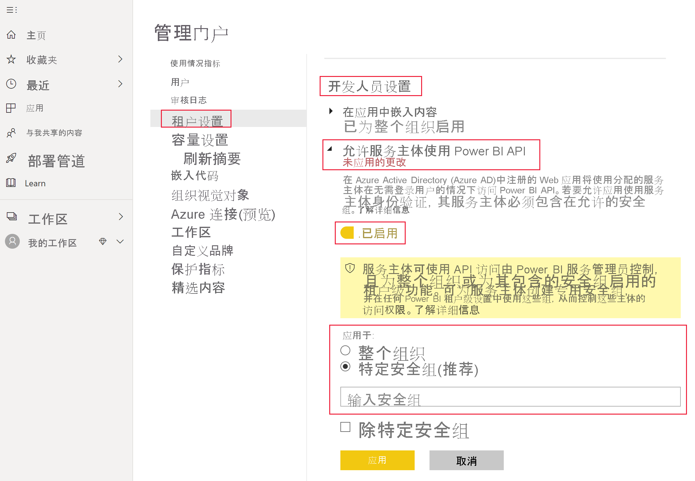

# <a name="embedding-power-bi-content-with-service-principal-and-application-secret"></a>使用服务主体和应用程序密码嵌入 Power BI 内容

[!INCLUDE[service principal overview](../../includes/service-principal-overview.md)]

本文介绍了如何使用应用程序 ID 和应用程序密码进行服务主体身份验证。

## <a name="method"></a>方法

若要将服务主体和应用程序 ID 与嵌入式分析结合使用，请按照以下步骤操作：

1. 创建 [Azure AD 应用程序](https://docs.microsoft.com/azure/active-directory/manage-apps/what-is-application-management)。

    1. 创建 Azure AD 应用程序密码。
    
    2. 获取应用程序的应用程序 ID 和应用程序密码。

    >[!NOTE]
    >“第 1 步”中介绍了这些步骤。 若要详细了解如何创建 Azure AD 应用程序，请参阅[创建 Azure AD 应用程序](https://docs.microsoft.com/azure/active-directory/develop/howto-create-service-principal-portal)一文。

2. 创建 Azure AD 安全组。

3. 启用 Power BI 服务管理设置。

4. 将服务主体添加到工作区中。

5. 嵌入内容。

> [!IMPORTANT]
> 在使服务主体可用于 Power BI 后，应用程序的 AD 权限将不再有效。 然后，将通过 Power BI 管理门户管理应用程序权限。

## <a name="step-1---create-an-azure-ad-app"></a>第 1 步 - 创建 Azure AD 应用程序

使用下面的一种方法来创建 Azure AD 应用程序：
* 在 [Microsoft Azure 门户](https://portal.azure.com/#allservices)中创建应用程序
* 使用 [PowerShell](https://docs.microsoft.com/powershell/azure/create-azure-service-principal-azureps?view=azps-3.6.1) 创建应用程序。

### <a name="creating-an-azure-ad-app-in-the-microsoft-azure-portal"></a>在 Microsoft Azure 门户中创建 Azure AD 应用程序

1. 登录 [Microsoft Azure](https://portal.azure.com/#allservices)。

2. 搜索“应用程序注册”，然后单击“应用程序注册”链接。

    

3. 单击“新建注册”。

    

4. 填写所需信息：
    * **名称** - 输入应用程序名称
    * **支持的帐户类型** - 选择所需的 Azure AD 帐户
    * （可选）**重定向 URI** - 视需要输入 URI

5. 单击“注册”。

6. 注册后，可以从“概览”选项卡中获取“应用程序 ID”。复制并保存“应用程序 ID”，以供日后使用。

    

7. 单击“证书和密码”选项卡。

     

8. 单击“新建客户端密码”

    

9. 在“添加客户端密码”窗口中，输入描述，指定所需的客户端密码到期时间，然后单击“添加”。

10. 复制并保存“客户端密码”值。

    

    >[!NOTE]
    >在你离开此窗口后，客户端密码值将会隐藏起来，你将无法再次查看或复制它。

### <a name="creating-an-azure-ad-app-using-powershell"></a>使用 PowerShell 创建 Azure AD 应用程序

此部分中包含使用 [PowerShell](https://docs.microsoft.com/powershell/azure/create-azure-service-principal-azureps?view=azps-1.1.0) 新建 Azure AD 应用程序的示例脚本。

```powershell
# The app ID - $app.appid
# The service principal object ID - $sp.objectId
# The app key - $key.value

# Sign in as a user that's allowed to create an app
Connect-AzureAD

# Create a new Azure AD web application
$app = New-AzureADApplication -DisplayName "testApp1" -Homepage "https://localhost:44322" -ReplyUrls "https://localhost:44322"

# Creates a service principal
$sp = New-AzureADServicePrincipal -AppId $app.AppId

# Get the service principal key
$key = New-AzureADServicePrincipalPasswordCredential -ObjectId $sp.ObjectId
```

## <a name="step-2---create-an-azure-ad-security-group"></a>第 2 步 - 创建 Azure AD 安全组

服务主体无权访问你的任何 Power BI 内容和 API。 若要向服务主体授予访问权限，请在 Azure AD 中创建安全组，并将创建的服务主体添加到此安全组中。

创建 Azure AD 安全组有以下两种方法：
* 手动（在 Azure 中）
* 使用 PowerShell

### <a name="create-a-security-group-manually"></a>手动创建安全组

若要手动创建 Azure 安全组，请按照[使用 Azure Active Directory 创建基本组并添加成员](https://docs.microsoft.com/azure/active-directory/fundamentals/active-directory-groups-create-azure-portal)一文中的说明操作。 

### <a name="create-a-security-group-using-powershell"></a>使用 PowerShell 创建安全组

下面的示例脚本用于新建安全组，并向此安全组中添加应用程序。

>[!NOTE]
>若要为整个组织启用服务主体访问权限，请跳过这一步。

```powershell
# Required to sign in as a tenant admin
Connect-AzureAD

# Create an Azure AD security group
$group = New-AzureADGroup -DisplayName <Group display name> -SecurityEnabled $true -MailEnabled $false -MailNickName notSet

# Add the service principal to the group
Add-AzureADGroupMember -ObjectId $($group.ObjectId) -RefObjectId $($sp.ObjectId)
```

## <a name="step-3---enable-the-power-bi-service-admin-settings"></a>第 3 步 - 启用 Power BI 服务管理设置

为了让 Azure AD 应用程序能够访问 Power BI 内容和 API，Power BI 管理员必须在 Power BI 管理门户中启用服务主体访问权限。

在“开发人员设置”中，将你在 Azure AD 中创建的安全组添加到特定安全组部分。

>[!IMPORTANT]
>服务主体有权访问为其启用的任何租户设置。 这包括特定安全组或整个组织，具体视管理设置而定。
>
>若要限制服务主体只能访问特定租户设置，请只允许访问特定安全组。 也可以为服务主体创建专用安全组，并将它排除在相应租户设置之外。



## <a name="step-4---add-the-service-principal-as-an-admin-to-your-workspace"></a>第 4 步- 以管理员身份将服务主体添加到工作区

若要让 Azure AD 应用程序能够访问 Power BI 服务中的项目（如报表、仪表板和数据集），请以成员或管理员身份将服务主体实体添加到工作区。

>[!NOTE]
>此部分提供了 UI 说明。 也可以使用[“组 - 添加组用户”API](https://docs.microsoft.com/rest/api/power-bi/groups/addgroupuser) 将服务主体添加到工作区。

1. 滚动到要能够访问的工作区，然后选择“更多”菜单中的“工作区访问”。

    

2. 以管理员或成员身份将服务主体添加到工作区。

    

## <a name="step-5---embed-your-content"></a>第 5 步 - 嵌入内容

可以在示例应用程序或你自己的应用程序中嵌入内容。

* [使用示例应用程序嵌入内容](embed-sample-for-customers.md#embed-content-using-the-sample-application)
* [在应用程序中嵌入内容](embed-sample-for-customers.md#embed-content-within-your-application)

嵌入内容后，你便可以[迁移到生产阶段](embed-sample-for-customers.md#move-to-production)。

## <a name="considerations-and-limitations"></a>注意事项和限制

* 服务主体仅适用于[新的工作区](../../collaborate-share/service-create-the-new-workspaces.md)。
* 使用服务主体时，不支持“我的工作区”。
* 移动到生产环境时，需要专用容量。
* 无法使用服务主体登录 Power BI 门户。
* 在 Power BI 管理门户的开发人员设置中启用服务主体需要 Power BI 管理权限。
* 无法使用服务主体[为组织应用程序嵌入内容](embed-sample-for-your-organization.md)。
* 不支持[数据流](../../transform-model/service-dataflows-overview.md)管理。
* 服务主体目前不支持任何管理员 API。
* 使用带有 [Azure Analysis Services](https://docs.microsoft.com/azure/analysis-services/analysis-services-overview) 数据源的服务主体时，服务主体本身必须具有 Azure Analysis Services 实例权限。 使用包含服务主体的安全组来实现此目的，这不起作用。

## <a name="next-steps"></a>后续步骤

* [适用于客户的 Power BI Embedded](embed-sample-for-customers.md)

* [配合使用本地数据网关与服务主体的行级别安全性](embedded-row-level-security.md#on-premises-data-gateway-with-service-principal)
