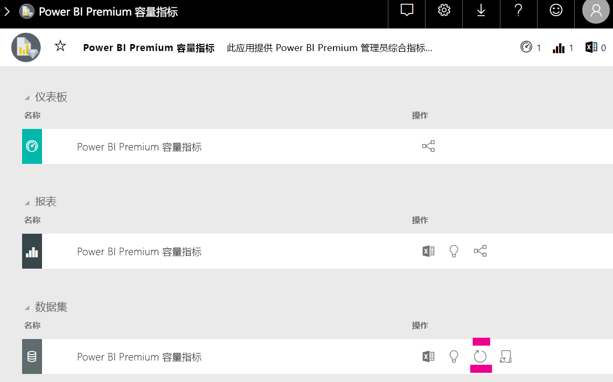

# Power BI 嵌入式分析中的容量计划

计算 Power BI 嵌入式分析部署所需的容量类型可能很复杂。 这是因为此计算基于多个参数，其中一些很难预测。

计划容量时需要考虑的一些事项包括：

* 要使用的数据模型
* 必需查询的数量和复杂度
* 应用程序使用情况的每小时分布
* 数据刷新频率
* 难以预测的其他使用模式。

本文旨在简化 Power BI 嵌入式分析的容量计划，具体是通过引入 [Power BI 专用容量负载评估工具](https://github.com/microsoft/PowerBI-Tools-For-Capacities/tree/master/LoadTestingPowerShellTool/)，此工具是为了自动执行 Power BI 嵌入式分析容量（A  、EM  或 P  SKU）的负载测试而创建的。

## 计划工具

 [Power BI 专用容量负载评估工具](https://github.com/microsoft/PowerBI-Tools-For-Capacities/tree/master/LoadTestingPowerShellTool/)有助于了解容量可以处理多少用户负载。 它使用 PowerShell 对容量创建自动负载测试，并可便于选择要测试哪些报表，以及要模拟多少并发用户。

此工具通过持续使用新筛选器值呈现各个报表来生成容量负载（以防由于报表缓存而导致不切实际的良好性能），直到针对服务验证此工具所需的令牌到期。

### 使用计划工具

运行此工具时，请注意容量中的现有负载，并确保在使用高峰时段期间不运行负载测试。

下面举例说明了此计划工具的一些用途。

* 容量管理员可以更好地了解容量在给定期限内可以处理多少用户。
* 报表作者可以了解用户负载效果，就像使用 Power BI Desktop [性能分析器](https://docs.microsoft.com/power-bi/desktop-performance-analyzer)进行度量一样。
* 可以在浏览器中实时呈现。
* 使用 SQL Server Profiler，可以[连接到正在度量的容量的 XMLA 终结点](https://powerbi.microsoft.com/blog/power-bi-open-platform-connectivity-with-xmla-endpoints-public-preview/)，以查看正在执行的查询。
* 可以在 Premium Capacity Metrics 应用的“数据集”页中查看负载测试效果。 容量管理员可以使用此工具生成负载，并查看相应负载如何呈现。

### 审阅测试结果

若要在测试运行后在 Metrics 应用中查看负载测试效果，请按照下面的说明操作。 从测试开始生成负载到 Metrics 应用中显示负载，预计最长会有 15 分钟的延迟。

1. 展开 [Metrics 应用](../../service-admin-premium-monitor-capacity.md)登陆页面的“数据集”  选项卡。
2. 单击“立即刷新”  ，启动按需刷新。 管理员应该。

    

## Power BI 容量工具 GitHub 存储库

[Power BI 容量工具 GitHub 存储库](https://github.com/microsoft/PowerBI-Tools-For-Capacities)是为了托管容量计划工具以及未来的其他工具和实用工具而创建的。

此存储库是开放源代码的，并且鼓励用户参与、添加与 Power BI Premium 和 Power BI Embedded 容量相关的其他工具，同时改进现有工具。

## 后续步骤

> [!div class="nextstepaction"]
>[Power BI 嵌入式分析中的容量和 SKU](embedded-capacity.md)

> [!div class="nextstepaction"]
>[Power BI Embedded 性能最佳做法](embedded-performance-best-practices.md)