# <a name="row-level-security-with-power-bi-embedded"></a>Power BI Embedded 的行级安全性

行级别安全性 (RLS)  可用于限制用户访问仪表板、磁贴、报表和数据集中的数据。 这样一来，各个用户虽然处理的是相同项目，但看到的数据却不同。 嵌入支持 RLS。

如果要为非 Power BI 用户（应用拥有数据）嵌入（通常是 ISV 方案），那本文很适合你！ 请配置嵌入令牌，以将用户和角色考虑在内。

若要嵌入给组织内的 Power BI 用户（用户拥有数据），RLS 的工作方式与其直接在 Power BI 服务中的工作方式相同。 你无需在应用程序中执行其他任何操作。 有关详细信息，请参阅 [Power BI 行级别安全性 (RLS)](../../service-admin-rls.md)。


要利用 RLS，务必要了解三个主要概念：用户、角色和规则。 让我们仔细了解这些概念：

用户  – 查看项目（仪表板、磁贴、报表或数据集）的最终用户。 在 Power BI Embedded 中，用户由嵌入令牌中的 username 属性进行标识。

**角色** – 用户属于角色。 角色是规则的容器，并可以命名为“销售经理”  或“销售代表”  之类的名称。可以在 Power BI Desktop 中创建角色。 有关详细信息，请参阅 [Power BI Desktop 行级别安全性 (RLS)](../../desktop-rls.md)。

**规则** – 角色具有规则，并且这些规则要应用于数据的实际筛选器。 这些规则可以像“国家/地区 = 美国”一样简单，也可以是更动态的规则。
在本文的剩余部分中，举例介绍了如何创作 RLS，再在已嵌入应用程序中使用此示例。 我们的示例使用[零售分析示例](https://go.microsoft.com/fwlink/?LinkID=780547) PBIX 文件。


## <a name="adding-roles-with-power-bi-desktop"></a>使用 Power BI Desktop 添加角色

“零售分析”示例  显示了所有零售连锁店的销售额。 如果不使用 RLS，无论哪个地区经理登录和查看报表，看到的数据全都相同。 高级管理人员已确定，每个地区经理只能看到自己所管理连锁店的销售额。 使用 RLS，高级管理人员可以根据地区经理限制数据。

RLS 在 Power BI Desktop 中进行编写。 当打开数据集和报表时，我们可以切换到关系图视图来查看架构：


下面介绍了此架构的几个注意事项：

* 所有度量值（例如，总销售额  ）均存储在“销售”  事实数据表中。
* 另外还有四个相关维度表：“项目”  、“时间”  、“商店”  和“地区”  。
* 关系行上的箭头指示筛选器从一个表流向另一个表的方式。 例如，如果筛选器位于“时间[日期]”  上，在当前架构中，它将仅筛选出“销售”  表中的值。 由于关系行上的所有箭头均指向“销售”表，不会改变，因此，其他表不会受此筛选器的影响。
* “地区”  表指示每个区的经理：
  
    

根据此架构，如果我们将匹配查看报表的用户的筛选器应用于“地区”  表中的“地区经理”  列，此筛选器会通篇筛选“连锁店”  和“销售额”  表，以筛选出相应地区经理能看到的数据。

下面介绍如何操作：

1. 在“建模”  选项卡中，选择“管理角色”  。

    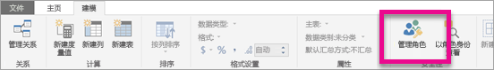
2. 创建名为“经理”  的新角色。

    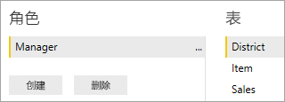
3. 在“地区”  表中，输入以下 DAX 表达式：[District Manager] = USERNAME()  。

    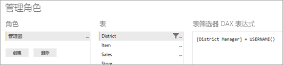
4. 为了确保这些规则能够生效，请在“建模”  选项卡上选择“以角色身份查看”  ，再选中已创建的“经理”  角色和“其他用户”  。 输入 AndrewMa  作为用户。

    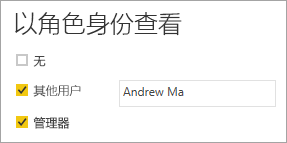

    此时，报表显示数据，就像你是以 AndrewMa  身份登录时一样。

应用该筛选器（我们此处进行的操作）筛选出“地区”  、“商店”  和“销售”  表中的所有记录。 不过，鉴于“销售额”  和“时间”  之间关系的筛选方向，“销售额”  和“项”  以及“项”  和“时间”  表不会进行通篇筛选。 要了解有关双向交叉筛选的详细信息，请下载 [SQL Server Analysis Services 2016 和 Power BI Desktop 中的双向交叉筛选](https://download.microsoft.com/download/2/7/8/2782DF95-3E0D-40CD-BFC8-749A2882E109/Bidirectional%20cross-filtering%20in%20Analysis%20Services%202016%20and%20Power%20BI.docx)白皮书。

## <a name="applying-user-and-role-to-an-embed-token"></a>将用户和角色应用于签入令牌

至此，已配置 Power BI Desktop 角色。必须在应用程序中执行一些其他操作，才能利用角色。

用户由应用程序进行身份验证和授权，而嵌入令牌用于授予用户对特定 Power BI Embedded 报表的访问权限。 Power BI Embedded 不具备有关用户身份的任何特定信息。 为了让 RLS 能够正常运行，必须将某附加上下文作为标识形式的嵌入令牌的一部分进行传递。 可使用[嵌入令牌](https://docs.microsoft.com/rest/api/power-bi/embedtoken) API 来传递标识。

API 接受具有相关数据集指示的标识列表。 为了让 RLS 能够正常运行，必须将以下各部分内容作为标识的一部分进行传递。

* **用户名（必需）** - 有助于在应用 RLS 规则时标识用户的字符串。 只能列出单个用户。 可以使用 ASCII  字符创建用户名。
* **角色（必填）** – 一个字符串，包含在应用“行级别安全性”规则时要选择的角色。 如果传递多个角色，则这些角色应该作为字符串数组传递。
* **数据集（必需）** - 适用于要嵌入的项目的数据集。

可以通过使用 PowerBIClient.Reports  上的 GenerateTokenInGroup  创建嵌入令牌。

例如，可以更改 [PowerBIEmbedded_AppOwnsData](https://github.com/microsoft/PowerBI-Developer-Samples/tree/master/.NET%20Framework/App%20Owns%20Data/PowerBIEmbedded_AppOwnsData) 示例。 “Services\EmbedService.cs 第 76 行和第 77 行”可以从以下位置更新  ：

```csharp
// Generate Embed Token.
var generateTokenRequestParameters = new GenerateTokenRequest(accessLevel: "view");

var tokenResponse = await client.Reports.GenerateTokenInGroupAsync(GroupId, report.Id, generateTokenRequestParameters);
```

to

```csharp
var generateTokenRequestParameters = new GenerateTokenRequest("View", null, identities: new List<EffectiveIdentity> { new EffectiveIdentity(username: "username", roles: new List<string> { "roleA", "roleB" }, datasets: new List<string> { "datasetId" }) });

var tokenResponse = await client.Reports.GenerateTokenInGroupAsync("groupId", "reportId", generateTokenRequestParameters);
```

如果调用的是 REST API，更新后的 API 现在接受包含用户名、字符串角色列表和字符串数据集列表的附加 JSON 数组“标识”  。 

使用下面的示例代码：

```json
{
    "accessLevel": "View",
    "identities": [
        {
            "username": "EffectiveIdentity",
            "roles": [ "Role1", "Role2" ],
            "datasets": [ "fe0a1aeb-f6a4-4b27-a2d3-b5df3bb28bdc" ]
        }
    ]
}
```

现在，将所有都组合在一起后，若有人登录应用程序查看此项目，只能看到行级别安全性规定允许其查看的数据。

## <a name="working-with-analysis-services-live-connections"></a>使用 Analysis Services 实时连接

行级别安全性可用于本地服务器的 Analysis Services 实时连接。 使用这种类型的连接时，应该了解一些具体的概念。

为用户名属性提供的有效标识必须是具有 Analysis Services 服务器操作权限的 Windows 用户。

>[!NOTE]
> 使用带有 [Azure Analysis Services](https://docs.microsoft.com/azure/analysis-services/analysis-services-overview) 数据源的服务主体时，服务主体本身必须具有 Azure Analysis Services 实例权限。 使用包含服务主体的安全组来实现此目的，这不起作用。

### <a name="on-premises-data-gateway-configuration"></a>本地数据网关配置

在使用 Analysis Services 实时连接时，将使用[本地数据网关](../../service-gateway-onprem.md)。 当生成嵌入令牌时，如果列出标识，则主帐户需要列为网关的管理员。 如果主帐户未列出，行级别安全性不会应用于数据属性。 网关的非管理员可以提供角色，但必须为有效标识指定其自己的用户名。

### <a name="use-of-roles"></a>使用角色

可以在嵌入令牌中通过标识提供角色。 如果没有提供角色，则提供的用户名可用于解析相关角色。

### <a name="using-the-customdata-feature"></a>使用 CustomData 功能

CustomData 功能仅适用于驻留在 Azure Analysis Services  中的模型，并且仅在“实时连接”  模式下才起作用。 与用户和角色不同的是，CustomData 功能不能在 .pbix 文件中设置。 必须有用户名，才能使用 CustomData 功能生成令牌。

借助 CustomData 功能，可以在应用程序中查看将 Azure Analysis Services  用作数据源的 Power BI 数据（在应用程序中查看已连接到 Azure Analysis Services 的 Power BI 数据）时添加行筛选器。

借助 CustomData 功能，可使用 CustomData 连接字符串属性传递自定义文本（字符串）。 Analysis Services 通过 CUSTOMDATA() 函数使用此值  。

在 Azure Analysis Services  中使用动态 RLS（使用动态值进行筛选器计算）的唯一方法是，使用 CUSTOMDATA()  函数。

可以在角色 DAX 查询中使用它，并且可以在度量值 DAX 查询中使用，而无需任何角色。
CustomData 功能属于令牌生成功能，适用于以下项目：仪表板、报表和磁贴。 仪表板可以具有多个 CustomData 标识（每个磁贴/模型一个）。

#### <a name="customdata-sdk-additions"></a>CustomData SDK 添加

CustomData 字符串属性已添加到令牌生成方案中的有效标识。

```json
[JsonProperty(PropertyName = "customData")]
public string CustomData { get; set; }
```

借助以下调用，可使用自定义数据创建标识：

```csharp
public EffectiveIdentity(string username, IList<string> datasets, IList<string> roles = null, string customData = null);
```

#### <a name="customdata-sdk-usage"></a>CustomData SDK 用法

若要调用 REST API，可以在每个标识中添加自定义数据，例如：

```json
{
    "accessLevel": "View",
    "identities": [
        {
            "username": "EffectiveIdentity",
            "roles": [ "Role1", "Role2" ],
            "customData": "MyCustomData",
            "datasets": [ "fe0a1aeb-f6a4-4b27-a2d3-b5df3bb28bdc" ]
        }
    ]
}
```

下面逐步介绍了如何开始为 Power BI Embedded 应用程序设置 CustomData() 功能。

1. 创建 Azure Analysis Services 数据库。 然后，通过 [SQL Server Management Studio](https://docs.microsoft.com/sql/ssms/download-sql-server-management-studio-ssms?view=sql-server-2017) 登录 Azure Analysis Services 服务器。

    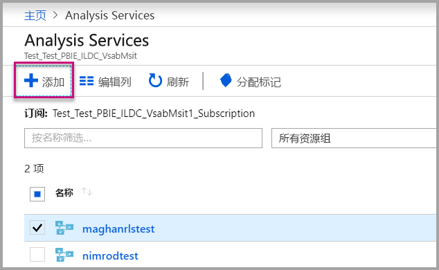

    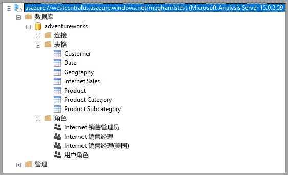

2. 在 Analysis Services 服务器中创建角色。

    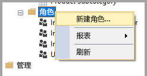

3. 设置“常规”  设置。  此时，提供“角色名称”  ，并将数据库权限设置为“只读”  。

    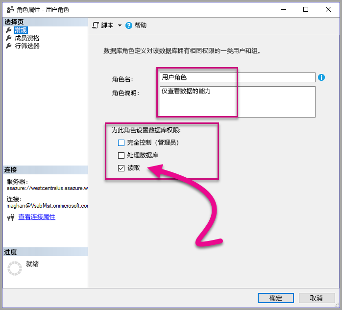

4. 设置“成员资格”  设置。 此时，添加受此角色影响的用户。

    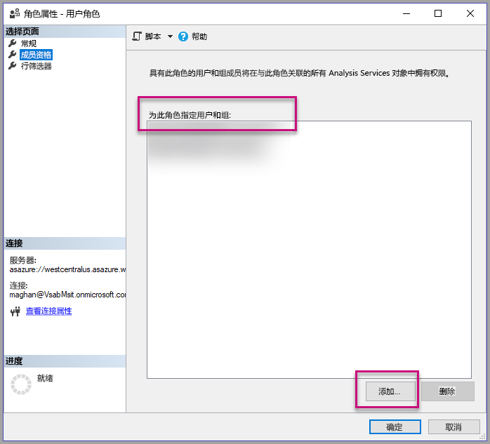

5. 使用 CUSTOMDATA()  函数设置  “行筛选器”DAX 查询。

    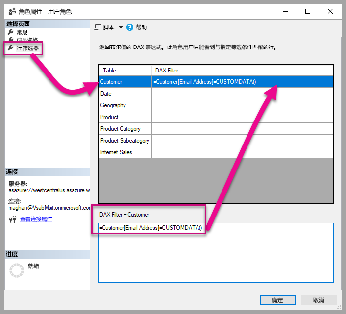

6. 生成 PBI 报表，并将它发布到包含专用容量的工作区中。

    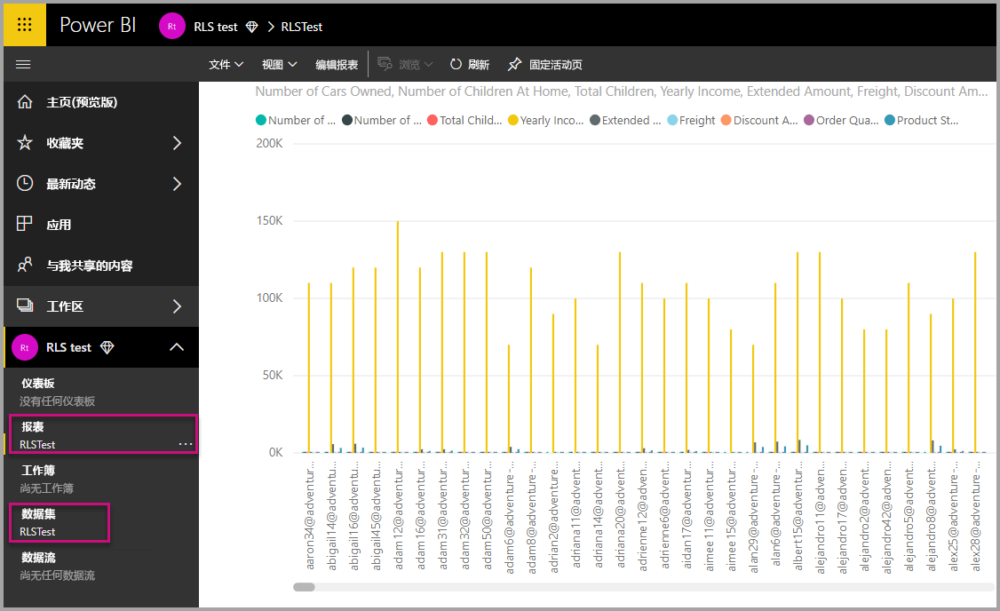

7. 使用 Power BI API 在应用程序中使用 CustomData 功能。  必须有用户名，才能使用 CustomData 功能生成令牌。 用户名必须等于主用户的 UPN。 主用户必须是你创建的一个或多个角色的成员。 如果未指定任何角色，主用户所属的全部角色都用于 RLS 计算。

    使用[服务主体](embed-service-principal.md)时，还需要执行上述步骤来代替使用主帐户。 生成嵌入令牌时，使用[服务主体对象 ID](embed-service-principal.md) 作为用户名。

    > [!Note]
    > 如果你已准备好将应用程序部署到生产，主用户帐户字段或选项不得对最终用户可见。

    查看用于添加 CustomData 功能的[代码](#customdata-sdk-additions)。

8. 现在可以在应用 CustomData 值前查看应用程序中的报表，以查看报表包含的所有数据。

    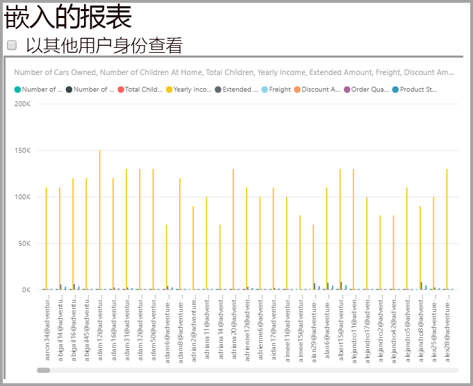

    然后，应用一个或多个 CustomData 值，看看报表是如何显示不同数据集的。
    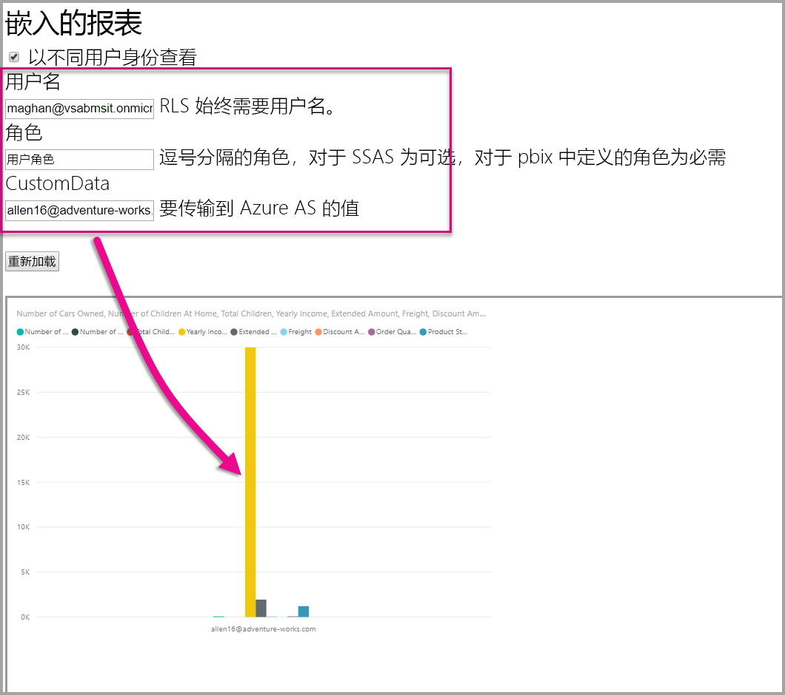

## <a name="using-rls-vs-javascript-filters"></a>使用 RLS 与 JavaScript 筛选器

决定筛选报表数据时，可使用行级别安全性 (RLS)  或 JavaScript 筛选器  。

[行级别安全性](../../service-admin-rls.md)是在数据模型一级筛选数据的功能。 后端数据源可控制 RLS 设置。 根据数据模型，嵌入令牌生成流程会为会话设置用户名和角色。 客户端代码无法替代、删除或控制它，正因为此，它被视为安全。 建议将 RLS 用于数据的安全筛选。 若要使用 RLS 筛选数据，可采用下列方法之一。

* [在 Power BI 报表中配置角色](../../desktop-rls.md)。
* 在数据源一级配置角色（仅限 Analysis Services 实时连接）。
* 使用 `EffectiveIdentity` 以编程方式生成[嵌入令牌](https://docs.microsoft.com/rest/api/power-bi/embedtoken/datasets_generatetokeningroup)。 使用嵌入令牌时，实际筛选器为特定会话传递嵌入令牌。

使用 [JavaScript 筛选器](https://github.com/Microsoft/PowerBI-JavaScript/wiki/Filters#page-level-and-visual-level-filters)，可允许用户使用已减少、已限定范围或已筛选的数据视图。 不过，用户仍有权访问模型架构表、列和度量值，并能访问其中任意数据。 限制数据访问只能通过 RLS 应用，不能通过客户端筛选 API 应用。

## <a name="token-based-identity-with-azure-sql-database"></a>基于令牌的标识与 Azure SQL 数据库

基于令牌的标识  允许你指定嵌入令牌的有效标识，方法是为 Azure SQL 数据库  使用 Azure Active Directory (AAD)  访问令牌。

将数据保存在 Azure SQL数据库  中的客户，现在可以在与 Power BI Embedded  集成时，使用新功能来管理用户以及他们对 Azure SQL 中数据的访问。

在生成嵌入令牌时，可以在 Azure SQL 中指定用户的有效标识。 通过将 AAD 访问令牌传递到服务器，可以指定用户的有效标识。 访问令牌仅用于从 Azure SQL 中为特定会话提取该用户的相关数据。

它可以用于在 Azure SQL 中管理每个用户的视图，或者以多租户数据库中特定客户的身份登录到 Azure SQL。 还可以在 Azure SQL 中对该会话应用行级别安全性，并且只检索该会话的相关数据，而无需在 Power BI 中管理 RLS。

此类有效标识问题直接应用于 Azure SQL Server 上的 RLS 规则。 Power BI Embedded 在从 Azure SQL Server 查询数据时使用提供的访问令牌。 可通过 USER_NAME() SQL 函数访问用户的UPN（已为其提供访问令牌）。

基于令牌的标识只适用于专用容量上的 DirectQuery 模型 - 连接到 Azure SQL 数据库，该数据库被配置为允许进行 AAD 身份验证（[详细了解 Azure SQL 数据库的 AAD 身份验证](https://docs.microsoft.com/azure/sql-database/sql-database-manage-logins)）。 数据集的数据源必须配置为使用最终用户的 OAuth2 凭据，以使用基于令牌的标识。

   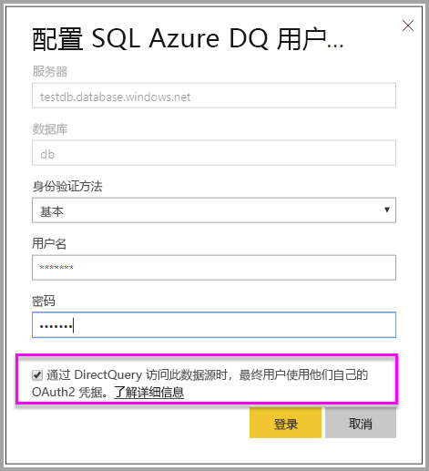

### <a name="token-based-identity-sdk-additions"></a>基于令牌的标识 SDK 添加件

标识 blob 属性已添加到令牌生成方案中的有效标识。

```JSON
[JsonProperty(PropertyName = "identityBlob")]
public IdentityBlob IdentityBlob { get; set; }
```

IdentityBlob 类型是包含值字符串属性的简单 JSON 结构

```JSON
[JsonProperty(PropertyName = "value")]
public string value { get; set; }
```

借助以下调用，可使用标识 blob 创建 EffectiveIdentity：

```C#
public EffectiveIdentity(string username, IList<string> datasets, IList<string> roles = null, string customData = null, IdentityBlob identityBlob = null);
```

可以使用以下调用创建标识 blob。

```C#
public IdentityBlob(string value);
```

### <a name="token-based-identity-rest-api-usage"></a>基于令牌的标识 REST API 的使用情况

若要调用 [REST API](/rest/api/power-bi/embedtoken/reports_generatetokeningroup#definitions)，可以在每个标识中添加标识 blob。

```JSON
{
    "accessLevel": "View",
    "identities": [
        {
            "datasets": ["fe0a1aeb-f6a4-4b27-a2d3-b5df3bb28bdc"],
        "identityBlob": {
            "value": "eyJ0eXAiOiJKV1QiLCJh…."
         }
        }
    ]
}
```

标识 blob 中提供的值应是 Azure SQL Server 的有效访问令牌（资源 URL 为 (<https://database.windows.net/>)）。

   > [!Note]
   > 要为 Azure SQL 创建访问令牌，应用程序必须在 Azure 门户中的 AAD 应用程序注册配置上具有“访问 Azure SQL DB 和数据仓库”  的委派权限，以访问 Azure SQL 数据库  API。

   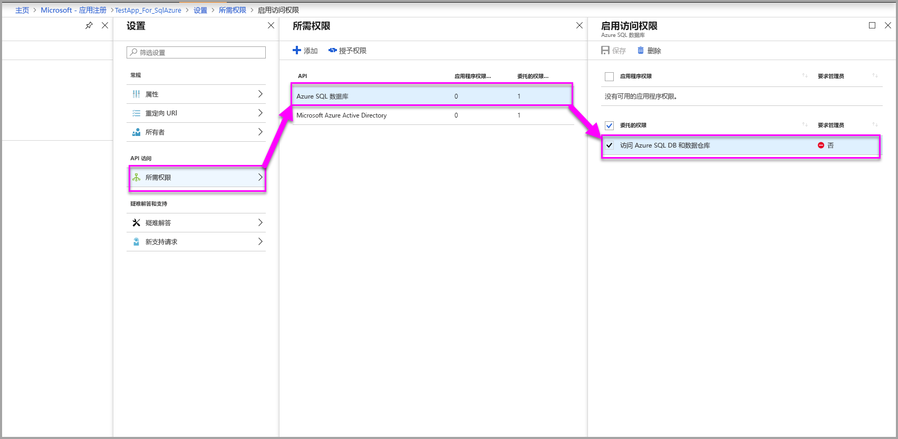

## <a name="on-premises-data-gateway-with-service-principal"></a>本地数据网关与服务主体

如果与 Power BI Embedded 集成，则使用 SQL Server Analysis Services (SSAS) 本地实时连接数据源配置行级别安全性 (RLS) 的客户能够享受使用新的[服务主体](embed-service-principal.md)功能管理用户及其对 SSAS 中数据的访问权限  。

通过 [Power BI REST API](https://docs.microsoft.com/rest/api/power-bi/) 可以使用[服务主体对象](https://docs.microsoft.com/azure/active-directory/develop/app-objects-and-service-principals#service-principal-object)为嵌入令牌指定 SSAS 本地实时连接的有效标识。

到目前为止，为能够指定 SSAS 本地实时连接的有效标识，生成嵌入令牌的主用户必须是网关管理员。现在，不需要用户是网关管理员，网关管理员可为该数据源授予用户专用权限，这使用户能够在生成嵌入令牌时覆盖有效标识。 此项新功能支持使用实时 SSAS 连接的服务主体进行嵌入。

若要支持此方案，网关管理员使用[添加数据源用户 REST API](https://docs.microsoft.com/rest/api/power-bi/gateways/adddatasourceuser) 对服务主体授予 Power BI Embedded 的 ReadOverrideEffectiveIdentity 权限  。

无法通过管理门户设置此权限。 只能使用 API 设置此权限。 在管理门户中，可以看到具有此类权限的用户和 SPN 指示。

## <a name="considerations-and-limitations"></a>注意事项和限制

* 使用嵌入令牌时，在 Power BI 服务中将用户分配到角色不会影响 RLS。
* 虽然 Power BI 服务不会将 RLS 设置应用于管理员或拥有编辑权限的成员，但如果你提供具有嵌入令牌的标识，它也会应用于数据。
* 本地服务器支持 Analysis Services 实时连接。
* Azure Analysis Services 实时连接支持按角色筛选。 可使用 CustomData 执行动态筛选。
* 如果基础数据集不需要 RLS，则 GenerateToken 请求不  得包含有效的标识。
* 如果基础数据集是云模型（已缓存模型或 DirectQuery），有效标识至少必须包含一个角色，否则无法执行角色分配。
* 使用标识列表可以嵌入仪表板的多个标识标记。 对于其他所有项目，该列表包含单个标识。

### <a name="token-based-identity-limitations"></a>基于令牌的标识限制

* 只有拥有专用容量，才能使用 RLS。
* RLS 不适用于本地 SQL Server。

更多问题？ [尝试咨询 Power BI 社区](https://community.powerbi.com/)
