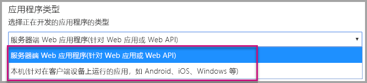
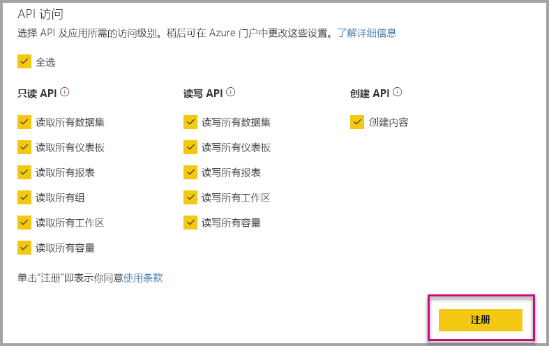
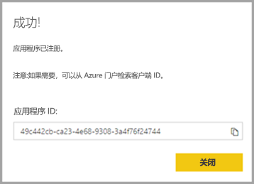
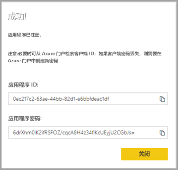

# <a name="register-an-azure-ad-application-to-use-with-power-bi"></a>注册 Azure AD 应用程序以使用 Power BI

了解如何在 Azure Active Directory (Azure AD) 中注册应用程序，用于嵌入 Power BI 内容。

在 Azure AD 中注册应用程序后，该应用程序将能够访问 [Power BI REST API](https://docs.microsoft.com/rest/api/power-bi/)。 注册应用后，可以建立应用标识，并指定对 Power BI REST 资源的权限。

> [!IMPORTANT]
> 注册 Power BI 应用之前，需要一个 [Azure Active Directory 租户和一个组织用户](create-an-azure-active-directory-tenant.md)。 如果尚未以租户中的用户身份注册 Power BI，则无法成功完成应用注册。

注册应用程序有两种方法。 第一种方法是使用 [Power BI 应用注册工具](https://dev.powerbi.com/apps/)，第二种方法是直接在 Azure 门户中注册。 使用 Power BI 应用注册工具时，只需填充几个字段即可，因此使用起来较为方便。 若要更改应用，请使用 Azure 门户。

## <a name="register-with-the-power-bi-application-registration-tool"></a>使用 Power BI 应用程序注册工具注册

在  Azure Active Directory 中注册你的应用程序，以便为应用程序建立标识，并指定对 Power BI REST 资源的权限。 注册控制台应用或网站等应用程序时，用户会收到一个标识符，应用程序使用该标识符向被请求权限的用户标识自己的身份。

下面介绍如何使用 Power BI 应用注册工具注册应用程序：

1. 转到 [dev.powerbi.com/apps](https://dev.powerbi.com/apps)。

2. 选择“使用现有帐户登录”，然后选择“下一步”   。

3. 提供“应用程序名称”  。

4. 提供“应用程序类型”  。

    以下说明了对于应用程序类型选择“本机”而不是“服务器端 Web 应用程序”的原因差别   。

    本机：
    * 计划创建的应用程序[设计用于客户](embed-sample-for-customers.md)，这些客户使用主用户帐户（用于登录 Power BI 的 Power BI Pro 许可证）进行身份验证。

    服务器端 Web 应用程序：
    * 计划创建的应用程序[设计用于组织](embed-sample-for-your-organization.md)。
    * 计划创建的应用程序[设计用于客户](embed-sample-for-customers.md)，这些客户使用服务主体进行身份验证。
    * 计划创建 Web 应用或 Web API。

    

5. 如果对应用程序类型选择“服务器端 Web 应用程序”，然后继续输入“主页 URL”和“重定向 URL”的值    。 “重定向 URL”适用于任何有效 URL，并且应适合创建的应用程序  。 如果已选择“本机”，则转至步骤 6  。

6. 选择应用程序需要的 Power BI API。 有关 Power BI 访问权限的详细信息，请参阅 [Power BI 权限](power-bi-permissions.md)。 然后选择“注册”  。

    

    > [!Important]
    > 如果使服务主体可用于 Power BI，则 Azure Active Directory 权限将不再有效。 通过 Power BI 管理门户管理权限。

7. 如果对应用程序类型选择“本机”，则系统会提供“应用程序 ID”   。 如果对应用程序类型选择“服务器端 Web 应用”，则系统会提供“应用程序 ID”和“应用程序密码”    。

    > [!Note]
    > 如有需要，稍后可以从 Azure 门户中检索应用程序 ID  。 如果忘记了应用程序密码，则需要在 Azure 门户中新建一个密码  。

| 本地 | 服务器端 Web 应用程序 |
|--------|-----------------------------|
|  |  |

现在，可以将注册的应用程序作为自定义应用程序使用，以与 Power BI 服务和 Power BI Embedded 应用程序交互。

## <a name="register-with-the-azure-portal"></a>使用 Azure 门户注册

注册应用程序还有另一种选择，即直接在 Azure 门户中注册。 请按照下列步骤注册你的应用程序。

1. 接受 [Microsoft Power BI API 条款](https://powerbi.microsoft.com/api-terms)。

2. 登录到 [Azure 门户](https://portal.azure.com)。

3. 在页面右上角选择你的帐户，从而选择你的 Azure AD 租户。

4. 在左侧导航窗格中，转到“所有服务”，选择“应用注册”，然后选择“新注册”    。

5. 按照提示进行操作，并创建新的应用程序。

   有关如何在 Azure Active Directory 中注册应用程序的详细信息，请参阅[向 Azure Active Directory 注册应用](https://docs.microsoft.com/azure/active-directory/develop/quickstart-v2-register-an-app)

## <a name="how-to-get-the-application-id"></a>如何获取应用程序 ID

注册应用程序时，你将收到一个[应用程序 ID](embed-sample-for-customers.md#application-id)。  应用程序 ID 请求应用程序用户的权限以标识其自身  。

## <a name="how-to-get-the-service-principal-object-id"></a>如何获取服务主体对象 ID

使用 [Power BI API](https://docs.microsoft.com/rest/api/power-bi/) 时，请务必使用[服务主体对象 ID](embed-service-principal.md) 定义操作以引用服务主体 - 例如，以管理员身份将服务主体应用于工作区。

## <a name="apply-permissions-to-your-application-within-azure-ad"></a>在 Azure AD 中向应用授予权限

除了应用注册页中提供的权限之外，还需要对应用程序启用其他权限。 可以通过 Azure AD 门户或以编程方式完成此任务。

需要使用用于嵌入内容的主  帐户登录，或使用全局管理员帐户登录。

### <a name="using-the-azure-ad-portal"></a>使用 Azure AD 门户

1. 在 Azure 门户中，转到[应用注册](https://portal.azure.com/#blade/Microsoft_AAD_RegisteredApps/ApplicationsListBlade/quickStartType//sourceType/)，然后选择要用于嵌入内容的应用。

2. 选择“管理”   下的“API 权限”。

3. 在“API 权限”   中，选择“添加权限”，  然后选择“Power BI 服务”。

    

4. 在“委派权限”  下选择所需的特定权限。 逐一选中这些选项以保存所做的选择。 完成时选择“保存”  。

5. 选择“授予同意”  。

    需要为“主帐户”  调用“授予同意”  操作，以免 Azure AD 提示提供内容。 如果执行此操作的帐户是全局管理员，会向组织内此应用的所有用户授予权限。 如果执行此操作的帐户是主帐户，而不是全局管理员，将仅向此应用程序的主帐户授予权限   。

### <a name="applying-permissions-programmatically"></a>以编程方式应用权限

1. 需要获取租户中的现有服务主体（用户）。 有关如何执行该操作的信息，请参阅 [servicePrincipal](https://docs.microsoft.com/graph/api/resources/serviceprincipal?view=graph-rest-beta)。

    可以调用 Get servicePrincipal API 而无需使用 {ID}，这将使你获取租户中的所有服务主体  。

2. 使用作为“appId”属性的应用的应用程序 ID 检查服务主体  。

3. 如果应用缺少服务计划，请新建一个。

    ```json
    Post https://graph.microsoft.com/beta/servicePrincipals
    Authorization: Bearer ey..qw
    Content-Type: application/json
    {
    "accountEnabled" : true,
    "appId" : "{App_Client_ID}",
    "displayName" : "{App_DisplayName}"
    }
    ```

4. 向 Power BI API 授予应用权限

   如果使用的是现有租户，并且不希望向所有租户用户授予权限，可以将 contentType 值替换为 Principal，向特定用户授予权限   。

   consentType 值可提供 AllPrincipals 或 Principal    。

   * AllPrincipals 仅可由租户管理员使用，用于代表租户中的所有用户授予权限  。
   * Principal 用于代表特定用户授予权限  。 在此情况下，应将附加属性添加到请求正文 - principalId={User_ObjectId}  。

     主帐户若要避免收到获取 Azure AD 同意的提示，需要“获取权限”，而这在进行非交互式登录情况下是不可能的  。

     ```json
     Post https://graph.microsoft.com/beta/OAuth2PermissionGrants
     Authorization: Bearer ey..qw
     Content-Type: application/json
     {
     "clientId":"{Service_Plan_ID}",
     "consentType":"AllPrincipals",
     "resourceId":"c78a3685-1ce7-52cd-95f7-dc5aea8ec98e",
     "scope":"Dataset.ReadWrite.All Dashboard.Read.All Report.Read.All Group.Read Group.Read.All Content.Create Metadata.View_Any Dataset.Read.All Data.Alter_Any",
     "expiryTime":"2018-03-29T14:35:32.4943409+03:00",
     "startTime":"2017-03-29T14:35:32.4933413+03:00"
     }
     ```

    resourceId c78a3685-1ce7-52cd-95f7-dc5aea8ec98e 不是通用的，而是与租户相关   。 此值是 Azure Active Directory (AAD) 租户中“Power BI 服务”应用程序的 objectId。

    用户可在 Azure 门户中快速获取此值：
    1. https://portal.azure.com/#blade/Microsoft_AAD_IAM/StartboardApplicationsMenuBlade/AllApps

    2. 在搜索框中搜索“Power BI 服务”

5. 向 Azure Active Directory (AAD) 授予应用权限

   consentType 值可提供 AllPrincipals 或 Principal    。

   * AllPrincipals 只能由租户管理员用于向租户中的所有用户授予权限  。
   * Principal  用于向特定用户授予权限。 在此情况下，应将附加属性添加到请求正文 - principalId={User_ObjectId}  。

   主帐户若要避免收到获取 Azure AD 同意的提示，需要“获取权限”，而这在进行非交互式登录情况下是不可能的  。

   ```json
   Post https://graph.microsoft.com/beta/OAuth2PermissionGrants
   Authorization: Bearer ey..qw
   Content-Type: application/json
   { 
   "clientId":"{Service_Plan_ID}",
   "consentType":"AllPrincipals",
   "resourceId":"61e57743-d5cf-41ba-bd1a-2b381390a3f1",
   "scope":"User.Read Directory.AccessAsUser.All",
   "expiryTime":"2018-03-29T14:35:32.4943409+03:00",
   "startTime":"2017-03-29T14:35:32.4933413+03:00"
   }
   ```

## <a name="next-steps"></a>后续步骤

至此，已在 Azure AD 中注册了应用程序，需要在应用程序中对用户进行身份验证。 若要了解详细信息，请参阅[对用户进行身份验证，并获取 Power BI 应用的 Azure AD 访问令牌](get-azuread-access-token.md)。

更多问题？ [尝试咨询 Power BI 社区](https://community.powerbi.com/)