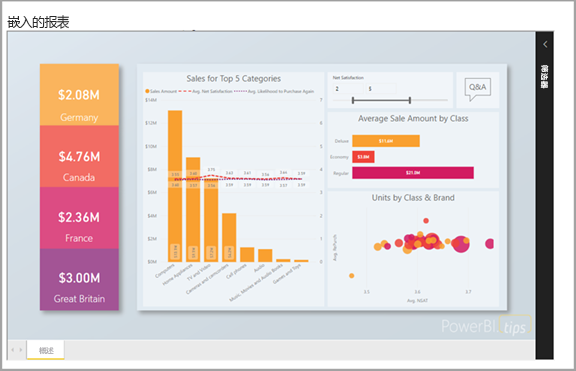
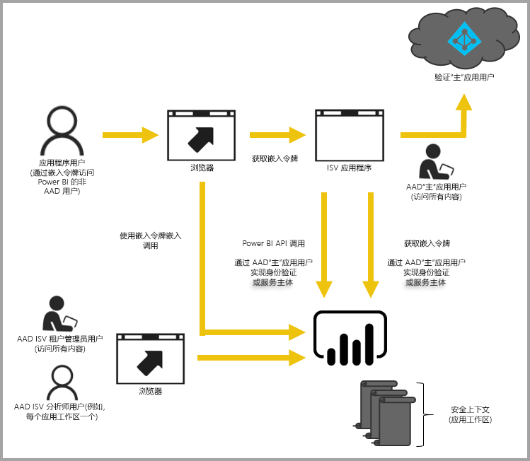

# Power BI 嵌入式分析

Azure (PaaS) 中的 Power BI 服务 (SaaS) 和 Power BI 嵌入式服务具有用于嵌入仪表板和报表的 API。 当嵌入内容，这样，您可以访问到最新的 Power BI 功能，如仪表板、 网关和应用工作区。

可使用[嵌入安装程序工具](https://aka.ms/embedsetup)快速开始并下载示例应用程序。

选择最适合你的解决方案：

* 通过[为组织嵌入内容](embedding.md#embedding-for-your-organization)，可以扩展 Power BI 服务。 若要执行此操作，实现[为组织嵌入](https://aka.ms/embedsetup/UserOwnsData)解决方案。
* [为客户嵌入](embedding.md#embedding-for-your-customers)使您可以嵌入仪表板和报表复制到未安装 Power BI 帐户的用户。 若要执行此操作，实现[嵌入你的客户](https://aka.ms/embedsetup/AppOwnsData)解决方案。

## 使用 Api

有两个嵌入 Power BI 内容的主要方案：
- 为你组织的用户 （拥有 Power BI 许可证） 嵌入内容。 
 
- 为你的用户和不需要 Power BI 许可证的客户嵌入内容。 

[Power BI REST API](https://docs.microsoft.com/rest/api/power-bi/)允许这两种情况。

对于没有 Power BI 许可证的客户和用户，可以使用同一 API 为组织或客户提供服务，将仪表板和报表嵌入自定义应用程序中。 客户会看到应用程序管理的数据。 此外，你组织的 Power BI 用户具有其他选项，以查看*其数据*直接在 Power BI 或嵌入式应用程序的上下文中。 可以充分利用 JavaScript 和 REST API 的功能以满足你的嵌入需要。

若要了解如何嵌入工作原理，请参阅[JavaScript 嵌入示例](https://microsoft.github.io/PowerBI-JavaScript/demo/)。

## 为组织嵌入内容

通过**为组织嵌入内容**，可以扩展 Power BI 服务。 此嵌入需要应用程序的用户登录到 Power BI 服务以查看内容。 组织中的用户登录后，只能访问他们拥有的，或者他们在 Power BI 服务中共享的仪表板和报表。

组织嵌入示例包括内部应用程序如下所述[SharePoint Online](https://powerbi.microsoft.com/blog/integrate-power-bi-reports-in-sharepoint-online/)， [（您必须具有管理员权限） 的 Microsoft Teams 集成](https://powerbi.microsoft.com/blog/power-bi-teams-up-with-microsoft-teams/)，和[Microsoft Dynamics](https://docs.microsoft.com/dynamics365/customer-engagement/basics/add-edit-power-bi-visualizations-dashboard).

若要嵌入为你的组织，请参阅[教程：Power BI 内容嵌入应用程序中为你的组织](embed-sample-for-your-organization.md)。

为 Power BI 用户嵌入内容时，通过 [JavaScript API](https://github.com/Microsoft/PowerBI-JavaScript) 可使用编辑和保存等自助服务功能。

您可通过完成[嵌入安装程序工具](https://aka.ms/embedsetup/UserOwnsData)开始并下载将指导你完成将为你的组织报表集成的示例应用程序。

## 为客户嵌入内容

**为客户嵌入**可以嵌入仪表板和报表的用户没有 Power BI 帐户。 此嵌入是一种也称为*Power BI Embedded*。

[Power BI Embedded](azure-pbie-what-is-power-bi-embedded.md)是**Microsoft Azure**快速允许独立软件供应商 (Isv) 和开发人员服务，将视觉对象、 报表和仪表板嵌入到应用程序。 此嵌入是通过基于容量的、 每小时按流量计费模型。

Power BI Embedded 可让 ISV、其开发人员和客户受益。 例如，ISV 可以使用 Power BI Desktop 开始免费创建视觉对象。 通过尽量减少视觉分析开发工作，Isv 实现更快推向市场的时间，并且通过差异化的数据体验的竞争对手中脱颖而出。 Isv 还可以选择他们具有嵌入式分析创建的附加价值收取。

使用 Power BI Embedded，客户无需了解有关 Power BI 的任何信息。 可以使用两种不同方法来创建嵌入式应用程序：
- Power BI Pro 帐户 
- 服务主体 

Power BI Pro 帐户充当应用程序的主帐户 （将其视为代理帐户）。 此帐户可以生成嵌入令牌，用于访问应用程序的 Power BI 仪表板和报表。

[服务主体](embed-service-principal.md)可以使用仅限应用的令牌将 Power BI 内容嵌入应用程序  。 它还允许您生成嵌入令牌，用于访问应用程序的 Power BI 仪表板和报表。

使用 Power BI Embedded 的开发人员可以更专注于构建应用程序的核心功能而不是支出开发视觉对象和分析的时间。 它们可以快速满足客户的报表和仪表板需求，并轻松地嵌入具有完全有案可稽的 Api 和 Sdk。 通过在应用中启用易于导航的数据浏览，ISV 让客户能够使用任意设备在上下文中快速作出数据驱动型决策。

> [!IMPORTANT]
> 虽然嵌入需要 Power BI 服务，你的客户不需要具有 Power BI 帐户才能查看应用程序的嵌入的内容。 

准备迁移到生产环境时，必须为应用工作区分配专用容量。 Microsoft Azure 中的 Power BI Embedded 提供用于应用程序的[专用容量](azure-pbie-create-capacity.md)。

有关嵌入的详细信息，请参阅[如何嵌入 Power BI 内容](embed-sample-for-customers.md)。

## 后续步骤

现在可以尝试将 Power BI 内容嵌入应用程序，或尝试为客户嵌入 Power BI 内容。

> [!div class="nextstepaction"]
> [为组织嵌入内容](embed-sample-for-your-organization.md)

> [!div class="nextstepaction"]
> [Power BI Embedded 是什么？](azure-pbie-what-is-power-bi-embedded.md)

> [!div class="nextstepaction"]
>[为客户嵌入内容](embed-sample-for-customers.md)

更多问题？ [尝试咨询 Power BI 社区](http://community.powerbi.com/)
