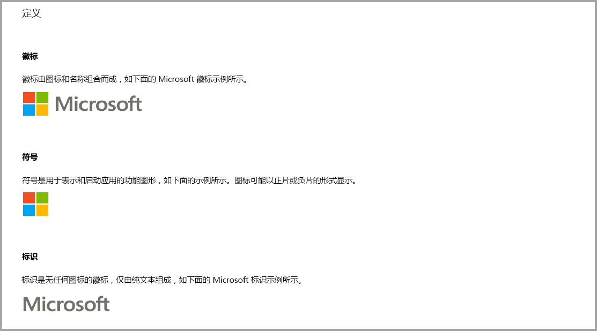
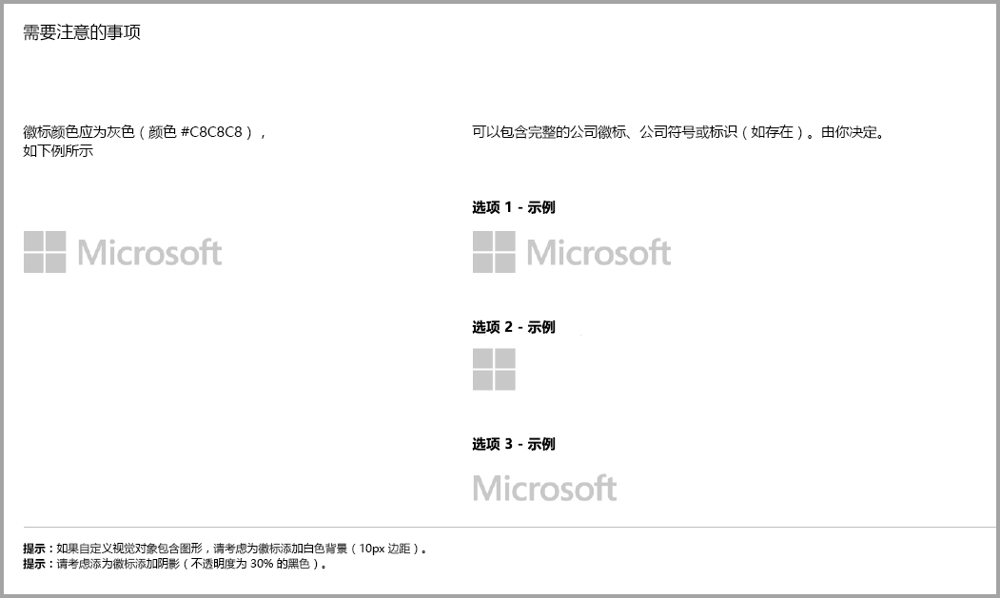
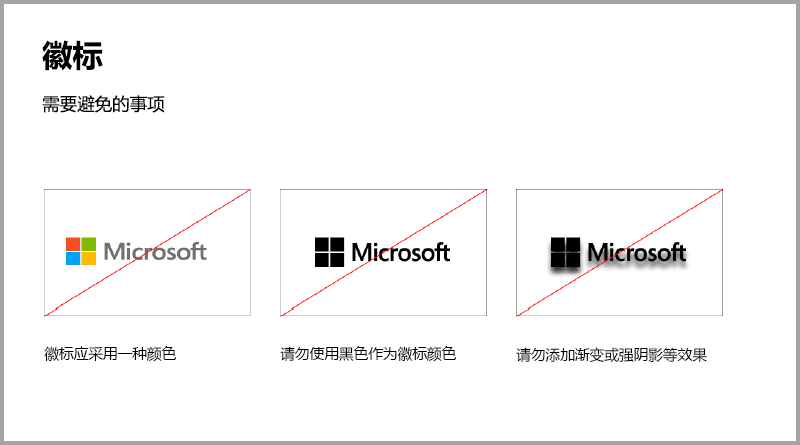
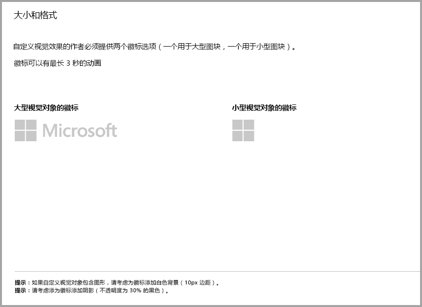
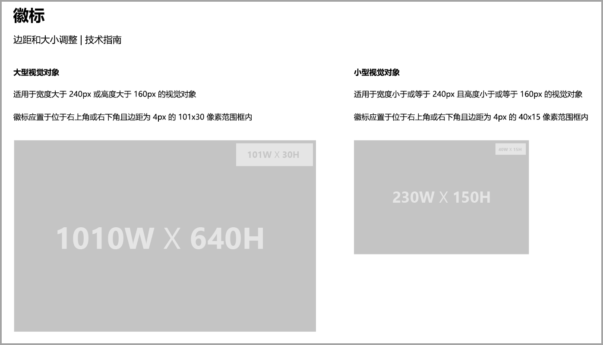
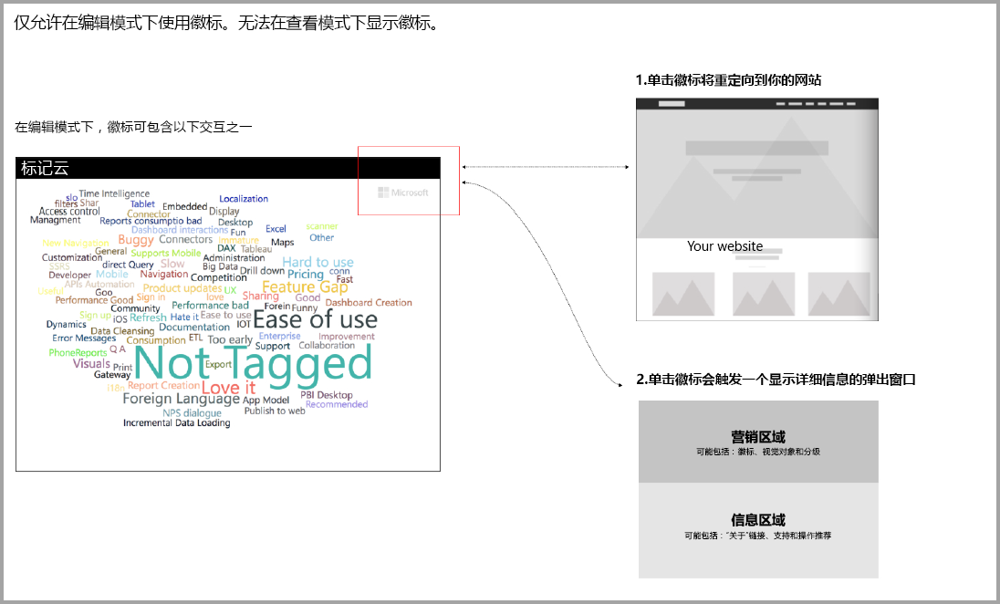

# Power BI 视觉对象指南
在将视觉对象[发布](https://docs.microsoft.com/power-bi/developer/office-store)到 AppSource 供其他人发现和使用之前，请确保遵循指导原则为用户创造好的体验。 

## 上下文菜单
上下文菜单是在用户将鼠标悬停在视觉对象上时显示的右键单击菜单。
所有 Power BI 视觉对象都应启用上下文菜单，以带来统一的体验。 请查看[本文](https://github.com/Microsoft/PowerBI-visuals/blob/gh-pages/tutorials/building-bar-chart/adding-context-menu-to-the-bar.md)了解如何添加上下文菜单。

## 徽标指南

本部分介绍了在视觉对象中添加徽标和标识的规范。

> [!IMPORTANT]
> 仅允许在编辑模式下使用徽标  。 无法在查看模式下显示徽标  。

## 额外购买的 Power BI 视觉对象指南

一直到最近，市场 (AppSource) 仅接受免费的 Power BI 视觉对象。 此策略已更改（2018 年 12 月），还可以向 AppSource 提交带有“可能需要额外付费”价格标签的视觉对象。 

“可能需要额外付费”的视觉对象类似于 Office 应用商店中的应用内购买 (IAP) 加载项。 在得到 AppSource 团队的批准，并确保视觉对象符合认证要求后，开发人员还可提交这些视觉对象进行认证。 有关要求的详细信息，请参阅[认证的自定义视觉对象](../power-bi-custom-visuals-certified.md)。

> [!NOTE]
> 要认证的视对象觉不得访问外部服务或资源。

>[!IMPORTANT]  
> 如果将视觉对象从免费更新为“可能需要额外付费”，用户必须获得与更新前相同级别的免费功能。 可以在现有免费功能基础上添加可选的高级付费功能。 我们建议将具有高级功能的 IAP 视觉对象作为新视觉对象提交，而不是更新现有免费视觉对象。

## 提交过程有什么变化？

开发人员通过卖家仪表板将其 IAP 视觉对象上传到 AppSource，与上传免费视觉对象时一样。 为表明提交的视觉对象具有 IAP 功能，开发人员应在卖家仪表板上注明：“应用内购买视觉对象。” 此外，开发人员需提供许可证密钥或令牌，以便验证团队可验证 IAP 功能。 在视觉对象通过验证和批准后，列出 IAP 视觉对象的 AppSource 会在定价选项下声明“可能需要额外付费”。

## 什么是具有 IAP 功能的 Power BI 视觉对象？

IAP 视觉对象是一个免费的视觉对象，可提供免费功能   。 它还有一些高级功能，可能需要支付额外费用才能使用这些功能。 在视觉对象的描述中，开发人员必须告知用户哪些功能需要额外付费。 目前，Microsoft 不提供支持购买应用和加载项的本机 API。

开发人员可使用各种第三方支付系统进行购买。 有关详细信息，请参阅[我们的应用商店策略](https://docs.microsoft.com/office/dev/store/validation-policies#2-apps-or-add-ins-can-display-certain-ads)。

> [!NOTE]
> 不允许在免费功能或免费视觉对象上设置水印。 只能为使用时无有效许可的付费功能使用水印。 如果在无有效许可的情况下使用高级功能，建议显示一个弹出窗口，提示与许可相关的所有信息。  

## 最佳做法

### 视觉对象登陆页面

使用登陆页面向用户说明视觉对象的使用方法，以及在何处购买许可证。 请勿包含自动播放的视频。 仅添加有助于改善用户体验的材料，例如有关许可证购买详情的信息或链接，以及如何使用 IAP 功能。

### 许可证密钥和令牌

为方便用户，请在格式窗格的顶部添加许可证密钥或令牌相关字段。

## 常见问题解答

有关视觉对象的详细信息，请参阅[关于额外付费的视觉对象的常见问题解答](https://docs.microsoft.com/power-bi/power-bi-custom-visuals-faq#visuals-with-additional-purchases)。

## 后续步骤

了解如何将自定义视觉对象发布到 [AppSource](office-store.md) 让其他人了解和使用。
