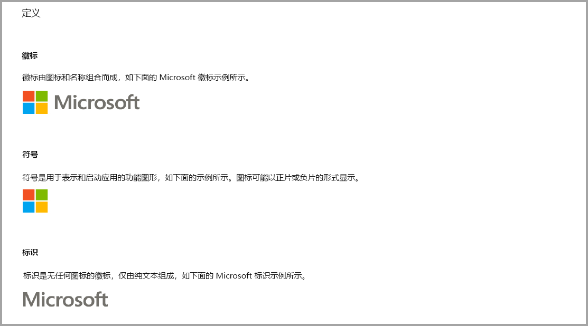
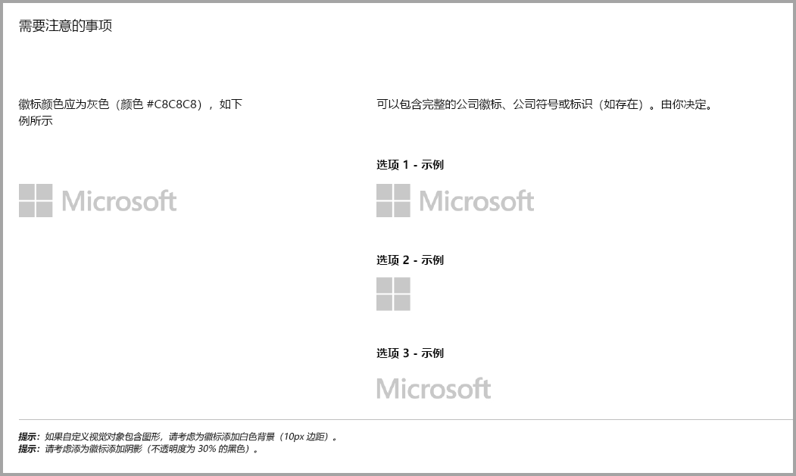
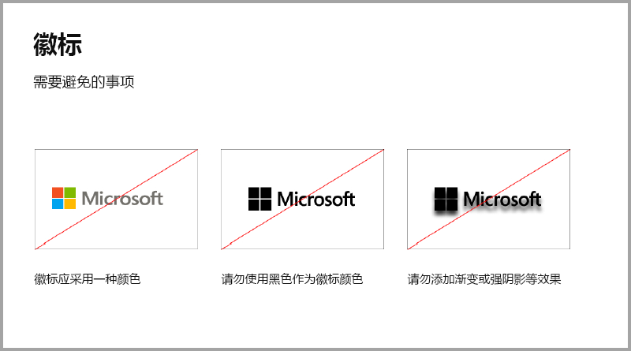
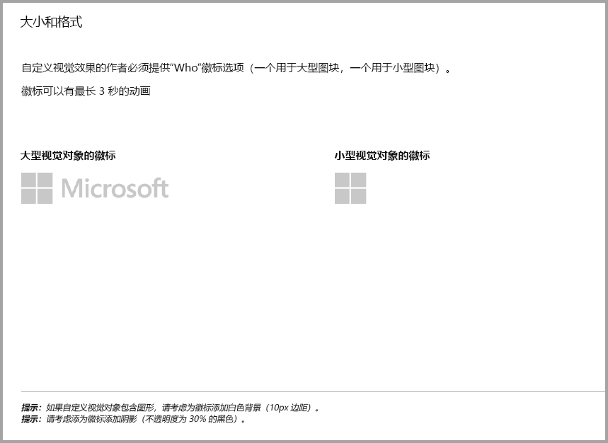
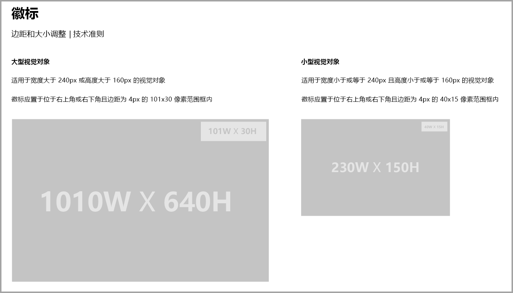
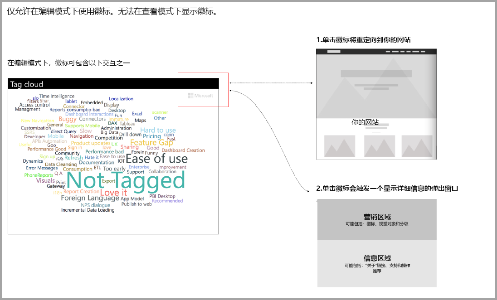

# 额外购买的 Power BI 视觉对象指南

一直到最近，市场 (AppSource) 仅接受免费的 Power BI 视觉对象。 此政策正在更改，因此可能还需向“AppSource”提交带有“可能需要额外付费”价格标签的视觉对象。 需额外付费的视觉对象类似于 office 应用商店中的应用内购买 (IAP) 插件。 在得到 AppSource 团队的批准，并确保视觉对象符合[认证的自定义视觉对象文章](../power-bi-custom-visuals-certified.md)中描述的认证要求后，开发人员还可提交这些视觉对象进行认证。

> [!Note]
> 要认证的视对象觉不得访问外部服务或资源。

> [!Note]
> 所有免费视觉效果应保留以前提供的相同免费功能。 可以在旧版免费功能基础上添加可选的高级付费功能。 我们建议将具有高级功能的 IAP 视觉效果作为新视觉效果提交，而不是更新旧版免费视觉效果。

## 提交过程有什么变化？

开发人员通过卖家仪表板将其 IAP 视觉对象上传到 AppSource，与上传免费视觉对象时一样。 为表明提交的视觉对象具有 IAP 功能，开发人员应在卖家仪表板上注明：“应用内购买视觉对象”。 此外，开发人员需提供许可证密钥或令牌，以便验证团队可验证 IAP 功能。 一旦视觉对象通过验证和批准，列出 IAP 视觉对象的 AppSource 会在定价选项下声明“需额外付费”。

## 什么是具有 IAP 功能的 Power BI 视觉对象？

IAP 视觉对象是免费的视觉对象，提供免费功能，但也有额外的功能，要使用额外功能可能需要额外付费。 开发人员必须在视觉对象描述中告知用户哪些功能需要额外付费。 目前，Microsoft 不支持在应用程序和加载项中购买本机应用程序编程接口 (API)。开发人员可使用各种第三方支付系统进行购买。 请参阅我们的应用商店[政策](https://docs.microsoft.com/office/dev/store/validation-policies#2-apps-or-add-ins-can-display-certain-ads)。

## 徽标指南

本部分介绍了在视觉对象中添加徽标和标识的规范。

> [!NOTE]
> 仅允许在编辑模式下使用徽标。 无法在查看模式下显示徽标。

## 最佳做法

### 视觉对象登陆页面

使用登陆页面向用户说明视觉对象的使用方法，以及在何处购买许可证。 请勿包含自动播放的视频。 仅添加有助于改善用户体验的材料，例如有关许可证购买详情的信息或链接，以及如何使用 IAP 功能。

### 许可证密钥和令牌

为方便用户，请在格式窗格的顶部添加许可证密钥或令牌相关字段，便于用户找到密钥或令牌。

## 常见问题解答

有关详细信息和问题的答案，请访问[关于额外购买的视觉对象的常见问题解答](https://docs.microsoft.com/power-bi/power-bi-custom-visuals-faq#visuals-with-additional-purchases)。

## 后续步骤

了解如何将自定义视觉对象发布到 [AppSource](office-store.md) 让其他人了解和使用。
