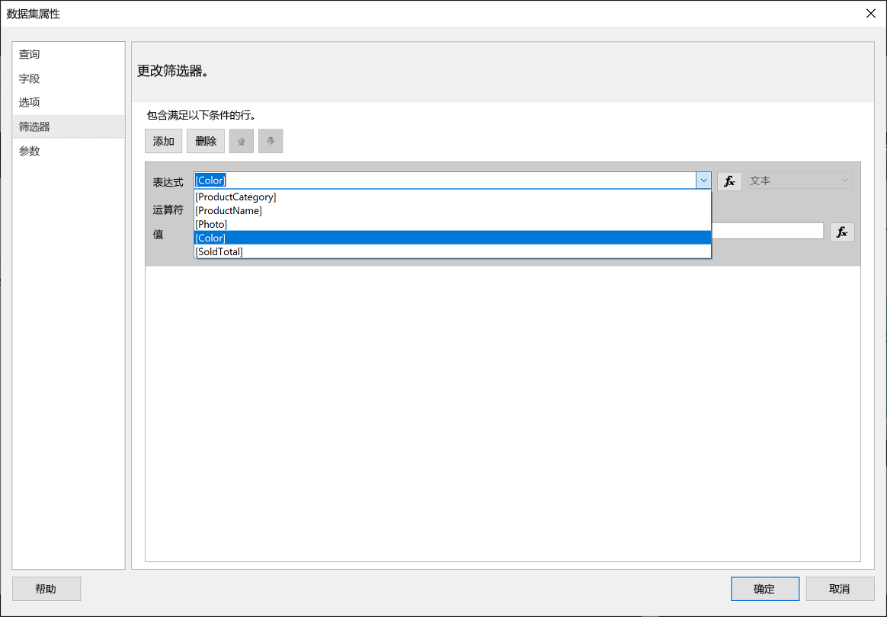
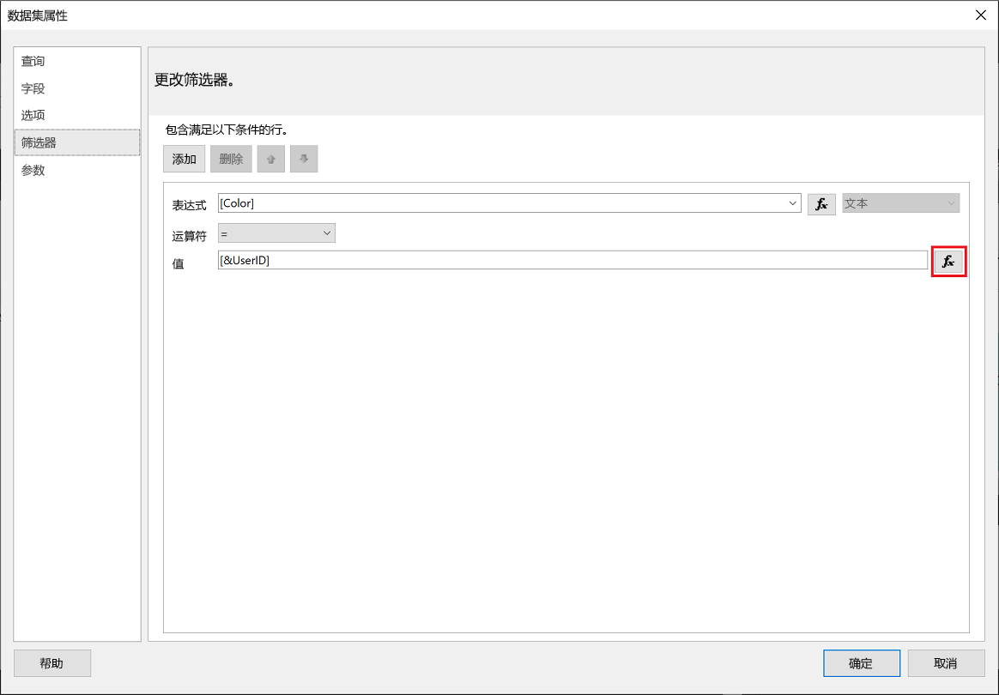
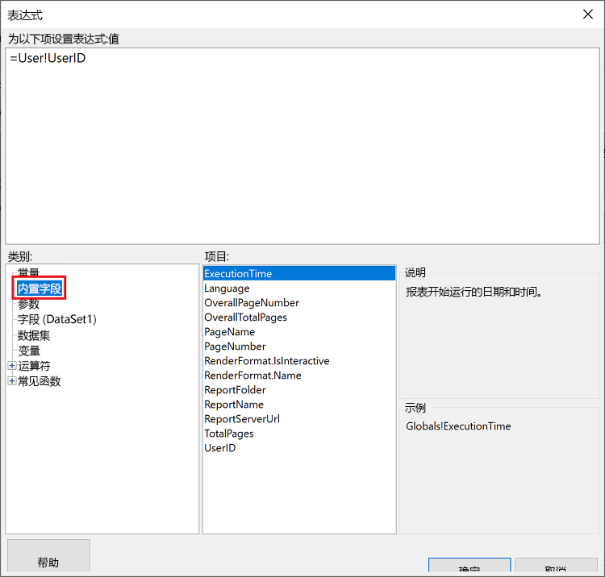
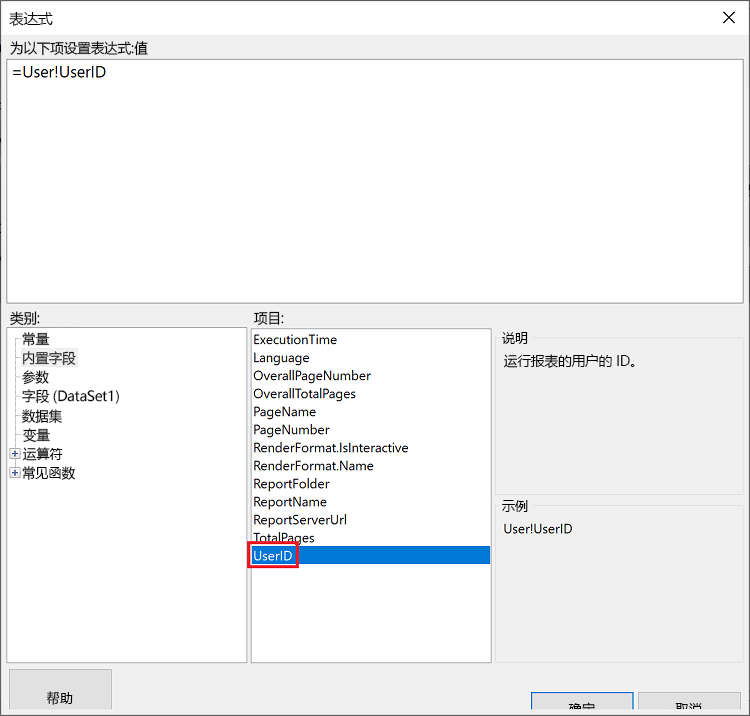
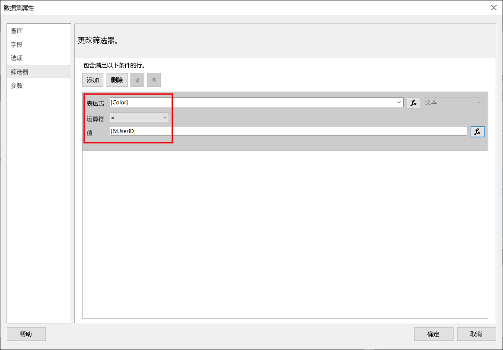
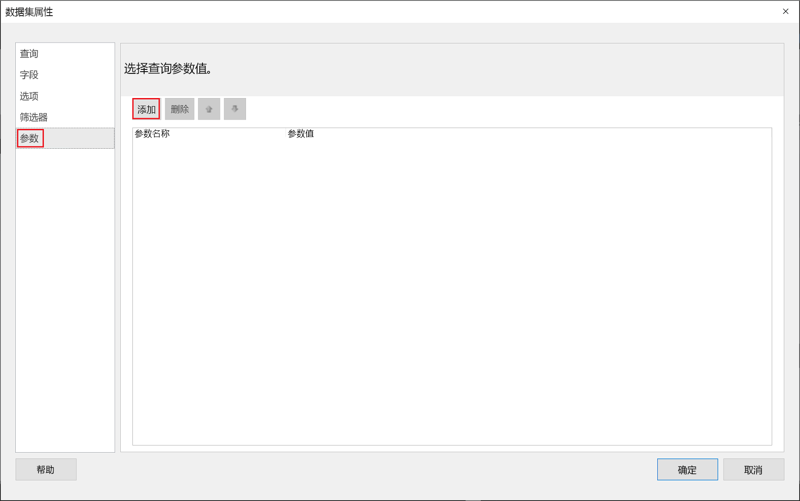
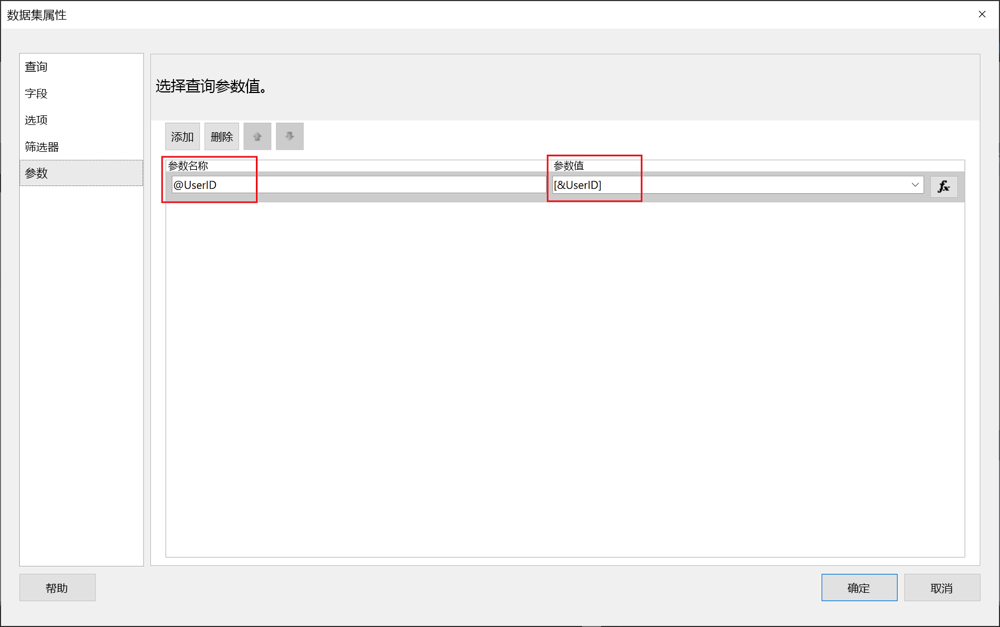
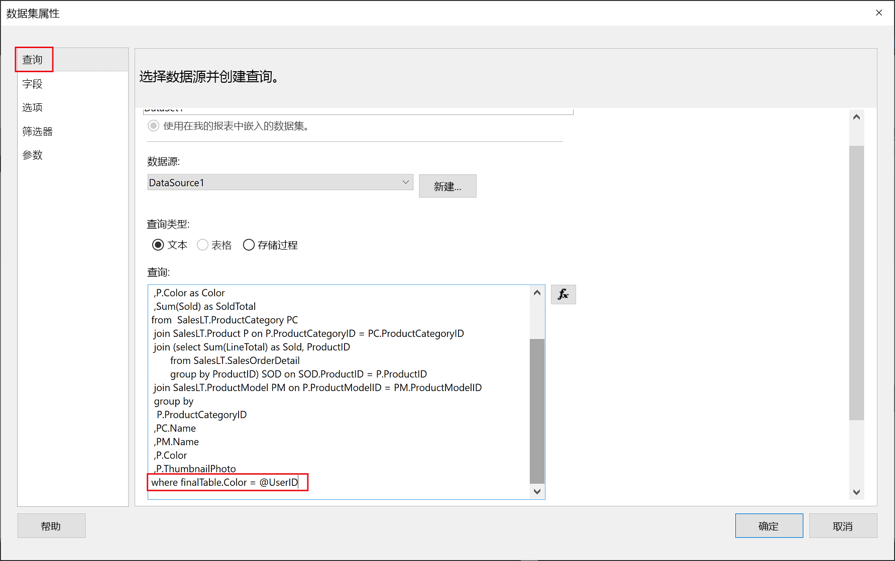

# <a name="implementing-row-level-security-in-embedded-paginated-reports-preview"></a>在嵌入的分页报表中实现行级别安全性（预览）

嵌入分页报表时，可以控制所显示的数据。 这允许为每个用户定制显示的信息。 例如，如果你有包含全球销售结果的 Power BI 分页报表，则可以将其嵌入以便仅提供特定区域的销售结果。

此功能可以安全地显示数据的子集而不影响其余数据。 它类似于[行级别安全性 (RLS)](embedded-row-level-security.md) 功能，该功能可以在 Power BI 报表（未分页）、仪表板、磁贴和数据集中安全地显示数据。  

> [!Note]
> 此功能适用于面向客户的嵌入式分页报表。

## <a name="configuring-a-parameter-to-filter-the-dataset"></a>配置参数以筛选数据集

将行级别安全性应用于 Power BI 分页报表时，需要将[参数](../report-builder-parameters.md)分配到 UserID 特性  。 此参数将限制嵌入报表前从数据集中提取的数据。

将参数分配到 UserID 后，使用 [Reports GenerateTokenForCreateInGroup](https://docs.microsoft.com/rest/api/power-bi/embedtoken/reports_generatetokenforcreateingroup) API 获取嵌入令牌  。

## <a name="use-uderid-as-a-filter-at-report-or-query-level"></a>在报表或查询级别使用 UderID 作为筛选器

可以使用 UserId 作为筛选器，也可将其用于对 [Power BI 分页报表生成器](../report-builder-power-bi.md)中数据源的查询    。

### <a name="using-the-filter"></a>使用筛选器

1. 在“数据集属性”窗口的左窗格中，选择“筛选器”   。

    

2. 从“表达式”下拉菜单中，选择要用于筛选数据的参数  。

     

3. 单击“值”函数按钮  。 

    

4. 在“表达式”窗口的“类别”列表中，选择“内置字段”    。

    

5. 从“项”列表中，选择 UserID，然后单击“确定”    。

    

6. 在“数据集属性”窗口中，验证表达式是否是“所选参数 = UserID”，然后单击“确定”    。

    

### <a name="using-a-query"></a>使用查询

1. 在“数据集属性”窗口的左窗格中，选择“参数”，然后单击“添加”    。

    

2. 在“参数名称”中输入 @UserID，然后在“参数值”中添加 [&UserID]     。

     

3. 在左侧窗格中，选择“查询”，在“查询”中添加 UserID 参数作为查询的一部分，然后单击“确定”    。
    > [!NOTE]
    > 在下方的屏幕截图中，使用 color 参数作为示例 (whereFinalTable.Color = @UserID)。 如果需要，可以创建更复杂的查询。

    

## <a name="passing-the-configured-parameter-using-the-embed-token"></a>使用嵌入令牌传递配置的参数

为客户嵌入分页报表时，使用 [Reports GenerateTokenForCreateInGroup](https://docs.microsoft.com/rest/api/power-bi/embedtoken/reports_generatetokenforcreateingroup) API 获取嵌入令牌。 此令牌还可用于筛选从分页报表中提取的某些数据。

若要只公开某些数据，请用要显示的信息指定 `username` 字段。 例如，在使用 color 参数的分页报表中，如果在 `username` 字段中输入 green，则嵌入令牌会限制嵌入的数据，仅显示颜色列中具有 green 值的数据   。

```JSON
{
    "accessLevel": "View",
    "reportId": "cfafbeb1-8037-4d0c-896e-a46fb27ff229",
    "identities": [
            {
                    // Replace the 'username' with a paginated report parameter
                    "username":     "...",
                    "reports: [
                        "cfafbeb1-8037-4d0c-896e-a46fb27ff229"
                    ]
            }
    ]
}
```
