# Power BI 中的视觉对象

创建或编辑 Power BI 报表时，可以使用多种不同类型的视觉对象。 这些视觉对象的图标显示在“可视化效果”窗格中  。 下载 [Power BI Desktop](https://powerbi.microsoft.com/desktop/) 或打开 [Power BI 服务](https://app.powerbi.com)时，这些视觉对象都已“预打包”。

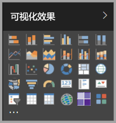

但是，你并不限于使用这组视觉对象。 如果选择底部的“更多选项”(…)，则可使用另一个报表视觉对象源 - Power BI 视觉对象   。

开发人员使用 Power BI 视觉对象 SDK 创建 Power BI 视觉对象。 业务用户通过这些视觉对象能够以最适合其业务的方式查看数据。 报表创建者可以将自定义视觉对象文件导入报表中，并像任何其他 Power BI 视觉对象一样来使用他们。 Power BI 视觉对象在 Power BI 中处于最高等级，可以对其执行筛选、突出显示、编辑和共享等操作。

可以通过以下三种方式部署 Power BI 视觉对象：

* 自定义视觉对象文件
* 组织视觉对象
* 市场视觉对象

## 自定义视觉对象文件

Power BI 视觉对象是包含代码的包，这些代码用于呈现提供给它们的数据。 任何人都可以创建自定义视觉对象并将其打包为之后可导入 Power BI 报表的单个 `.pbiviz` 文件。

> [!WARNING]
> 自定义视觉对象可能包含存在安全或隐私风险的代码。 请确保创建者和自定义视觉对象源可信，然后将其导入报表。

## 组织视觉对象

Power BI 管理员许可并将 Power BI 视觉对象部署到其组织中，以便报表作者可以轻松地发现、更新和使用这些视觉对象。 管理员可以轻松地管理（例如，更新版本、禁用/启用）这些视觉对象。

 [详细了解可组织的视觉对象](power-bi-custom-visuals-organization.md)。

## 市场视觉对象

社区成员和 Microsoft 已经将 Power BI 视觉对象公开发布到 [AppSource](https://appsource.microsoft.com/marketplace/apps?product=power-bi-visuals) 市场。 你可以下载这些视觉对象，然后将其添加到 Power BI 报表。 这些 Power BI 视觉对象都已经过测试并通过 Microsoft 的功能和质量审核。

什么是 [AppSource](office-store.md)？ 它是可以在其中查找与 Microsoft 软件相关的应用、加载项和扩展的地方。 AppSource 为 Office 365、Azure、Dynamics 365 和 Power BI 等产品的数百万用户提供解决方案，帮助他们更高效、更有见地并且更为完美地完成工作。

### 已认证的视觉对象

Power BI 取得认证的视觉对象是指已通过额外严格质量测试的市场视觉对象，可用于其他情形，如[电子邮件订阅](../service-report-subscribe.md)和[导出到 PowerPoint](../consumer/end-user-powerpoint.md)。
若要查看已认证的 Power BI 视觉对象列表或提交自己的 Power BI 视觉对象，请参阅[已认证的 Power BI 视觉对象](power-bi-custom-visuals-certified.md)。

你是 Web 开发者吗？对创建自己的可视化效果，并将它们添加到 AppSource 感兴趣吗？ 请参阅[开发 Power BI 自定义视觉对象](visuals/custom-visual-develop-tutorial.md)，了解如何[将自定义视觉对象发布到 AppSource](office-store.md)。

### 从文件导入自定义视觉对象

1. 选择“可视化效果”窗格底部的省略号  。

    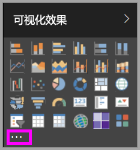

2. 在下拉列表中，选择“从文件导入”  。

    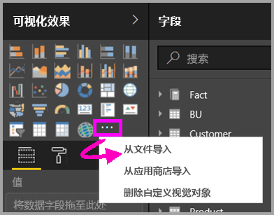

3. 从“打开”文件菜单中，选择你想要导入的 `.pbiviz` 文件，然后选择“打开”   。 自定义视觉对象图标会添加到“可视化效果”窗格底部，现供用户在报表中使用  。

    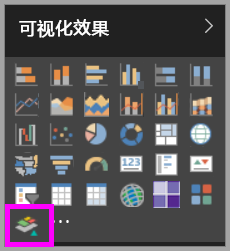

### 导入组织视觉对象

1. 选择“可视化效果”窗格底部的省略号  。

    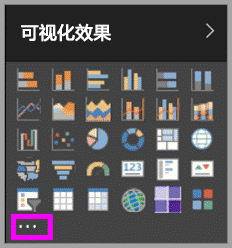

2. 在下拉列表中，选择“从市场导入”  。

    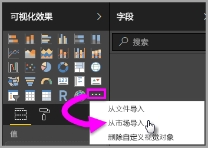

3. 从顶部的选项卡菜单中选择“我的组织”  。

    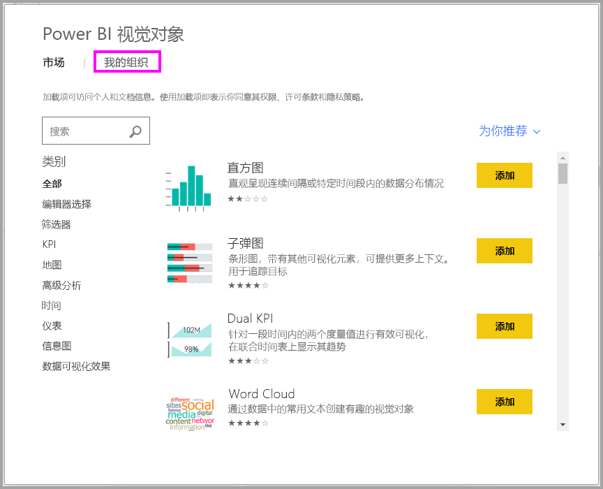

4. 滚动浏览列表，找到要导入的视觉对象。

    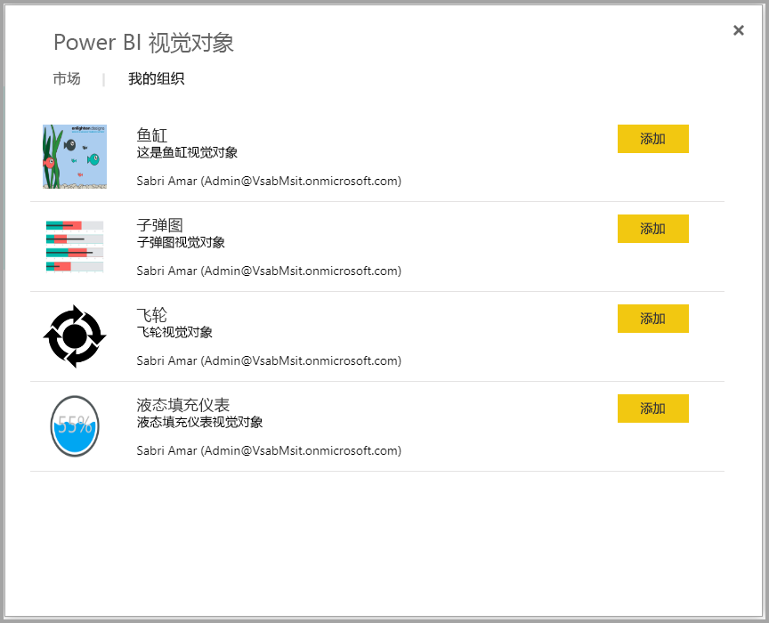

5. 选择“添加”，导入自定义视觉对象  。 它的图标会添加到“可视化效果”窗格底部，现供用户在报表中使用  。

    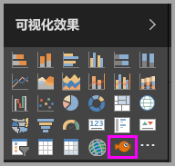

## 从 Microsoft AppSource 下载或导入 Power BI 视觉对象

下载和导入 Power BI 视觉对象的方法有两种：可以在 Power BI 中获取，也可以从 [AppSource 网站](https://appsource.microsoft.com/)获取。

### 在 Power BI 中导入 Power BI 视觉对象

1. 选择“可视化效果”窗格底部的省略号  。

    

2. 在下拉列表中，选择“从市场导入”  。

    

3. 滚动浏览列表，找到要导入的视觉对象。

    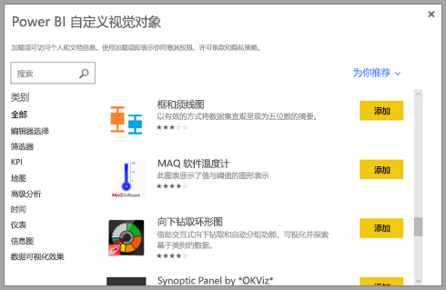

4. 若要详细了解某个视觉对象，请选中它。

    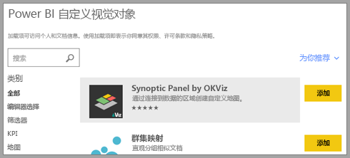

5. 在详细信息页中，可以查看屏幕截图、视频、详细说明等内容。

    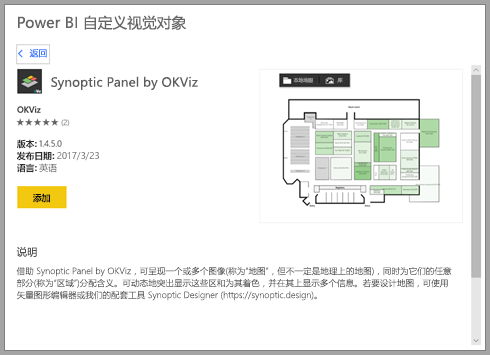

6. 滚动到底部可以查看评论。

    

7. 选择“添加”，导入自定义视觉对象  。 它的图标会添加到“可视化效果”窗格底部，现供用户在报表中使用  。

    

### 从 Microsoft AppSource 下载和导入 Power BI 视觉对象

1. 首先，访问 [Microsoft AppSource](https://appsource.microsoft.com)，并选择“应用”  选项卡。

    

2. 转到[应用结果页](https://appsource.microsoft.com/marketplace/apps)。在此页中，可以查看每种类别的热门应用，包括 Power BI 应用  。 我们要查找的是 Power BI 视觉对象，因此可以从导航窗格列表中选择“Power BI 视觉对象”，以缩小结果范围  。

    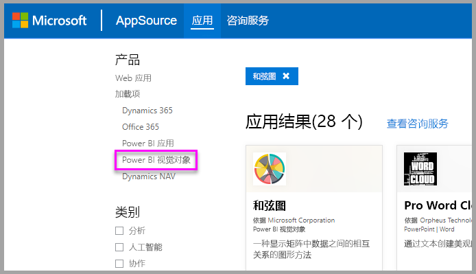

3. AppSource 会显示每个自定义视觉对象的磁贴。  每个磁贴均有自定义视觉对象快照，其中带有简短说明和下载链接。 如需了解更多详情，请选择磁贴。

    

4. 在详细信息页中，可以查看屏幕截图、视频、详细说明等内容。 选择“立即获取”以下载自定义视觉对象，然后同意使用条款  。

    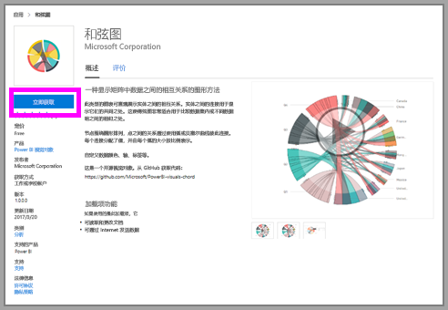

5. 单击自定义视觉对象下载链接。

    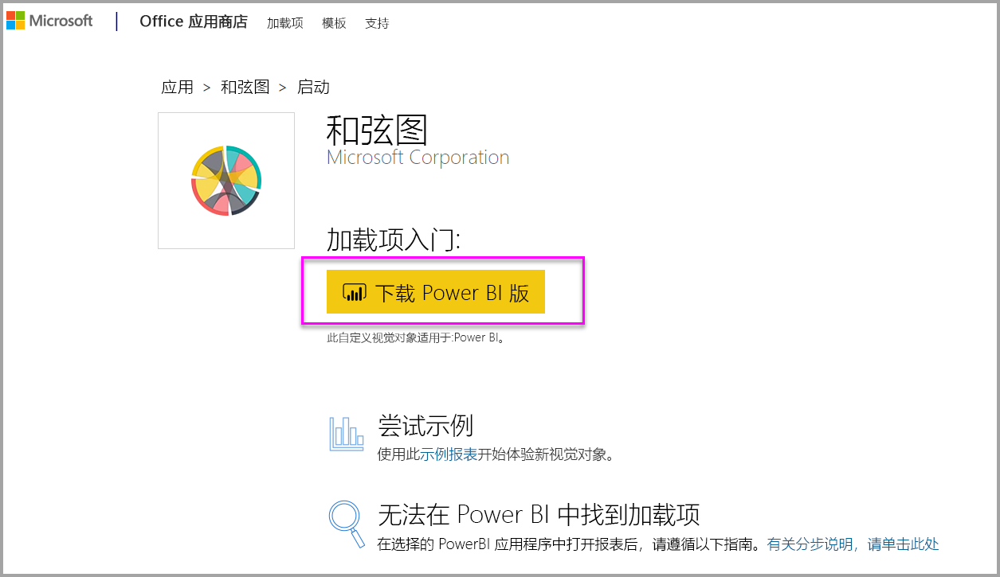

    下载页还介绍了如何将自定义视觉对象导入 Power BI Desktop 和 Power BI 服务。

    还可以下载包含自定义视觉对象并展示其功能的示例报表。

    

6. 保存 `.pbiviz` 文件，然后打开 Power BI。

7. 将 `.pbiviz` 文件导入报表。 （请参阅上面的[从文件导入自定义视觉对象](#import-a-custom-visual-from-a-file)部分。）

## 注意事项和限制

* 导入完成后，自定义视觉对象就已添加到特定报表中。 若要在其他报表中使用此视觉对象，还需要将它导入到相应报表。 使用“另存为”选项保存包含自定义视觉对象的报表时，自定义视觉对象的副本会与新报表一同保存。 

* 如果看不到“可视化效果”窗格，则表示无权编辑报表  。  只能将 Power BI 视觉对象添加到自己有权编辑的报表，而不能添加到仅与自己共享的报表。

## 疑难解答

若要进行疑难解答，请参阅 [Power BI 视觉对象疑难解答](power-bi-custom-visuals-troubleshoot.md)。

## 常见问题解答

有关详细信息和问题的答案，请访问[关于 Power BI 视觉对象的常见问题解答](power-bi-custom-visuals-faq.md#organizational-power-bi-visuals)。

## 后续步骤

* [Power BI 报表中的可视化效果](../visuals/power-bi-report-visualizations.md)

更多问题？ [尝试参与 Power BI 社区](https://community.powerbi.com/)。
