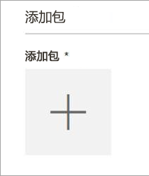
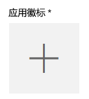
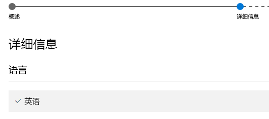

# 使用卖家面板将 Power BI 视觉对象提交到 AppSource

在将视觉对象提交到 AppSource 之前，必须先将附带 pbiviz 文件和 pbix 文件的电子邮件发送到 Power BI 团队。   这样，Power BI 团队便可将这些文件上传到公共共享服务器。 否则，应用商店将无法检索这些文件。 提交新 Power BI 视觉对象、更新现有 Power BI 视觉对象和修复被拒绝的提交内容时，必须发送这些文件。

>[!NOTE]
>[卖家面板](https://docs.microsoft.com/office/dev/store/use-the-seller-dashboard-to-submit-to-the-office-store)正被逐步淘汰。它被[合作伙伴中心](https://docs.microsoft.com/partner-center/)所取代。 只在 Power BI 视觉对象提交进行到一半时，才使用卖家面板。 如果要将新的 Power BI 视觉对象提交到 AppSource，请使用[合作伙伴中心方法](office-store.md#submitting-to-appsource)。

### 卖家面板提交过程

必须具有有效的 Office 开发人员帐户才能登录到 [Office 开发人员中心](https://dev.office.com/)。 Office 开发人员帐户必须是 Microsoft 帐户 Live ID，例如 hotmail.com 或 outlook.com。

1. 导航到[开发人员中心](https://sellerdashboard.microsoft.com/Application/Summary)。

2. 选择“添加新应用”  。

    

3. 选择“Power BI 自定义视觉对象”  ，然后选择“下一步”  。

4. 选择“应用包”  下的 **+** ，然后在打开文件对话框中选择从 Power BI 团队获得的应用包 XML 文件。

    

5. 应该会看到一条批准消息，提示你这是有效的 Power BI 应用包。

    

6. 填写“常规信息”  详细信息。

   * *提交标题：* 提交在开发人员中心中的命名方式。
   * *版本：* 版本号通过加载项应用包自动填充。
   * *发布日期 (UTC)：* 选择将应用发布到应用商店的日期。 如果选定一个将来的日期，在到达该日期后，你的应用才会在应用商店中提供。
   * *类别：* 第一个类别将自动填充为“数据可视化效果 + BI”。 这就是标记所有 Power BI 视觉对象的方法。 为了帮助用户轻松搜索你的视觉对象，你可以最多提供两个其他类别。
   * *测试说明：* 可选，如果你想要为 Microsoft 测试人员提供一些说明，则可以填写此项
   * *我的应用调用、支持、包含或使用加密：* 保持未选中状态
   * *在 iPad 的 Office 外接程序目录中提供此外接程序：* 保持未选中状态
7. 通过选择“应用徽标”  下的“+”  上载视觉对象的徽标。 然后，选择打开文件对话框中的图标文件。 文件格式必须为 .png、.jpg、.jpeg 或 .gif。 必须正好为 300 像素（宽度）x 300 像素（高度），且大小不得超过 512 KB。

    

8. 填写“支持文档”  详细信息。

   * 支持文档链接
   * 隐私文档链接
   * 视频链接
   * 最终用户许可协议 (EULA)

       必须上载 EULA 文件。 这可以是你自己的 EULA，也可以使用 Office 应用商店中适用于 Power BI 视觉对象的默认 EULA。 若要使用默认 EULA，请将以下 URL 粘贴到卖家面板的“最终用户许可协议”文件上传对话框中：[https://visuals.azureedge.net/app-store/Power BI - Default Custom Visual EULA.pdf](https://visuals.azureedge.net/app-store/Power%20BI%20-%20Default%20Custom%20Visual%20EULA.pdf)。

9. 选择“下一步”  以前往**详细信息**页。

10. 选择“语言”  ，并从列表中选择一种语言。

    

11. 填写“说明”详细信息。

    * *（此语言的）应用名称：* 输入应用的标题，因为该标题应在店面中显示。
    * *简短说明：* 输入应用的简短说明，最多 100 个字符，因为该说明应在店面中显示。 此说明及徽标将显示在最高级别的页面中。 可以从 pbiviz 程序包使用此说明。
    * *详细说明：* 提供应用的更详细说明，客户将在应用详细信息页上看到该说明。 若要将视觉对象变成开放源代码对象，以便通过社区的力量来改进视觉对象，请在此处提供公共存储库（如 GitHub）的链接。

12. 至少上载一个屏幕截图。 格式可以为 .png、.jpg、.jpeg 或 .gif。 它必须正好为 1366 像素（宽度）x 768 像素（高度）。 文件大小不得超过 1024 KB。 *为了实现更好的利用率，添加文本气泡以阐明每个屏幕截图中所示的主要功能的价值主张。*

12. 如果想要添加更多语言，请选择“添加语言”  ，然后重复步骤 10 和 11。 添加更多语言可帮助用户以他们自己的语言查看自定义视觉对象详细信息。 未列出的语言将默认为所选的第一语言。

13. 添加语言完成后，选择“下一步”  以前往**阻止访问**页。

14. 如果你想要阻止特定国家或地区的客户使用或购买你的应用，请选中此框，然后从列表中进行选择。

15. 选择“下一步”  以前往**定价**页。

16. 目前，仅支持免费视觉对象，不允许视觉对象内有附加购买（应用内购买）内容。  选择“此应用免费”  。

    > [!NOTE]
    > 如果没有选择免费选项，或提交的视觉对象中有应用内购买内容，那么提交会遭拒。

17. 现在，可以选择“另存为草稿”并于稍后提交，也可以选择“提交供审批”，将自定义视觉对象提交到 Office 应用商店。  

## 卖家面板认证提交过程

按照本部分中的说明提交 Power BI 视觉对象，以便在卖家面板中取得认证。 如果以前使用卖家面板将 Power BI 视觉对象提交到了 AppSource，则使用此方法。

1. 向 Power BI Power BI 视觉对象支持团队 (pbicvsupport@microsoft.com) 发送电子邮件。 在电子邮件中，添加以下信息：
    * 标题：视觉对象认证请求
    * 指向托管人工可读源代码的 GitHub 存储库的链接
    * [符合要求](power-bi-custom-visuals-certified.md#certification-requirements)
    * 通过代码审查

2. 当你的 Power BI 视觉对象通过认证并添加到[经认证的 Power BI 视觉对象列表](power-bi-custom-visuals-certified.md#certified-power-bi-visuals)中时，Microsoft Power BI 视觉对象团队会向你发出通知；如果你的视觉对象遭到拒绝，也会发送通知并随附报告，列出需要解决的问题。 由开发者负责维护与 Microsoft 间的开放式沟通渠道，并根据需要更新经认证的视觉对象。

## 跟踪提交状态和使用情况

可以查看[验证策略](https://dev.office.com/officestore/docs/validation-policies#13-power-bi-custom-visuals)。

提交后，可以在[“应用仪表板”](https://sellerdashboard.microsoft.com/Application/Summary/)中查看提交状态。

## 认证视觉对象

创建视觉对象后，如果需要，可以让视觉对象取得[认证](../developer/power-bi-custom-visuals-certified.md)。

## 后续步骤

[开发 Power BI 自定义视觉对象](visuals/custom-visual-develop-tutorial.md)  
[Power BI 中的可视化效果](../visuals/power-bi-report-visualizations.md)  
[Power BI 中的自定义可视化效果](../developer/power-bi-custom-visuals.md)  
[让 Power BI 视觉对象取得认证](../developer/power-bi-custom-visuals-certified.md)

更多问题？ [尝试咨询 Power BI 社区](https://community.powerbi.com/)
