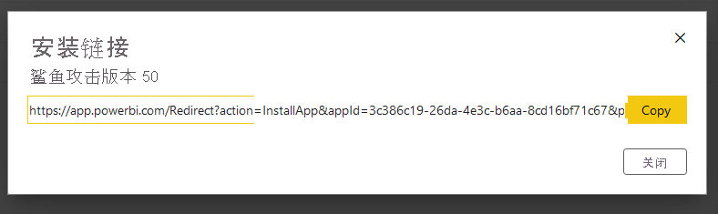

# <a name="tutorial-automate-configuration-of-template-app-installation-using-an-azure-function"></a>教程：使用 Azure Function 自动配置模板应用安装

模板应用有助于客户开始从其数据中获取见解。 模板应用通过与数据连接并提供预生成的报表（可根据需要自定义报表）来快速启动并运行。

客户对有关如何连接到其数据的详细信息不太熟悉，因此，他们可能难以在安装模板应用时提供这些详细信息。

如果你是数据服务提供商，并且创建了一个模板应用来帮助客户在你的服务上开始使用他们的数据，那么可通过自动配置模板应用的参数，让客户更容易安装模板应用。 当客户登录到门户时，他们会单击你准备好的特殊链接。 此操作将会启动自动化来收集所需的信息，预配置模板应用参数，并将客户重定向到他们可在其中安装应用的 Power BI 帐户。 他们只需单击“安装”并对其数据源进行身份验证就可以了！ 

此客户体验如下所示。


本教程将使用我们创建的自动安装 Azure Function 示例来预配置和安装模板应用。 为了便于演示，故意采用简单的示例。 该示例封装了 Azure Function 的设置，以利用 Power BI API 来为用户自动安装模板应用并配置它。

有关常规自动化流及其使用的 API 的详细信息，请参阅[自动配置模板应用安装](template-apps-auto-install.md)

我们的简单应用程序使用 Azure Function。 有关 Azure Functions 的详细信息，请参阅 [Azure Functions 文档](https://docs.microsoft.com/azure/azure-functions/)。

## <a name="basic-flow"></a>基本流程

下面是客户通过单击门户上的链接来启动应用程序时，应用程序执行的基本流程。

1. 用户登录 ISV 的门户并单击提供的链接。 这将启动流。 ISV 的门户在此阶段准备了用户特定的配置。

2. ISV 根据在 ISV 的租户中注册的[服务主体（仅限应用的令牌）](../embedded/embed-service-principal.md)获取“仅限应用”令牌。

3. 使用 [Power BI REST API](https://docs.microsoft.com/rest/api/power-bi/)，ISV 将创建“安装票证”，其中包含由 ISV 准备的用户特定参数配置。

4. ISV 使用包含安装票证的 ```POST``` 重定向方法将用户重定向到 Power BI。

5. 通过安装票证将用户重定向到其 Power BI 帐户，并提示他们安装模板应用。 当用户单击“安装”时，将会为其安装模板应用。

>[!Note]
>尽管在创建安装票证时由 ISV 配置参数值，但在安装的最后阶段，只能由用户提供与数据源相关的凭据。 这是为了防止将它们公开给第三方，从而确保用户和模板应用数据源之间的连接安全。

## <a name="prerequisites"></a>先决条件

在开始之前，你需要具有：

* 自己的 Azure Active Directory 租户设置。 请参阅[创建 Azure Active Directory 租户](https://docs.microsoft.com/power-bi/developer/embedded/create-an-azure-active-directory-tenant)，了解如何设置一个租户。

* 在上述租户中注册的[服务主体（仅限应用的令牌）](https://docs.microsoft.com/power-bi/developer/embedded/embed-service-principal)。

* 已准备好安装的参数化[模板应用](https://docs.microsoft.com/power-bi/connect-data/service-template-apps-overview)。 必须在将应用程序注册到 Azure Active Directory (Azure AD) 的同一租户中创建模板应用。 有关详细信息，请参阅[模板应用提示](https://docs.microsoft.com/power-bi/connect-data/service-template-apps-tips.md)或[在 Power BI 中创建模板应用](https://docs.microsoft.com/power-bi/connect-data/service-template-apps-create)。

* Power BI Pro 许可证。 如果没有注册 Power BI Pro，请在开始之前[注册免费试用版](https://powerbi.microsoft.com/pricing/)。

## <a name="set-up-your-template-apps-automation-development-environment"></a>设置模板应用自动化开发环境

在继续设置应用程序之前，请按照[快速入门：使用 Azure 应用程序配置创建 Azure Functions 应用](https://docs.microsoft.com/azure/azure-app-configuration/quickstart-azure-functions-csharp)中的说明开发 Azure Function 以及 Azure 应用程序配置。 按照本文中的说明创建应用程序配置。

### <a name="register-an-application-in-azure-active-directory-azure-ad"></a>在 Azure Active Directory (Azure AD) 中注册应用程序

请按照[使用服务主体和应用程序密码嵌入 Power BI 内容](https://docs.microsoft.com/power-bi/developer/embedded/embed-service-principal)中所述创建服务主体。

请务必将应用程序注册为“服务器端 Web 应用程序”应用。 注册服务器端 Web 应用程序以创建应用程序密码。

保存“应用程序 ID”（客户端 ID）和“应用程序密码”（客户端密码），以便执行后续步骤 。

可通过[嵌入安装程序工具](https://aka.ms/embedsetup/AppOwnsData)快速开始创建应用注册。 如果你使用的是 [Power BI 应用注册工具](https://app.powerbi.com/embedsetup)，请选择“为客户嵌入内容”选项。

## <a name="template-app-preparation"></a>模板应用准备

创建模板应用并准备好进行安装后，请保存以下信息以执行后续步骤：

* 应用 ID、包密钥和所有者 ID，这些信息显示在创建应用时[定义模板应用的属性](../../connect-data/service-template-apps-create.md#define-the-properties-of-the-template-app)过程最后一步的安装 URL 中  。

    还可单击模板应用的[发布管理](../../connect-data/service-template-apps-create.md#manage-the-template-app-release)中的“获取链接”，获取相同的链接。

* 在模板应用的数据集中定义的“参数名称”。 参数名称是区分大小写的字符串，也可在[定义模板应用的属性](../../connect-data/service-template-apps-create.md#define-the-properties-of-the-template-app)时从“参数设置”选项卡中进行检索，或从 Power BI 中的数据集设置中进行检索。

>[!NOTE]
>如果模板应用已准备好安装，则可在模板应用上测试预配置的安装应用程序，即使该应用尚未在 AppSource 上公开提供。 但是，为了让租户外部的用户能够使用自动化安装应用程序来安装模板应用，模板应用必须在 [Power BI 应用市场](https://app.powerbi.com/getdata/services)中公开提供。 因此，在使用所创建的自动化安装应用程序分发模板应用之前，请务必将其发布到[合作伙伴中心](https://docs.microsoft.com/azure/marketplace/partner-center-portal/create-power-bi-app-offer)。


## <a name="install-and-configure-your-template-app-using-our-azure-function-sample"></a>使用 Azure Function 示例安装和配置模板应用

本部分将使用我们创建的自动安装 Azure Function 示例来预配置和安装模板应用。 为了便于演示，故意采用简单的示例。 它使你可以利用 [Azure Function](https://docs.microsoft.com/azure/azure-functions/functions-overview) 和 [Azure 应用程序配置](https://docs.microsoft.com/azure/azure-app-configuration/overview)来轻松部署和使用适用于你的模板应用的自动安装 API。

### <a name="download-visual-studio-version-2017-or-later"></a>下载 [Visual Studio](https://www.visualstudio.com/)（版本 2017 或更高版本）

下载 [Visual Studio](https://www.visualstudio.com/)（2017 版或更高版本）。 请务必下载最新版 [NuGet 包](https://www.nuget.org/profiles/powerbi)。

### <a name="download-the-automated-install-azure-function-sample"></a>下载自动安装 Azure Function 示例

若要开始，请从 GitHub 下载[自动安装 Azure Function 示例](https://github.com/microsoft/Template-apps-examples/tree/master/Developer%20Samples/Automated%20Install%20Azure%20Function)。


### <a name="setup-your-azure-app-configuration"></a>设置 Azure 应用程序配置

若要运行此示例，需要使用如下所述的值和键设置 Azure 应用程序配置。 键为“应用程序 ID”、“应用程序密码”以及模板应用的“AppId”、“PackageKey”和“OwnerId”    。 有关获取这些值的信息，请参阅以下部分。 

这些键还在 Constants.cs 文件中进行了定义。

| 配置密钥 | 含义           |
|---------------    |-------------------|
| TemplateAppInstall:Application:AppId | [安装 URL](#getting-the-template-app-properties) 中的 AppId |
| TemplateAppInstall:Application:PackageKey | [安装 URL](#getting-the-template-app-properties) 中的 PackageKey |
| TemplateAppInstall:Application:OwnerId | [安装 URL](#getting-the-template-app-properties) 中的 OwnerId |
| TemplateAppInstall:ServicePrincipal:ClientId | 服务主体[应用程序 ID](#getting-the-application-id) |
| TemplateAppInstall:ServicePrincipal:ClientSecret | 服务主体[应用程序密码](#getting-the-application-secret) |
|||


Constants.cs文件：


#### <a name="getting-the-template-app-properties"></a>获取模板应用属性
填写创建应用时定义的所有相关模板应用属性。 这些属性是模板应用的“AppId”、“PackageKey”和“OwnerId”  。

若要获取上述值，请执行以下步骤：

1. 登录到 [Power BI](https://app.powerbi.com)。

2. 转到应用程序的原始工作区。

3. 打开“版本管理”窗格。

    

4. 选择应用版本并获取其安装链接。

    

5. 将链接复制到剪贴板。

    

6. 此安装 URL 包含需要其值的 3 个 URL 参数。 使用应用程序的“appId”、“packageKey” & “ownerId”值  。 示例 URL 与下面显示的内容相似。

    ```html
    https://app.powerbi.com/Redirect?action=InstallApp&appId=3c386...16bf71c67&packageKey=b2df4b...dLpHIUnum2pr6k&ownerId=72f9...1db47&buildVersion=5
    ```

#### <a name="getting-the-application-id"></a>获取应用程序 ID

将 Azure 中的“应用 ID”填入“applicationId”字段。 应用使用“applicationId”对你向其请求获取权限的用户标识自身。

若要获取“applicationId”，请按以下步骤操作：

1. 登录到 [Azure 门户](https://portal.azure.com)。

2. 在左侧导航窗格中，依次选择“所有服务”和“应用注册” 。

    

3. 选择需要 applicationId 的应用程序。

    

4. 存在列为 GUID 的“应用程序 ID”。 使用此“应用 ID”作为应用的“applicationId”。

    

#### <a name="getting-the-application-secret"></a>获取应用程序密码

将 Azure 的“应用注册”部分中的“密钥”部分信息填入“ApplicationSecret”字段。  使用[服务主体](../embedded/embed-service-principal.md)时，此属性适用。

若要获取“ApplicationSecret”，请按以下步骤操作：

 1. 登录 [Azure 门户](https://portal.azure.com)。

 2. 在左侧导航窗格中，依次选择“所有服务”和“应用注册” 。

    

3. 选择需要使用“ApplicationSecret”的应用。

    

4. 在“管理”下选择“证书和密码” 。

5. 选择“新的客户端密码”。

6. 在“说明”框中输入一个名称并选择持续时间。 然后选择“保存”为应用程序获取“值”。  如果在保存密钥值后关闭“密钥”窗格，值字段会仅显示为隐藏状态。 此时，你无法检索密钥值。 如果忘记了密钥值，请在 Azure 门户中新建密钥值。

    

## <a name="test-your-function-locally"></a>在本地测试函数

按照[在本地运行函数](https://docs.microsoft.com/azure/azure-functions/functions-create-your-first-function-visual-studio#run-the-function-locally)中所述的步骤运行函数。

配置门户以向函数的 URL 发出 ```POST``` 请求（例如 ```POST http://localhost:7071/api/install```）。 请求正文应为描述键值对的 JSON 对象，其中键是“参数名称”（在 Power BI Desktop 中定义），值是要为模板应用中的每个参数设置的所需值。

>[!Note]
> 在生产中，将根据门户的预期逻辑推导每个用户的参数值。

所需的流应为：

1. 门户按用户\会话准备请求。
2. 向 Azure Function 发出 ```POST /api/install``` 请求。 请求正文由键值对组成，其中键是参数名称，值是要设置的所需值。 
3. 如果正确进行了所有配置，浏览器应自动重定向到客户的 Power BI 帐户并显示自动安装流。
4. 安装后，将按照步骤 1 和 2 中的配置设置参数值。
 
## <a name="next-steps"></a>后续步骤

### <a name="publish-your-project-to-azure"></a>将项目发布到 Azure

请遵循 [Azure Functions 文档](https://docs.microsoft.com/azure/azure-functions/functions-create-your-first-function-visual-studio#publish-the-project-to-azure)，获取有关如何将项目发布到 Azure 的说明，以便可以将模板应用自动安装 API 集成到产品中并开始在生产环境中进行测试。
