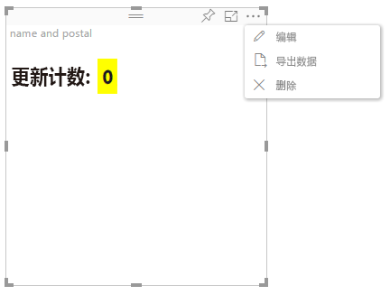

# 高级编辑模式

需要高级 UI 控件的视觉对象可以声明支持高级编辑模式。
如果支持，则在报表编辑模式下，视觉对象的菜单中会显示 `Edit` 按钮。
单击 `Edit` 按钮后，EditMode 设置为 `Advanced`。
视觉对象可以使用 EditMode 标志来决定是否显示此类 UI 控件。

默认情况下，视觉对象不支持高级编辑模式。
如需其他行为，则应通过设置 `advancedEditModeSupport` 属性在此视觉对象的 `capabilities.json` 文件中进行显式声明。

可能的值为：

- 0 - NotSupported

- 1 - SupportedNoAction

- 2 - SupportedInFocus

## 进入高级编辑模式

在以下情况下，会显示 `Edit` 按钮：

 1 - capabilities.json 中的 `advancedEditModeSupport` 属性设置为 `SupportedNoAction` 或 `SupportedInFocus`。

 2 - 在报表编辑模式下查看视觉对象。

如果 capabilities.json 中缺少 `advancedEditModeSupport` 属性或者该属性设置为 `NotSupported`，“编辑”按钮不会显示。

用户单击 `Edit` 时，视觉对象会获取一个 update() 调用，且 EditMode 设置为 `Advanced`。
根据功能中设置的值，可发生以下操作：

* `SupportedNoAction` - 主机不执行任何进一步操作。
* `SupportedInFocus` - 主机以焦点模式弹出视觉对象。

## 退出高级编辑模式

在以下情况下，会显示 `Back to report` 按钮：

1 - capabilities.json 中的 `advancedEditModeSupport` 属性设置为 `SupportedInFocus`。
