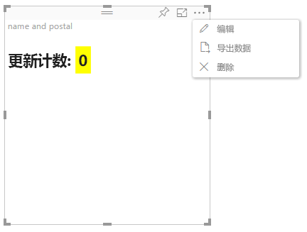

# Power BI 视觉对象中的高级编辑模式

如果在 Power BI 视觉对象中需要高级 UI 控件，可以使用高级编辑模式。 处于报表编辑模式时，请选择“编辑”按钮以将编辑模式设置为“高级”   。 视觉对象可以使用 `EditMode` 标志来决定是否应显示此 UI 控件。

默认情况下，视觉对象不支持高级编辑模式。 如需其他行为，则可以通过设置 `advancedEditModeSupport` 属性，在视觉对象的 capabilities.json 文件中明确声明  。

可能的值为：

- `0` - NotSupported

- `1` - SupportedNoAction

- `2` - SupportedInFocus

## 进入高级编辑模式

如果出现以下情况，则会显示“编辑”按钮  ：

* 在 capabilities.json 文件中将 `advancedEditModeSupport` 属性设置为 `SupportedNoAction` 或 `SupportedInFocus`  。

* 在报表编辑模式下查看视觉对象。

如果 capabilities.json 文件中缺少属性 `advancedEditModeSupport` 或将其设置为 `NotSupported`，则不会显示“编辑”按钮   。

选择“编辑”  时，视觉对象将获取 update() 调用，并将 EditMode 设置为 `Advanced`。 根据 capabilities.json 文件中设置的值，将发生以下操作  ：

* `SupportedNoAction`：主机无需执行任何进一步操作。
* `SupportedInFocus`：主机以焦点模式弹出视觉对象。

## 退出高级编辑模式

如果出现以下情况，则会显示“返回报表”按钮  ：

* 在 capabilities.json 文件中将 `advancedEditModeSupport` 属性设置为 `SupportedInFocus`  。
