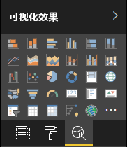

# <a name="the-analytics-pane-in-power-bi-visuals"></a>Power BI 视觉对象中的“分析”窗格

2018 年 11 月，[原生视觉对象引入了](../../transform-model/desktop-analytics-pane.md)“分析”窗格。
本文介绍具有 API v2.5.0 的 Power BI 视觉对象如何在“分析”窗格中显示和管理其属性  。



## <a name="manage-the-analytics-pane"></a>管理“分析”窗格

就像在[格式](./custom-visual-develop-tutorial-format-options.md)窗格中管理属性一样，你通过在视觉对象的 capabilities.json 文件中定义一个对象来管理“分析”窗格。

对于“分析”窗格，不同之处如下所示  ：

* 在对象的定义下，添加一个值为 2 的“objectCategory”字段  。

    > [!NOTE]
    > API 2.5.0 中引入了可选的 `objectCategory` 字段。 它定义了对象控制的视觉对象方面（1 = 格式设置，2 = 分析）。 `Formatting` 用于外观、颜色、轴和标签等元素。 `Analytics` 用于预测、趋势线、参考行和形状等元素。
    >
    > 如果未指定该值，则 `objectCategory` 默认为“格式设置”。

* 对象必须具有以下两种属性：
    * 类型为 `bool` 的 `show`，默认值为 `false`。
    * `text` 类型的 `displayName`。 所选择的默认值将成为实例的初始显示名称。

```json
{
  "objects": {
    "YourAnalyticsPropertiesCard": {
      "displayName": "Your analytics properties card's name",
      "objectCategory": 2,
      "properties": {
        "show": {
          "type": {
            "bool": true
          }
        },
        "displayName": {
          "type": {
            "text": true
          }
        },
      ... //any other properties for your Analytics card
      }
    }
  ...
  }
}
```

可以使用与定义“格式”对象相同的方式，定义其他属性  。 可以像在“格式”窗格中一样枚举对象  。

## <a name="known-limitations-and-issues-of-the-analytics-pane"></a>“分析”窗格的已知限制和问题

* “分析”窗格尚无多实例支持  。 对象的[选择器](https://microsoft.github.io/PowerBI-visuals/docs/concepts/objects-and-properties/#selector)只能是静态选择器（即“选择器”：null），并且 Power BI 视觉对象不能有用户定义的多个卡实例。
* 类型 `integer` 的属性显示不正确。 一种解决方法是，改用类型 `numeric`。

> [!NOTE]
> * 仅为用于添加新信息或进一步阐述显示的信息的对象使用“分析”窗格（例如，说明重要趋势的动态参考线）  。
> * 控制视觉对象外观的任何选项（即格式设置）都应限制为“格式设置”窗格  。