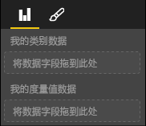

# <a name="capabilities-and-properties-of-power-bi-visuals"></a>Power BI 视觉对象的功能和属性 

可使用功能向主机提供有关视觉对象的信息。 功能模型上的所有属性都是 `optional`。

视觉对象功能的根对象是 `dataRoles`、`dataViewMappings` 等。

```json
{
    "dataRoles": [ ... ],
    "dataViewMappings": [ ... ],
    "objects":  { ... },
    "supportsHighlight": true|false,
    "advancedEditModeSupport": 0|1|2,
    "sorting": { ... }
}

```

## <a name="define-the-data-fields-that-your-visual-expects-dataroles"></a>定义视觉对象所需的数据字段：dataRoles

要定义可绑定到数据的字段，请使用 `dataRoles`。 `dataRoles` 采用 `DataViewRole` 对象的数组，它定义了所有必需的属性。

### <a name="properties"></a>属性

* **name**：此数据字段的内部名称（必须是唯一的）。
* **kind**：字段类型：
    * `Grouping`：用于对度量值字段进行分组的离散值。
    * `Measure`：数值数据值。
    * `GroupingOrMeasure`：可用作组别或度量值的值。
* **displayName**：在“属性”窗格中向用户显示的名称  。
* **description**：字段的简短说明（可选）。
* **requiredTypes**：此数据角色所需的数据类型。 不匹配的值设置为 null（可选）。
* **preferredTypes**：此数据角色的首选数据类型（可选）。

### <a name="valid-data-types-in-requiredtypes-and-preferredtypes"></a>requiredTypes 和 preferredTypes 中的有效数据类型

* **bool**：布尔值
* **Integer**：整数值
* **numeric**：数值
* **text**：文本值
* **geography**：地理数据

### <a name="example"></a>示例

```json
"dataRoles": [
    {
        "displayName": "My Category Data",
        "name": "myCategory",
        "kind": "Grouping",
        "requiredTypes": [
            {
                "text": true
            },
            {
                "numeric": true
            },
            {
                "integer": true
            }
        ],
        "preferredTypes": [
            {
                "text": true
            }
        ]
    },
    {
        "displayName": "My Measure Data",
        "name": "myMeasure",
        "kind": "Measure",
        "requiredTypes": [
            {
                "integer": true
            },
            {
                "numeric": true
            }
        ],
        "preferredTypes": [
            {
                "integer": true
            }
        ]
    },
    {
        "displayNameKey": "Visual_Location",
        "name": "Locations",
        "kind": "Measure",
        "displayName": "Locations",
        "requiredTypes": [
            {
                "geography": {
                    "address": true
                }
            },
            {
                "geography": {
                    "city": true
                }
            },
            {
                "geography": {
                    "continent": true
                }
            },
            {
                "geography": {
                    "country": true
                }
            },
            {
                "geography": {
                    "county": true
                }
            },
            {
                "geography": {
                    "place": true
                }
            },
            {
                "geography": {
                    "postalCode": true
                }
            },
            {
                "geography": {
                    "region": true
                }
            },
            {
                "geography": {
                    "stateOrProvince": true
                }
            }
        ]
    }
]
```

前面的数据角色将创建如下图所示的字段：



## <a name="define-how-you-want-the-data-mapped-dataviewmappings"></a>定义数据映射的方式：dataViewMappings

DataViewMappings 属性描述数据角色如何彼此相关，并允许你为它们指定条件要求。

大多数视觉对象提供单个映射，但你可以提供多个 dataViewMapping。 每个有效映射都会生成数据视图。 

```json
"dataViewMappings": [
    {
        "conditions": [ ... ],
        "categorical": { ... },
        "table": { ... },
        "single": { ... },
        "matrix": { ... }
    }
]
```

有关详细信息，请参阅[了解 Power BI 视觉对象中的数据视图映射](dataview-mappings.md)。

## <a name="define-property-pane-options-objects"></a>定义属性窗格选项：objects

对象描述与视觉对象关联的可自定义属性。 每个对象可以具有多个属性，每个属性都有与之关联的类型。 类型指示属性将是什么属性。 

```json
"objects": {
    "myCustomObject": {
        "displayName": "My Object Name",
        "properties": { ... }
    }
}
```

有关详细信息，请参阅 [Power BI 视觉对象的对象和属性](objects-properties.md)。

## <a name="handle-partial-highlighting-supportshighlight"></a>处理部分突出显示：supportsHighlight

默认情况下，此值设置为 `false`，这意味着选择页面上的某些内容时，会自动筛选值。 此自动筛选会进而更新视觉对象以仅显示所选值。 如果要显示完整的数据，且只突出显示选定项，则需要在 capabilities.json 文件中将 `supportsHighlight` 设置为 `true`  。

有关详细信息，请参阅[突出显示 Power BI 视觉对象中的数据点](highlight.md)。

## <a name="handle-advanced-edit-mode-advancededitmodesupport"></a>处理高级编辑模式：advancedEditModeSupport

视觉对象可以声明其高级编辑模式支持。 默认情况下，除非 capabilities json 文件中另有说明，否则视觉对象不支持高级编辑模式  。

有关详细信息，请参阅 [Power BI 视觉对象中的高级编辑模式](advanced-edit-mode.md)。

## <a name="data-sorting-options-for-visual-sorting"></a>视觉对象的数据排序选项：sorting

视觉对象可通过其功能定义其排序行为。 默认情况下，除非 capabilities.json 文件中另有说明，否则视觉对象不支持修改其排序顺序  。

有关详细信息，请参阅 [Power BI 视觉对象的排序选项](sort-options.md)。
