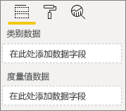
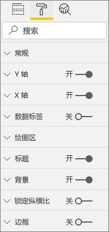
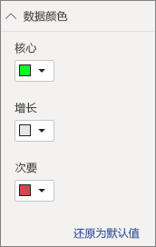

# <a name="build-a-bar-chart"></a>生成条形图

本文分步介绍了如何使用代码构建 Power BI 条形图视觉对象示例。 可以在 [https://github.com/Microsoft/PowerBI-visuals-sampleBarChart](https://github.com/Microsoft/PowerBI-visuals-sampleBarChart) 获取完整的代码示例。

## <a name="view-model"></a>查看模型
首先定义条形图视图模型，并在生成时循环访问视觉对象，这一点很重要。

```typescript
/**
 * Interface for BarCharts viewmodel.
 *
 * @interface
 * @property {BarChartDataPoint[]} dataPoints - Set of data points the visual will render.
 * @property {number} dataMax                 - Maximum data value in the set of data points.
 */
interface BarChartViewModel {
    dataPoints: BarChartDataPoint[];
    dataMax: number;
};

/**
 * Interface for BarChart data points.
 *
 * @interface
 * @property {number} value    - Data value for the point.
 * @property {string} category - Corresponding category of the data value.
 */
interface BarChartDataPoint {
    value: number;
    category: string;
};
```

### <a name="use-static-data"></a>使用静态数据

使用静态数据是在不进行数据绑定的情况下测试视觉对象的好方法。 即使在稍后的步骤中添加数据绑定后，视图模型也不会更改。

```typescript
let testData: BarChartDataPoint[] = [
    {
        value: 10,
        category: 'a'
    },
    {
        value: 20,
        category: 'b'
    },
    {
        value: 1,
        category: 'c'
    },
    {
        value: 100,
        category: 'd'
    },
    {
        value: 500,
        category: 'e'
    }];

let viewModel: BarChartViewModel = {
    dataPoints: testData,
    dataMax: d3.max(testData.map((dataPoint) => dataPoint.value))
};
```

## <a name="data-binding"></a>数据绑定 
通过定义 *capabilities.json* 中的视觉对象功能来添加数据绑定。 示例代码已有一个可供使用的架构。

数据绑定适用于 Power BI 中的字段框。



### <a name="add-data-roles"></a>添加数据角色
示例代码已有数据角色，但你可以对其进行自定义。

- `displayName` 是字段框中显示的名称。
- `name` 是用于引用数据角色的内部名称。
- `kind` 是字段类型。 分组字段 (0) 具有离散值。 度量值字段 (1) 具有数值数据值。

```json
"dataRoles": [
    {
        "displayName": "Category Data",
        "name": "category",
        "kind": 0
    },
    {
        "displayName": "Measure Data",
        "name": "measure",
        "kind": 1
    }
],
```

有关详细信息，请参阅[数据角色](./capabilities.md#define-the-data-fields-that-your-visual-expects-dataroles)。

### <a name="add-conditions-to-dataviewmapping"></a>向 DataViewMapping 添加条件
在 `dataViewMappings` 中定义条件，设置每个字段框可以绑定的字段数。 使用数据角色的内部 `name` 引用每个字段。

```json
    "dataViewMappings": [
        {
            "conditions": [
                {
                    "category": {
                        "max": 1
                    },
                    "measure": {
                        "max": 1
                    }
                }
            ],
        }
    ]
```

有关详细信息，请参阅[数据视图映射](./dataview-mappings.md)。

### <a name="define-and-use-visualtransform"></a>定义和使用 visualTransform
`DataView` 是 Power BI 向视觉对象提供的结构，其中包含要进行可视化处理的查询数据。 但 `DataView` 可以提供不同格式的数据，例如类别和表格。 若要生成类似于条形图的类别视觉对象，只需使用 `DataView` 上的类别属性即可。 通过定义 `visualTransform`，可将 `DataView` 转换为视觉对象将使用的视图模型。

若要在定义各个数据点时分配颜色并进行选择，请使用 `IVisualHost`。 

```typescript
/**
 * Function that converts queried data into a view model that will be used by the visual
 *
 * @function
 * @param {VisualUpdateOptions} options - Contains references to the size of the container
 *                                        and the dataView which contains all the data
 *                                        the visual had queried.
 * @param {IVisualHost} host            - Contains references to the host which contains services
 */
function visualTransform(options: VisualUpdateOptions, host: IVisualHost): BarChartViewModel {
    /*Convert dataView to your viewModel*/
}

```

## <a name="color"></a>颜色 
颜色作为 `IVisualHost` 上可用的一项服务公开。

### <a name="add-color-to-data-points"></a>为数据点添加颜色
每个数据点以一种不同颜色表示。 可以向 `BarChartDataPoint` 接口添加颜色。

```typescript
/**
 * Interface for BarChart data points.
 *
 * @interface
 * @property {number} value    - Data value for the point.
 * @property {string} category - Corresponding category of the data value.
 * @property {string} color    - Color corresponding to the data point.
 */
interface BarChartDataPoint {
    value: number;
    category: string;
    color: string;
};
```

### <a name="the-colorpalette-service"></a>colorPalette 服务
`colorPalette` 服务管理视觉对象中使用的颜色。 `IVisualHost` 上提供了实例。

### <a name="assign-color-to-data-points"></a>为数据点分配颜色
将 `visualTransform` 定义为构造，以将 `dataView` 转换为条形图可使用的视图模型。 由于你在 `visualTransform` 中循环访问数据点，因此它也是分配颜色的理想位置。

```typescript
let colorPalette: IColorPalette = host.colorPalette; // host: IVisualHost
for (let i = 0, len = Math.max(category.values.length, dataValue.values.length); i < len; i++) {
    barChartDataPoints.push({
        category: category.values[i],
        value: dataValue.values[i],
        color: colorPalette.getColor(category.values[i]).value,
    });
}
```

## <a name="selection-and-interactions"></a>选择和交互
通过选择，用户可以与你的视觉对象和其他视觉对象交互。 

### <a name="add-selection-to-each-data-point"></a>向每个数据点添加选择
由于每个数据点都是唯一的，因此可向每个数据点添加选择。 在 `BarChartDataPoint` 接口上添加选择属性。

```typescript
/**
 * Interface for BarChart data points.
 *
 * @interface
 * @property {number} value             - Data value for the point.
 * @property {string} category          - Corresponding category of data value.
 * @property {string} color             - Color corresponding to data point.
 * @property {ISelectionId} selectionId - Id assigned to data point for cross filtering
 *                                        and visual interaction.
 */
interface BarChartDataPoint {
    value: number;
    category: string;
    color: string;
    selectionId: ISelectionId;
};
```

### <a name="assign-selection-ids-to-each-data-point"></a>向每个数据点分配选择 ID
由于你在 `visualTransform` 中循环访问数据点，因此它也是创建选择 ID 的理想位置。 主机变量是一个 `IVisualHost`，其中包含视觉对象可使用的服务，如颜色和选择生成器。 

使用 `IVisualHost` 上的 `createSelectionIdBuilder` 工厂方法来创建新的选择 ID。 为每个数据点创建一个新的选择生成器。

由于仅根据类别进行选择，因此只需定义选择 `withCategory`。

```typescript
for (let i = 0, len = Math.max(category.values.length, dataValue.values.length); i < len; i++) {
    barChartDataPoints.push({
        category: category.values[i],
        value: dataValue.values[i],
        color: colorPalette.getColor(category.values[i]).value,
        selectionId: host.createSelectionIdBuilder()
            .withCategory(category, i)
            .createSelectionId()
    });
}
```

有关详细信息，请参阅[创建选择生成器的实例](./selection-api.md#create-an-instance-of-the-selection-builder)。

### <a name="interact-with-data-points"></a>与数据点交互
一旦将选择 ID 分配给数据点，就可以与条形图的每个条形交互。 条形图侦听 `click` 事件。

使用 `IVisualHost` 的 `selectionManager` 工厂方法来创建选择管理器，用于交叉筛选和清除选择。

```typescript
let selectionManager = this.selectionManager;

//This must be an anonymous function instead of a lambda because
//d3 uses 'this' as the reference to the element that was clicked.
bars.on('click', function(d) {
    selectionManager.select(d.selectionId).then((ids: ISelectionId[]) => {
        bars.attr({
            'fill-opacity': ids.length > 0 ? BarChart.Config.transparentOpacity : BarChart.Config.solidOpacity
        });

        d3.select(this).attr({
            'fill-opacity': BarChart.Config.solidOpacity
        });
    });

    (<Event>d3.event).stopPropagation();
});
```

有关详细信息，请参阅[如何使用 SelectionManager](./selection-api.md#how-to-use-selectionmanager-to-select-data-points)。

## <a name="static-objects"></a>静态对象

可以将对象添加到“属性”窗格中以进一步自定义视觉对象。 这些自定义项可以是用户界面更改，或与查询的数据相关的更改。 该示例使用静态对象呈现条形图的 X 轴。

可以在“属性”窗格中打开或关闭对象。



### <a name="define-objects-in-capabilities"></a>定义功能中的对象
定义 *capabilities.json* 文件中的 `objects` 属性，以便对象显示在“属性”窗格中。
- `enableAxis` 是 `dataView` 引用的内部名称。 
- `displayName` 是“属性”窗格中显示的名称。
- `bool` 是通常用于静态对象（例如文本框或开关）的基元值。
- `show` 是 `properties` 上的一个特殊属性，可在对象上启用 `show` 开关。 由于 `show` 是一个开关，因此它被类型化为 `bool`。


```typescript
"objects": {
    "enableAxis": {
        "displayName": "Enable Axis",
        "properties": {
            "show": {
                "displayName": "Enable Axis",
                "type": { "bool": true }
            }
        }
    }
}
```

有关详细信息，请参阅[对象](./objects-properties.md)。

### <a name="define-property-settings"></a>定义属性设置

以下各节介绍了定义属性设置的基本原则。 还可以使用 `powerbi-visuals-utils-dataviewutils` 包中定义的实用工具类来定义属性设置。 有关详细信息，请参阅 [DataViewObjectsParser](https://github.com/Microsoft/powerbi-visuals-utils-dataviewutils/blob/master/docs/api/data-view-objects-parser.md) 类的文档和示例。


尽管将大多数设置本地化为单个对象是可选的，但最好这样做以方便引用。

```typescript
/**
 * Interface for BarCharts viewmodel.
 *
 * @interface
 * @property {BarChartDataPoint[]} dataPoints - Set of data points the visual will render.
 * @property {number} dataMax                 - Maximum data value in the set of data points.
 * @property {BarChartSettings} settings      - Object property settings
 */
interface BarChartViewModel {
    dataPoints: BarChartDataPoint[];
    dataMax: number;
    settings: BarChartSettings;
};

/**
 * Interface for BarChart settings.
 *
 * @interface
 * @property "show" enableAxis - Object property that allows axis to be enabled.
 */
interface BarChartSettings {
    enableAxis: {
        show: boolean;
    };
}
```

### <a name="define-and-use-objectenumerationutility"></a>定义和使用 ObjectEnumerationUtility
对象属性值作为 `dataView` 上的元数据提供，但没有可帮助检索这些属性的服务。 `ObjectEnumerationUtility` 是一组静态函数，可用于从 `dataView` 和其他视觉对象项目检索对象值。 `ObjectEnumerationUtility` 是可选的，但它非常适合用于循环访问 `dataView` 以检索对象属性。

```typescript
/**
 * Gets property value for a particular object.
 *
 * @function
 * @param {DataViewObjects} objects - Map of defined objects.
 * @param {string} objectName       - Name of desired object.
 * @param {string} propertyName     - Name of desired property.
 * @param {T} defaultValue          - Default value of desired property.
 */
export function getValue<T>(objects: DataViewObjects, objectName: string, propertyName: string, defaultValue: T ): T {
    if(objects) {
        let object = objects[objectName];
        if(object) {
            let property: T = object[propertyName];
            if(property !== undefined) {
                return property;
            }
        }
    }
    return defaultValue;
}
```

请参阅 [objectEnumerationUtility.ts](https://github.com/Microsoft/PowerBI-visuals-sampleBarChart/blob/master/src/objectEnumerationUtility.ts)，获取源代码。

### <a name="retrieve-property-values-from-dataview"></a>从 dataView 检索属性值
`visualTransform` 是操作视觉对象的视图模型的理想位置。 若要继续此模式，请从 `dataView` 检索对象属性。

定义属性的默认状态，并使用 `getValue` 从 `dataView` 中检索属性。

```typescript
let defaultSettings: BarChartSettings = {
    enableAxis: {
        show: false,
    }
};

let barChartSettings: BarChartSettings = {
    enableAxis: {
        show: getValue<boolean>(objects, 'enableAxis', 'show', defaultSettings.enableAxis.show),
    }
}
```

### <a name="populate-property-pane-with-enumerateobjectinstances"></a>用 enumerateObjectInstances 填充属性窗格
`IVisual` 上的 `enumerateObjectInstances` 可选方法枚举所有对象，并将它们放置在“属性”窗格中。 使用 `enumerateObjectInstances` 调用每个对象。 对象的名称在 `EnumerateVisualObjectInstancesOptions` 上提供。

对于每个对象，将属性定义为其当前状态。

```typescript
/**
 * Enumerates through the objects defined in the capabilities and adds the properties to the format pane
 *
 * @function
 * @param {EnumerateVisualObjectInstancesOptions} options - Map of defined objects
 */
public enumerateObjectInstances(options: EnumerateVisualObjectInstancesOptions): VisualObjectInstanceEnumeration {
    let objectName = options.objectName;
    let objectEnumeration: VisualObjectInstance[] = [];

    switch(objectName) {
        case 'enableAxis':
            objectEnumeration.push({
                objectName: objectName,
                properties: {
                    show: this.barChartSettings.enableAxis.show,
                },
                selector: null
            });
    };

    return objectEnumeration;
}
```

### <a name="control-property-update-logic"></a>控件属性更新逻辑
将对象添加到“属性”窗格后，每个开关会触发更新。 在 `if` 块中添加特定对象逻辑：

```typescript
if(settings.enableAxis.show) {
    let margins = BarChart.Config.margins;
    height -= margins.bottom;
}
```

## <a name="databound-objects"></a>数据绑定对象
数据绑定对象类似于静态对象，但通常处理数据选择。 例如，可以更改与数据点相关联的颜色。



### <a name="define-object-in-capabilities"></a>定义功能中的对象
类似于静态对象，在 *capabilities.json* 中定义另一个对象。 
- `colorSelector` 是 `dataView` 引用的内部名称。
- `displayName` 是“属性”窗格中显示的名称。
- `fill` 与基元类型无关的结构对象值。

```typescript
"colorSelector": {
    "displayName": "Data Colors",
    "properties": {
        "fill": {
            "displayName": "Color",
            "type": {
                "fill": {
                    "solid": {
                        "color": true
                    }
                }
            }
        }
    }
}
```

有关详细信息，请参阅[对象](./objects-properties.md)。

### <a name="use-objectenumerationutility"></a>使用 ObjectEnumerationUtility
与静态对象一样，你需要从 `dataView` 检索对象的详细信息。 但是，对象值不是与元数据关联，而是与每个类别关联。

```typescript
/**
 * Gets property value for a particular object in a category.
 *
 * @function
 * @param {DataViewCategoryColumn} category - List of category objects.
 * @param {number} index                    - Index of category object.
 * @param {string} objectName               - Name of desired object.
 * @param {string} propertyName             - Name of desired property.
 * @param {T} defaultValue                  - Default value of desired property.
 */
export function getCategoricalObjectValue<T>(category: DataViewCategoryColumn, index: number, objectName: string, propertyName: string, defaultValue: T): T {
    let categoryObjects = category.objects;

    if(categoryObjects) {
        let categoryObject: DataViewObject = categoryObjects[index];
        if(categoryObject) {
            let object = categoryObject[objectName];
            if(object) {
                let property: T = object[propertyName];
                if(property !== undefined) {
                    return property;
                }
            }
        }
    }
    return defaultValue;
}
```

请参阅 [objectEnumerationUtility.ts](https://github.com/Microsoft/PowerBI-visuals-sampleBarChart/blob/master/src/objectEnumerationUtility.ts)，获取源代码。

### <a name="define-default-color-and-retrieve-categorical-object-from-dataview"></a>定义默认颜色并从 dataView 检索类别对象
每种颜色现在都与 `dataView` 中的每个类别关联。 可以将每个数据点设置为其相应的颜色。

```typescript
for (let i = 0, len = Math.max(category.values.length, dataValue.values.length); i < len; i++) {
    let defaultColor: Fill = {
        solid: {
            color: colorPalette.getColor(category.values[i]).value
        }
    }

    barChartDataPoints.push({
        category: category.values[i],
        value: dataValue.values[i],
        color: getCategoricalObjectValue<Fill>(category, i, 'colorSelector', 'fill', defaultColor).solid.color,
        selectionId: host.createSelectionIdBuilder()
            .withCategory(category, i)
            .createSelectionId()
    });
}
```

### <a name="populate-property-pane-with-enumerateobjectinstances"></a>用 enumerateObjectInstances 填充属性窗格
使用 `enumerateObjectInstances`将对象填充入“属性”窗格。 

对于此实例，添加颜色选取器，以便在“属性”窗格中呈现每个类别。 为此，请向 `colorSelector` 的 `switch` 语句添加其他用例，并使用关联的颜色循环访问每个数据点。 

需要选择才能将颜色与数据点相关联。

```typescript
/**
 * Enumerates through the objects defined in the capabilities and adds the properties to the format pane
 *
 * @function
 * @param {EnumerateVisualObjectInstancesOptions} options - Map of defined objects
 */
public enumerateObjectInstances(options: EnumerateVisualObjectInstancesOptions): VisualObjectInstanceEnumeration {
    let objectName = options.objectName;
    let objectEnumeration: VisualObjectInstance[] = [];

    switch(objectName) {
        case 'enableAxis':
            objectEnumeration.push({
                objectName: objectName,
                properties: {
                    show: this.barChartSettings.enableAxis.show,
                },
                selector: null
            });
            break;
        case 'colorSelector':
            for(let barDataPoint of this.barDataPoints) {
                objectEnumeration.push({
                    objectName: objectName,
                    displayName: barDataPoint.category,
                    properties: {
                        fill: {
                            solid: {
                                color: barDataPoint.color
                            }
                        }
                    },
                    selector: barDataPoint.selectionId.getSelector()
                });
            }
            break;
    };

    return objectEnumeration;
}
```

为每个属性提供选择器后，将获得以下 `dataView` 对象数组：


数组 `dataViews[0].categorical.categories[0].objects` 中的每一项都对应于数据集的具体类别。

函数 `getCategoricalObjectValue` 只提供一种通过属性的类别索引访问属性的简便方法。 你必须提供与 capabilities.json 中的对象和属性匹配的 `objectName` 和 `propertyName`。

## <a name="other-features"></a>其他功能 
可以向条形图添加滑块控件或工具提示。 对于要添加的代码，请参阅[添加属性窗格滑块来控制不透明度](https://github.com/Microsoft/PowerBI-visuals-sampleBarChart/commit/e2e0bc5888d9a3ca305a7a7af5046068645c8b30)和[添加对工具提示的支持](https://github.com/Microsoft/PowerBI-visuals-sampleBarChart/commit/981b021612d7b333adffe9f723ab27783c76fb14)中的提交内容。 有关工具提示的详细信息，请参阅 [Power BI 视觉对象中的工具提示](./add-tooltips.md)。

## <a name="packaging"></a>包装

将视觉对象加载到 [Power BI Desktop](https://powerbi.microsoft.com/desktop/) 中或者在 [Power BI 视觉对象库](https://visuals.powerbi.com/)中与社区共享视觉对象之前，必须将视觉对象打包。 导航到包含文件 pbiviz.json 的视觉对象的根文件夹，使用以下命令生成 pbiviz 文件：

```bash
pbiviz package
```
此命令在视觉对象的 dist/ 目录中创建一个 pbiviz 文件，并覆盖先前包操作中的任何 pbiviz 文件。

## <a name="next-steps"></a>后续步骤
可以将以下功能添加到视觉对象：
* [将上下文菜单添加到视觉对象](./context-menu.md)
* [登陆页面](./landing-page.md)
* [启动 URL](./launch-url.md)
* [区域设置支持](./localization.md)