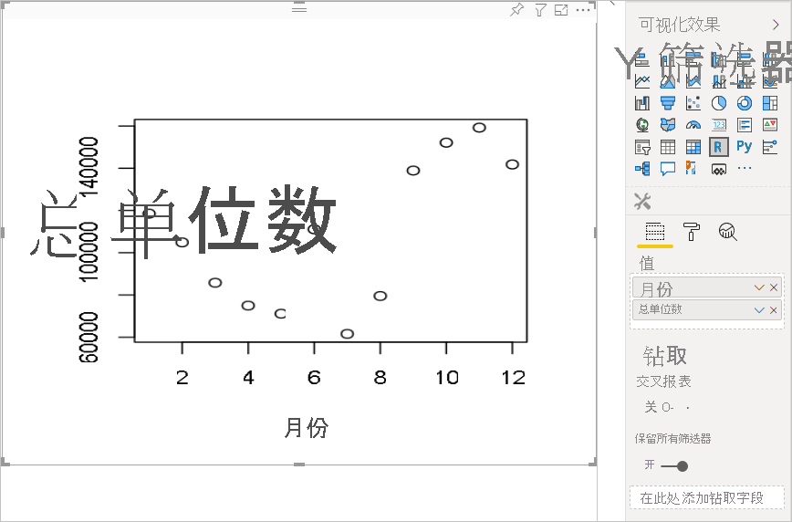
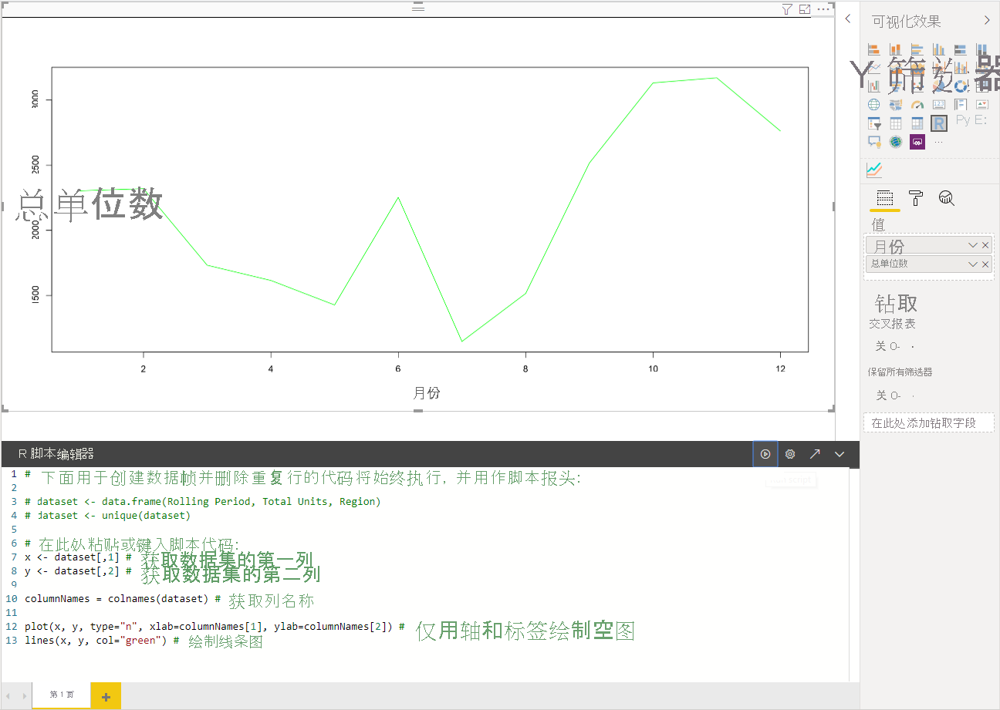
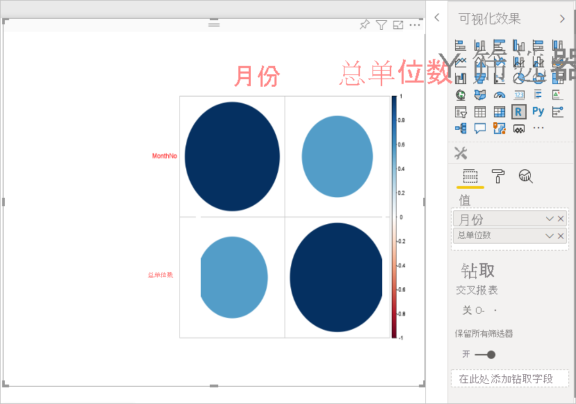
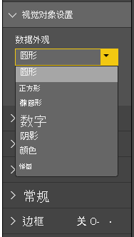
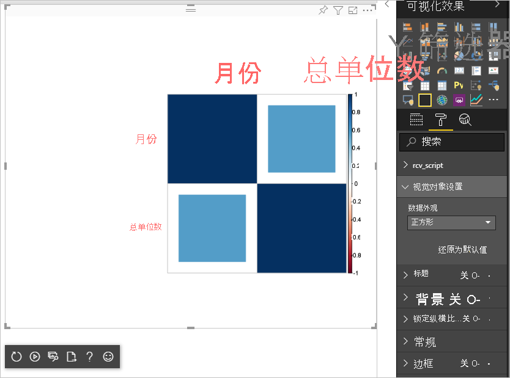

# <a name="tutorial-create-an-r-powered-power-bi-visual"></a>教程：创建 R 驱动的 Power BI 视觉对象

本教程介绍如何创建 R 驱动的 Power BI 视觉对象。

在本教程中，了解如何：

> [!div class="checklist"]
>
> * 创建 R 驱动的视觉对象
> * 在 Power BI Desktop 中编辑 R 脚本
> * 向视觉对象添加库
> * 添加静态属性

## <a name="prerequisites"></a>先决条件

* Power BI Pro 帐户。 开始之前，[请注册免费试用版](https://powerbi.microsoft.com/pricing/)。
* R 引擎。 可以从很多位置（包括 [Revolution Open 下载页](https://mran.revolutionanalytics.com/download/)和 [CRAN 存储库](https://cran.r-project.org/bin/windows/base/)）免费下载 R。 有关详细信息，请参阅[使用 R 创建 Power BI 视觉对象](../../desktop-r-visuals.md)。
* [Power BI Desktop](../../fundamentals/desktop-get-the-desktop.md)。
* 对于 Windows 用户，需要 [Windows PowerShell](https://docs.microsoft.com/powershell/scripting/install/installing-windows-powershell?view=powershell-6) 版本 4 或更高版本，而对于 OSX 用户，则需要[终端](https://macpaw.com/how-to/use-terminal-on-mac)。

## <a name="getting-started"></a>入门

1. 准备视觉对象的示例数据。 可以将这些值保存到 Excel 数据库或 .csv 文件中，然后将其导入到 Power BI Desktop 中。

    | MonthNo | 总单位数 |
    |-----|-----|
    | 1 | 2303 |
    | 2 | 2319 |
    | 3 | 1732 |
    | 4 | 1615 |
    | 5 | 1427 |
    | 6 | 2253 |
    | 7 | 1147 |
    | 8 | 1515 |
    | 9 | 2516 |
    | 10 | 3131 |
    | 11 | 3170 |
    | 12 | 2762 |

1. 若要创建视觉对象，请打开 PowerShell 或终端，并运行以下命令：

   ```cmd
   pbiviz new rVisualSample -t rvisual
   ```

   此命令会根据 `rvisual` 模板创建新的文件夹结构。 此模板包括一个简单且可随时运行的 R 驱动的视觉对象，该视觉对象运行以下 R 脚本：

   ```r
   plot(Values)
   ```

   `Values` 数据帧将包含 `Values` 数据角色中的列。

1. 通过将“月份”和“单位总数”添加到视觉对象的“值”中，将数据分配到开发人员的视觉对象中。  

   

## <a name="editing-the-r-script"></a>编辑 R 脚本

使用 `pbiviz` 创建基于 `rvisual` 模板的 R 驱动的视觉对象时，它将在视觉对象的根文件夹中创建一个名为 script.r 的文件。 此文件将保管 R 脚本，该脚本运行后可生成用户映像。 可以在 Power BI Desktop 中创建 R 脚本。

1. 在 Power BI Desktop 中，选择“R 脚本视觉对象”：

   

1. 将此 R 代码粘贴到 R 脚本编辑器中：

    ```r
    x <- dataset[,1] # get the first column from dataset
    y <- dataset[,2] # get the second column from dataset

    columnNames = colnames(dataset) # get column names

    plot(x, y, type="n", xlab=columnNames[1], ylab=columnNames[2]) # draw empty plot with axis and labels only
    lines(x, y, col="green") # draw line plot
    ```

1. 选择“运行脚本”图标以查看结果。

    

1. R 脚本准备就绪后，将其复制到在前面的某个步骤中在视觉对象项目中创建的 `script.r` 文件。

1. 将 capabilities.json 中的 `dataRoles` 的 `name` 更改为 `dataRoles`。 Power BI 将数据作为 R 脚本视觉对象的 `dataset` 数据帧对象进行传递，但 R 视觉对象根据 `dataRoles` 名称获取数据帧名称。

    ```json
    {
      "dataRoles": [
        {
          "displayName": "Values",
          "kind": "GroupingOrMeasure",
          "name": "dataRoles"
        }
      ],
      "dataViewMappings": [
        {
          "scriptResult": {
            "dataInput": {
              "table": {
                "rows": {
                  "select": [
                    {
                      "for": {
                        "in": "dataset"
                      }
                    }
                  ],
                  "dataReductionAlgorithm": {
                    "top": {}
                  }
                }
              }
            },
            ...
          }
        }
      ],
    }
    ```

1. 添加以下代码，以支持从 src/visual. ts 文件中调整此映像大小。

    ```typescript
      public onResizing(finalViewport: IViewport): void {
          this.imageDiv.style.height = finalViewport.height + "px";
          this.imageDiv.style.width = finalViewport.width + "px";
          this.imageElement.style.height = finalViewport.height + "px";
          this.imageElement.style.width = finalViewport.width + "px";
      }
    ```

## <a name="add-libraries-to-visual-package"></a>向视觉对象包添加库

通过此过程，视觉对象可以使用 `corrplot` 包。

1. 将视觉对象的库依赖项添加到 `dependencies.json`。 下面是文件内容示例：

    ```json
    {
      "cranPackages": [
        {
          "name": "corrplot",
          "displayName": "corrplot",
          "url": "https://cran.r-project.org/web/packages/corrplot/"
        }
      ]
    }
    ```

    `corrplot` 包以图形形式显示相关矩阵。 有关 `corrplot` 的详细信息，请参阅 [corrplot 包简介](https://cran.r-project.org/web/packages/corrplot/vignettes/corrplot-intro.html)。

1. 完成这些更改后，开始将此包用于 `script.r` 文件。

    ```r
    library(corrplot)
    corr <- cor(dataset)
    corrplot(corr, method="circle", order = "hclust")
    ```

使用 `corrplot` 包的结果如下例所示：



## <a name="adding-a-static-property-to-the-property-pane"></a>将静态属性添加到“属性”窗格

允许用户更改 UI 设置。 要实现此目的，请将属性添加到“属性”窗格，这些属性将更改 R 脚本基于用户输入的行为。

可以使用 `corrplot` 函数的 `method` 参数配置 `corrplot`。 默认脚本使用圆圈。 修改视觉对象，允许用户在多个选项之间进行选择。

1. 定义 capabilities.json 文件中的对象和属性。 然后，在枚举方法中使用此对象名称，以从“属性”窗格中获取这些值。

    ```json
    {
      "settings": {
      "displayName": "Visual Settings",
      "description": "Settings to control the look and feel of the visual",
      "properties": {
        "method": {
          "displayName": "Data Look",
          "description": "Control the look and feel of the data points in the visual",
          "type": {
            "enumeration": [
              {
                "displayName": "Circle",
                "value": "circle"
              },
              {
                "displayName": "Square",
                "value": "square"
              },
              {
                "displayName": "Ellipse",
                "value": "ellipse"
              },
              {
                "displayName": "Number",
                "value": "number"
              },
              {
                "displayName": "Shade",
                "value": "shade"
              },
              {
                "displayName": "Color",
                "value": "color"
              },
              {
                "displayName": "Pie",
                "value": "pie"
              }
            ]
          }
        }
      }
    }
    ```

1. 打开 src/settings.ts 文件。 使用公共属性 `method` 创建 `CorrPlotSettings` 类。 类型为 `string`，默认值为 `circle`。 将 `settings` 属性添加到 `VisualSettings` 类，其默认值为：

    ```typescript
    "use strict";

    import { dataViewObjectsParser } from "powerbi-visuals-utils-dataviewutils";
    import DataViewObjectsParser = dataViewObjectsParser.DataViewObjectsParser;

    export class VisualSettings extends DataViewObjectsParser {
      public rcv_script: rcv_scriptSettings = new rcv_scriptSettings();
      public settings: CorrPlotSettings = new CorrPlotSettings();
    }

    export class CorrPlotSettings {
      public method: string = "circle";
    }

    export class rcv_scriptSettings {
      public provider;
      public source;
    }
    ```

    完成这些步骤后，可以更改视觉对象的属性。

   

    最后，R 脚本必须以属性开头。 如果用户不更改此属性，则视觉对象无法获取此属性的任何值。

    对于属性的 R 运行时变量，命名约定为 `<objectname>_<propertyname>`，在本例中为 `settings_method`。

1. 更改视觉对象中的 R 脚本，使其与以下代码相匹配：

    ```r
    library(corrplot)
    corr <- cor(dataset)

    if (!exists("settings_method"))
    {
        settings_method = "circle";
    }

    corrplot(corr, method=settings_method, order = "hclust")
    ```

最终的视觉对象如以下示例所示：



## <a name="next-steps"></a>后续步骤

若要详细了解 R 驱动的视觉对象，请参阅[使用 Power BI 中 R 驱动的 Power BI 视觉对象](../../desktop-r-powered-custom-visuals.md)。

有关 Power BI Desktop 中 R 驱动的视觉对象的详细信息，请参阅[使用 R 创建 Power BI 视觉对象](../../desktop-r-visuals.md)。
