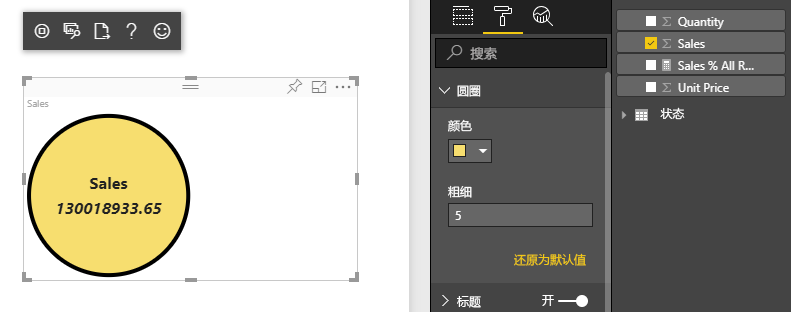
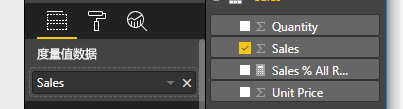

# <a name="tutorial-create-a-react-based-visual"></a>教程：创建基于 React 的视觉对象

本教程介绍如何使用 [React](https://reactjs.org/) 创建 Power BI 视觉对象。 视觉对象在圆圈中显示一个值。 视觉对象具有自适应大小和设置可对其进行自定义。 通过本文中的信息，你可以通过 React 创建自己的 Power BI 视觉对象。



在本教程中，了解如何：

> [!div class="checklist"]
>
> * 设置开发环境
> * 创建 React 视觉对象
> * 为视觉对象配置功能
> * 呈现 Power BI 中的数据
> * 调整视觉对象的大小
> * 使视觉对象可自定义

## <a name="prerequisites"></a>先决条件

* Power BI Pro 帐户。 开始之前，[请注册免费试用版](https://powerbi.microsoft.com/pricing/)。
* [Visual Studio Code](https://www.visualstudio.com/)。
* 对于 Windows 用户，需要 [Windows PowerShell](/powershell/scripting/install/installing-windows-powershell) 版本 4 或更高版本，而对于 OSX 用户，则需要[终端](https://macpaw.com/how-to/use-terminal-on-mac)。
* [设置用于开发 Power BI 视觉对象的环境](environment-setup.md)中所述的环境。

## <a name="getting-started"></a>入门

若要开始，请使用 `pbiviz` 创建最小 Power BI 视觉对象。 有关项目和项目结构的详细信息，请参阅 [Power BI 视觉对象结构](visual-project-structure.md)。 有关此视觉对象的完整源代码，请参阅[圆形卡片 React 视觉对象](https://github.com/Microsoft/powerbi-visuals-circlecard-react)。

可以从 [GitHub](https://github.com/Microsoft/powerbi-visuals-circlecard-react) 克隆或下载视觉对象的完整源代码。

1. 打开 PowerShell 并运行以下命令：

   ```powershell
   pbiviz new ReactCircleCard
   ```

   命令创建一个名为 ReactCircleCard 的文件夹。

1. 将目录更改为该文件夹并打开 Visual Studio Code。

   ```powershell
   cd ./ReactCircleCard
   code .
   ```

1. 启动视觉对象的开发人员服务器。

   ```powershell
   pbiviz start
   ```

   

此基本视觉对象表示更新计数。 接下来，让我们将其转换为圆形卡片。

## <a name="change-the-visual-to-a-circle-card"></a>将视觉对象更改为圆形卡片

此基本视觉对象表示更新计数。 接下来，将其转换为圆形卡片，这表示度量值及其标题。

1. 运行以下命令安装所需的依赖项：

   ```powershell
   npm i react react-dom
   ```

1. 运行以下命令，以安装 React 16 和相应版本的 `react-dom` 并键入：

   ```powershell
   npm i @types/react @types/react-dom
   ```

1. 创建 React 组件类。 在 Visual Studio Code 中，选择“文件” > “新建文件”。 将以下代码复制到文件中。

    ```typescript
    import * as React from "react";

    export class ReactCircleCard extends React.Component<{}>{
        render(){
            return (
                <div className="circleCard">
                    Hello, React!
                </div>
            )
        }
    }

    export default ReactCircleCard;
    ```

1. 选择“另存为”。 转到 src 目录。 输入名称“component”。 对于“另存为类型”，选择“TypeScript React” 。

1. 打开“src/visual.ts”。 将当前代码替换为以下代码：

    ```typescript
    "use strict";
    import powerbi from "powerbi-visuals-api";

    import DataView = powerbi.DataView;
    import VisualConstructorOptions = powerbi.extensibility.visual.VisualConstructorOptions;
    import VisualUpdateOptions = powerbi.extensibility.visual.VisualUpdateOptions;
    import IVisual = powerbi.extensibility.visual.IVisual;

    import "./../style/visual.less";

    export class Visual implements IVisual {

        constructor(options: VisualConstructorOptions) {

        }

        public update(options: VisualUpdateOptions) {

        }
    }
    ```

1. 导入 React 依赖项和刚才添加的组件。

    ```typescript
    import * as React from "react";
    import * as ReactDOM from "react-dom";
    ...
    import ReactCircleCard from "./component";
    ```

   默认 Power BI TypeScript 设置不会获取 React tsx 文件。 Visual Studio Code 将 `component` 突出显示为错误。

1. 打开文件 tsconfig.json，然后将两行添加到 `compilerOptions` 项的开头。

    ```json
    {
      "compilerOptions": {
        "jsx": "react",
        "types": ["react", "react-dom"],
        //...
      }
    }
    ```

   `component` 上的错误应消失。

   要呈现组件，请添加目标 HTML 元素。 此元素是 `VisualConstructorOptions` 中的 `HTMLElement`，该元素传递到构造函数中。

1. 修改 `Visual` 类，如以下代码中所示：

    ```typescript
      private target: HTMLElement;
      private reactRoot: React.ComponentElement<any, any>;

      constructor(options: VisualConstructorOptions) {
          this.reactRoot = React.createElement(ReactCircleCard, {});
          this.target = options.element;

          ReactDOM.render(this.reactRoot, this.target);
      }
    ```

1. 使用此命令保存更改并运行现有代码：

    ```bash
    pbiviz start
    ```

   > [!NOTE]
   > 如果以前运行了 `pbiviz`，则必须重新启动它，才能应用 tsconfig.json 中的更改。

  

## <a name="configure-capabilities"></a>配置功能

可以配置视觉对象的功能。

1. 打开 `capabilities.json`。 从 `dataRoles` 类中删除 `Category Data` 对象。 `ReactCircleCard` 显示单个值，因此我们只需要 `Measure Data`。 `dataRoles` 键现在如下所示：

    ```json
    "dataRoles": [
        {
            "displayName": "Measure Data",
            "name": "measure",
            "kind": "Measure"
        }
    ],
    ```

1. 删除 `objects` 键的所有内容。 稍后再进行填充。

    ```json
        "objects": {},
    ```

1. 复制 `dataViewMappings` 属性的以下代码。 `max: 1` 的值意味着只能提交一个度量值列。

    ```json
        "dataViewMappings": [
            {
                "conditions": [
                    {
                        "measure": {
                            "max": 1
                        }
                    }
                ],
                "single": {
                    "role": "measure"
                }
            }
        ]
    ```

现在，你可以将 `Fields` 窗格中的数据引入视觉对象设置。



## <a name="receive-properties-from-power-bi"></a>接收来自 Power BI 的属性

可以使用 React 呈现数据。 组件可以显示来自其自身状态的数据。

1. 修改 src/component.tsx。

    ```javascript
    export interface State {
        textLabel: string,
        textValue: string
    }

    export const initialState: State = {
        textLabel: "",
        textValue: ""
    }

    export class ReactCircleCard extends React.Component<{}, State>{
        constructor(props: any){
            super(props);
            this.state = initialState;
        }

        render(){
            const { textLabel, textValue } = this.state;

            return (
                <div className="circleCard">
                    <p>
                        {textLabel}
                        <br/>
                        <em>{textValue}</em>
                    </p>
                </div>
            )
        }
    }
    ```

1. 通过编辑 styles/visual.less 为新标记添加样式。

    ```css
    .circleCard {
        position: relative;
        box-sizing: border-box;
        border: 1px solid #000;
        border-radius: 50%;
        width: 200px;
        height: 200px;
    }

    p {
        text-align: center;
        line-height: 30px;
        font-size: 20px;
        font-weight: bold;

        position: relative;
        top: -30px;
        margin: 50% 0 0 0;
    }
    ```

1. 视觉对象接收当前数据作为 `update` 方法的参数。 打开 src/visual. ts 并将代码添加到 `ReactCircleCard.update`。

    ```typescript
    //...
    import { ReactCircleCard, initialState } from "./component";
    //...

    export class Visual implements IVisual {
        //...
        public update(options: VisualUpdateOptions) {

            if(options.dataViews && options.dataViews[0]){
                const dataView: DataView = options.dataViews[0];

                ReactCircleCard.update({
                    textLabel: dataView.metadata.columns[0].displayName,
                    textValue: dataView.single.value.toString()
                });
            }
            } else {
                this.clear();
            }
        }

        private clear() {
            ReactCircleCard.update(initialState);
        }
    }
    ```

    此代码从 `DataView` 中选择 `textLabel` 和 `textValue`，如果数据存在，则更新组件状态。

1. 要将更新发送到组件实例，请在 `ReactCircleCard` 类中插入以下代码：

    ```typescript
        private static updateCallback: (data: object) => void = null;

        public static update(newState: State) {
            if(typeof ReactCircleCard.updateCallback === 'function'){
                ReactCircleCard.updateCallback(newState);
            }
        }

        public state: State = initialState;

        public componentWillMount() {
            ReactCircleCard.updateCallback = (newState: State): void => { this.setState(newState); };
        }

        public componentWillUnmount() {
            ReactCircleCard.updateCallback = null;
        }
    ```

1. 测试视觉对象。 请确保已运行 `pbiviz start`，并保存所有文件。 刷新视觉对象。

   

## <a name="make-component-resizable"></a>使组件可调整大小

在本部分中，使组件可调整大小。 目前，组件具有固定的宽度和高度。

从 `options` 对象获取视觉对象视区的当前大小。

1. 打开“src/visual.ts”。 导入 `IViewport` 接口，并将 `viewport` 属性添加到 `visual` 类中。

    ```typescript
    import IViewport = powerbi.IViewport;

    //...

    export class Visual implements IVisual {
        private viewport: IViewport;
        //...
    }
    ```

1. 将以下代码添加到 `visual` 的 `update` 方法。

    ```typescript
      if (options.dataViews && options.dataViews[0]) {
          const dataView: DataView = options.dataViews[0];

          this.viewport = options.viewport;
          const { width, height } = this.viewport;
          const size = Math.min(width, height);

          ReactCircleCard.update({
              size,
              //...
          });
      }
    ```

1. 向 src/component.tsx 中的 `State` 接口添加属性。

    ```typescript
    export interface State {
        //...
        size: number
    }

    const initialState: State = {
        //...
        size: 200
    }
    ```

1. 在 src/component.tsx 的 `render` 方法中进行以下更改：

    ```typescript
        render() {
            const { textLabel, textValue, size } = this.state;

            const style: React.CSSProperties = { width: size, height: size };

            return (
                <div className="circleCard" style={style}>
                    {/* ... */}
                </div>
            )
        }
    ```

1. 将 style/visual.less 中的 `width` 和 `height` 规则替换为 `min-width` 和 `min-height`。

    ```css
        min-width: 200px;
        min-height: 200px;
    ```

现在，可以调整视区的大小。 圆形直径对应于宽度或高度的最小大小。

## <a name="make-your-power-bi-visual-customizable"></a>使 Power BI 视觉对象可自定义

在本部分中，使视觉对象可自定义。

1. 打开“capabilities.json”。 将以下设置添加到 `objects` 属性。

    ```json
    //...
        "objects": {
            "circle": {
                "displayName": "Circle",
                "properties": {
                    "circleColor": {
                        "displayName": "Color",
                        "description": "The fill color of the circle.",
                        "type": {
                            "fill": {
                                "solid": {
                                    "color": true
                                }
                            }
                        }
                    },
                    "circleThickness": {
                        "displayName": "Thickness",
                        "description": "The circle thickness.",
                        "type": {
                            "numeric": true
                        }
                    }
                }
            }
        },
    //...
    ```

1. 将 src/settings. ts 中的现有代码替换为此代码：

    ```typescript
    "use strict";

    import { dataViewObjectsParser } from "powerbi-visuals-utils-dataviewutils";
    import DataViewObjectsParser = dataViewObjectsParser.DataViewObjectsParser;

    export class CircleSettings {
        public circleColor: string = "white";
        public circleThickness: number = 2;
    }

    export class VisualSettings extends DataViewObjectsParser {
        public circle: CircleSettings = new CircleSettings();
    }
    ```

1. 将这些 `import` 语句添加到 src/visual. ts 的顶部：

    ```typescript
    import VisualObjectInstance = powerbi.VisualObjectInstance;
    import EnumerateVisualObjectInstancesOptions = powerbi.EnumerateVisualObjectInstancesOptions;
    import VisualObjectInstanceEnumerationObject = powerbi.VisualObjectInstanceEnumerationObject;

    import { VisualSettings } from "./settings";

    ```

1. 将 `enumerateObjectInstances` 方法添加到 src/visual. ts。 此方法用于应用视觉对象设置。

    ```typescript
    export class Visual implements IVisual {
        private settings: VisualSettings;

        //...

        public enumerateObjectInstances(
            options: EnumerateVisualObjectInstancesOptions
        ): VisualObjectInstance[] | VisualObjectInstanceEnumerationObject {

            return VisualSettings.enumerateObjectInstances(this.settings || VisualSettings.getDefault(), options);
        }
    }
    ```

1. 添加代码，使 `dataView` 对象现在可以接收设置。

    ```typescript
        public update(options: VisualUpdateOptions) {

            if(options.dataViews && options.dataViews[0]){
                //...
                this.settings = VisualSettings.parse(dataView) as VisualSettings;
                const object = this.settings.circle;

                ReactCircleCard.update({
                    borderWidth: object && object.circleThickness ? object.circleThickness : undefined,
                    background: object && object.circleColor ? object.circleColor : undefined,
                    //...
                });
            }
        }
    }
    ```

1. 首先将以下值添加到 `State`，从而将相应的更改应用到 src/component.tsx：

    ```typescript
    export interface State {
        //...
        background?: string,
        borderWidth?: number
    }
    ```

1. 然后将以下代码添加到 `render` 方法中：

    ```typescript
        const { /*...*/ background, borderWidth } = this.state;

        const style: React.CSSProperties = { /*...*/ background, borderWidth };
    ```

    

## <a name="next-steps"></a>后续步骤

有关 Power BI 开发的详细信息，请参阅 [Power BI 视觉对象指南](guidelines-powerbi-visuals.md)和 [Power BI 中的视觉对象](power-bi-visuals-concept.md)。