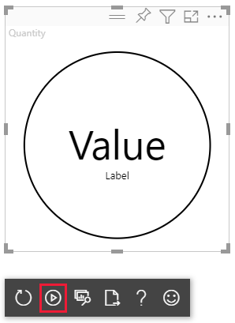

# <a name="tutorial-develop-a-power-bi-circle-card-visual"></a>教程：开发 Power BI 圆形卡片视觉对象

作为开发人员，你可以创建自己的 Power BI 视觉对象。 这些视觉对象可供你、你的组织或第三方使用。

在本教程中，你将开发名为“圆形卡片”的 Power BI 视觉对象，以便在圆圈内显示格式化的度量值。 圆形卡片视觉对象支持自定义填充颜色和轮廓粗细。

在本教程中，你将了解如何执行以下操作：
> [!div class="checklist"]
> * 为视觉对象创建开发项目。
> * 使用 D3 视觉对象元素开发视觉对象。
> * 配置视觉对象以处理数据。

## <a name="prerequisites"></a>先决条件

在开始开发 Power BI 视觉对象之前，请验证本部分中是否已列出所有内容。

* 需要 Power BI Pro 帐户。 如果没有订阅密钥，可以[注册免费试用版](https://powerbi.microsoft.com/pricing/)。

* [Visual Studio Code (VS Code)](https://www.visualstudio.com/)。 VS Code 是用于开发 JavaScript 和 TypeScript 应用程序的理想集成开发环境 (IDE)。

* [Windows PowerShell](/powershell/scripting/install/installing-windows-powershell) 版本 4 或更高版本（适用于 Windows）。 或[终端](https://macpaw.com/how-to/use-terminal-on-mac)（适用于 OSX）。

* 准备好开发 Power BI 视觉对象的环境。 [设置用于开发 Power BI 视觉对象的环境](environment-setup.md)。

* 本教程使用“美国销售额分析”报表。 你可以[下载](https://microsoft.github.io/PowerBI-visuals/docs/step-by-step-lab/images/US_Sales_Analysis.pbix)此报表并将其上传到 Power BI 服务，或使用自己的报表。 如果需要有关 Power BI 服务和上传文件的详细信息，请参阅[开始在 Power BI 服务中创建](../../fundamentals/service-get-started.md)教程。

## <a name="create-a-development-project"></a>创建开发项目

在本部分中，你将为圆形卡片视觉对象创建项目。

1. 打开 PowerShell 并导航到要在其中创建项目的文件夹。

2. 输入以下命令：

    ```PowerShell
    pbiviz new CircleCard
    ```

3. 导航到项目的文件夹。

    ```powershell
    cd CircleCard
    ```

4. 启动圆形卡片视觉对象。 托管在计算机上的视觉对象现在正在运行。

    ```powershell
    pbiviz start
    ```
    >[!IMPORTANT]
    >在本教程结束之前，请不要关闭 PowerSell 窗口。 若要停止运行视觉对象，请输入 Ctrl+C，若系统提示终止批处理作业，请输入 Y，然后按 Enter。

## <a name="view-the-circle-card-in-power-bi-service"></a>查看 Power BI 服务中的圆形卡片

若要测试 Power BI 服务中的圆形卡片视觉对象，我们将使用“美国销售额分析”报表。 你可以[下载](https://microsoft.github.io/PowerBI-visuals/docs/step-by-step-lab/images/US_Sales_Analysis.pbix)此报表并将其上传到 Power BI 服务。

还可以使用自己的报表来测试圆形卡片视觉对象。

>[!NOTE]
>在继续之前，请验证是否[已启用视觉对象开发人员设置](environment-setup.md#set-up-power-bi-service-for-developing-a-visual)。

1. 登录到 [PowerBI.com](https://powerbi.microsoft.com/) 并打开“美国销售额分析”报表。

2. 选择“更多选项” > “编辑”。

    >[!div class="mx-imgBorder"]
    >

3. 通过单击 Power BI 服务界面底部的“新建页面”按钮，创建用于测试的新页面。

    >[!div class="mx-imgBorder"]
    >

4. 从“可视化效果”窗格中选择“开发人员视觉对象”。

    >[!div class="mx-imgBorder"]
    >

    此视觉对象表示在计算机上运行的自定义视觉对象。 仅当启用[自定义视觉对象调试](environment-setup.md#set-up-power-bi-service-for-developing-a-visual)设置时，它才可用。

5. 验证是否已向报表画布添加了视觉对象。

    >[!div class="mx-imgBorder"]
    >

    这是一个非常简单的视觉对象，它显示了 update 方法调用的次数。 在此阶段，视觉对象尚未检索任何数据。

    >[!NOTE]
    >如果视觉对象显示连接错误消息，请在浏览器中打开新选项卡，导航到 `https://localhost:8080/assets/status`，并授权浏览器使用此地址。
    >
    >

6. 选择新视觉对象的同时，转到“字段”窗格，展开“销售额”，然后选择“数量”。

    >[!div class="mx-imgBorder"]
    >

7. 若要测试视觉对象的响应方式，请调整其大小，并注意“更新计数”值会在每次调整视觉对象大小时递增。

    >[!div class="mx-imgBorder"]
    >

## <a name="add-visual-elements-and-text"></a>添加视觉对象元素和文本

本部分介绍如何将视觉对象变为圆形并使其显示文本。

>[!NOTE]
>在本教程中，[Visual Studio Code](https://code.visualstudio.com/) (VS Code) 用于开发 Power BI 视觉对象。

### <a name="modify-the-visuals-file"></a>修改视觉对象文件

通过删除和添加几行代码来设置 visual.ts 文件。

1. 在 VS Code 中打开项目（“文件” > “打开文件夹”）。

2. 在“资源管理器”窗格中，展开“src”文件夹，然后选择文件“visual.ts”。

    >[!div class="mx-imgBorder"]
    >

    > [!IMPORTANT]
    > 请注意“visual.ts”文件顶部的注释。 在麻省理工学院 (MIT) 许可证条款下，免费授予使用 Power BI 视觉对象包的权限。 作为协议的一部分，必须将注释保留在文件顶部。

3. 从 visual.ts 文件中删除以下代码行。

    * VisualSettings 导入：
        ```typescript
        import { VisualSettings } from "./settings";
        ```

    * 四个类级别私有变量声明。

    * 构造函数中的所有代码行。

    * update 方法中的所有代码行。

    * update 方法下所有剩余的代码行，包括 parseSettings 和 enumerateObjectInstances 方法。

4. 在“导入”部分的末尾添加以下代码行：

    * IVisualHost - 用于与视觉对象主机 (Power BI) 进行交互的属性和服务的集合。

         ```typescript
        import IVisualHost = powerbi.extensibility.IVisualHost;
        ```

    * D3 库

        ```typescript
        import * as d3 from "d3";
        type Selection<T extends d3.BaseType> = d3.Selection<T, any,any, any>;
        ```
    
        >[!NOTE]
        >如果未在安装过程中安装此库，请[安装 D3 JavaScript 库](environment-setup.md#d3-javascript-library)。

5. 在 Visual 类声明下，插入以下类级别属性。 只需添加从 `private` 开始的代码行。

    ```typescript
    export class Visual implements IVisual {
        // ...
        private host: IVisualHost;
        private svg: Selection<SVGElement>;
        private container: Selection<SVGElement>;
        private circle: Selection<SVGElement>;
        private textValue: Selection<SVGElement>;
        private textLabel: Selection<SVGElement>;
        // ...
    }
    ```

6. 保存“visual.ts”文件。

### <a name="add-a-circle-and-text-elements"></a>添加圆形和文本元素

添加 D3 可缩放向量图形 (SVG)。 这样可以创建三个形状：圆形和两个文本元素。

1. 在 VS Code 中打开 visual.ts。

2. 将以下代码添加到构造函数。

    ```typescript
    this.svg = d3.select(options.element)
        .append('svg')
        .classed('circleCard', true);
    this.container = this.svg.append("g")
        .classed('container', true);
    this.circle = this.container.append("circle")
        .classed('circle', true);
    this.textValue = this.container.append("text")
        .classed("textValue", true);
    this.textLabel = this.container.append("text")
        .classed("textLabel", true);
    ```

    >[!TIP]
    >为了提高可读性，建议每次将代码段复制到项目中时设置文档格式。 在 VS Code 中右键单击任意位置，然后选择“设置文档格式”(Alt+Shift+F)。

3. 保存“visual.ts”文件。

### <a name="set-the-width-and-height"></a>设置宽度和高度

设置视觉对象的宽度和高度，然后初始化可视元素的属性和样式。

1. 在 VS Code 中打开 visual.ts。

2. 将以下代码添加到 update 方法。

    ```typescript
    let width: number = options.viewport.width;
    let height: number = options.viewport.height;
    this.svg.attr("width", width);
    this.svg.attr("height", height);
    let radius: number = Math.min(width, height) / 2.2;
    this.circle
        .style("fill", "white")
        .style("fill-opacity", 0.5)
        .style("stroke", "black")
        .style("stroke-width", 2)
        .attr("r", radius)
        .attr("cx", width / 2)
        .attr("cy", height / 2);
    let fontSizeValue: number = Math.min(width, height) / 5;
    this.textValue
        .text("Value")
        .attr("x", "50%")
        .attr("y", "50%")
        .attr("dy", "0.35em")
        .attr("text-anchor", "middle")
        .style("font-size", fontSizeValue + "px");
    let fontSizeLabel: number = fontSizeValue / 4;
    this.textLabel
        .text("Label")
        .attr("x", "50%")
        .attr("y", height / 2)
        .attr("dy", fontSizeValue / 1.2)
        .attr("text-anchor", "middle")
        .style("font-size", fontSizeLabel + "px");
    ```

3. 保存“visual.ts”文件。

### <a name="optional-review-the-code-in-the-visuals-file"></a>（可选）查看视觉对象文件中的代码

验证 visuals.ts 文件中的代码是否如下所示：

```typescript
/*
*  Power BI Visual CLI
*
*  Copyright (c) Microsoft Corporation
*  All rights reserved.
*  MIT License
*
*  Permission is hereby granted, free of charge, to any person obtaining a copy
*  of this software and associated documentation files (the ""Software""), to deal
*  in the Software without restriction, including without limitation the rights
*  to use, copy, modify, merge, publish, distribute, sublicense, and/or sell
*  copies of the Software, and to permit persons to whom the Software is
*  furnished to do so, subject to the following conditions:
*
*  The above copyright notice and this permission notice shall be included in
*  all copies or substantial portions of the Software.
*
*  THE SOFTWARE IS PROVIDED *AS IS*, WITHOUT WARRANTY OF ANY KIND, EXPRESS OR
*  IMPLIED, INCLUDING BUT NOT LIMITED TO THE WARRANTIES OF MERCHANTABILITY,
*  FITNESS FOR A PARTICULAR PURPOSE AND NONINFRINGEMENT. IN NO EVENT SHALL THE
*  AUTHORS OR COPYRIGHT HOLDERS BE LIABLE FOR ANY CLAIM, DAMAGES OR OTHER
*  LIABILITY, WHETHER IN AN ACTION OF CONTRACT, TORT OR OTHERWISE, ARISING FROM,
*  OUT OF OR IN CONNECTION WITH THE SOFTWARE OR THE USE OR OTHER DEALINGS IN
*  THE SOFTWARE.
*/
"use strict";

import "core-js/stable";
import "./../style/visual.less";
import powerbi from "powerbi-visuals-api";
import VisualConstructorOptions = powerbi.extensibility.visual.VisualConstructorOptions;
import VisualUpdateOptions = powerbi.extensibility.visual.VisualUpdateOptions;
import IVisual = powerbi.extensibility.visual.IVisual;
import EnumerateVisualObjectInstancesOptions = powerbi.EnumerateVisualObjectInstancesOptions;
import VisualObjectInstance = powerbi.VisualObjectInstance;
import DataView = powerbi.DataView;
import VisualObjectInstanceEnumerationObject = powerbi.VisualObjectInstanceEnumerationObject;
import IVisualHost = powerbi.extensibility.IVisualHost;
import * as d3 from "d3";
type Selection<T extends d3.BaseType> = d3.Selection<T, any, any, any>;

export class Visual implements IVisual {
    private host: IVisualHost;
    private svg: Selection<SVGElement>;
    private container: Selection<SVGElement>;
    private circle: Selection<SVGElement>;
    private textValue: Selection<SVGElement>;
    private textLabel: Selection<SVGElement>;

    constructor(options: VisualConstructorOptions) {
        this.svg = d3.select(options.element)
            .append('svg')
            .classed('circleCard', true);
        this.container = this.svg.append("g")
            .classed('container', true);
        this.circle = this.container.append("circle")
            .classed('circle', true);
        this.textValue = this.container.append("text")
            .classed("textValue", true);
        this.textLabel = this.container.append("text")
            .classed("textLabel", true);
    }

    public update(options: VisualUpdateOptions) {
        let width: number = options.viewport.width;
        let height: number = options.viewport.height;
        this.svg.attr("width", width);
        this.svg.attr("height", height);
        let radius: number = Math.min(width, height) / 2.2;
        this.circle
            .style("fill", "white")
            .style("fill-opacity", 0.5)
            .style("stroke", "black")
            .style("stroke-width", 2)
            .attr("r", radius)
            .attr("cx", width / 2)
            .attr("cy", height / 2);
        let fontSizeValue: number = Math.min(width, height) / 5;
        this.textValue
            .text("Value")
            .attr("x", "50%")
            .attr("y", "50%")
            .attr("dy", "0.35em")
            .attr("text-anchor", "middle")
            .style("font-size", fontSizeValue + "px");
        let fontSizeLabel: number = fontSizeValue / 4;
        this.textLabel
            .text("Label")
            .attr("x", "50%")
            .attr("y", height / 2)
            .attr("dy", fontSizeValue / 1.2)
            .attr("text-anchor", "middle")
            .style("font-size", fontSizeLabel + "px");
    }
}
```

### <a name="modify-the-capabilities-file"></a>修改 capabilities 文件

从 capabilities 文件中删除不需要的代码行。

1. 在 VS Code 中打开项目（“文件” > “打开文件夹”）。

2. 选择“capabilities.json”文件。

    >[!div class="mx-imgBorder"]
    >

3. 删除所有对象元素（14-60 行）。

4. 保存“capabilities.json”文件。

### <a name="restart-the-circle-card-visual"></a>重新启动圆形卡片视觉对象

停止运行视觉对象并重新启动它。

1. 在运行视觉对象的 PowerShell 窗口中，输入 Ctrl+C，若系统提示终止批处理作业，请输入 Y，然后按 Enter。

2. 在 PowerShell 中，启动视觉对象。

    ```powershell
    pbiviz start
    ```

### <a name="test-the-visual-with-the-added-elements"></a>使用添加的元素测试视觉对象

验证视觉对象是否显示新添加的元素。

1. 在 Power BI 服务中，打开“Power BI 美国销售额分析”报表。 如果使用其他报表开发圆形卡片视觉对象，请导航到该报表。

2. 请确保视觉对象的形状为圆形。

    >[!div class="mx-imgBorder"]
    >

    >[!NOTE]
    >如果视觉对象未显示任何内容，请从“字段”窗格，将“数量”字段拖动到开发人员视觉对象中。

3. 调整视觉对象的大小。

    请注意，圆形和文本可以根据视觉对象的维度进行缩放。 调整视觉对象的大小时将调用 update 方法，因此会重新缩放视觉对象元素。

### <a name="enable-auto-reload"></a>启用自动重新加载

使用此设置可确保每次保存项目更改时，都会自动重新加载视觉对象。

1. 导航到“Power BI 美国销售额分析”报表（或包含圆形卡片视觉对象的项目）。

2. 选择圆形卡片视觉对象。

3. 在浮动工具栏中，选择“切换自动重新加载”。

    >[!div class="mx-imgBorder"]
    >

## <a name="get-the-visual-to-process-data"></a>使用视觉对象处理数据

在本部分中，你将定义数据角色和数据视图映射。 还将修改视觉对象以显示它所显示的值的名称。

### <a name="configure-the-capabilities-file"></a>配置 capabilities 文件

修改“capabilities.json”文件以定义数据角色和数据视图映射。

* **定义数据角色**

    使用 measure 类型的单个数据角色定义 dataRoles 数组。 此数据角色称为“measure”，并显示为“Measure”。 它允许传递“measure”字段，或汇总字段。

    1. 在 VS Code 中打开“capabilities.json”文件。

    2. 删除 dataRoles 数组内的所有内容（3-12 行）。

    3. 在“dataRoles”数组中插入以下代码。

        ```json
        {
            "displayName": "Measure",
            "name": "measure",
            "kind": "Measure"
        }
        ```

    4. 保存“capabilities.json”文件。

* **定义数据视图映射**

    在 dataViewMappings 数组中定义称为“measure”的字段。 此字段可以传递到数据角色。

    1. 在 VS Code 中打开“capabilities.json”文件。

    2. 从“dataViewMappings”数组中删除所有内容（10-30 行）。

    3. 在“dataViewMappings”数组中插入以下代码。

        ```json
        {
            "conditions": [
                { "measure": { "max": 1 } }
            ],
            "single": {
                "role": "measure"
            }
        }
        ```

    4. 保存“capabilities.json”文件。

### <a name="optional-review-the-capabilities-file-code-changes"></a>（可选）查看 capabilities 文件代码更改

验证圆形卡片视觉对象是否显示“measure”字段，并使用“显示数据视图”选项查看所做的更改。 

1. 在 Power BI 服务中，打开“Power BI 美国销售额分析”报表。 如果使用其他报表开发圆形卡片视觉对象，请导航到该报表。

2. 请注意，现在可以使用标题为“Measure”的字段来配置圆形卡片视觉对象。 可以将元素从“字段”窗格拖放到“Measure”字段中。

    >[!div class="mx-imgBorder"]
    >

    > [!Note]
    > 视觉对象项目尚不包含数据绑定逻辑。

3. 在浮动工具栏中，选择“显示数据视图”。 

    >[!div class="mx-imgBorder"]
    >

4. 选择三个点来展开显示，并选择“单个”以查看值。

    >[!div class="mx-imgBorder"]
    >

5. 依次展开“元数据”、“列”数组，然后查看“格式”和“显示名称”值。

    >[!div class="mx-imgBorder"]
    >

6. 若要切换回视觉对象，在视觉对象上方浮动的工具栏中，选择“显示数据视图”。

### <a name="configure-the-visual-to-consume-data"></a>将视觉对象配置为使用数据

对 visual.ts 文件进行更改，使圆形卡片视觉对象能够使用数据。

1. 在 VS Code 中打开“visual.ts”文件。

2. 添加以下行，从 `powerbi` 模块中导入 `DataView` 接口。

    ```typescript
    import DataView = powerbi.DataView;
    ```

3. 在 update 方法中，执行以下操作：

    * 添加以下语句作为第一个语句。 此语句将 dataView 分配给一个变量以方便访问，并声明变量来引用 dataView 对象。

        ```typescript
        let dataView: DataView = options.dataViews[0];
        ```

    * 使用下面这行代码替换 .text("Value")：

        ```typescript
        .text(<string>dataView.single.value)
        ```

    * 使用下面这行代码替换 .text("Label")：

        ```typescript
        .text(dataView.metadata.columns[0].displayName)
        ```

4. 保存“visual.ts”文件。

5. 查看 Power BI 服务中的视觉对象。 视觉对象此时将显示值和显示名称。

## <a name="next-steps"></a>后续步骤

> [!div class="nextstepaction"]
> [向圆形卡片视觉对象添加格式设置选项](custom-visual-develop-tutorial-format-options.md)

> [!div class="nextstepaction"]
> [创建 Power BI 条形图视觉对象](create-bar-chart.md)

> [!div class="nextstepaction"]
> [了解如何调试已创建的 Power BI 视觉对象](visuals-how-to-debug.md)

> [!div class="nextstepaction"]
> [Power BI 视觉对象项目结构](visual-project-structure.md)
