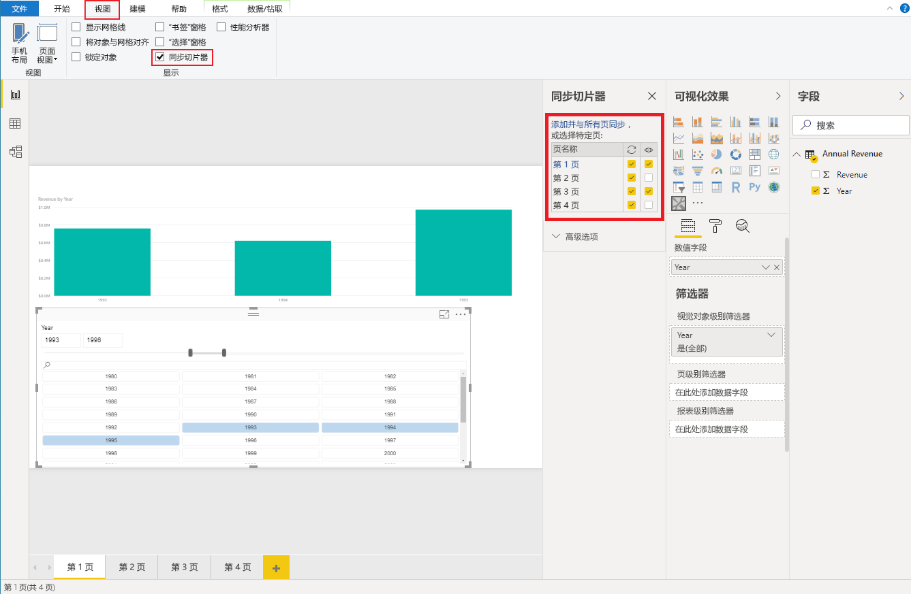

# <a name="sync-slicers"></a>同步切片器

若要支持[同步切片器](https://docs.microsoft.com/power-bi/desktop-slicers)，自定义切片器视觉对象须使用 API 1.13 或更高版本。

第二个必要方面是 `capabilities.json` 中已启用的选项（请参阅下面的示例）。

```json
{
    ...
    "supportsHighlight": true,
    "suppressDefaultTitle": true,
    "supportsSynchronizingFilterState": true,
    "sorting": {
        "default": {}
    }
}
```

在 `capabilities.json` 中进行更改后，单击自定义切片器视觉对象时会显示“同步切片器”选项面板。

> [!NOTE]
> 如果切片器中的字段超过 1 个字段（类别或度量值），将禁用该功能，因为“同步切片器”不支持多个字段。



在面板中，可看到，切片器可见性及其筛选设置可能会应用于多个报表页。
